Redwood fungal ecology
================
Claire Willing
5/14/2020

Bioinfomatic steps in ampTK \#\#Pre-processing reads; allowing for
custum seq primers (spacers, etc) amptk illumina -i unzipped -o
Redwoodfunginew -f AACTTTYRRCAAYGGATCWCT -r AGCCTCCGCTTATTGATATGCTTAART
–require\_primer off –rescue\_forward off –primer\_mismatch 6 (6
wildcards in these primers)

\#\#Clustering data; 2 errors in alignment allowed (longer seq length);
default of 97% similarity amptk cluster -i Redwoodfunginew.demux.fq.gz
-e 1.0 -o Redwoodfunginew

\#\#Filter table based on what is in negative controls amptk filter -i
Redwoodfunginew.otu\_table.txt -f Redwoodfunginew.cluster.otus.fa -p
0.005 -d –negatives ControlSynMockBuffer ControlPCR1
ControlExtractionBuffer ControlPCR2 ControlPCR3 ControlPCR4 ControlPCR5

\#\#Post clustering LULU (used for structures) amptk lulu -i
Structures2.final.txt -f Structures2.filtered.otus.fa -o Structures2

\#\#Assign taxonomy (used ITS database) amptk taxonomy -f
Redwoodfunginew.cluster.otus.fa -i Redwoodfunginew.otu\_table.txt -m
Redwoodfunginew.mapping\_file.txt -d ITS -o Redwoodfunginew

``` r
library(phyloseq)
library(vegan)
library(devtools)
library(lattice)
library(ggplot2)
library(dplyr)
library(tidyr)
library(gridExtra)
library(nortest)
library(SoDA)
library(ecodist)
library(labdsv)
library(TITAN2)
library(cowplot)
```

Publication formatting

Plots and landscape metrics

``` r
library(readr)
library(ggplot2)
library(tidyverse)
library(sf) # for some spatial stuffs
library(rgeos) # for buffer
library(leaflet) # for some fun plotting
library(landscapemetrics)
library(landscapetools)

# To read in land cover 
library(raster)
library(rgdal)

setwd("~/Dropbox/Research/Thesis_Ch1/Data/CleanData")
locs <- read_csv(file = "SiteLocations.csv")

locs$plot <- substr(locs$SampleUnique,1,2) 

# quick plot to see if it makes sense
ggplot(data = locs) +
  geom_point(aes(x = Longitude, y = Latitude, color = Plot), alpha = 0.5)
```

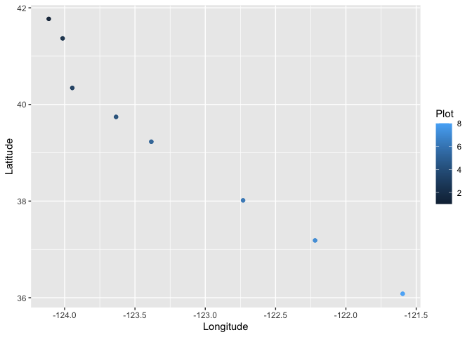<!-- -->

``` r
# Calculate the midpoint of each set of 4 trees within each plot ID
mids <- locs %>% dplyr::group_by(Plot) %>% dplyr::summarise(mid_long = mean(Longitude), mid_lat = mean(Latitude))


# Join the original locations together with the midpoints for each tree by "plot"
locs <- left_join(locs, mids, by = "Plot")
locs$SiteID<-c(1,1,1,1,2,2,2,2,3,3,3,3,4,4,4,4,5,5,5,5,6,6,6,6,7,7,7,7,8,8,8,8)
# Gut check to see if this mid-point makes sense... just subset one plot so that we can see the original points plus the new midpoint
locs %>% filter(plot == "AR") %>% ggplot() +
  geom_point(aes(x = Longitude, y = Latitude, color = as.factor(SiteID)), alpha = 0.5) +
  geom_point(aes(x = mid_long, y = mid_lat), color = "blue")
```

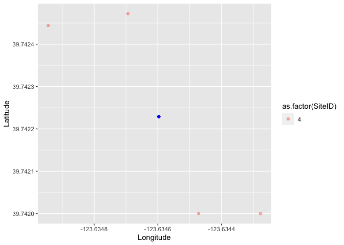<!-- -->

``` r
# Grab unique midpoint location for each plot ID
# CREATE SF POINTS for each midpoint
midpoints <- locs %>% dplyr::select(SiteID, mid_long, mid_lat) %>%
  distinct() %>% 
  sf::st_as_sf(coords = c("mid_long", "mid_lat")) %>% sf::st_set_crs(4326) %>% # THIS IS JUST SPECIFYING THE geodetic datum WGS84
  sf::st_transform(crs = 26910) %>% # THIS IS UTM ZONE 10 WHICH IS GOOD FOR MOST OF NORTHERN CALIFORNIA...but might be better option for CRS
  as(Class = "Spatial")

# WIDTH SPECIFIES THE SIZE (or like radius) of the BUFFER IN METERS (10km = 10,000m)
buffers <- gBuffer(midpoints, byid = TRUE, id = midpoints$plot, width = 10000) %>% st_as_sf() %>%
  st_transform(crs = 4326) # transform back to WGS84 (we just converted to UTM Zone 10 to do the buffering in meters)

labs <- unique(locs$SiteID)
p <- c("#2332A0", "#36B4FC", "#1BFFE8", "#19FF31", "#FFE400", "#FE9400", "#ff5a04", "#AA3407", "red")


pal <- colorFactor(palette = p, domain = labs)
leaflet::leaflet(buffers, width = "100%") %>%
  leaflet::addTiles() %>%
  leaflet::addProviderTiles("Esri.WorldImagery") %>%
  leaflet::setView(lat = 40, lng = -124, zoom = 6.5) %>%
  leaflet::addPolygons(label = ~SiteID, color = ~pal(SiteID), opacity = 0.6) %>%
  addLegend("bottomright", pal = pal, values = ~SiteID,
    title = "Site ID",
    opacity = 1) %>%
  addScaleBar(position = "topleft")
```

<!--html_preserve-->

<div id="htmlwidget-56d582f28ea220b5297c" class="leaflet html-widget" style="width:100%;height:480px;">

</div>

<script type="application/json" data-for="htmlwidget-56d582f28ea220b5297c">{"x":{"options":{"crs":{"crsClass":"L.CRS.EPSG3857","code":null,"proj4def":null,"projectedBounds":null,"options":{}}},"calls":[{"method":"addTiles","args":["//{s}.tile.openstreetmap.org/{z}/{x}/{y}.png",null,null,{"minZoom":0,"maxZoom":18,"tileSize":256,"subdomains":"abc","errorTileUrl":"","tms":false,"noWrap":false,"zoomOffset":0,"zoomReverse":false,"opacity":1,"zIndex":1,"detectRetina":false,"attribution":"&copy; <a href=\"http://openstreetmap.org\">OpenStreetMap<\/a> contributors, <a href=\"http://creativecommons.org/licenses/by-sa/2.0/\">CC-BY-SA<\/a>"}]},{"method":"addProviderTiles","args":["Esri.WorldImagery",null,null,{"errorTileUrl":"","noWrap":false,"detectRetina":false}]},{"method":"addPolygons","args":[[[[{"lng":[-123.992688739837,-123.998145310845,-124.014830004739,-124.041100508171,-124.074384720662,-124.111432716449,-124.148631755295,-124.182354692999,-124.209309657905,-124.226858789411,-124.233276165911,-124.227919803271,-124.21129975163,-124.185033633096,-124.151691872873,-124.114546377851,-124.077247129965,-124.043459550199,-124.016500201184,-123.999008617708,-123.992688739837],"lat":[41.7719707406296,41.7440906351291,41.7188360203165,41.6986747568873,41.6855749290149,41.6808142629833,41.6848567880864,41.6973081626239,41.7169537579255,41.7418759650181,41.7696398367615,41.7975296741886,41.8228140730906,41.8430137963679,41.8561460695005,41.8609207731173,41.8568685159738,41.8443873571358,41.8247033019694,41.7997486498176,41.7719707406296]}]],[[{"lng":[-123.894854282415,-123.900322279403,-123.916944891394,-123.943086106412,-123.976186542772,-124.013014142545,-124.049977479798,-124.083472183207,-124.110228496845,-124.127627939623,-124.133959361834,-124.128589452948,-124.11202989072,-124.085892604167,-124.052735474052,-124.015812213249,-123.978750787247,-123.945193034263,-123.918432792924,-123.901090044185,-123.894854282415],"lat":[41.3690055887038,41.3411281120718,41.3158866149206,41.2957477179961,41.2826773921314,41.2779505547767,41.282027975841,41.2945119030129,41.3141844776145,41.339125373912,41.3668977359858,41.3947849811837,41.4200559534205,41.4402327735724,41.4533349854296,41.4580754920783,41.4539883023359,41.441474899873,41.4217644020292,41.3967916199355,41.3690055887038]}]],[[{"lng":[-123.827932101,-123.833351738181,-123.849752371274,-123.875520187707,-123.908132412795,-123.944404400013,-123.980798442573,-124.013765191091,-124.040086095653,-124.057185233332,-124.063381224088,-124.058054683815,-124.041713755676,-124.015949446894,-123.983283191997,-123.946920274935,-123.910433134875,-123.877406681579,-123.851082270068,-123.834037162454,-123.827932101],"lat":[40.3428748918894,40.3149962187285,40.2897622081806,40.2696388894677,40.2565908995437,40.2518911374884,40.2559978041685,40.2685102482368,40.2882076794817,40.3131671482014,40.3409498114699,40.3688379956488,40.3941004883936,40.4142603813473,40.4273390674455,40.4320519226211,40.427935744817,40.4153948183596,40.3956608128609,40.3706706481513,40.3428748918894]}]],[[{"lng":[-123.517888807467,-123.523390412126,-123.539765381795,-123.565402789082,-123.597792794102,-123.633772405004,-123.669832207499,-123.702455137324,-123.728455926064,-123.745289812977,-123.751301477025,-123.745889904193,-123.729571996718,-123.703936886083,-123.671493534596,-123.635425310527,-123.599275475649,-123.56659548381,-123.540592399087,-123.523811858874,-123.517888807467],"lat":[39.7428083504998,39.714940762954,39.6897482342298,39.669692767966,39.656732466795,39.6521317853239,39.6563393435167,39.6689446658011,39.6887178363688,39.7137283846252,39.7415323282402,39.7694097918435,39.7946305600021,39.814721842665,39.827711856557,39.8323247977319,39.8281073633763,39.8154738014735,39.7956648144983,39.7706245536997,39.7428083504998]}]],[[{"lng":[-123.267969905521,-123.273532298597,-123.289878868254,-123.315401769743,-123.347602502713,-123.383336512646,-123.419118150184,-123.451457222174,-123.477195942775,-123.493815070479,-123.499680393627,-123.494205499031,-123.477913847316,-123.452392306354,-123.420138856498,-123.384318188219,-123.348449051674,-123.316055061924,-123.290314981438,-123.273748570833,-123.267969905521],"lat":[39.2287961405017,39.200937679885,39.1757782309788,39.1557765918613,39.1428856874989,39.1383632947191,39.1426504654444,39.1553289703759,39.1751616983005,39.2002122578472,39.2280326345906,39.2559012484551,39.2810887103841,39.301125522365,39.314045324596,39.3185793021585,39.3142819780808,39.3015754599492,39.2817075591562,39.2566281019151,39.2287961405017]}]],[[{"lng":[-122.61738578853,-122.62310394385,-122.639401762967,-122.664676875891,-122.696455354979,-122.731633791805,-122.766780300794,-122.79846604275,-122.823596480019,-122.839711590188,-122.845226679358,-122.839590236617,-122.823342358205,-122.798066338365,-122.76623645086,-122.7309757403,-122.695747518266,-122.664011835794,-122.638882306022,-122.622818604441,-122.61738578853],"lat":[38.014629013392,37.9867962375678,37.9617222400332,37.9418575211878,37.9291418158609,37.924816028319,37.9293022017263,37.9421627327452,37.9621426270089,37.9872908759189,38.0151496248609,38.042993299648,38.0680948453008,38.0879932390558,38.1007358834115,38.1050715842255,38.1005745117518,38.0876864324525,38.0676728632825,38.0424976755079,38.014629013392]}]],[[{"lng":[-122.106542552713,-122.112381886631,-122.128665093507,-122.153791711335,-122.185302578845,-122.220120380174,-122.254848134146,-122.28609745191,-122.310816037511,-122.32658394867,-122.331850576898,-122.326089128953,-122.309852481106,-122.284723311302,-122.253161755307,-122.218264490191,-122.183458849824,-122.152162973224,-122.127446940142,-122.111729717611,-122.106542552713],"lat":[37.1850720187298,37.1572615082165,37.1322543914924,37.1124946578167,37.09991190877,37.0957342304352,37.1003693428514,37.1133651502123,37.1334533819097,37.158672281815,37.1865568826832,37.2143789038269,37.2394133221792,37.2592057202629,37.2718140197993,37.276000375208,37.2713537520584,37.2583306429172,37.2382097468208,37.2129652965834,37.1850720187298]}]],[[{"lng":[-121.485454661364,-121.491420715916,-121.507659888581,-121.532576607823,-121.563732517265,-121.598084886656,-121.632281777198,-121.662986086578,-121.687198286538,-121.702547739631,-121.707524954458,-121.701631984594,-121.685435262954,-121.660514146129,-121.629308669974,-121.594880497484,-121.560610521878,-121.529863761669,-121.505655959789,-121.490356073521,-121.485454661364],"lat":[36.0804952875446,36.0527130484928,36.0277855611439,36.0081490772288,35.9957213221238,35.9917154577047,35.9965225984834,36.0096739063697,36.029885833552,36.0551843281816,36.0830963835654,36.1108908173944,36.1358452088611,36.1555130298462,36.1679645852699,36.1719776222689,36.1671582866113,36.1539800744673,36.1337368102303,36.1084145154314,36.0804952875446]}]]],null,null,{"interactive":true,"className":"","stroke":true,"color":["#2332A0","#39BFF9","#3CFFBA","#A6F622","#FFB700","#FF6D03","#B63907","#FF0000"],"weight":5,"opacity":0.6,"fill":true,"fillColor":["#2332A0","#39BFF9","#3CFFBA","#A6F622","#FFB700","#FF6D03","#B63907","#FF0000"],"fillOpacity":0.2,"smoothFactor":1,"noClip":false},null,null,["1","2","3","4","5","6","7","8"],{"interactive":false,"permanent":false,"direction":"auto","opacity":1,"offset":[0,0],"textsize":"10px","textOnly":false,"className":"","sticky":true},null]},{"method":"addLegend","args":[{"colors":["#2332A0","#39BFF9","#3CFFBA","#A6F622","#FFB700","#FF6D03","#B63907","#FF0000"],"labels":["1","2","3","4","5","6","7","8"],"na_color":null,"na_label":"NA","opacity":1,"position":"bottomright","type":"factor","title":"Site ID","extra":null,"layerId":null,"className":"info legend","group":null}]},{"method":"addScaleBar","args":[{"maxWidth":100,"metric":true,"imperial":true,"updateWhenIdle":true,"position":"topleft"}]}],"setView":[[40,-124],6.5,[]],"limits":{"lat":[35.9917154577047,41.8609207731173],"lng":[-124.233276165911,-121.485454661364]}},"evals":[],"jsHooks":[]}</script>

<!--/html_preserve-->

``` r
library(rworldmap)
worldmap <- getMap(resolution = "high")
worldmap <- st_as_sf(worldmap)
class(worldmap)
```

    ## [1] "sf"         "data.frame"

``` r
setwd("~/Dropbox/Research/Thesis_Ch1/Data/CleanData")
Plotdata=read.table("MID_Meta.txt", header = T)

plotmap<-ggplot(data = worldmap)+
  geom_sf()+
  geom_point(data = Plotdata,  # Add and plot species data
        aes(x = Longitude, y = Latitude, 
            colour = SiteID))+
  coord_sf(xlim=c(-125,-118), ylim=c(33,44), expand = F)+
  Publicationcolors()+
  theme(
        text = element_text(),
        panel.background = element_rect(fill="transparent", colour = NA),
        plot.background = element_rect(fill="transparent",colour = NA),
        panel.border = element_blank(),
        axis.title.y = element_blank(),
        axis.title.x = element_blank(),
        axis.text.x = element_blank(),
        axis.text.y = element_blank(),
        axis.line = element_blank(),
        axis.ticks.x = element_blank(),
        axis.ticks.y = element_blank(),
        axis.ticks.length=unit(-1.4, "mm"), 
        panel.grid.major = element_blank(),
        panel.grid.minor = element_blank(),
        legend.key = element_rect(fill="transparent", colour = NA),
        legend.position =c(0.00,0.3),
        legend.key.size= unit(4, "mm"),
        legend.text = element_text(size =10),
        legend.spacing = unit(0, "mm"),
        legend.background = element_rect(fill = "transparent", colour = NA),
        plot.margin=margin(t=2, r=2, b=2, l=2, unit = "mm"),
        strip.background=element_rect(fill="transparent", colour=NA),
        strip.text = element_text(face="bold"))

# FUNCTION TO CALCULATE GEODESIC BUFFERS
make_GeodesicBuffer <- function(pts, width) {

  # A) Construct buffers as points at given distance and bearing ---------------
  dg <- seq(from = 0, to = 360, by = 5)

  # Construct equidistant points defining circle shapes (the "buffer points")
  buff.XY <- geosphere::destPoint(p = pts, 
                                  b = rep(dg, each = length(pts)), 
                                  d = width)

  # B) Make SpatialPolygons -------------------------------------------------

  # Group (split) "buffer points" by id
  buff.XY <- as.data.frame(buff.XY)
  id  <- rep(1:dim(pts)[1], times = length(dg))
  lst <- split(buff.XY, id)

  # Make SpatialPolygons out of the list of coordinates
  poly   <- lapply(lst, sp::Polygon, hole = FALSE)
  polys  <- lapply(list(poly), sp::Polygons, ID = NA)
  spolys <- sp::SpatialPolygons(Srl = polys, 
                                proj4string = CRS("+proj=longlat +ellps=WGS84 +datum=WGS84"))
  # Disaggregate (split in unique polygons)
  spolys <- sp::disaggregate(spolys)
  return(spolys)
}

# APPLY geodesic buffer FUNCTION
pts <- locs %>% dplyr::select(mid_long, mid_lat) %>%
  distinct()
buffers_geodesic <- make_GeodesicBuffer(as.matrix(pts), 10000) # spatialpolygons

# dataframe to store plot data
p.df <- data.frame(plot = unique(locs$plot), row.names = row.names(buffers_geodesic))

buffers_geodesic_SPDF <- SpatialPolygonsDataFrame(buffers_geodesic, p.df) 
buffers_geodesic_SPDF <- sp::spTransform(buffers_geodesic_SPDF, CRSobj = CRS("+proj=longlat +ellps=WGS84 +datum=WGS84 +no_defs"))

buffers_geodesic <- buffers_geodesic_SPDF %>% st_as_sf()

leaflet::leaflet(buffers_geodesic, width = "100%") %>%
  leaflet::addTiles() %>%
  leaflet::addProviderTiles("Esri.WorldImagery") %>%
  leaflet::addPolygons(label = ~plot, color = ~pal(plot), opacity = 0.8) %>%
  addLegend("bottomright", pal = pal, values = ~plot,
    title = "10km buffers on tree plots",
    opacity = 1) %>%
  addScaleBar(position = "topleft")
```

<!--html_preserve-->

<div id="htmlwidget-311c9db7c14f9842eb92" class="leaflet html-widget" style="width:100%;height:480px;">

</div>

<script type="application/json" data-for="htmlwidget-311c9db7c14f9842eb92">{"x":{"options":{"crs":{"crsClass":"L.CRS.EPSG3857","code":null,"proj4def":null,"projectedBounds":null,"options":{}}},"calls":[{"method":"addTiles","args":["//{s}.tile.openstreetmap.org/{z}/{x}/{y}.png",null,null,{"minZoom":0,"maxZoom":18,"tileSize":256,"subdomains":"abc","errorTileUrl":"","tms":false,"noWrap":false,"zoomOffset":0,"zoomReverse":false,"opacity":1,"zIndex":1,"detectRetina":false,"attribution":"&copy; <a href=\"http://openstreetmap.org\">OpenStreetMap<\/a> contributors, <a href=\"http://creativecommons.org/licenses/by-sa/2.0/\">CC-BY-SA<\/a>"}]},{"method":"addProviderTiles","args":["Esri.WorldImagery",null,null,{"errorTileUrl":"","noWrap":false,"detectRetina":false}]},{"method":"addPolygons","args":[[[[{"lng":[-124.112986,-124.112986,-124.102489282665,-124.102489282665,-124.092072785837,-124.092072785837,-124.081816109286,-124.081816109286,-124.071797616333,-124.071797616333,-124.062093828188,-124.062093828188,-124.052778833194,-124.052778833194,-124.043923715759,-124.043923715759,-124.035596009529,-124.035596009529,-124.027859179142,-124.027859179142,-124.020772134647,-124.020772134647,-124.01438878234,-124.01438878234,-124.008757615484,-124.008757615484,-124.003921347971,-124.003921347971,-123.999916593639,-123.999916593639,-123.996773593549,-123.996773593549,-123.994515993106,-123.994515993106,-123.993160670497,-123.993160670497,-123.992717617498,-123.992717617498,-123.993189873272,-123.993189873272,-123.994573511355,-123.994573511355,-123.996857679623,-123.996857679623,-124.000024692646,-124.000024692646,-124.004050175402,-124.004050175402,-124.008903257006,-124.008903257006,-124.01454681273,-124.01454681273,-124.020937752247,-124.020937752247,-124.028027351754,-124.028027351754,-124.035761627312,-124.035761627312,-124.044081746493,-124.044081746493,-124.05292447518,-124.05292447518,-124.062222656146,-124.062222656146,-124.071905715868,-124.071905715868,-124.081900195823,-124.081900195823,-124.09213030443,-124.09213030443,-124.102518485624,-124.102518485624,-124.112986,-124.112986,-124.123453514376,-124.123453514376,-124.13384169557,-124.13384169557,-124.144071804177,-124.144071804177,-124.154066284132,-124.154066284132,-124.163749343854,-124.163749343854,-124.17304752482,-124.17304752482,-124.181890253507,-124.181890253507,-124.190210372688,-124.190210372688,-124.197944648246,-124.197944648246,-124.205034247753,-124.205034247753,-124.21142518727,-124.21142518727,-124.217068742994,-124.217068742994,-124.221921824598,-124.221921824598,-124.225947307354,-124.225947307354,-124.229114320377,-124.229114320377,-124.231398488645,-124.231398488645,-124.232782126728,-124.232782126728,-124.233254382502,-124.233254382502,-124.232811329503,-124.232811329503,-124.231456006894,-124.231456006894,-124.229198406451,-124.229198406451,-124.226055406361,-124.226055406361,-124.222050652029,-124.222050652029,-124.217214384516,-124.217214384516,-124.21158321766,-124.21158321766,-124.205199865353,-124.205199865353,-124.198112820858,-124.198112820858,-124.190375990471,-124.190375990471,-124.182048284241,-124.182048284241,-124.173193166806,-124.173193166806,-124.163878171812,-124.163878171812,-124.154174383667,-124.154174383667,-124.144155890714,-124.144155890714,-124.133899214163,-124.133899214163,-124.123482717335,-124.123482717335,-124.112986,-124.112986],"lat":[41.8609017975758,41.8609017975758,41.8605587163302,41.8605587163302,41.8595320944798,41.8595320944798,41.857829777399,41.857829777399,41.8554647732571,41.8554647732571,41.852455152412,41.852455152412,41.8488239077038,41.8488239077038,41.8445987767806,41.8445987767806,41.8398120278899,41.8398120278899,41.834500210863,41.834500210863,41.8287038752915,41.8287038752915,41.8224672581553,41.8224672581553,41.8158379433919,41.8158379433919,41.8088664961165,41.8088664961165,41.8016060743838,41.8016060743838,41.7941120215536,41.7941120215536,41.7864414424525,41.7864414424525,41.7786527666395,41.7786527666395,41.7708053021616,41.7708053021616,41.7629587832438,41.7629587832438,41.7551729153807,41.7551729153807,41.7475069213025,41.7475069213025,41.7400190912561,41.7400190912561,41.732766340994,41.732766340994,41.7258037807841,41.7258037807841,41.7191842986545,41.7191842986545,41.712958160962,41.712958160962,41.7071726332328,41.7071726332328,41.7018716240563,41.7018716240563,41.6970953546327,41.6970953546327,41.6928800563787,41.6928800563787,41.6892576987799,41.6892576987799,41.6862557494518,41.6862557494518,41.6838969681374,41.6838969681374,41.6821992361151,41.6821992361151,41.681175422238,41.681175422238,41.6808332865604,41.6808332865604,41.681175422238,41.681175422238,41.6821992361151,41.6821992361151,41.6838969681374,41.6838969681374,41.6862557494518,41.6862557494518,41.6892576987799,41.6892576987799,41.6928800563787,41.6928800563787,41.6970953546327,41.6970953546327,41.7018716240563,41.7018716240563,41.7071726332328,41.7071726332328,41.712958160962,41.712958160962,41.7191842986545,41.7191842986545,41.7258037807841,41.7258037807841,41.732766340994,41.732766340994,41.7400190912561,41.7400190912561,41.7475069213025,41.7475069213025,41.7551729153807,41.7551729153807,41.7629587832438,41.7629587832438,41.7708053021616,41.7708053021616,41.7786527666395,41.7786527666395,41.7864414424525,41.7864414424525,41.7941120215536,41.7941120215536,41.8016060743838,41.8016060743838,41.8088664961165,41.8088664961165,41.8158379433919,41.8158379433919,41.8224672581553,41.8224672581553,41.8287038752915,41.8287038752915,41.834500210863,41.834500210863,41.8398120278899,41.8398120278899,41.8445987767806,41.8445987767806,41.8488239077038,41.8488239077038,41.852455152412,41.852455152412,41.8554647732571,41.8554647732571,41.857829777399,41.857829777399,41.8595320944798,41.8595320944798,41.8605587163302,41.8605587163302,41.8609017975758,41.8609017975758]}]],[[{"lng":[-124.01441,-124.01441,-124.003978495104,-124.003978495104,-123.993626707667,-123.993626707667,-123.98343373844,-123.98343373844,-123.973477459767,-123.973477459767,-123.963833913831,-123.963833913831,-123.954576725724,-123.954576725724,-123.945776536045,-123.945776536045,-123.937500457571,-123.937500457571,-123.929811560298,-123.929811560298,-123.922768388915,-123.922768388915,-123.91642451644,-123.91642451644,-123.910828137453,-123.910828137453,-123.906021703973,-123.906021703973,-123.902041606688,-123.902041606688,-123.898917903797,-123.898917903797,-123.896674099388,-123.896674099388,-123.895326972772,-123.895326972772,-123.894886459863,-123.894886459863,-123.895355587198,-123.895355587198,-123.896730458813,-123.896730458813,-123.899000295783,-123.899000295783,-123.902147527816,-123.902147527816,-123.906147935907,-123.906147935907,-123.910970844722,-123.910970844722,-123.916579362976,-123.916579362976,-123.922930669799,-123.922930669799,-123.929976344716,-123.929976344716,-123.937662738632,-123.937662738632,-123.945931382913,-123.945931382913,-123.95471943344,-123.95471943344,-123.963960146273,-123.963960146273,-123.973583381403,-123.973583381403,-123.983516130873,-123.983516130873,-123.993683067423,-123.993683067423,-124.004007109706,-124.004007109706,-124.01441,-124.01441,-124.024812890294,-124.024812890294,-124.035136932577,-124.035136932577,-124.045303869127,-124.045303869127,-124.055236618597,-124.055236618597,-124.064859853727,-124.064859853727,-124.07410056656,-124.07410056656,-124.082888617087,-124.082888617087,-124.091157261368,-124.091157261368,-124.098843655284,-124.098843655284,-124.105889330201,-124.105889330201,-124.112240637024,-124.112240637024,-124.117849155278,-124.117849155278,-124.122672064093,-124.122672064093,-124.126672472184,-124.126672472184,-124.129819704217,-124.129819704217,-124.132089541187,-124.132089541187,-124.133464412802,-124.133464412802,-124.133933540137,-124.133933540137,-124.133493027228,-124.133493027228,-124.132145900612,-124.132145900612,-124.129902096203,-124.129902096203,-124.126778393312,-124.126778393312,-124.122798296027,-124.122798296027,-124.117991862547,-124.117991862547,-124.11239548356,-124.11239548356,-124.106051611085,-124.106051611085,-124.099008439702,-124.099008439702,-124.091319542429,-124.091319542429,-124.083043463955,-124.083043463955,-124.074243274276,-124.074243274276,-124.064986086169,-124.064986086169,-124.055342540233,-124.055342540233,-124.04538626156,-124.04538626156,-124.035193292333,-124.035193292333,-124.024841504896,-124.024841504896,-124.01441,-124.01441],"lat":[41.4580536287475,41.4580536287475,41.4577105301046,41.4577105301046,41.456683856042,41.456683856042,41.4549814518762,41.4549814518762,41.4526163256966,41.4526163256966,41.4496065477823,41.4496065477823,41.4459751109271,41.4459751109271,41.4417497528036,41.4417497528036,41.4369627417991,41.4369627417991,41.4316506280465,41.4316506280465,41.4258539616514,41.4258539616514,41.4196169803687,41.4196169803687,41.4129872692199,41.4129872692199,41.4060153947552,41.4060153947552,41.3987545168541,41.3987545168541,41.3912599811187,41.3912599811187,41.3835888950569,41.3835888950569,41.3757996913568,41.3757996913568,41.3679516816407,41.3679516816407,41.3601046041406,41.3601046041406,41.3523181687639,41.3523181687639,41.3446516030201,41.3446516030201,41.337163202251,41.337163202251,41.3299098875586,41.3299098875586,41.322946774743,41.322946774743,41.316326757467,41.316326757467,41.3101001077392,41.3101001077392,41.3043140966629,41.3043140966629,41.299012638237,41.299012638237,41.2942359588099,41.2942359588099,41.2900202945939,41.2900202945939,41.2863976194301,41.2863976194301,41.2833954047696,41.2833954047696,41.2810364135988,41.2810364135988,41.2793385297855,41.2793385297855,41.2783146240689,41.2783146240689,41.27797245765,41.27797245765,41.2783146240689,41.2783146240689,41.2793385297855,41.2793385297855,41.2810364135988,41.2810364135988,41.2833954047696,41.2833954047696,41.2863976194301,41.2863976194301,41.2900202945939,41.2900202945939,41.2942359588099,41.2942359588099,41.299012638237,41.299012638237,41.3043140966629,41.3043140966629,41.3101001077392,41.3101001077392,41.316326757467,41.316326757467,41.322946774743,41.322946774743,41.3299098875586,41.3299098875586,41.337163202251,41.337163202251,41.3446516030201,41.3446516030201,41.3523181687639,41.3523181687639,41.3601046041406,41.3601046041406,41.3679516816407,41.3679516816407,41.3757996913568,41.3757996913568,41.3835888950569,41.3835888950569,41.3912599811187,41.3912599811187,41.3987545168541,41.3987545168541,41.4060153947552,41.4060153947552,41.4129872692199,41.4129872692199,41.4196169803687,41.4196169803687,41.4258539616514,41.4258539616514,41.4316506280465,41.4316506280465,41.4369627417991,41.4369627417991,41.4417497528036,41.4417497528036,41.4459751109271,41.4459751109271,41.4496065477823,41.4496065477823,41.4526163256966,41.4526163256966,41.4549814518762,41.4549814518762,41.456683856042,41.456683856042,41.4577105301046,41.4577105301046,41.4580536287475,41.4580536287475]}]],[[{"lng":[-123.9456595,-123.9456595,-123.935388207456,-123.935388207456,-123.925195396576,-123.925195396576,-123.915158942228,-123.915158942228,-123.905355510598,-123.905355510598,-123.895859967084,-123.895859967084,-123.886744798723,-123.886744798723,-123.878079555817,-123.878079555817,-123.869930317182,-123.869930317182,-123.862359183275,-123.862359183275,-123.855423801166,-123.855423801166,-123.84917692505,-123.84917692505,-123.843666015657,-123.843666015657,-123.838932881587,-123.838932881587,-123.835013365206,-123.835013365206,-123.83193707538,-123.83193707538,-123.829727168903,-123.829727168903,-123.828400182066,-123.828400182066,-123.827965913426,-123.827965913426,-123.828427358384,-123.828427358384,-123.829780695807,-123.829780695807,-123.832015326497,-123.832015326497,-123.835113962932,-123.835113962932,-123.839052769333,-123.839052769333,-123.843801550716,-123.843801550716,-123.849323989274,-123.849323989274,-123.855577926098,-123.855577926098,-123.862515685914,-123.862515685914,-123.870084442275,-123.870084442275,-123.878226620343,-123.878226620343,-123.886880334187,-123.886880334187,-123.895979855292,-123.895979855292,-123.905456108787,-123.905456108787,-123.91523719375,-123.91523719375,-123.925248923781,-123.925248923781,-123.935415383934,-123.935415383934,-123.9456595,-123.9456595,-123.955903616066,-123.955903616066,-123.966070076219,-123.966070076219,-123.97608180625,-123.97608180625,-123.985862891213,-123.985862891213,-123.995339144708,-123.995339144708,-124.004438665813,-124.004438665813,-124.013092379657,-124.013092379657,-124.021234557725,-124.021234557725,-124.028803314086,-124.028803314086,-124.035741073902,-124.035741073902,-124.041995010726,-124.041995010726,-124.047517449284,-124.047517449284,-124.052266230667,-124.052266230667,-124.056205037068,-124.056205037068,-124.059303673503,-124.059303673503,-124.061538304193,-124.061538304193,-124.062891641616,-124.062891641616,-124.063353086574,-124.063353086574,-124.062918817934,-124.062918817934,-124.061591831097,-124.061591831097,-124.05938192462,-124.05938192462,-124.056305634794,-124.056305634794,-124.052386118413,-124.052386118413,-124.047652984343,-124.047652984343,-124.04214207495,-124.04214207495,-124.035895198834,-124.035895198834,-124.028959816725,-124.028959816725,-124.021388682818,-124.021388682818,-124.013239444183,-124.013239444183,-124.004574201277,-124.004574201277,-123.995459032916,-123.995459032916,-123.985963489402,-123.985963489402,-123.976160057772,-123.976160057772,-123.966123603424,-123.966123603424,-123.955930792544,-123.955930792544,-123.9456595,-123.9456595],"lat":[40.4320282009722,40.4320282009722,40.4316850578536,40.4316850578536,40.4306582503202,40.4306582503202,40.4289556235713,40.4289556235713,40.4265901855399,40.4265901855399,40.4235800063679,40.4235800063679,40.4199480788095,40.4199480788095,40.41572214069,40.41572214069,40.4109344608501,40.4109344608501,40.4056215902952,40.4056215902952,40.3998240805442,40.3998240805442,40.3935861714286,40.3935861714286,40.3869554508259,40.3869554508259,40.3799824890289,40.3799824890289,40.3727204506367,40.3727204506367,40.3652246870208,40.3652246870208,40.3575523125564,40.3575523125564,40.3497617679198,40.3497617679198,40.3419123738361,40.3419123738361,40.3340638787177,40.3340638787177,40.3262760036627,40.3262760036627,40.3186079882833,40.3186079882833,40.3111181408085,40.3111181408085,40.3038633958565,40.3038633958565,40.2968988831932,40.2968988831932,40.2902775106968,40.2902775106968,40.2840495646239,40.2840495646239,40.2782623301312,40.2782623301312,40.2729597348417,40.2729597348417,40.2681820180654,40.2681820180654,40.2639654280842,40.2639654280842,40.2603419496988,40.2603419496988,40.2573390640089,40.2573390640089,40.254979542158,40.254979542158,40.253281274526,40.253281274526,40.2522571365952,40.2522571365952,40.2519148924491,40.2519148924491,40.2522571365952,40.2522571365952,40.253281274526,40.253281274526,40.254979542158,40.254979542158,40.2573390640089,40.2573390640089,40.2603419496988,40.2603419496988,40.2639654280842,40.2639654280842,40.2681820180654,40.2681820180654,40.2729597348417,40.2729597348417,40.2782623301312,40.2782623301312,40.2840495646239,40.2840495646239,40.2902775106968,40.2902775106968,40.2968988831932,40.2968988831932,40.3038633958565,40.3038633958565,40.3111181408085,40.3111181408085,40.3186079882833,40.3186079882833,40.3262760036627,40.3262760036627,40.3340638787177,40.3340638787177,40.3419123738361,40.3419123738361,40.3497617679198,40.3497617679198,40.3575523125564,40.3575523125564,40.3652246870208,40.3652246870208,40.3727204506367,40.3727204506367,40.3799824890289,40.3799824890289,40.3869554508259,40.3869554508259,40.3935861714286,40.3935861714286,40.3998240805442,40.3998240805442,40.4056215902952,40.4056215902952,40.4109344608501,40.4109344608501,40.41572214069,40.41572214069,40.4199480788095,40.4199480788095,40.4235800063679,40.4235800063679,40.4265901855399,40.4265901855399,40.4289556235713,40.4289556235713,40.4306582503202,40.4306582503202,40.4316850578536,40.4316850578536,40.4320282009722,40.4320282009722]}]],[[{"lng":[-123.634597,-123.634597,-123.624415594051,-123.624415594051,-123.614311976477,-123.614311976477,-123.604363334416,-123.604363334416,-123.594645657388,-123.594645657388,-123.585233150593,-123.585233150593,-123.576197662602,-123.576197662602,-123.567608132031,-123.567608132031,-123.559530057609,-123.559530057609,-123.552024995837,-123.552024995837,-123.545150090174,-123.545150090174,-123.538957635397,-123.538957635397,-123.533494680487,-123.533494680487,-123.528802673015,-123.528802673015,-123.524917147669,-123.524917147669,-123.521867461165,-123.521867461165,-123.519676575389,-123.519676575389,-123.518360890225,-123.518360890225,-123.517930127101,-123.517930127101,-123.518387263886,-123.518387263886,-123.519728521367,-123.519728521367,-123.521943401121,-123.521943401121,-123.525014774224,-123.525014774224,-123.528919019854,-123.528919019854,-123.533626212491,-123.533626212491,-123.539100356049,-123.539100356049,-123.545299662993,-123.545299662993,-123.552176876135,-123.552176876135,-123.559679630579,-123.559679630579,-123.567750852968,-123.567750852968,-123.576329194991,-123.576329194991,-123.58534949787,-123.58534949787,-123.59474328438,-123.59474328438,-123.604439274757,-123.604439274757,-123.614363922741,-123.614363922741,-123.624441967864,-123.624441967864,-123.634597,-123.634597,-123.644752032136,-123.644752032136,-123.654830077259,-123.654830077259,-123.664754725243,-123.664754725243,-123.67445071562,-123.67445071562,-123.68384450213,-123.68384450213,-123.692864805009,-123.692864805009,-123.701443147032,-123.701443147032,-123.709514369421,-123.709514369421,-123.717017123865,-123.717017123865,-123.723894337007,-123.723894337007,-123.730093643951,-123.730093643951,-123.735567787509,-123.735567787509,-123.740274980146,-123.740274980146,-123.744179225776,-123.744179225776,-123.747250598879,-123.747250598879,-123.749465478633,-123.749465478633,-123.750806736114,-123.750806736114,-123.751263872899,-123.751263872899,-123.750833109775,-123.750833109775,-123.749517424611,-123.749517424611,-123.747326538835,-123.747326538835,-123.744276852331,-123.744276852331,-123.740391326985,-123.740391326985,-123.735699319513,-123.735699319513,-123.730236364603,-123.730236364603,-123.724043909826,-123.724043909826,-123.717169004163,-123.717169004163,-123.709663942391,-123.709663942391,-123.701585867969,-123.701585867969,-123.692996337398,-123.692996337398,-123.683960849407,-123.683960849407,-123.674548342612,-123.674548342612,-123.664830665584,-123.664830665584,-123.654882023523,-123.654882023523,-123.644778405949,-123.644778405949,-123.634597,-123.634597],"lat":[39.8322943041116,39.8322943041116,39.8319511349198,39.8319511349198,39.8309242491475,39.8309242491475,39.8292214919429,39.8292214919429,39.8268558711768,39.8268558711768,39.82384545695,39.82384545695,39.8202132420412,39.8202132420412,39.8159869644197,39.8159869644197,39.8111988932512,39.8111988932512,39.8058855801136,39.8058855801136,39.8000875774151,39.8000875774151,39.793849126262,39.793849126262,39.7872178162587,39.7872178162587,39.7802442199358,39.7802442199358,39.7729815046934,39.7729815046934,39.7654850253068,39.7654850253068,39.7578119001854,39.7578119001854,39.7500205746813,39.7500205746813,39.742170374833,39.742170374833,39.7343210549824,39.7343210549824,39.7265323427329,39.7265323427329,39.7188634847218,39.7188634847218,39.7113727966486,39.7113727966486,39.7041172209581,39.7041172209581,39.6971518954959,39.6971518954959,39.6905297363577,39.6905297363577,39.6843010380313,39.6843010380313,39.6785130937871,39.6785130937871,39.6732098391107,39.6732098391107,39.6684315207888,39.6684315207888,39.6642143940632,39.6642143940632,39.6605904500527,39.6605904500527,39.6575871754178,39.6575871754178,39.6552273460027,39.6552273460027,39.6535288559391,39.6535288559391,39.6525045834415,39.6525045834415,39.6521622942541,39.6521622942541,39.6525045834415,39.6525045834415,39.6535288559391,39.6535288559391,39.6552273460027,39.6552273460027,39.6575871754178,39.6575871754178,39.6605904500527,39.6605904500527,39.6642143940632,39.6642143940632,39.6684315207888,39.6684315207888,39.6732098391107,39.6732098391107,39.6785130937871,39.6785130937871,39.6843010380313,39.6843010380313,39.6905297363577,39.6905297363577,39.6971518954959,39.6971518954959,39.7041172209581,39.7041172209581,39.7113727966486,39.7113727966486,39.7188634847218,39.7188634847218,39.7265323427329,39.7265323427329,39.7343210549824,39.7343210549824,39.742170374833,39.742170374833,39.7500205746813,39.7500205746813,39.7578119001854,39.7578119001854,39.7654850253068,39.7654850253068,39.7729815046934,39.7729815046934,39.7802442199358,39.7802442199358,39.7872178162587,39.7872178162587,39.793849126262,39.793849126262,39.8000875774151,39.8000875774151,39.8058855801136,39.8058855801136,39.8111988932512,39.8111988932512,39.8159869644197,39.8159869644197,39.8202132420412,39.8202132420412,39.82384545695,39.82384545695,39.8268558711768,39.8268558711768,39.8292214919429,39.8292214919429,39.8309242491475,39.8309242491475,39.8319511349198,39.8319511349198,39.8322943041116,39.8322943041116]}]],[[{"lng":[-123.38382625,-123.38382625,-123.373719724303,-123.373719724303,-123.363690409459,-123.363690409459,-123.353814919713,-123.353814919713,-123.34416868091,-123.34416868091,-123.334825348291,-123.334825348291,-123.325856238564,-123.325856238564,-123.317329780788,-123.317329780788,-123.309310990458,-123.309310990458,-123.301860970933,-123.301860970933,-123.295036446132,-123.295036446132,-123.288889328106,-123.288889328106,-123.28346632281,-123.28346632281,-123.278808577043,-123.278808577043,-123.274951369158,-123.274951369158,-123.27192384579,-123.27192384579,-123.269748806429,-123.269748806429,-123.268442537293,-123.268442537293,-123.268014695525,-123.268014695525,-123.268468244358,-123.268468244358,-123.26979943947,-123.26979943947,-123.27199786636,-123.27199786636,-123.275046528195,-123.275046528195,-123.278921983207,-123.278921983207,-123.283594530331,-123.283594530331,-123.28902844148,-123.28902844148,-123.295182238482,-123.295182238482,-123.302009012439,-123.302009012439,-123.309456782953,-123.309456782953,-123.317468894435,-123.317468894435,-123.325984446452,-123.325984446452,-123.334938754873,-123.334938754873,-123.344263840365,-123.344263840365,-123.35388894065,-123.35388894065,-123.363741042772,-123.363741042772,-123.373745431513,-123.373745431513,-123.38382625,-123.38382625,-123.393907068487,-123.393907068487,-123.403911457228,-123.403911457228,-123.41376355935,-123.41376355935,-123.423388659635,-123.423388659635,-123.432713745127,-123.432713745127,-123.441668053548,-123.441668053548,-123.450183605565,-123.450183605565,-123.458195717047,-123.458195717047,-123.465643487561,-123.465643487561,-123.472470261518,-123.472470261518,-123.47862405852,-123.47862405852,-123.484057969669,-123.484057969669,-123.488730516793,-123.488730516793,-123.492605971805,-123.492605971805,-123.49565463364,-123.49565463364,-123.49785306053,-123.49785306053,-123.499184255642,-123.499184255642,-123.499637804475,-123.499637804475,-123.499209962707,-123.499209962707,-123.497903693571,-123.497903693571,-123.49572865421,-123.49572865421,-123.492701130842,-123.492701130842,-123.488843922957,-123.488843922957,-123.48418617719,-123.48418617719,-123.478763171894,-123.478763171894,-123.472616053868,-123.472616053868,-123.465791529067,-123.465791529067,-123.458341509542,-123.458341509542,-123.450322719212,-123.450322719212,-123.441796261436,-123.441796261436,-123.432827151709,-123.432827151709,-123.42348381909,-123.42348381909,-123.413837580287,-123.413837580287,-123.403962090541,-123.403962090541,-123.393932775697,-123.393932775697,-123.38382625,-123.38382625],"lat":[39.3185452880912,39.3185452880912,39.3182020965405,39.3182020965405,39.3171751436787,39.3171751436787,39.3154722746198,39.3154722746198,39.3131064971965,39.3131064971965,39.3100958814954,39.3100958814954,39.3064634203417,39.3064634203417,39.3022368518572,39.3022368518572,39.2974484455177,39.2974484455177,39.2921347534246,39.2921347534246,39.286336328781,39.286336328781,39.2800974138173,39.2800974138173,39.2734655996461,39.2734655996461,39.266491460741,39.266491460741,39.2592281669217,39.2592281669217,39.2517310758944,39.2517310758944,39.2440573095317,39.2440573095317,39.2362653171922,39.2362653171922,39.2284144294585,39.2284144294585,39.2205644057364,39.2205644057364,39.2127749791789,39.2127749791789,39.2051054024099,39.2051054024099,39.1976139974904,39.1976139974904,39.1903577135252,39.1903577135252,39.1833916952314,39.1833916952314,39.1767688656896,39.1767688656896,39.1705395263814,39.1705395263814,39.1647509774688,39.1647509774688,39.1594471611133,39.1594471611133,39.1546683304486,39.1546683304486,39.1504507466231,39.1504507466231,39.1468264061169,39.1468264061169,39.1438228003085,39.1438228003085,39.1414627090292,39.1414627090292,39.1397640295934,39.1397640295934,39.1387396425329,39.1387396425329,39.1383973150005,39.1383973150005,39.1387396425329,39.1387396425329,39.1397640295934,39.1397640295934,39.1414627090292,39.1414627090292,39.1438228003085,39.1438228003085,39.1468264061169,39.1468264061169,39.1504507466231,39.1504507466231,39.1546683304486,39.1546683304486,39.1594471611133,39.1594471611133,39.1647509774688,39.1647509774688,39.1705395263814,39.1705395263814,39.1767688656896,39.1767688656896,39.1833916952314,39.1833916952314,39.1903577135252,39.1903577135252,39.1976139974904,39.1976139974904,39.2051054024099,39.2051054024099,39.2127749791789,39.2127749791789,39.2205644057364,39.2205644057364,39.2284144294585,39.2284144294585,39.2362653171922,39.2362653171922,39.2440573095317,39.2440573095317,39.2517310758944,39.2517310758944,39.2592281669217,39.2592281669217,39.266491460741,39.266491460741,39.2734655996461,39.2734655996461,39.2800974138173,39.2800974138173,39.286336328781,39.286336328781,39.2921347534246,39.2921347534246,39.2974484455177,39.2974484455177,39.3022368518572,39.3022368518572,39.3064634203417,39.3064634203417,39.3100958814954,39.3100958814954,39.3131064971965,39.3131064971965,39.3154722746198,39.3154722746198,39.3171751436787,39.3171751436787,39.3182020965405,39.3182020965405,39.3185452880912,39.3185452880912]}]],[[{"lng":[-122.7313055,-122.7313055,-122.721368406818,-122.721368406818,-122.711507217795,-122.711507217795,-122.701797250951,-122.701797250951,-122.692312656756,-122.692312656756,-122.683125846107,-122.683125846107,-122.674306932301,-122.674306932301,-122.665923191455,-122.665923191455,-122.658038545656,-122.658038545656,-122.650713072939,-122.650713072939,-122.644002547912,-122.644002547912,-122.6379580166,-122.6379580166,-122.632625408754,-122.632625408754,-122.628045190552,-122.628045190552,-122.624252060272,-122.624252060272,-122.621274689116,-122.621274689116,-122.619135509037,-122.619135509037,-122.617850548967,-122.617850548967,-122.617429320504,-122.617429320504,-122.61787475367,-122.61787475367,-122.619183183,-122.619183183,-122.621344383801,-122.621344383801,-122.624341658057,-122.624341658057,-122.62815196907,-122.62815196907,-122.632746123611,-122.632746123611,-122.638088999951,-122.638088999951,-122.644139819904,-122.644139819904,-122.650852462639,-122.650852462639,-122.658175817778,-122.658175817778,-122.66605417505,-122.66605417505,-122.674427647487,-122.674427647487,-122.683232624999,-122.683232624999,-122.692402254915,-122.692402254915,-122.701866945966,-122.701866945966,-122.711554892002,-122.711554892002,-122.72139261165,-122.72139261165,-122.7313055,-122.7313055,-122.74121838835,-122.74121838835,-122.751056107998,-122.751056107998,-122.760744054034,-122.760744054034,-122.770208745085,-122.770208745085,-122.779378375001,-122.779378375001,-122.788183352513,-122.788183352513,-122.79655682495,-122.79655682495,-122.804435182222,-122.804435182222,-122.811758537361,-122.811758537361,-122.818471180096,-122.818471180096,-122.824522000049,-122.824522000049,-122.829864876389,-122.829864876389,-122.83445903093,-122.83445903093,-122.838269341943,-122.838269341943,-122.841266616199,-122.841266616199,-122.843427817,-122.843427817,-122.84473624633,-122.84473624633,-122.845181679496,-122.845181679496,-122.844760451033,-122.844760451033,-122.843475490963,-122.843475490963,-122.841336310884,-122.841336310884,-122.838358939728,-122.838358939728,-122.834565809447,-122.834565809447,-122.829985591246,-122.829985591246,-122.8246529834,-122.8246529834,-122.818608452088,-122.818608452088,-122.811897927061,-122.811897927061,-122.804572454344,-122.804572454344,-122.796687808545,-122.796687808545,-122.788304067699,-122.788304067699,-122.779485153893,-122.779485153893,-122.770298343244,-122.770298343244,-122.760813749049,-122.760813749049,-122.751103782205,-122.751103782205,-122.741242593182,-122.741242593182,-122.7313055,-122.7313055],"lat":[38.1050365281119,38.1050365281119,38.1046932837436,38.1046932837436,38.103666172408,38.103666172408,38.10196303917,38.10196303917,38.0995968918239,38.0995968918239,38.0965858004914,38.0965858004914,38.0929527581912,38.0929527581912,38.0887255035008,38.0887255035008,38.0839363067316,38.0839363067316,38.0786217213285,38.0786217213285,38.0728223024786,38.0728223024786,38.0665822951687,38.0665822951687,38.0599492941656,38.0599492941656,38.0529738786094,38.0529738786094,38.0457092240959,38.0457092240959,38.0382106952922,38.0382106952922,38.0305354222667,38.0305354222667,38.0227418638292,38.0227418638292,38.0148893612577,38.0148893612577,38.0070376858518,38.0070376858518,37.9992465837784,37.9992465837784,37.991575321681,37.991575321681,37.9840822365003,37.9840822365003,37.9768242929049,37.9768242929049,37.9698566516554,37.9698566516554,37.9632322521307,37.9632322521307,37.9570014121205,37.9570014121205,37.9512114478489,37.9512114478489,37.9459063170301,37.9459063170301,37.9411262875784,37.9411262875784,37.9369076343934,37.9369076343934,37.933282366433,37.933282366433,37.9302779860538,37.9302779860538,37.9279172823641,37.9279172823641,37.9262181600812,37.9262181600812,37.9251935051274,37.9251935051274,37.9248510879308,37.9248510879308,37.9251935051274,37.9251935051274,37.9262181600812,37.9262181600812,37.9279172823641,37.9279172823641,37.9302779860538,37.9302779860538,37.933282366433,37.933282366433,37.9369076343934,37.9369076343934,37.9411262875784,37.9411262875784,37.9459063170301,37.9459063170301,37.9512114478489,37.9512114478489,37.9570014121205,37.9570014121205,37.9632322521307,37.9632322521307,37.9698566516554,37.9698566516554,37.9768242929049,37.9768242929049,37.9840822365003,37.9840822365003,37.991575321681,37.991575321681,37.9992465837784,37.9992465837784,38.0070376858518,38.0070376858518,38.0148893612577,38.0148893612577,38.0227418638292,38.0227418638292,38.0305354222667,38.0305354222667,38.0382106952922,38.0382106952922,38.0457092240959,38.0457092240959,38.0529738786094,38.0529738786094,38.0599492941656,38.0599492941656,38.0665822951687,38.0665822951687,38.0728223024786,38.0728223024786,38.0786217213285,38.0786217213285,38.0839363067316,38.0839363067316,38.0887255035008,38.0887255035008,38.0929527581912,38.0929527581912,38.0965858004914,38.0965858004914,38.0995968918239,38.0995968918239,38.10196303917,38.10196303917,38.103666172408,38.103666172408,38.1046932837436,38.1046932837436,38.1050365281119,38.1050365281119]}]],[[{"lng":[-122.2191945,-122.2191945,-122.209367422609,-122.209367422609,-122.199615400957,-122.199615400957,-122.190012911444,-122.190012911444,-122.180633276449,-122.180633276449,-122.171548098926,-122.171548098926,-122.162826710803,-122.162826710803,-122.154535639585,-122.154535639585,-122.146738097402,-122.146738097402,-122.139493496527,-122.139493496527,-122.132856995156,-122.132856995156,-122.126879076971,-122.126879076971,-122.121605167691,-122.121605167691,-122.117075291526,-122.117075291526,-122.113323770054,-122.113323770054,-122.110378965729,-122.110378965729,-122.108263071801,-122.108263071801,-122.106991950092,-122.106991950092,-122.106575017634,-122.106575017634,-122.107015182833,-122.107015182833,-122.108308831374,-122.108308831374,-122.110445861762,-122.110445861762,-122.113409769959,-122.113409769959,-122.117177782255,-122.117177782255,-122.121721035132,-122.121721035132,-122.127004800563,-122.127004800563,-122.132988754862,-122.132988754862,-122.139627288899,-122.139627288899,-122.146869857228,-122.146869857228,-122.154661363404,-122.154661363404,-122.16294257855,-122.16294257855,-122.171650590004,-122.171650590004,-122.180719276702,-122.180719276702,-122.190079807783,-122.190079807783,-122.199661160757,-122.199661160757,-122.209390655471,-122.209390655471,-122.2191945,-122.2191945,-122.228998344529,-122.228998344529,-122.238727839243,-122.238727839243,-122.248309192217,-122.248309192217,-122.257669723298,-122.257669723298,-122.266738409996,-122.266738409996,-122.27544642145,-122.27544642145,-122.283727636596,-122.283727636596,-122.291519142772,-122.291519142772,-122.298761711101,-122.298761711101,-122.305400245138,-122.305400245138,-122.311384199437,-122.311384199437,-122.316667964868,-122.316667964868,-122.321211217745,-122.321211217745,-122.324979230041,-122.324979230041,-122.327943138238,-122.327943138238,-122.330080168626,-122.330080168626,-122.331373817167,-122.331373817167,-122.331813982366,-122.331813982366,-122.331397049908,-122.331397049908,-122.330125928199,-122.330125928199,-122.328010034271,-122.328010034271,-122.325065229946,-122.325065229946,-122.321313708474,-122.321313708474,-122.316783832309,-122.316783832309,-122.311509923029,-122.311509923029,-122.305532004844,-122.305532004844,-122.298895503473,-122.298895503473,-122.291650902598,-122.291650902598,-122.283853360415,-122.283853360415,-122.275562289197,-122.275562289197,-122.266840901074,-122.266840901074,-122.257755723551,-122.257755723551,-122.248376088556,-122.248376088556,-122.238773599043,-122.238773599043,-122.229021577391,-122.229021577391,-122.2191945,-122.2191945],"lat":[37.2759727217607,37.2759727217607,37.2756294413748,37.2756294413748,37.2746022219799,37.2746022219799,37.27289890863,37.27289890863,37.2705325091292,37.2705325091292,37.2675210936721,37.2675210936721,37.2638876554691,37.2638876554691,37.2596599334763,37.2596599334763,37.2548701986485,37.2548701986485,37.2495550054228,37.2495550054228,37.2437549104148,37.2437549104148,37.2375141605626,37.2375141605626,37.23088035319,37.23088035319,37.2239040706742,37.2239040706742,37.2166384925919,37.2166384925919,37.2091389883841,37.2091389883841,37.2014626937183,37.2014626937183,37.1936680738402,37.1936680738402,37.1858144772929,37.1858144772929,37.1779616834383,37.1779616834383,37.1701694472492,37.1701694472492,37.1624970448422,37.1624970448422,37.1550028231998,37.1550028231998,37.147743757483,37.147743757483,37.1407750192592,37.1407750192592,37.1341495588771,37.1341495588771,37.1279177050959,37.1279177050959,37.1221267849377,37.1221267849377,37.1168207665675,37.1168207665675,37.1120399278274,37.1120399278274,37.1078205528506,37.1078205528506,37.1041946589709,37.1041946589709,37.1011897559126,37.1011897559126,37.0988286390085,37.0988286390085,37.0971292179428,37.0971292179428,37.0961043822535,37.0961043822535,37.0957619045661,37.0957619045661,37.0961043822535,37.0961043822535,37.0971292179428,37.0971292179428,37.0988286390085,37.0988286390085,37.1011897559126,37.1011897559126,37.1041946589709,37.1041946589709,37.1078205528506,37.1078205528506,37.1120399278274,37.1120399278274,37.1168207665675,37.1168207665675,37.1221267849377,37.1221267849377,37.1279177050959,37.1279177050959,37.1341495588771,37.1341495588771,37.1407750192592,37.1407750192592,37.147743757483,37.147743757483,37.1550028231998,37.1550028231998,37.1624970448422,37.1624970448422,37.1701694472492,37.1701694472492,37.1779616834383,37.1779616834383,37.1858144772929,37.1858144772929,37.1936680738402,37.1936680738402,37.2014626937183,37.2014626937183,37.2091389883841,37.2091389883841,37.2166384925919,37.2166384925919,37.2239040706742,37.2239040706742,37.23088035319,37.23088035319,37.2375141605626,37.2375141605626,37.2437549104148,37.2437549104148,37.2495550054228,37.2495550054228,37.2548701986485,37.2548701986485,37.2596599334763,37.2596599334763,37.2638876554691,37.2638876554691,37.2675210936721,37.2675210936721,37.2705325091292,37.2705325091292,37.27289890863,37.27289890863,37.2746022219799,37.2746022219799,37.2756294413748,37.2756294413748,37.2759727217607,37.2759727217607]}]],[[{"lng":[-121.59648625,-121.59648625,-121.586798829547,-121.586798829547,-121.577185387859,-121.577185387859,-121.567719332991,-121.567719332991,-121.558472936154,-121.558472936154,-121.549516774702,-121.549516774702,-121.54091918869,-121.54091918869,-121.532745755332,-121.532745755332,-121.525058785526,-121.525058785526,-121.517916846412,-121.517916846412,-121.511374313691,-121.511374313691,-121.505480957176,-121.505480957176,-121.500281562739,-121.500281562739,-121.495815593515,-121.495815593515,-121.492116892863,-121.492116892863,-121.489213431265,-121.489213431265,-121.487127098919,-121.487127098919,-121.485873545469,-121.485873545469,-121.485462067867,-121.485462067867,-121.485895547032,-121.485895547032,-121.487170433544,-121.487170433544,-121.489276782259,-121.489276782259,-121.492198335353,-121.492198335353,-121.495912652925,-121.495912652925,-121.500391289983,-121.500391289983,-121.505600018259,-121.505600018259,-121.511499091011,-121.511499091011,-121.518043548679,-121.518043548679,-121.525183562957,-121.525183562957,-121.532864816621,-121.532864816621,-121.541028916212,-121.541028916212,-121.549613834428,-121.549613834428,-121.55855437896,-121.55855437896,-121.567782684264,-121.567782684264,-121.57722872269,-121.57722872269,-121.586820831219,-121.586820831219,-121.59648625,-121.59648625,-121.606151668781,-121.606151668781,-121.61574377731,-121.61574377731,-121.625189815736,-121.625189815736,-121.63441812104,-121.63441812104,-121.643358665572,-121.643358665572,-121.651943583788,-121.651943583788,-121.660107683379,-121.660107683379,-121.667788937043,-121.667788937043,-121.674928951321,-121.674928951321,-121.681473408989,-121.681473408989,-121.687372481741,-121.687372481741,-121.692581210017,-121.692581210017,-121.697059847075,-121.697059847075,-121.700774164647,-121.700774164647,-121.703695717741,-121.703695717741,-121.705802066456,-121.705802066456,-121.707076952968,-121.707076952968,-121.707510432133,-121.707510432133,-121.707098954531,-121.707098954531,-121.705845401081,-121.705845401081,-121.703759068735,-121.703759068735,-121.700855607137,-121.700855607137,-121.697156906485,-121.697156906485,-121.692690937261,-121.692690937261,-121.687491542824,-121.687491542824,-121.681598186309,-121.681598186309,-121.675055653588,-121.675055653588,-121.667913714474,-121.667913714474,-121.660226744668,-121.660226744668,-121.65205331131,-121.65205331131,-121.643455725298,-121.643455725298,-121.634499563846,-121.634499563846,-121.625253167009,-121.625253167009,-121.615787112141,-121.615787112141,-121.606173670453,-121.606173670453,-121.59648625,-121.59648625],"lat":[36.1719687161278,36.1719687161278,36.1716253879725,36.1716253879725,36.1705980252687,36.1705980252687,36.1688944730795,36.1688944730795,36.1665277392614,36.1665277392614,36.1635158941575,36.1635158941575,36.159881931296,36.159881931296,36.1556535902075,36.1556535902075,36.1508631427781,36.1508631427781,36.145547144842,36.145547144842,36.13974615499,36.13974615499,36.1335044228245,36.1335044228245,36.1268695491297,36.1268695491297,36.1198921206345,36.1198921206345,36.1126253222405,36.1126253222405,36.1051245297491,36.1051245297491,36.0974468862637,36.0974468862637,36.0896508655572,36.0896508655572,36.0817958257772,36.0817958257772,36.0739415569272,36.0739415569272,36.0661478255862,36.0661478255862,36.0584739203417,36.0584739203417,36.0509782013827,36.0509782013827,36.0437176576574,36.0437176576574,36.0367474749237,36.0367474749237,36.0301206179255,36.0301206179255,36.0238874298097,36.0238874298097,36.0180952517544,36.0180952517544,36.0127880656205,36.0127880656205,36.0080061622561,36.0080061622561,36.0037858378878,36.0037858378878,36.0001591208166,36.0001591208166,35.9971535304123,35.9971535304123,35.9947918701554,35.9947918701554,35.9930920562306,35.9930920562306,35.9920669829077,35.9920669829077,35.9917244256877,35.9917244256877,35.9920669829077,35.9920669829077,35.9930920562306,35.9930920562306,35.9947918701554,35.9947918701554,35.9971535304123,35.9971535304123,36.0001591208166,36.0001591208166,36.0037858378878,36.0037858378878,36.0080061622561,36.0080061622561,36.0127880656205,36.0127880656205,36.0180952517544,36.0180952517544,36.0238874298097,36.0238874298097,36.0301206179255,36.0301206179255,36.0367474749237,36.0367474749237,36.0437176576574,36.0437176576574,36.0509782013827,36.0509782013827,36.0584739203417,36.0584739203417,36.0661478255862,36.0661478255862,36.0739415569272,36.0739415569272,36.0817958257772,36.0817958257772,36.0896508655572,36.0896508655572,36.0974468862637,36.0974468862637,36.1051245297491,36.1051245297491,36.1126253222405,36.1126253222405,36.1198921206345,36.1198921206345,36.1268695491297,36.1268695491297,36.1335044228245,36.1335044228245,36.13974615499,36.13974615499,36.1455471448421,36.1455471448421,36.1508631427781,36.1508631427781,36.1556535902075,36.1556535902075,36.159881931296,36.159881931296,36.1635158941575,36.1635158941575,36.1665277392614,36.1665277392614,36.1688944730795,36.1688944730795,36.1705980252687,36.1705980252687,36.1716253879725,36.1716253879725,36.1719687161278,36.1719687161278]}]]],null,null,{"interactive":true,"className":"","stroke":true,"color":["#808080","#808080","#808080","#808080","#808080","#808080","#808080","#808080"],"weight":5,"opacity":0.8,"fill":true,"fillColor":["#808080","#808080","#808080","#808080","#808080","#808080","#808080","#808080"],"fillOpacity":0.2,"smoothFactor":1,"noClip":false},null,null,["JS","PC","HR","AR","MG","SP","BB","BC"],{"interactive":false,"permanent":false,"direction":"auto","opacity":1,"offset":[0,0],"textsize":"10px","textOnly":false,"className":"","sticky":true},null]},{"method":"addLegend","args":[{"colors":["#808080","#808080","#808080","#808080","#808080","#808080","#808080","#808080"],"labels":["AR","BB","BC","HR","JS","MG","PC","SP"],"na_color":null,"na_label":"NA","opacity":1,"position":"bottomright","type":"factor","title":"10km buffers on tree plots","extra":null,"layerId":null,"className":"info legend","group":null}]},{"method":"addScaleBar","args":[{"maxWidth":100,"metric":true,"imperial":true,"updateWhenIdle":true,"position":"topleft"}]}],"limits":{"lat":[35.9917244256877,41.8609017975758],"lng":[-124.233254382502,-121.485462067867]}},"evals":[],"jsHooks":[]}</script>

<!--/html_preserve-->

``` r
# Read in land cover data
setwd("~/Dropbox/Research/Thesis_Ch1/Data/CleanData")
lc <- raster("gaplf2011lc_v30_CA/gaplf2011lc_v30_ca.tif")

 plot(lc) # quick gut check, is this the right raster layer
```

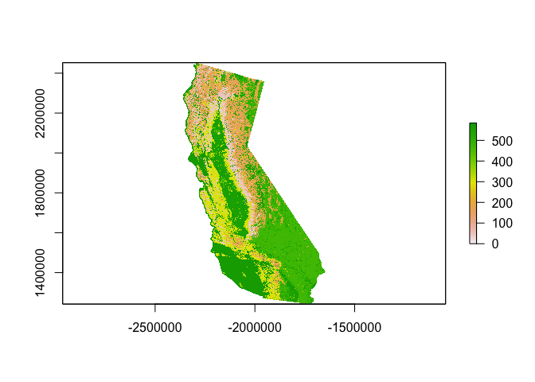<!-- -->

``` r
# get crf string from raster 
crs_string <- lc@crs

# convert geodesic buffers to this CRS so we are all dealing with same "California land cover projection"
buffers_geodesic <- buffers_geodesic %>% sf::st_transform(crs = crs_string) 
buffers_geodesic <- as(buffers_geodesic, "Spatial") # convert to SPDF

# Crop and mask the land cover data to each polygon 
lc_by_plotbuffer <- list() # initiate empty list
plotIDs <- unique(locs$plot)

for (i in 1:length(buffers_geodesic)){
  buffer <- buffers_geodesic[which(buffers_geodesic@data$plot == plotIDs[i]),]
  tmp1 <- raster::crop(lc, extent(buffer))
  tmp2 <- raster::mask(tmp1, buffer)
  lc_by_plotbuffer[[i]] <- tmp2
  names(lc_by_plotbuffer)[[i]] <- plotIDs[i]
}

# PLOT THE JS LAND COVER DATA
 plotTest <- plot(lc_by_plotbuffer$JS)
```

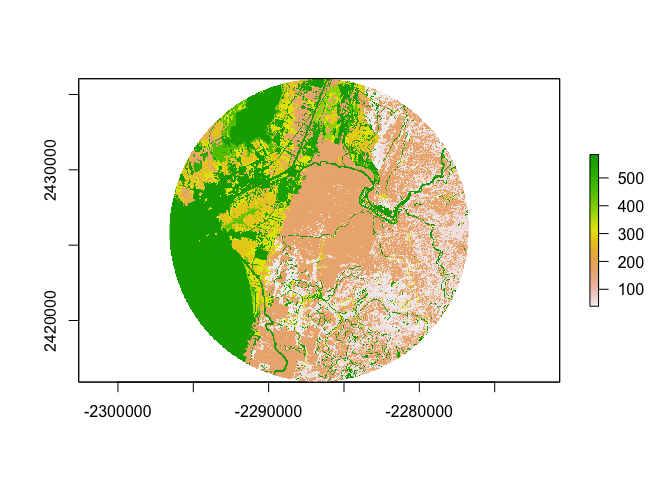<!-- -->

``` r
 rasterTest <- raster(lc_by_plotbuffer$JS)


# PLOT THE PC LAND COVER DATA
plot(lc_by_plotbuffer$PC)
```

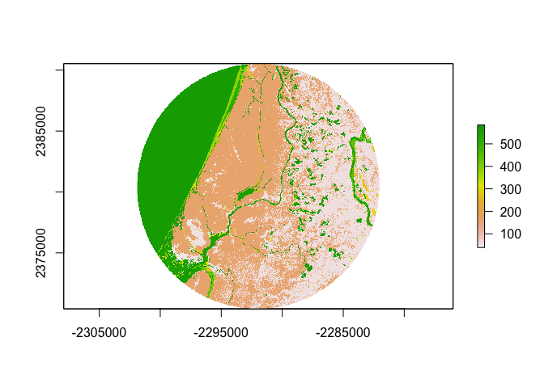<!-- -->

``` r
# ACCESS THE RASTER DATA CELL VALUES
#lc_by_plotbuffer$JS@data@values 

# WRITE OUT ALL OF THESE RASTER LAYERS to OUTPUT FOLDER
for (i in 1:length(lc_by_plotbuffer)){
  writeRaster(lc_by_plotbuffer[[i]], filename = paste(names(lc_by_plotbuffer)[[i]]), format = "HFA", overwrite = TRUE)
}
```

``` r
# landscape and vegetation data
# resolution = 30x30 = 30m2; therefore, to calculate m2: count x 30m x 30m 
## see: https://gis.stackexchange.com/questions/229455/calculating-areas-of-different-raster-classes-in-r

# this will be useful to ID classes
#setwd("~/Dropbox/Research/Thesis_Ch1/Data/CleanData")
#vegID <- read.table("gaplf2011lc_v30_CA/GAP_LANDFIRE_National_Terrestrial_Ecosystems_2011_Attributes.txt", sep="\t", header=TRUE)
# redwoods are ID = 165


# these are all the whole site buffer level (l = landcape, c = class)
# lsm_l_shdi() # Shannon’s diversity index (Diversity metric)
## Example: lsm_l_shdi(lc_by_plotbuffer) - all datasets - or lsm_l_shdi(lc_by_plotbuffer$AR) - one buffer
# lsm_l_msidi() # Modified Simpson’s diversity index (Diversity metric)
# lsm_l_msiei() # Modified Simpson’s evenness index (Diversity metric)
# lsm_l_pr() # Patch richness (Diversity metric)
# lsm_l_ord() # Patch richness density (Diversity metric)
# lsm_l_ed() # Edge Density (Area and Edge metric)
# lsm_l_lpi() # Largest patch index (Area and Edge metric)

#all <- data.frame(JS = getValues(lc_by_plotbuffer$JS), PC = getValues(lc_by_plotbuffer$PC), HR = getValues(lc_by_plotbuffer$HR), 
#                       AR = getValues(lc_by_plotbuffer$AR), MG = getValues(lc_by_plotbuffer$MG), SP = getValues(lc_by_plotbuffer$SP), 
 #                      BB = getValues(lc_by_plotbuffer$BB), BC = getValues(lc_by_plotbuffer$BC))


# Table with different landscape heterogeneity metrics
# Shannon's diversity (shannon), Simpson's diversity (simpson), land cover richness density (LCR), Edge density (EDG), weighted edge density (WEDG) = edge density/land cover richness, Largest patch index (LPI), percentage of redwood (redwood_percent)


#landscapeMetrics <- data.frame(site = names(lc_by_plotbuffer),
  #                                   shannon = #lsm_l_shdi(lc_by_plotbuffer)$value,
  #                                   simpson = #lsm_l_msidi(lc_by_plotbuffer)$value,
  #                                   LCR = lsm_l_pr(lc_by_plotbuffer)$value,
 #                                    EDG = #lsm_l_ed(lc_by_plotbuffer)$value, 
 #                                    LPI = lsm_l_lpi(lc_by_plotbuffer)$value,
  #                                   TotArea_ha = lsm_l_ta(lc_by_plotbuffer)$value) %>%
#  mutate(WEDG = EDG/LCR)


# get vegetation ID names
#vegNames <- vegID %>% 
#  dplyr::select(Value, NVC_CLASS, NVC_SUBCL, NVC_FORM, NVC_DIV, NVC_MACRO, NVC_GROUP, ECOLSYS_LU) %>%
#  dplyr::rename(ID = "Value") 

# get raw vegetation data
#rawDataList <- lapply(lc_by_plotbuffer, function(x) {
#  lsm_c_ca(x) #function automatically converts the units to hectares 
 # })

# join the list of raw data and keep site name as a column
#vegData <- dplyr::bind_rows(rawDataList, .id = 'site') %>%
#  rename(ID = "class", ha = value) %>% 
#  left_join(vegNames, by = c("ID")) %>%
#  left_join(landscapeMetrics %>% dplyr::select(site, TotArea_ha), by=c("site")) %>%
#  mutate(vegPercent = ha/TotArea_ha) %>%
#  dplyr::select(site, ID, ha, TotArea_ha, vegPercent, NVC_CLASS, NVC_SUBCL, NVC_FORM, NVC_DIV, NVC_MACRO, NVC_GROUP, ECOLSYS_LU)


# Create vegetation/community matrix table for each site
#vegMatrix <- vegData %>% 
 # pivot_wider(id_cols = site, names_from = ID, values_from = ha) #site name is a column name not a row name 


# now that we've done that, let's get percentage redwood
#rdwdArea <- vegData %>% filter(ID == 165) %>%
#  rename(redwood_ha = ha, redwoodPercent = vegPercent) %>%
#  dplyr::select(site, redwood_ha, redwoodPercent)

# now add to the landscape metrics we calculated above  
#landscapeMetrics_FINAL <- landscapeMetrics %>% 
 # left_join(rdwdArea, by = "site")

# save to csv
#write_csv(landscapeMetrics_FINAL, "landscapeMetrics.csv")
#write_csv(vegMatrix, "vegMatrix.csv")
```

Reading in my OTU table (phyloseq)

``` r
#setwd("~/Dropbox/Research/Thesis_Ch1/Data/CleanData")
#CN=read.csv("CNData_Cleaned.csv", header=T)
    #Calculate CN ratio
    #CNratio=PercentC/PercentN
    ##Append to table
    #CNall<-cbind.data.frame(CNratio, CN)
#attach(CNall)

#Soilread1=read.csv("OtherSoilDataClean.csv", header=T)
#attach(Soilread1)

#Combine all soil data into one dataframe
#merging both datasets
#Soildata<-full_join(Soilread1, CNall)

##mapfile
#METAdata=read.table("MID_Meta.txt", header = T)
#    Soildata$SiteID<-as.character(Soildata$SiteID)
#    Soildata$Treenum<-as.character(Soildata$Treenum)

    
#METAfull=full_join(METAdata, Soildata)

##Created a new file with full metadata (couldn't script this because of phyloseq)
#write.csv(METAfull, file = "MIDMETA_complete.csv")


##biom file and map file
setwd("~/Dropbox/Research/Thesis_Ch1/Data/CleanData")
biom_file="Redwoodfungibiogeo.biom"
map_file="MIDMETA_complete.txt"
biomot=import_biom(biom_file, parseFunction=parse_taxonomy_greengenes)
META=import_qiime_sample_data(map_file)


##Rhizonode data
setwd("~/Dropbox/Research/Thesis_Ch1/Data/CleanData")
biom_file2="RvS_Big.biom"
map_file2="RvsS_META.txt"
biomot2=import_biom(biom_file2, parseFunction=parse_taxonomy_greengenes)
META2=import_qiime_sample_data(map_file2)
META2$Treenum<-as.character(META2$Treenum)
```

Creating phyloseq objects and merging OTU with meta data and removing
plant reads

``` r
##merging OTU and metadata
Redwoodfungi=merge_phyloseq(biomot, META)
Structures=merge_phyloseq(biomot2, META2)

##Remove plant reads
Redwoodfungi<-subset_taxa(Redwoodfungi, Kingdom=="Fungi")
#Redwoodplant<-subset_taxa(Redwoodfungi, Kingdom=="Plantae")
Structures<-subset_taxa(Structures, Kingdom=="Fungi")

##Gather only samples (already parameterized OTU with negative controls in phyloseq)
MID<-subset_samples(Redwoodfungi, Samp=="Sample")
Structures<-subset_samples(Structures, SiteID=="8")
```

Rarefaction curves

``` r
MIDtable<-otu_table(MID)
Structuretable<-otu_table(Structures)

rarecurve(MIDtable, step = 50, col = "blue", label = F)
```

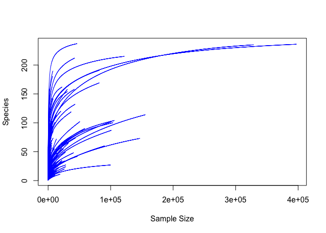<!-- -->

``` r
rarecurve(Structuretable, step = 20, col = "blue", label=F)
```

<!-- -->
Rarification

``` r
set.seed(5)
#RARE=rarefy_even_depth(MID, sample.size = 1000)
#save(RARE, file = "RARE.rda")
setwd("~/Dropbox/Research/Thesis_Ch1/Data/R")
load(file = "RARE.rda")

set.seed(5)
#RAREstructure=rarefy_even_depth(Structures, sample.size = 2000)
#setwd("~/Dropbox/Research/Thesis_Ch1/Data/R")
#save(RAREstructure, file = "RAREstructure.rda")
setwd("~/Dropbox/Research/Thesis_Ch1/Data/R")
load(file = "RAREstructure.rda")
```

Subsetting samples by sample type

``` r
##subset by sample type
Roots<-subset_samples(RARE, SampleType=="Root")
Soils<-subset_samples(RARE, SampleType=="Soil")
Glom<-subset_taxa(RARE, Phylum=="Glomeromycota")
Glomroot<-subset_samples(Glom, SampleType=="Root")
Glomsoil<-subset_samples(Glom, SampleType=="Soil")


##Not rare Gloms
GlomNR<-subset_taxa(MID, Phylum=="Glomeromycota")
GlomrootNR<-subset_samples(GlomNR, SampleType=="Root")
GlomsoilNR<-subset_samples(GlomNR, SampleType=="Soil")
```

Adonis test; vegan

``` r
RootsRARE<-subset_samples(RARE, SampleType=="Root")
SoilsRARE<-subset_samples(RARE, SampleType=="Soil")

##Extracting spp counts to a transposed dataframe
FUNGIdf<-t(as.data.frame(as(otu_table(RARE), "matrix")))
Rootdf<-t(as.data.frame(as(otu_table(RootsRARE), "matrix")))
Soildf<-t(as.data.frame(as(otu_table(SoilsRARE), "matrix")))
Structuresdf<-t(as.data.frame(as(otu_table(RAREstructure), "matrix")))

##Extracting Metadata    
Fdf<-(as(sample_data(RARE), "data.frame")) 
Rdf<-as(sample_data(RootsRARE), "data.frame")
Sdf<-as(sample_data(SoilsRARE),"data.frame")
Strucdf<-as(sample_data(RAREstructure),"data.frame")

Samptypedata<-dplyr::select(Strucdf, SampleUnique, SampleType)

##Variance in total, root, and soil fungal comm. across sites
##This is accounting for the nested design; tree num is nested within Site 
adonis(FUNGIdf ~ SiteID*SampleType, data=Fdf, strata = Fdf$Treenum, perm=1e3)
```

    ## 
    ## Call:
    ## adonis(formula = FUNGIdf ~ SiteID * SampleType, data = Fdf, permutations = 1000,      strata = Fdf$Treenum) 
    ## 
    ## Blocks:  strata 
    ## Permutation: free
    ## Number of permutations: 1000
    ## 
    ## Terms added sequentially (first to last)
    ## 
    ##                    Df SumsOfSqs MeanSqs F.Model      R2   Pr(>F)    
    ## SiteID              7    12.361  1.7659  5.4014 0.12423 0.000999 ***
    ## SampleType          1     9.347  9.3467 28.5891 0.09394 0.000999 ***
    ## SiteID:SampleType   7     8.157  1.1653  3.5644 0.08198 0.000999 ***
    ## Residuals         213    69.636  0.3269         0.69985             
    ## Total             228    99.501                 1.00000             
    ## ---
    ## Signif. codes:  0 '***' 0.001 '**' 0.01 '*' 0.05 '.' 0.1 ' ' 1

``` r
adonis(Soildf ~ SiteID, data=Sdf, strata = Sdf$Treenum, perm=1e3)
```

    ## 
    ## Call:
    ## adonis(formula = Soildf ~ SiteID, data = Sdf, permutations = 1000,      strata = Sdf$Treenum) 
    ## 
    ## Blocks:  strata 
    ## Permutation: free
    ## Number of permutations: 1000
    ## 
    ## Terms added sequentially (first to last)
    ## 
    ##            Df SumsOfSqs MeanSqs F.Model      R2   Pr(>F)    
    ## SiteID      7    11.848 1.69253  5.2339 0.24985 0.000999 ***
    ## Residuals 110    35.572 0.32338         0.75015             
    ## Total     117    47.419                 1.00000             
    ## ---
    ## Signif. codes:  0 '***' 0.001 '**' 0.01 '*' 0.05 '.' 0.1 ' ' 1

``` r
adonis(Rootdf ~ SiteID, data=Rdf, strata = Rdf$Treenum, perm=1e3)
```

    ## 
    ## Call:
    ## adonis(formula = Rootdf ~ SiteID, data = Rdf, permutations = 1000,      strata = Rdf$Treenum) 
    ## 
    ## Blocks:  strata 
    ## Permutation: free
    ## Number of permutations: 1000
    ## 
    ## Terms added sequentially (first to last)
    ## 
    ##            Df SumsOfSqs MeanSqs F.Model      R2   Pr(>F)    
    ## SiteID      7     8.515 1.21645  3.6781 0.19998 0.000999 ***
    ## Residuals 103    34.065 0.33072         0.80002             
    ## Total     110    42.580                 1.00000             
    ## ---
    ## Signif. codes:  0 '***' 0.001 '**' 0.01 '*' 0.05 '.' 0.1 ' ' 1

``` r
##Are structures sig different from root sample from which they are collected?
adonis(Structuresdf~SampleType, data=Strucdf, perm=1e3)
```

    ## 
    ## Call:
    ## adonis(formula = Structuresdf ~ SampleType, data = Strucdf, permutations = 1000) 
    ## 
    ## Permutation: free
    ## Number of permutations: 1000
    ## 
    ## Terms added sequentially (first to last)
    ## 
    ##            Df SumsOfSqs MeanSqs F.Model      R2   Pr(>F)    
    ## SampleType  2    4.3491 2.17454  6.2216 0.15663 0.000999 ***
    ## Residuals  67   23.4173 0.34951         0.84337             
    ## Total      69   27.7664                 1.00000             
    ## ---
    ## Signif. codes:  0 '***' 0.001 '**' 0.01 '*' 0.05 '.' 0.1 ' ' 1

``` r
#How much variance does site of collection explain in root+rhizonodes 
adonis(Structuresdf~SampleType+Treenum, data = Strucdf, permutations = 1e3)
```

    ## 
    ## Call:
    ## adonis(formula = Structuresdf ~ SampleType + Treenum, data = Strucdf,      permutations = 1000) 
    ## 
    ## Permutation: free
    ## Number of permutations: 1000
    ## 
    ## Terms added sequentially (first to last)
    ## 
    ##            Df SumsOfSqs MeanSqs F.Model      R2   Pr(>F)    
    ## SampleType  2    4.3491 2.17454  6.9760 0.15663 0.000999 ***
    ## Treenum     5    4.0910 0.81820  2.6248 0.14734 0.000999 ***
    ## Residuals  62   19.3264 0.31172         0.69603             
    ## Total      69   27.7664                 1.00000             
    ## ---
    ## Signif. codes:  0 '***' 0.001 '**' 0.01 '*' 0.05 '.' 0.1 ' ' 1

``` r
library(pairwiseAdonis)
pairwise.adonis2(Structuresdf ~ SampleType+Treenum, data = Strucdf)
```

    ## $parent_call
    ## [1] "Structuresdf ~ SampleType + Treenum , strata = Null"
    ## 
    ## $Rhizonode_vs_Root
    ## Permutation: free
    ## Number of permutations: 999
    ## 
    ## Terms added sequentially (first to last)
    ## 
    ##            Df SumsOfSqs MeanSqs F.Model      R2 Pr(>F)    
    ## SampleType  1    0.7797 0.77972  2.5025 0.04778  0.003 ** 
    ## Treenum     5    3.3867 0.67734  2.1739 0.20754  0.001 ***
    ## Residuals  39   12.1516 0.31158         0.74467           
    ## Total      45   16.3180                 1.00000           
    ## ---
    ## Signif. codes:  0 '***' 0.001 '**' 0.01 '*' 0.05 '.' 0.1 ' ' 1
    ## 
    ## $Rhizonode_vs_Soil
    ## Permutation: free
    ## Number of permutations: 999
    ## 
    ## Terms added sequentially (first to last)
    ## 
    ##            Df SumsOfSqs MeanSqs F.Model      R2 Pr(>F)    
    ## SampleType  1    2.8455 2.84555  9.2264 0.15079  0.001 ***
    ## Treenum     5    3.3801 0.67603  2.1920 0.17912  0.001 ***
    ## Residuals  41   12.6449 0.30841         0.67009           
    ## Total      47   18.8706                 1.00000           
    ## ---
    ## Signif. codes:  0 '***' 0.001 '**' 0.01 '*' 0.05 '.' 0.1 ' ' 1
    ## 
    ## $Root_vs_Soil
    ## Permutation: free
    ## Number of permutations: 999
    ## 
    ## Terms added sequentially (first to last)
    ## 
    ##            Df SumsOfSqs MeanSqs F.Model      R2 Pr(>F)    
    ## SampleType  1    2.8692 2.86917  8.9605 0.15816  0.001 ***
    ## Treenum     5    2.7834 0.55667  1.7385 0.15343  0.001 ***
    ## Residuals  39   12.4879 0.32020         0.68840           
    ## Total      45   18.1405                 1.00000           
    ## ---
    ## Signif. codes:  0 '***' 0.001 '**' 0.01 '*' 0.05 '.' 0.1 ' ' 1
    ## 
    ## attr(,"class")
    ## [1] "pwadstrata" "list"

Ordination (NMDS) using default of bray for distance (bray is default
method for ordinate function)

``` r
ORDtotalvals<-ordinate(RARE, "NMDS")
```

    ## Square root transformation
    ## Wisconsin double standardization
    ## Run 0 stress 0.2630447 
    ## Run 1 stress 0.2644234 
    ## Run 2 stress 0.2624801 
    ## ... New best solution
    ## ... Procrustes: rmse 0.01210577  max resid 0.1396244 
    ## Run 3 stress 0.2621014 
    ## ... New best solution
    ## ... Procrustes: rmse 0.007082206  max resid 0.08854539 
    ## Run 4 stress 0.2696594 
    ## Run 5 stress 0.2625724 
    ## ... Procrustes: rmse 0.006444695  max resid 0.09097386 
    ## Run 6 stress 0.2667237 
    ## Run 7 stress 0.2636643 
    ## Run 8 stress 0.2694414 
    ## Run 9 stress 0.2639678 
    ## Run 10 stress 0.2675834 
    ## Run 11 stress 0.2636835 
    ## Run 12 stress 0.2624778 
    ## ... Procrustes: rmse 0.006962766  max resid 0.08646332 
    ## Run 13 stress 0.2638881 
    ## Run 14 stress 0.2704999 
    ## Run 15 stress 0.2697603 
    ## Run 16 stress 0.2649791 
    ## Run 17 stress 0.2641744 
    ## Run 18 stress 0.2621449 
    ## ... Procrustes: rmse 0.004021652  max resid 0.05753404 
    ## Run 19 stress 0.2644338 
    ## Run 20 stress 0.2706564 
    ## *** No convergence -- monoMDS stopping criteria:
    ##     20: stress ratio > sratmax

``` r
ORD<-plot_ordination(RARE, ORDtotalvals, color = "SiteID", shape = "SampleType")+ geom_point(size=3)+
  Publicationcolors()+
  theme(
        text = element_text(),
        panel.background = element_rect(fill="transparent", colour = NA),
        plot.background = element_rect(fill="transparent",colour = NA),
        panel.border = element_rect(fill="transparent", colour = "black"),
        axis.title.y = element_text(angle=90, size = 12, margin = margin(r=3, unit = "mm")),
        axis.title.x = element_text(size=12, margin = margin(t=3, unit = "mm")),
        axis.text.x = element_text(size=12, margin = unit(c(t = 2.5, r = 0, b = 0, l = 0), "mm")),
        axis.text.y = element_text(size=12, margin = unit(c(t = 0, r = 2.5, b = 0, l = 0), "mm")),
        axis.line = element_blank(),
        axis.ticks.x = element_line(colour = "black"),
        axis.ticks.y = element_line(colour = "black"),
        axis.ticks.length=unit(-1.4, "mm"), 
        panel.grid.major = element_blank(),
        panel.grid.minor = element_blank(),
        legend.key = element_rect(fill="transparent", colour = NA),
        legend.position =c(0.09,0.75),
        legend.key.size= unit(4, "mm"),
        legend.text = element_text(size =10),
        legend.spacing = unit(0, "mm"),
        legend.background = element_rect(fill = "transparent", colour = NA),
        plot.margin=margin(t=2, r=2, b=2, l=2, unit = "mm"),
        strip.background=element_rect(fill="transparent", colour=NA),
        strip.text = element_text(face="bold"))
ORD
```

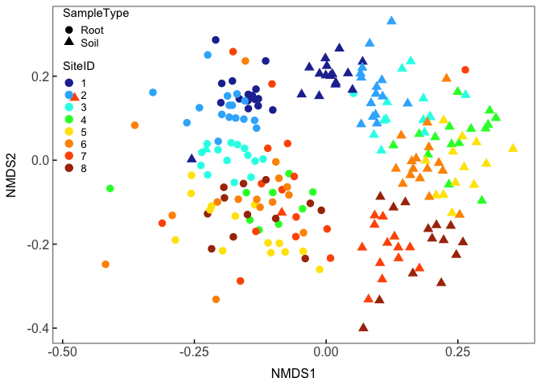<!-- -->

``` r
##Rootstructures
set.seed(33)
StructuresNMDS<-ordinate(RAREstructure, "NMDS")
```

    ## Square root transformation
    ## Wisconsin double standardization
    ## Run 0 stress 0.237017 
    ## Run 1 stress 0.2423269 
    ## Run 2 stress 0.2354958 
    ## ... New best solution
    ## ... Procrustes: rmse 0.02899639  max resid 0.1488729 
    ## Run 3 stress 0.2385676 
    ## Run 4 stress 0.2458852 
    ## Run 5 stress 0.2385168 
    ## Run 6 stress 0.2426885 
    ## Run 7 stress 0.2529933 
    ## Run 8 stress 0.2385328 
    ## Run 9 stress 0.235516 
    ## ... Procrustes: rmse 0.007074254  max resid 0.05508447 
    ## Run 10 stress 0.245618 
    ## Run 11 stress 0.2448252 
    ## Run 12 stress 0.2521357 
    ## Run 13 stress 0.2483469 
    ## Run 14 stress 0.2369083 
    ## Run 15 stress 0.2386885 
    ## Run 16 stress 0.2563033 
    ## Run 17 stress 0.2420008 
    ## Run 18 stress 0.2514619 
    ## Run 19 stress 0.245469 
    ## Run 20 stress 0.2363951 
    ## *** No convergence -- monoMDS stopping criteria:
    ##     20: stress ratio > sratmax

``` r
StructuresORD<-plot_ordination(RAREstructure, StructuresNMDS,color = "SampleType")+ 
  Publicationcolors()+
  theme(
        text = element_text(),
        panel.background = element_rect(fill="transparent", colour = NA),
        plot.background = element_rect(fill="transparent",colour = NA),
        panel.border = element_rect(fill="transparent", colour = "black"),
        axis.title.y = element_text(angle=90, size = 12, margin = margin(r=3, unit = "mm")),
        axis.title.x = element_text(size=12, margin = margin(t=3, unit = "mm")),
        axis.text.x = element_text(size=12, margin = unit(c(t = 2.5, r = 0, b = 0, l = 0), "mm")),
        axis.text.y = element_text(size=12, margin = unit(c(t = 0, r = 2.5, b = 0, l = 0), "mm")),
        axis.line = element_blank(),
        axis.ticks.x = element_line(colour = "black"),
        axis.ticks.y = element_line(colour = "black"),
        axis.ticks.length=unit(-1.4, "mm"), 
        panel.grid.major = element_blank(),
        panel.grid.minor = element_blank(),
        legend.key = element_rect(fill="transparent", colour = NA),
        legend.position =c(0.85,0.88),
        legend.key.size= unit(3, "mm"),
        legend.text = element_text(size =9),
        legend.title = element_text(size =9),
        legend.spacing = unit(0, "mm"),
        legend.background = element_rect(fill = "transparent", colour = NA),
        plot.margin=margin(t=2, r=2, b=2, l=2, unit = "mm"),
        strip.background=element_rect(fill="transparent", colour=NA),
        strip.text = element_text(face="bold"))

StructuresORD
```

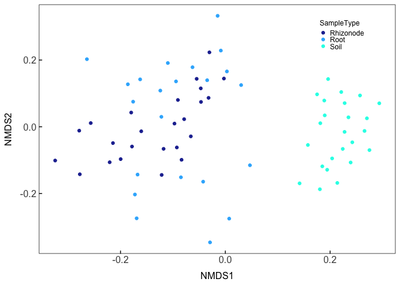<!-- -->
Bar charts

``` r
Top100= names(sort(taxa_sums(RARE), TRUE)[1:100])
Top100=prune_taxa(Top100, RARE)

Top100_Site1<-subset_samples(Top100, SiteID=="1")
Top100_Site2<-subset_samples(Top100, SiteID=="2")
Top100_Site3<-subset_samples(Top100, SiteID=="3")
Top100_Site4<-subset_samples(Top100, SiteID=="4")
Top100_Site5<-subset_samples(Top100, SiteID=="5")
Top100_Site6<-subset_samples(Top100, SiteID=="6")
Top100_Site7<-subset_samples(Top100, SiteID=="7")
Top100_Site8<-subset_samples(Top100, SiteID=="8")


Site1root<- subset_samples(Top100_Site1, SampleType=="Root")
Site1soil<-subset_samples(Top100_Site1, SampleType=="Soil")
Site2root<- subset_samples(Top100_Site2, SampleType=="Root")
Site2soil<-subset_samples(Top100_Site2, SampleType=="Soil")
Site3root<- subset_samples(Top100_Site3, SampleType=="Root")
Site3soil<-subset_samples(Top100_Site3, SampleType=="Soil")
Site4root<- subset_samples(Top100_Site4, SampleType=="Root")
Site4soil<-subset_samples(Top100_Site4, SampleType=="Soil")
Site5root<- subset_samples(Top100_Site5, SampleType=="Root")
Site5soil<-subset_samples(Top100_Site5, SampleType=="Soil")
Site6root<- subset_samples(Top100_Site6, SampleType=="Root")
Site6soil<-subset_samples(Top100_Site6, SampleType=="Soil")
Site7root<- subset_samples(Top100_Site7, SampleType=="Root")
Site7soil<-subset_samples(Top100_Site7, SampleType=="Soil")
Site8root<- subset_samples(Top100_Site8, SampleType=="Root")
Site8soil<-subset_samples(Top100_Site8, SampleType=="Soil")


Site1root <- Site1root %>%
  psmelt() %>%                                       
  arrange(Phylum) 

Site1soil <- Site1soil %>%
  psmelt() %>%                                       
  arrange(Phylum)

Site2root <- Site2root %>%
  psmelt() %>%                                       
  arrange(Phylum) 

Site2soil <- Site2soil %>%
  psmelt() %>%                                       
  arrange(Phylum)

Site3root <- Site3root %>%
  psmelt() %>%                                       
  arrange(Phylum) 

Site3soil <- Site3soil %>%
  psmelt() %>%                                       
  arrange(Phylum) 

Site4root <- Site4root %>%
  psmelt() %>%                                       
  arrange(Phylum) 

Site4soil <- Site4soil %>%
  psmelt() %>%                                       
  arrange(Phylum) 

Site5root <- Site5root %>%
  psmelt() %>%                                       
  arrange(Phylum) 

Site5soil <- Site5soil %>%
  psmelt() %>%                                       
  arrange(Phylum) 

Site6root <- Site6root %>%
  psmelt() %>%                                       
  arrange(Phylum) 

Site6soil <- Site6soil %>%
  psmelt() %>%                                       
  arrange(Phylum) 

Site7root <- Site7root %>%
  psmelt() %>%                                       
  arrange(Phylum) 

Site7soil <- Site7soil %>%
  psmelt() %>%                                       
  arrange(Phylum) 

Site8root <- Site8root %>%
  psmelt() %>%                                       
  arrange(Phylum) 

Site8soil <- Site8soil %>%
  psmelt() %>%                                       
  arrange(Phylum) 

Site1root$SampleType <- "Root"
Site1soil$SampleType <- "Soil"
Site2root$SampleType <- "Root"
Site2soil$SampleType <- "Soil"
Site3root$SampleType <- "Root"
Site3soil$SampleType <- "Soil"
Site4root$SampleType <- "Root"
Site4soil$SampleType <- "Soil"
Site5root$SampleType <- "Root"
Site5soil$SampleType <- "Soil"
Site6root$SampleType <- "Root"
Site6soil$SampleType <- "Soil"
Site7root$SampleType <- "Root"
Site7soil$SampleType <- "Soil"
Site8root$SampleType <- "Root"
Site8soil$SampleType <- "Soil"

Site1root$SiteID <- "1"
Site1soil$SiteID <- "1"
Site2root$SiteID <- "2"
Site2soil$SiteID <- "2"
Site3root$SiteID <- "3"
Site3soil$SiteID <- "3"
Site4root$SiteID <- "4"
Site4soil$SiteID <- "4"
Site5root$SiteID <- "5"
Site5soil$SiteID <- "5"
Site6root$SiteID <- "6"
Site6soil$SiteID <- "6"
Site7root$SiteID <- "7"
Site7soil$SiteID <- "7"
Site8root$SiteID <- "8"
Site8soil$SiteID <- "8"


barcolors= c(Agaricales="#2F4236", Atheliales ="#9F993D", Boletales="#576A00", Chaetothyriales="#560d0d", Eurotiales="#896c39", Geastrales="#6f0000", Geoglossales="#934D4B", Gomphales="#8D2D56", Helotiales="#2B193E", Hypocreales="#fdbe02",Hysterangiales="#0F7E94",Mortierellales="#487ABC",Mucorales="#55A049",Mytilinidales="#203453",Pezizales="#40318D", Pleosporales="#136207", Polyporales="#c9ffe5", Russulales="#e77797", Sordariales="#67B6BD", Thelebolales="#fdfd96", Thelephorales="#BFCE72", Trechisporales="#babed4", Venturiales="#383838")


##join all sets
bars_all<- rbind(Site1root, Site1soil,Site2root, Site2soil, Site3root, Site3soil, Site4root, Site4soil,
                 Site5root, Site5soil, Site6root, Site6soil, Site7root, Site7soil, Site8root, Site8soil)

bars_all_agg <- bars_all %>%
  group_by(Order, SiteID, SampleType) %>%
  summarise_at(vars(Abundance), list(sum), na.rm=TRUE)


##plot
barplot<-ggplot(data = filter(bars_all_agg), aes(SiteID, Abundance, fill = Order )) +
  facet_wrap(~SampleType,scales="free_x", ncol = 1, strip.position = "right") +
  geom_bar(stat = "identity", position = position_fill(), linetype=2) +
  guides(fill = guide_legend(ncol = 1))+
  scale_fill_manual(values = barcolors, na.value="#E8E8E8", labels=c("Agaricales", "Atheliales", "Boletales","Chaetothyriales", "Eurotiales", "Geastrales", "Geoglossales", "Gomphales", "Helotiales", "Hypocreales","Hysterangiales","Mortierellales","Mucorales","Mytilinidales","Pezizales", "Pleosporales", "Polyporales", "Russulales", "Sordariales", "Thelebolales", "Thelephorales", "Trechisporales", "Venturiales", "Unassigned"), name="Fungal Order")+ 
            scale_y_continuous("Relative abundance")+
            xlab("Site ID")+
            theme(
            text = element_text(family = "Helvetica"),
            panel.background = element_rect(fill="transparent", colour = NA),
            plot.background = element_rect(fill="transparent",colour = NA),
            strip.background.x=element_rect(fill="LightGray",colour = NA),
            strip.background.y=element_rect(fill="LightGray",colour = NA),
            panel.border = element_rect(fill="transparent", colour = "black"),
            axis.title.y = element_text(angle=90, size = 14, margin = margin(r=3, unit = "mm")),
            axis.title.x = element_text(size=12, margin = margin(t=3, unit = "mm")),
            axis.text.x = element_text(angle=0, size=14, 
                                       margin = unit(c(t = 2.5, r = 0, b = 0, l = 0), "mm")),
            axis.text.y = element_text(size=14, margin = unit(c(t = 0, r = 2.5, b = 0, l = 0), "mm")),
            axis.line = element_blank(),
            axis.ticks.x = element_blank(),
            axis.ticks.y = element_line(colour = "black"),
            axis.ticks.length=unit(-1.4, "mm"), 
            panel.grid.major = element_blank(),
            panel.grid.minor = element_blank(),
            legend.key = element_rect(fill="transparent", colour = NA),
            legend.box = "horizontal",
            legend.key.size= unit(4, "mm"),
            legend.text = element_text(size =11),
            legend.spacing = unit(0, "mm"),
            legend.background = element_rect(fill = "transparent", colour = NA),
            plot.margin=margin(t=2, r=2, b=2, l=2, unit = "mm"),
            strip.background=element_rect(fill="transparent", colour=NA),
            strip.text = element_text(face="bold"))
barplot
```

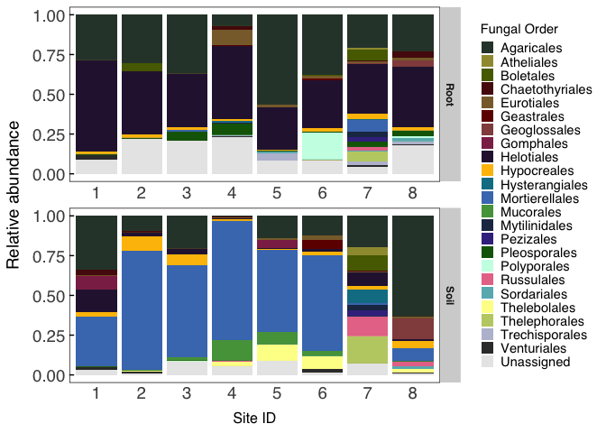<!-- -->
Rhizonode taxa (all fungi)

``` r
Top500rhizo= names(sort(taxa_sums(RAREstructure), TRUE)[1:500])
Top500rhizo=prune_taxa(Top500rhizo, RAREstructure)

RootsRhiz<-subset_samples(Top500rhizo, SampleType=="Rhizonode")
RootsRoot<-subset_samples(Top500rhizo, SampleType=="Root")
RootsSoils<-subset_samples(Top500rhizo, SampleType=="Soil")

RhizoT1<-subset_samples(RootsRhiz, Treenum=="1")
RhizoT2<-subset_samples(RootsRhiz, Treenum=="2")
RhizoT3<-subset_samples(RootsRhiz, Treenum=="3")
RhizoT4<-subset_samples(RootsRhiz, Treenum=="4")
RhizoT5<-subset_samples(RootsRhiz, Treenum=="5")
RhizoT6<-subset_samples(RootsRhiz, Treenum=="6")


RootT1<-subset_samples(RootsRoot, Treenum=="1")
RootT2<-subset_samples(RootsRoot, Treenum=="2")
RootT3<-subset_samples(RootsRoot, Treenum=="3")
RootT4<-subset_samples(RootsRoot, Treenum=="4")
RootT5<-subset_samples(RootsRoot, Treenum=="5")
RootT6<-subset_samples(RootsRoot, Treenum=="6")

SoilT1<-subset_samples(RootsSoils, Treenum=="1")
SoilT2<-subset_samples(RootsSoils, Treenum=="2")
SoilT3<-subset_samples(RootsSoils, Treenum=="3")
SoilT4<-subset_samples(RootsSoils, Treenum=="4")
SoilT5<-subset_samples(RootsSoils, Treenum=="5")
SoilT6<-subset_samples(RootsSoils, Treenum=="6")


RootT1 <- RootT1 %>%
  psmelt() %>%                                       
  arrange(Family) 
RootT2 <- RootT2 %>%
  psmelt() %>%                                       
  arrange(Family) 
RootT3 <- RootT3 %>%
  psmelt() %>%                                       
  arrange(Family) 
RootT4 <- RootT4 %>%
  psmelt() %>%                                       
  arrange(Family) 
RootT5 <- RootT5 %>%
  psmelt() %>%                                       
  arrange(Family) 
RootT6 <- RootT6 %>%
  psmelt() %>%                                       
  arrange(Family) 

RhizoT1 <- RhizoT1 %>%
  psmelt() %>%                                       
  arrange(Family) 
RhizoT2 <- RhizoT2 %>%
  psmelt() %>%                                       
  arrange(Family) 
RhizoT3 <- RhizoT3 %>%
  psmelt() %>%                                       
  arrange(Family) 
RhizoT4 <- RhizoT4 %>%
  psmelt() %>%                                       
  arrange(Family) 
RhizoT5 <- RhizoT5 %>%
  psmelt() %>%                                       
  arrange(Family) 
RhizoT6 <- RhizoT6 %>%
  psmelt() %>%                                       
  arrange(Family) 

SoilT1 <- SoilT1 %>%
  psmelt() %>%                                       
  arrange(Family) 
SoilT2 <- SoilT2 %>%
  psmelt() %>%                                       
  arrange(Family) 
SoilT3 <- SoilT3 %>%
  psmelt() %>%                                       
  arrange(Family) 
SoilT4 <- SoilT4 %>%
  psmelt() %>%                                       
  arrange(Family) 
SoilT5 <- SoilT5 %>%
  psmelt() %>%                                       
  arrange(Family) 
SoilT6 <- SoilT6 %>%
  psmelt() %>%                                       
  arrange(Family) 


RootT1$samptypecode <- "Root"
RootT2$samptypecode <- "Root"
RootT3$samptypecode <- "Root"
RootT4$samptypecode <- "Root"
RootT5$samptypecode <- "Root"
RootT6$samptypecode <- "Root"
RhizoT1$samptypecode <- "Rhizonode"
RhizoT2$samptypecode <- "Rhizonode"
RhizoT3$samptypecode <- "Rhizonode"
RhizoT4$samptypecode <- "Rhizonode"
RhizoT5$samptypecode <- "Rhizonode"
RhizoT6$samptypecode <- "Rhizonode"
SoilT1$samptypecode <- "Soil"
SoilT2$samptypecode <- "Soil"
SoilT3$samptypecode <- "Soil"
SoilT4$samptypecode <- "Soil"
SoilT5$samptypecode <- "Soil"
SoilT6$samptypecode <- "Soil"


RootT1$Treenumber <- "1"
RootT2$Treenumber <- "2"
RootT3$Treenumber <- "3"
RootT4$Treenumber <- "4"
RootT5$Treenumber <- "5"
RootT6$Treenumber <- "6"
RhizoT1$Treenumber <- "1"
RhizoT2$Treenumber <- "2"
RhizoT3$Treenumber <- "3"
RhizoT4$Treenumber <- "4"
RhizoT5$Treenumber <- "5"
RhizoT6$Treenumber <- "6"
SoilT1$Treenumber <- "1"
SoilT2$Treenumber <- "2"
SoilT3$Treenumber <- "3"
SoilT4$Treenumber <- "4"
SoilT5$Treenumber <- "5"
SoilT6$Treenumber <- "6"

Rhizobars<-rbind(RootT1, RootT2,RootT3, RootT4, RootT5, RootT6, SoilT1, SoilT2,SoilT3, SoilT4, SoilT5, SoilT6, RhizoT1, RhizoT2, RhizoT3, RhizoT4,RhizoT5, RhizoT6)

Rhizobars_agg <- Rhizobars %>%
  group_by(Phylum, Treenumber, samptypecode) %>%
  summarise_at(vars(Abundance), list(sum), na.rm=TRUE)

Rhizonodebarcolors= c(Ascomycota="#2B193E", Basidiomycota ="#2F4236", Chytridiomycota="#9F993D", Monoblepharidomycota="#800000", Glomeromycota="#fdbe02", Mortierellomycota="#487ABC", Mucoromycota="#23395d", Rozellomycota="#cc1100")


Rhizobarplot<-ggplot(data = filter(Rhizobars_agg), aes(Treenumber, Abundance, fill = Phylum)) +
  facet_wrap(~samptypecode,scales="free_x", ncol = 1, strip.position = "right") +
  geom_bar(stat = "identity", position = position_fill()) +
  guides(fill = guide_legend(ncol = 1))+
 scale_fill_manual(values = Rhizonodebarcolors, na.value="#E8E8E8", labels=c("Ascomycota", "Basidiomycota", "Chytridiomycota", "Glomeromycota", "Monoblepharidomycota","Mortierellomycota","Mucoromycota", "Rozellomycota", "Unassigned"), name="Fungal Phylum")+ 
            scale_y_continuous("Relative abundance")+
            xlab("Tree ID")+
            theme(
            text = element_text(family = "Helvetica"),
            panel.background = element_rect(fill="transparent", colour = NA),
            plot.background = element_rect(fill="transparent",colour = NA),
            strip.background.x=element_rect(fill="LightGray",colour = NA),
            strip.background.y=element_rect(fill="LightGray",colour = NA),
            panel.border = element_rect(fill="transparent", colour = "black"),
            axis.title.y = element_text(angle=90, size = 14, margin = margin(r=3, unit = "mm")),
            axis.title.x = element_text(size=12, margin = margin(t=3, unit = "mm")),
            axis.text.x = element_text(angle=0, size=14, 
                                       margin = unit(c(t = 2.5, r = 0, b = 0, l = 0), "mm")),
            axis.text.y = element_text(size=14, margin = unit(c(t = 0, r = 2.5, b = 0, l = 0), "mm")),
            axis.line = element_blank(),
            axis.ticks.x = element_blank(),
            axis.ticks.y = element_line(colour = "black"),
            axis.ticks.length=unit(-1.4, "mm"), 
            panel.grid.major = element_blank(),
            panel.grid.minor = element_blank(),
            legend.key = element_rect(fill="transparent", colour = NA),
            legend.box = "horizontal",
            legend.key.size= unit(4, "mm"),
            legend.text = element_text(size =11),
            legend.spacing = unit(0, "mm"),
            legend.background = element_rect(fill = "transparent", colour = NA),
            plot.margin=margin(t=2, r=2, b=2, l=2, unit = "mm"),
            strip.background=element_rect(fill="transparent", colour=NA),
            strip.text = element_text(face="bold"))
```

Rhizonode AMF taxa

``` r
GlomsRootsRhiz<-subset_samples(RAREstructure, SampleType=="Rhizonode")
GlomsRootsRhiz<-subset_taxa(GlomsRootsRhiz, Phylum=="Glomeromycota")

GlomsRootsRoot<-subset_samples(RAREstructure, SampleType=="Root")
GlomsRootsRoot<-subset_taxa(GlomsRootsRoot, Phylum=="Glomeromycota")

GlomsRootsSoils<-subset_samples(RAREstructure, SampleType=="Soil")
GlomsRootsSoils<-subset_taxa(GlomsRootsSoils, Phylum=="Glomeromycota")

GlomrhizoT1<-subset_samples(GlomsRootsRhiz, Treenum=="1")
GlomrhizoT2<-subset_samples(GlomsRootsRhiz, Treenum=="2")
GlomrhizoT3<-subset_samples(GlomsRootsRhiz, Treenum=="3")
GlomrhizoT4<-subset_samples(GlomsRootsRhiz, Treenum=="4")
GlomrhizoT5<-subset_samples(GlomsRootsRhiz, Treenum=="5")
GlomrhizoT6<-subset_samples(GlomsRootsRhiz, Treenum=="6")


GlomrootT1<-subset_samples(GlomsRootsRoot, Treenum=="1")
GlomrootT2<-subset_samples(GlomsRootsRoot, Treenum=="2")
GlomrootT3<-subset_samples(GlomsRootsRoot, Treenum=="3")
GlomrootT4<-subset_samples(GlomsRootsRoot, Treenum=="4")
GlomrootT5<-subset_samples(GlomsRootsRoot, Treenum=="5")
GlomrootT6<-subset_samples(GlomsRootsRoot, Treenum=="6")


GlomsoilT1<-subset_samples(GlomsRootsSoils, Treenum=="1")
GlomsoilT2<-subset_samples(GlomsRootsSoils, Treenum=="2")
GlomsoilT3<-subset_samples(GlomsRootsSoils, Treenum=="3")
GlomsoilT4<-subset_samples(GlomsRootsSoils, Treenum=="4")
GlomsoilT5<-subset_samples(GlomsRootsSoils, Treenum=="5")
GlomsoilT6<-subset_samples(GlomsRootsSoils, Treenum=="6")


GlomrootT1 <- GlomrootT1 %>%
  psmelt() %>%                                       
  arrange(Family) 
GlomrootT2 <- GlomrootT2 %>%
  psmelt() %>%                                       
  arrange(Family) 
GlomrootT3 <- GlomrootT3 %>%
  psmelt() %>%                                       
  arrange(Family) 
GlomrootT4 <- GlomrootT4 %>%
  psmelt() %>%                                       
  arrange(Family) 
GlomrootT5 <- GlomrootT5 %>%
  psmelt() %>%                                       
  arrange(Family) 
GlomrootT6 <- GlomrootT6 %>%
  psmelt() %>%                                       
  arrange(Family) 

GlomrhizoT1 <- GlomrhizoT1 %>%
  psmelt() %>%                                       
  arrange(Family) 
GlomrhizoT2 <- GlomrhizoT2 %>%
  psmelt() %>%                                       
  arrange(Family) 
GlomrhizoT3 <- GlomrhizoT3 %>%
  psmelt() %>%                                       
  arrange(Family) 
GlomrhizoT4 <- GlomrhizoT4 %>%
  psmelt() %>%                                       
  arrange(Family) 
GlomrhizoT5 <- GlomrhizoT5 %>%
  psmelt() %>%                                       
  arrange(Family) 
GlomrhizoT6 <- GlomrhizoT6 %>%
  psmelt() %>%                                       
  arrange(Family) 

GlomsoilT1 <- GlomsoilT1 %>%
  psmelt() %>%                                       
  arrange(Family) 
GlomsoilT2 <- GlomsoilT2 %>%
  psmelt() %>%                                       
  arrange(Family) 
GlomsoilT3 <- GlomsoilT3 %>%
  psmelt() %>%                                       
  arrange(Family) 
GlomsoilT4 <- GlomsoilT4 %>%
  psmelt() %>%                                       
  arrange(Family) 
GlomsoilT5 <- GlomsoilT5 %>%
  psmelt() %>%                                       
  arrange(Family) 
GlomsoilT6 <- GlomsoilT6 %>%
  psmelt() %>%                                       
  arrange(Family) 


GlomrootT1$samptypecode <- "Root"
GlomrootT2$samptypecode <- "Root"
GlomrootT3$samptypecode <- "Root"
GlomrootT4$samptypecode <- "Root"
GlomrootT5$samptypecode <- "Root"
GlomrootT6$samptypecode <- "Root"
GlomrhizoT1$samptypecode <- "Rhizonode"
GlomrhizoT2$samptypecode <- "Rhizonode"
GlomrhizoT3$samptypecode <- "Rhizonode"
GlomrhizoT4$samptypecode <- "Rhizonode"
GlomrhizoT5$samptypecode <- "Rhizonode"
GlomrhizoT6$samptypecode <- "Rhizonode"
GlomsoilT1$samptypecode <- "Soil"
GlomsoilT2$samptypecode <- "Soil"
GlomsoilT3$samptypecode <- "Soil"
GlomsoilT4$samptypecode <- "Soil"
GlomsoilT5$samptypecode <- "Soil"
GlomsoilT6$samptypecode <- "Soil"


GlomrootT1$Treenumber <- "1"
GlomrootT2$Treenumber <- "2"
GlomrootT3$Treenumber <- "3"
GlomrootT4$Treenumber <- "4"
GlomrootT5$Treenumber <- "5"
GlomrootT6$Treenumber <- "6"
GlomrhizoT1$Treenumber <- "1"
GlomrhizoT2$Treenumber <- "2"
GlomrhizoT3$Treenumber <- "3"
GlomrhizoT4$Treenumber <- "4"
GlomrhizoT5$Treenumber <- "5"
GlomrhizoT6$Treenumber <- "6"
GlomsoilT1$Treenumber <- "1"
GlomsoilT2$Treenumber <- "2"
GlomsoilT3$Treenumber <- "3"
GlomsoilT4$Treenumber <- "4"
GlomsoilT5$Treenumber <- "5"
GlomsoilT6$Treenumber <- "6"

Glombars<-rbind(GlomrootT1, GlomrootT2,GlomrootT3, GlomrootT4, GlomrootT5, GlomrootT6, GlomsoilT1, GlomsoilT2,GlomsoilT3, GlomsoilT4, GlomsoilT5, GlomsoilT6, GlomrhizoT1, GlomrhizoT2, GlomrhizoT3, GlomrhizoT4,GlomrhizoT5, GlomrhizoT6)

Glombars_agg <- Glombars %>%
  dplyr::group_by(Family, Treenumber, samptypecode) %>%
 dplyr:: summarise_at(vars(Abundance), list(sum), na.rm=TRUE)

AMbarcolors= c(Acaulosporaceae="#2B193E", Ambisporaceae ="#9F993D", Archaeosporaceae="#576A00", Claroideoglomeraceae="#487ABC", Diversisporaceae="#fdbe02", Glomeraceae="#2F4236")

Glombarplot<-ggplot(data = filter(Glombars_agg), aes(Treenumber, Abundance, fill = Family)) +
  facet_wrap(~samptypecode,scales="free_x", ncol = 1, strip.position = "right") +
  geom_bar(stat = "identity", position = position_fill()) +
  guides(fill = guide_legend(ncol = 1))+
  scale_fill_manual(values = AMbarcolors, na.value="#E8E8E8", labels=c("Acaulosporaceae", "Ambisporaceae","Archaeosporaceae", "Claroideoglomeraceae", "Diversisporaceae", "Glomeraceae", "Unassigned"), name="AMF Family")+ 
            scale_y_continuous("Relative abundance")+
            xlab("Tree ID")+
            theme(
            text = element_text(family = "Helvetica"),
            panel.background = element_rect(fill="transparent", colour = NA),
            plot.background = element_rect(fill="transparent",colour = NA),
            strip.background.x=element_rect(fill="LightGray",colour = NA),
            strip.background.y=element_rect(fill="LightGray",colour = NA),
            panel.border = element_rect(fill="transparent", colour = "black"),
            axis.title.y = element_text(angle=90, size = 14, margin = margin(r=3, unit = "mm")),
            axis.title.x = element_text(size=12, margin = margin(t=3, unit = "mm")),
            axis.text.x = element_text(angle=0, size=14, 
                                       margin = unit(c(t = 2.5, r = 0, b = 0, l = 0), "mm")),
            axis.text.y = element_text(size=14, margin = unit(c(t = 0, r = 2.5, b = 0, l = 0), "mm")),
            axis.line = element_blank(),
            axis.ticks.x = element_blank(),
            axis.ticks.y = element_line(colour = "black"),
            axis.ticks.length=unit(-1.4, "mm"), 
            panel.grid.major = element_blank(),
            panel.grid.minor = element_blank(),
            legend.key = element_rect(fill="transparent", colour = NA),
            legend.box = "horizontal",
            legend.key.size= unit(4, "mm"),
            legend.text = element_text(size =11),
            legend.spacing = unit(0, "mm"),
            legend.background = element_rect(fill = "transparent", colour = NA),
            plot.margin=margin(t=2, r=2, b=2, l=2, unit = "mm"),
            strip.background=element_rect(fill="transparent", colour=NA),
            strip.text = element_text(face="bold"))
```

Funguild

``` r
setwd("~/Dropbox/Research/Thesis_Ch1/Data/CleanData/")
guildsecto<-read.csv("Redwoodfungibiogeo.guilds.csv", header =T)
guildsecto <- guildsecto %>% dplyr::rename(OTU = X.OTU.ID) 
guildsecto<-dplyr::select(guildsecto,OTU,Guild, Confidence.Ranking, Notes)

OTUrootraretemp<-as(otu_table(Roots), "matrix")
OTUrareroot<-as.data.frame(OTUrootraretemp)

tempmatchguildsroots<-OTUrareroot
tempmatchguildsroots$OTU<-rownames(OTUrareroot)

##samples containing contaminant plant DNA (plus redwood DNA too)
#MG4WRoot MG4WRoot PC2WRoot AR3NRoot BB2ERoot BB2NRoot BB2WRoot BB3NRoot JS3ERoot

##removing any samples with contaminant plant DNA
tempmatchguildsrootsc<-dplyr::select(tempmatchguildsroots, c(-MG4WRoot, -MG4WRoot, -PC2WRoot, -AR3NRoot, -BB2ERoot, -BB2NRoot, -BB2WRoot, -BB3NRoot, -JS3ERoot))

OTUsoilraretemp<-as(otu_table(Soils), "matrix")
OTUraresoil<-as.data.frame(OTUsoilraretemp)

tempmatchguildssoils<-OTUraresoil
tempmatchguildssoils$OTU<-rownames(OTUraresoil)

rootguilds<-inner_join(tempmatchguildsrootsc, guildsecto)
soilguilds<-inner_join(tempmatchguildssoils, guildsecto)

unassignedsoils<-sum(soilguilds$Notes=="Unassigned", na.rm = TRUE)
totalcountsoils<-length(soilguilds$Notes)
(totalcountsoils-unassignedsoils)/totalcountsoils
```

    ## [1] 0.492973

``` r
##49.2973% of OTUs were assigned via funguild
##(OTUs aren't actually dropped here; keeps all OTUs even if they didnt appear in soils and only in roots, just shows as a zero, so this is the proportion of OTUs assigned in total)

Rootectos<-rootguilds%>% 
  filter(Guild==c("Ectomycorrhizal", "Ectomycorrhizal-Endophyte-Ericoid Mycorrhizal-Litter Saprotroph-Orchid Mycorrhizal", "Ectomycorrhizal-Fungal Parasite", "Ectomycorrhizal-Orchid Mycorrhizal-Root Associated Biotroph", "Ectomycorrhizal-Undefined Saprotroph", "Ectomycorrhizal-Fungal Parasite-Plant Pathogen-Wood Saprotroph", "Dung Saprotroph-Ectomycorrhizal-Soil Saprotroph-Wood Saprotroph"))

Soilectos<-soilguilds%>% 
  filter(Guild==c("Ectomycorrhizal", "Ectomycorrhizal-Endophyte-Ericoid Mycorrhizal-Litter Saprotroph-Orchid Mycorrhizal", "Ectomycorrhizal-Fungal Parasite", "Ectomycorrhizal-Orchid Mycorrhizal-Root Associated Biotroph", "Ectomycorrhizal-Undefined Saprotroph", "Ectomycorrhizal-Fungal Parasite-Plant Pathogen-Wood Saprotroph", "Dung Saprotroph-Ectomycorrhizal-Soil Saprotroph-Wood Saprotroph"))


Rootectosums<-colSums((Rootectos[,1:103]/1000)*100)
Rootectosumsdf=as.data.frame(Rootectosums)
Rootectosumsdf$SampleUnique=rownames(Rootectosumsdf)
Rootectosumsdf=left_join(Rootectosumsdf,Rdf)
colnames(Rootectosumsdf)[1]<-"Ectopercent"

Soilectosums<-colSums((Soilectos[,1:118]/1000)*100)
Soilectosumsdf=as.data.frame(Soilectosums)
Soilectosumsdf$SampleUnique=rownames(Soilectosumsdf)
Soilectosumsdf=left_join(Soilectosumsdf,Sdf)
colnames(Soilectosumsdf)[1]<-"Ectopercent"

Ectoproportions<-full_join(Soilectosumsdf,Rootectosumsdf)


Ectorootbarplot<-ggplot(data = Ectoproportions, aes(SiteID, Ectopercent, color=SiteID))+
  geom_point()+
  facet_wrap(~SampleType, ncol=1, scales = "free_y",
             strip.position = "right")+
  labs(x="Site ID", y="Percent ectomycorrhizal reads (%)")+
  Publicationcolors()+
  theme(
        text = element_text(),
        panel.background = element_rect(fill="transparent", colour = NA),
        plot.background = element_rect(fill="transparent",colour = NA),
        panel.border = element_rect(fill="transparent", colour = "black"),
        axis.title.y = element_text(angle=90, size = 12, margin = margin(r=3, unit = "mm")),
        axis.title.x = element_text(size=12, margin = margin(t=3, unit = "mm")),
        axis.text.x = element_text(size=12, margin = unit(c(t = 2.5, r = 0, b = 0, l = 0), "mm")),
        axis.text.y = element_text(size=12, margin = unit(c(t = 0, r = 2.5, b = 0, l = 0), "mm")),
        axis.line = element_blank(),
        axis.ticks.x = element_line(colour = "black"),
        axis.ticks.y = element_line(colour = "black"),
        axis.ticks.length=unit(-1.4, "mm"), 
        panel.grid.major = element_blank(),
        panel.grid.minor = element_blank(),
        legend.position = "right",
        legend.background = element_rect(fill="transparent",
                                         colour = NA),
        legend.key.size= unit(4, "mm"),
        legend.key = element_rect(fill="transparent", colour = NA))


##Proportion of OTUs matched in funguild
HasNoReadsRoots <- rowSums(otu_table(Roots))==0
nrow(otu_table(Roots))-sum(HasNoReadsRoots)
```

    ## [1] 1484

``` r
##There are 1484 OTUs total in roots

HasNoReadsSoils <- rowSums(otu_table(Soils))==0
nrow(otu_table(Soils))-sum(HasNoReadsSoils)
```

    ## [1] 2304

``` r
##There are 2304 OTUs total in soils
```

GDM Step 1: OTU Data for GDM

``` r
library(raster)
library(sp)

##Calculating k (decomp coeff)

setwd("~/Dropbox/Research/Thesis_Ch1/Data/CleanData")
redwoodsites<-read.table("MIDMETA_complete.txt", header = T, sep="", dec=".")

redwoodsitesroots<-dplyr::filter(redwoodsites, SampleType=="Root")
redwoodsitessoils<-dplyr::filter(redwoodsites, SampleType=="Soil")

clim <- raster::getData('worldclim', download = TRUE, var = 'bio', res = 10)
clim.ca=raster::crop(clim,c(-125,-118,34,45))
coordsroots<-data.frame(redwoodsitesroots$Longitude, redwoodsitesroots$Latitude)
coordssoils<-data.frame(redwoodsitessoils$Longitude, redwoodsitessoils$Latitude)

climr<-clim.ca[[c(10, 18)]]
points <- SpatialPoints(coordsroots, proj4string=climr@crs)
values<-raster::extract(climr, points)
SiteNum<-redwoodsitesroots$SiteID
df<-cbind.data.frame(coordinates(points), values, SiteNum)

clims<-clim.ca[[c(10, 18)]]
pointsS <- SpatialPoints(coordssoils, proj4string=clims@crs)
values<-raster::extract(clims, pointsS)
SiteNumS<-redwoodsitessoils$SiteID
dfS<-cbind.data.frame(coordinates(pointsS), values, SiteNumS)


library(dplyr)
df2=df %>% 
  rowwise()%>% 
  dplyr::mutate(bio10_C=bio10/10,
                  bio18_in_m=(bio18/1000)) 

df2s=dfS%>% 
  rowwise()%>% 
  dplyr::mutate(bio10_C=bio10/10,
                  bio18_in_m=(bio18/1000)) 

T=df2$bio10_C
P=df2$bio18_in_m
k = exp(0.095*T - 0.00014 * T^2) * (1 - exp(-1.21 * P))
dataframe<-list(SampleUnique=redwoodsitesroots$SampleUnique, 
           k=k)
df<-dplyr::bind_rows(dataframe)
df<-dplyr::arrange(df, SampleUnique)

T=df2s$bio10_C
P=df2s$bio18_in_m
k = exp(0.095*T - 0.00014 * T^2) * (1 - exp(-1.21 * P))
dataframe<-list(SampleUnique=redwoodsitessoils$SampleUnique, 
           k=k)
dfS<-dplyr::bind_rows(dataframe)
dfS<-dplyr::arrange(dfS, SampleUnique)


##write the rarified meta data into a data frame
dfroot<-as(sample_data(Roots), "data.frame")
dfsoil<-as(sample_data(Soils),"data.frame")

dfroot<-dplyr::select(dfroot,-RevBarcodeSequence, -DemuxReads, -phinchID, -Treatment, -ReversePrimer, -BarcodeSequence, -LinkerPrimerSequence, -LinkerPrimerSequence)

dfsoil<-dplyr::select(dfsoil,-RevBarcodeSequence, -DemuxReads, -phinchID, -Treatment, -ReversePrimer, -BarcodeSequence, -LinkerPrimerSequence, -LinkerPrimerSequence)

dfroot<-left_join(dfroot, df)
dfsoil<-left_join(dfsoil, dfS)

setwd("~/Dropbox/Research/Thesis_Ch1/Data/CleanData/")
landscapemets<-read.csv("landscapeMetrics.csv")

landscapemets$SiteID<-as.factor(c(1,2,3,4,5,6,7,8))
landscapemets<-dplyr::select(landscapemets, -site)

dfsoil<-dplyr::full_join(dfsoil, landscapemets)
dfroot<-dplyr::full_join(dfroot,landscapemets)

dfsoilfilter<-dplyr::filter(dfsoil, Treenum=="1",Cardinaldirection=="N")

Decompplot<-ggplot(data=dfsoilfilter, aes(SiteID, k, color=SiteID))+
                     geom_point(aes(), size=2)+
  labs(x="Site ID", y="Decomposition coefficient (k)")+
  theme(
        text = element_text(),
        panel.background = element_rect(fill="transparent", colour = NA),
        plot.background = element_rect(fill="transparent",colour = NA),
        panel.border = element_rect(fill="transparent", colour = "black"),
        axis.title.y = element_text(angle=90, size = 12, margin = margin(r=3, unit = "mm")),
        axis.title.x = element_text(size=12, margin = margin(t=3, unit = "mm")),
        axis.text.x = element_text(size=12, margin = unit(c(t = 2.5, r = 0, b = 0, l = 0), "mm")),
        axis.text.y = element_text(size=12, margin = unit(c(t = 0, r = 2.5, b = 0, l = 0), "mm")),
        axis.line = element_blank(),
        axis.ticks.x = element_line(colour = "black"),
        axis.ticks.y = element_line(colour = "black"),
        axis.ticks.length=unit(-1.4, "mm"), 
        panel.grid.major = element_blank(),
        panel.grid.minor = element_blank(),
        legend.position = "right",
        legend.background = element_rect(fill="transparent",
                                         colour = NA),
        legend.key = element_rect(fill="transparent", colour = NA),
        plot.margin=margin(t=2, r=2, b=2, l=2, unit = "mm"),
        strip.background=element_rect(fill="transparent", colour=NA),
        strip.text = element_text(face="bold"))
Decompplot
```

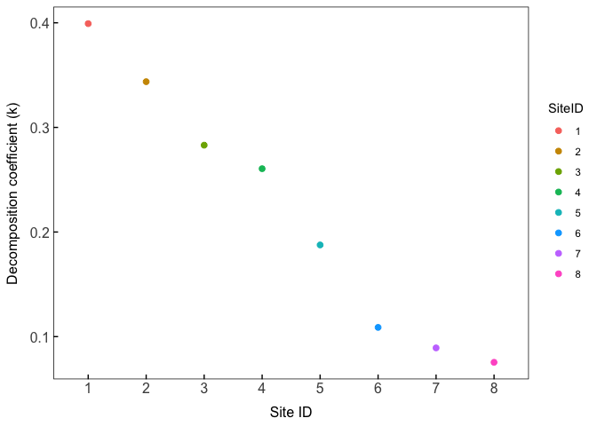<!-- -->

``` r
##write a datatable of rarified data 
OTUrootraretemp<-as(otu_table(Roots), "matrix")
OTUrareroot<-as.data.frame(OTUrootraretemp)

OTUsoilraretemp<-as(otu_table(Soils), "matrix")
OTUraresoil<-as.data.frame(OTUsoilraretemp)

##Extract the rare data
GDMrareroot<-as.data.frame(t(OTUrareroot))
GDMraresoil<-as.data.frame(t(OTUraresoil))

#append SampleID
SampleUnique<-dfroot$SampleUnique
GDMrareroot<-cbind(SampleUnique, GDMrareroot)
SampleUnique<-dfsoil$SampleUnique
GDMraresoil<-cbind(SampleUnique, GDMraresoil)


#setwd("~/Dropbox/Research/Thesis_Ch1/Data/R")
#write.csv(GDMrareroot, "FungiGDM_rareroot.csv")
#write.csv(GDMraresoil, "FungiGDM_raresoil.csv")
setwd("~/Dropbox/Research/Thesis_Ch1/Data/R")
bioDroot<-read.csv("FungiGDM_rareroot.csv", header =T)
bioDsoil<-read.csv("FungiGDM_raresoil.csv", header=T)

#remove extraneous columns from getting names formatted between files
bioDroot<-dplyr::select(bioDroot,-X)
bioDsoil<-dplyr::select(bioDsoil,-X)

##AMF (removing samples with no AMF present)
glomsumcounts<-as.data.frame(sort(sample_sums(GlomrootNR)))
GlomrootNRc<-prune_samples(sample_sums(GlomrootNR)>0, GlomrootNR)
glomsumcountsc<-as.data.frame(sort(sample_sums(GlomrootNRc)))

glomsumcountssoils<-as.data.frame(sort(sample_sums(GlomsoilNR)))
GlomsoilNRc<-prune_samples(sample_sums(GlomsoilNR)>0, GlomsoilNR)
glomsumcountsoilsc<-as.data.frame(sort(sample_sums(GlomsoilNRc)))

##Gloms roots
OTUglomsroots<-as(otu_table(GlomrootNRc), "matrix")
OTUglomsroots<-as.data.frame(OTUglomsroots)
GDMglomroots<-as.data.frame(t(OTUglomsroots))
#append SampleID
GDMglomroots$SampleUnique<-rownames(GDMglomroots)
#setwd("~/Dropbox/Research/Thesis_Ch1/Data/R")
#write.csv(GDMglomroots, "GDMglomroots.csv")
setwd("~/Dropbox/Research/Thesis_Ch1/Data/R")
bioDglomroots<-read.csv("GDMglomroots.csv", header =T)
bioDglomroots<-dplyr::select(bioDglomroots,-X)

##Gloms soils
#OTUglomsoils<-as(otu_table(GlomsoilNRc), "matrix")
#OTUglomsoils<-as.data.frame(OTUglomsoils)
#GDMglomsoils<-as.data.frame(t(OTUglomsoils))
#append SampleID
#GDMglomsoils$SampleUnique<-rownames(GDMglomsoils)
#setwd("~/Dropbox/Research/Thesis_Ch1/Data/R")
#write.csv(GDMglomsoils, "GDMglomsoils.csv")
setwd("~/Dropbox/Research/Thesis_Ch1/Data/R")
bioDglomsoils<-read.csv("GDMglomsoils.csv", header =T)
bioDglomsoils<-dplyr::select(bioDglomsoils,-X)


##Trophic modes
setwd("~/Dropbox/Research/Thesis_Ch1/Data/CleanData/")
guilds<-read.csv("Redwoodfungibiogeo.guilds.csv", header =T)
guilds <- guilds %>% dplyr::rename(OTU = X.OTU.ID) 
guilds<-dplyr::select(guilds,OTU,Trophic.Mode)

tempmatchguildsoils<-OTUraresoil
tempmatchguildsoils$OTU<-rownames(OTUraresoil)

tempmatchguildsroots<-OTUrareroot
tempmatchguildsroots$OTU<-rownames(OTUrareroot)

soilguilds<-inner_join(tempmatchguildsoils, guilds)
rootguilds<-inner_join(tempmatchguildsroots, guilds)


soilguildssaprobes<-soilguilds%>% 
  filter(Trophic.Mode=="Saprotroph")
soilguildssaprobes<-dplyr::select(soilguildssaprobes,-OTU,-Trophic.Mode)
##all samples have counts
colSums(soilguildssaprobes)<0
```

    ## AR1NSoil AR1SSoil AR1WSoil AR2ESoil AR2NSoil AR2SSoil AR2WSoil AR3ESoil 
    ##    FALSE    FALSE    FALSE    FALSE    FALSE    FALSE    FALSE    FALSE 
    ## AR3NSoil AR3SSoil AR3WSoil AR4ESoil AR4NSoil AR4SSoil AR4WSoil BB1ESoil 
    ##    FALSE    FALSE    FALSE    FALSE    FALSE    FALSE    FALSE    FALSE 
    ## BB1NSoil BB1SSoil BB1WSoil BB2ESoil BB2NSoil BB2SSoil BB2WSoil BB3ESoil 
    ##    FALSE    FALSE    FALSE    FALSE    FALSE    FALSE    FALSE    FALSE 
    ## BB3NSoil BB3SSoil BB3WSoil BB4ESoil BB4SSoil BB4WSoil BC1ESoil BC1NSoil 
    ##    FALSE    FALSE    FALSE    FALSE    FALSE    FALSE    FALSE    FALSE 
    ## BC1SSoil BC1WSoil BC2NSoil BC2SSoil BC2WSoil BC3ESoil BC3NSoil BC3SSoil 
    ##    FALSE    FALSE    FALSE    FALSE    FALSE    FALSE    FALSE    FALSE 
    ## BC4ESoil BC4NSoil BC4SSoil BC4WSoil HR1NSoil HR1SSoil HR1WSoil HR2ESoil 
    ##    FALSE    FALSE    FALSE    FALSE    FALSE    FALSE    FALSE    FALSE 
    ## HR2NSoil HR2SSoil HR2WSoil HR3ESoil HR3SSoil HR3WSoil HR4ESoil HR4NSoil 
    ##    FALSE    FALSE    FALSE    FALSE    FALSE    FALSE    FALSE    FALSE 
    ## HR4SSoil HR4WSoil JS1ESoil JS1NSoil JS1SSoil JS1WSoil JS2ESoil JS2NSoil 
    ##    FALSE    FALSE    FALSE    FALSE    FALSE    FALSE    FALSE    FALSE 
    ## JS2SSoil JS2WSoil JS3ESoil JS3NSoil JS3SSoil JS3WSoil JS4ESoil JS4NSoil 
    ##    FALSE    FALSE    FALSE    FALSE    FALSE    FALSE    FALSE    FALSE 
    ## JS4SSoil JS4WSoil MG1NSoil MG1SSoil MG1WSoil MG2ESoil MG2NSoil MG2SSoil 
    ##    FALSE    FALSE    FALSE    FALSE    FALSE    FALSE    FALSE    FALSE 
    ## MG2WSoil MG3NSoil MG3SSoil MG4ESoil MG4NSoil MG4SSoil MG4WSoil PC1ESoil 
    ##    FALSE    FALSE    FALSE    FALSE    FALSE    FALSE    FALSE    FALSE 
    ## PC1NSoil PC1SSoil PC1WSoil PC2ESoil PC2NSoil PC2SSoil PC2WSoil PC3ESoil 
    ##    FALSE    FALSE    FALSE    FALSE    FALSE    FALSE    FALSE    FALSE 
    ## PC3NSoil PC3SSoil PC3WSoil PC4NSoil PC4SSoil PC4WSoil SP1ESoil SP1NSoil 
    ##    FALSE    FALSE    FALSE    FALSE    FALSE    FALSE    FALSE    FALSE 
    ## SP1SSoil SP1WSoil SP2ESoil SP2NSoil SP2SSoil SP2WSoil SP3ESoil SP3NSoil 
    ##    FALSE    FALSE    FALSE    FALSE    FALSE    FALSE    FALSE    FALSE 
    ## SP3SSoil SP3WSoil SP4ESoil SP4NSoil SP4SSoil SP4WSoil 
    ##    FALSE    FALSE    FALSE    FALSE    FALSE    FALSE

``` r
GDMsoilsaps<-as.data.frame(t(soilguildssaprobes))
#append SampleID
GDMsoilsaps$SampleUnique<-rownames(GDMsoilsaps)
#setwd("~/Dropbox/Research/Thesis_Ch1/Data/R")
#write.csv(GDMsoilsaps, "GDMsoilsaps.csv")
setwd("~/Dropbox/Research/Thesis_Ch1/Data/R")
bioDsoilsaps<-read.csv("GDMsoilsaps.csv", header =T)
#remove extraneous columns from getting names formatted between files
bioDsoilsaps<-dplyr::select(bioDsoilsaps,-X)

#symbiotrophs
soilguildsymbio<-soilguilds%>% 
  filter(Trophic.Mode=="Symbiotroph")
soilguildsymbio<-dplyr::select(soilguildsymbio,-OTU,-Trophic.Mode)
#all samples have counts
sort(colSums(soilguildsymbio)>0)
```

    ## BB4SSoil BC2WSoil HR2NSoil HR3SSoil HR4SSoil MG4SSoil SP4SSoil AR1NSoil 
    ##    FALSE    FALSE    FALSE    FALSE    FALSE    FALSE    FALSE     TRUE 
    ## AR1SSoil AR1WSoil AR2ESoil AR2NSoil AR2SSoil AR2WSoil AR3ESoil AR3NSoil 
    ##     TRUE     TRUE     TRUE     TRUE     TRUE     TRUE     TRUE     TRUE 
    ## AR3SSoil AR3WSoil AR4ESoil AR4NSoil AR4SSoil AR4WSoil BB1ESoil BB1NSoil 
    ##     TRUE     TRUE     TRUE     TRUE     TRUE     TRUE     TRUE     TRUE 
    ## BB1SSoil BB1WSoil BB2ESoil BB2NSoil BB2SSoil BB2WSoil BB3ESoil BB3NSoil 
    ##     TRUE     TRUE     TRUE     TRUE     TRUE     TRUE     TRUE     TRUE 
    ## BB3SSoil BB3WSoil BB4ESoil BB4WSoil BC1ESoil BC1NSoil BC1SSoil BC1WSoil 
    ##     TRUE     TRUE     TRUE     TRUE     TRUE     TRUE     TRUE     TRUE 
    ## BC2NSoil BC2SSoil BC3ESoil BC3NSoil BC3SSoil BC4ESoil BC4NSoil BC4SSoil 
    ##     TRUE     TRUE     TRUE     TRUE     TRUE     TRUE     TRUE     TRUE 
    ## BC4WSoil HR1NSoil HR1SSoil HR1WSoil HR2ESoil HR2SSoil HR2WSoil HR3ESoil 
    ##     TRUE     TRUE     TRUE     TRUE     TRUE     TRUE     TRUE     TRUE 
    ## HR3WSoil HR4ESoil HR4NSoil HR4WSoil JS1ESoil JS1NSoil JS1SSoil JS1WSoil 
    ##     TRUE     TRUE     TRUE     TRUE     TRUE     TRUE     TRUE     TRUE 
    ## JS2ESoil JS2NSoil JS2SSoil JS2WSoil JS3ESoil JS3NSoil JS3SSoil JS3WSoil 
    ##     TRUE     TRUE     TRUE     TRUE     TRUE     TRUE     TRUE     TRUE 
    ## JS4ESoil JS4NSoil JS4SSoil JS4WSoil MG1NSoil MG1SSoil MG1WSoil MG2ESoil 
    ##     TRUE     TRUE     TRUE     TRUE     TRUE     TRUE     TRUE     TRUE 
    ## MG2NSoil MG2SSoil MG2WSoil MG3NSoil MG3SSoil MG4ESoil MG4NSoil MG4WSoil 
    ##     TRUE     TRUE     TRUE     TRUE     TRUE     TRUE     TRUE     TRUE 
    ## PC1ESoil PC1NSoil PC1SSoil PC1WSoil PC2ESoil PC2NSoil PC2SSoil PC2WSoil 
    ##     TRUE     TRUE     TRUE     TRUE     TRUE     TRUE     TRUE     TRUE 
    ## PC3ESoil PC3NSoil PC3SSoil PC3WSoil PC4NSoil PC4SSoil PC4WSoil SP1ESoil 
    ##     TRUE     TRUE     TRUE     TRUE     TRUE     TRUE     TRUE     TRUE 
    ## SP1NSoil SP1SSoil SP1WSoil SP2ESoil SP2NSoil SP2SSoil SP2WSoil SP3ESoil 
    ##     TRUE     TRUE     TRUE     TRUE     TRUE     TRUE     TRUE     TRUE 
    ## SP3NSoil SP3SSoil SP3WSoil SP4ESoil SP4NSoil SP4WSoil 
    ##     TRUE     TRUE     TRUE     TRUE     TRUE     TRUE

``` r
##remove samples with no symbiotrophs
soilguildsymbio<-soilguildsymbio[, apply(soilguildsymbio[1:(ncol(soilguildsymbio))], 2, sum)!=0]

GDMsoilsymbio<-as.data.frame(t(soilguildsymbio))
#append SampleID
GDMsoilsymbio$SampleUnique<-rownames(GDMsoilsymbio)
#setwd("~/Dropbox/Research/Thesis_Ch1/Data/R")
#write.csv(GDMsoilsymbio, "GDMsoilsymbio.csv")
setwd("~/Dropbox/Research/Thesis_Ch1/Data/R")
bioDsoilsymbio<-read.csv("GDMsoilsymbio.csv", header =T)
#remove extraneous columns from getting names formatted between files
bioDsoilsymbio<-dplyr::select(bioDsoilsymbio,-X)


#pathogens
soilguildspatho<-soilguilds%>% 
  filter(Trophic.Mode=="Pathotroph")
soilguildspatho<-dplyr::select(soilguildspatho,-OTU,-Trophic.Mode)
##all samples have counts
colSums(soilguildspatho)<0
```

    ## AR1NSoil AR1SSoil AR1WSoil AR2ESoil AR2NSoil AR2SSoil AR2WSoil AR3ESoil 
    ##    FALSE    FALSE    FALSE    FALSE    FALSE    FALSE    FALSE    FALSE 
    ## AR3NSoil AR3SSoil AR3WSoil AR4ESoil AR4NSoil AR4SSoil AR4WSoil BB1ESoil 
    ##    FALSE    FALSE    FALSE    FALSE    FALSE    FALSE    FALSE    FALSE 
    ## BB1NSoil BB1SSoil BB1WSoil BB2ESoil BB2NSoil BB2SSoil BB2WSoil BB3ESoil 
    ##    FALSE    FALSE    FALSE    FALSE    FALSE    FALSE    FALSE    FALSE 
    ## BB3NSoil BB3SSoil BB3WSoil BB4ESoil BB4SSoil BB4WSoil BC1ESoil BC1NSoil 
    ##    FALSE    FALSE    FALSE    FALSE    FALSE    FALSE    FALSE    FALSE 
    ## BC1SSoil BC1WSoil BC2NSoil BC2SSoil BC2WSoil BC3ESoil BC3NSoil BC3SSoil 
    ##    FALSE    FALSE    FALSE    FALSE    FALSE    FALSE    FALSE    FALSE 
    ## BC4ESoil BC4NSoil BC4SSoil BC4WSoil HR1NSoil HR1SSoil HR1WSoil HR2ESoil 
    ##    FALSE    FALSE    FALSE    FALSE    FALSE    FALSE    FALSE    FALSE 
    ## HR2NSoil HR2SSoil HR2WSoil HR3ESoil HR3SSoil HR3WSoil HR4ESoil HR4NSoil 
    ##    FALSE    FALSE    FALSE    FALSE    FALSE    FALSE    FALSE    FALSE 
    ## HR4SSoil HR4WSoil JS1ESoil JS1NSoil JS1SSoil JS1WSoil JS2ESoil JS2NSoil 
    ##    FALSE    FALSE    FALSE    FALSE    FALSE    FALSE    FALSE    FALSE 
    ## JS2SSoil JS2WSoil JS3ESoil JS3NSoil JS3SSoil JS3WSoil JS4ESoil JS4NSoil 
    ##    FALSE    FALSE    FALSE    FALSE    FALSE    FALSE    FALSE    FALSE 
    ## JS4SSoil JS4WSoil MG1NSoil MG1SSoil MG1WSoil MG2ESoil MG2NSoil MG2SSoil 
    ##    FALSE    FALSE    FALSE    FALSE    FALSE    FALSE    FALSE    FALSE 
    ## MG2WSoil MG3NSoil MG3SSoil MG4ESoil MG4NSoil MG4SSoil MG4WSoil PC1ESoil 
    ##    FALSE    FALSE    FALSE    FALSE    FALSE    FALSE    FALSE    FALSE 
    ## PC1NSoil PC1SSoil PC1WSoil PC2ESoil PC2NSoil PC2SSoil PC2WSoil PC3ESoil 
    ##    FALSE    FALSE    FALSE    FALSE    FALSE    FALSE    FALSE    FALSE 
    ## PC3NSoil PC3SSoil PC3WSoil PC4NSoil PC4SSoil PC4WSoil SP1ESoil SP1NSoil 
    ##    FALSE    FALSE    FALSE    FALSE    FALSE    FALSE    FALSE    FALSE 
    ## SP1SSoil SP1WSoil SP2ESoil SP2NSoil SP2SSoil SP2WSoil SP3ESoil SP3NSoil 
    ##    FALSE    FALSE    FALSE    FALSE    FALSE    FALSE    FALSE    FALSE 
    ## SP3SSoil SP3WSoil SP4ESoil SP4NSoil SP4SSoil SP4WSoil 
    ##    FALSE    FALSE    FALSE    FALSE    FALSE    FALSE

``` r
soilguildspatho<-soilguildspatho[, apply(soilguildspatho[1:(ncol(soilguildspatho))], 2, sum)!=0]
GDMsoilpatho<-as.data.frame(t(soilguildspatho))

#append SampleID
GDMsoilpatho$SampleUnique<-rownames(GDMsoilpatho)
#setwd("~/Dropbox/Research/Thesis_Ch1/Data/R")
#write.csv(GDMsoilpatho, "GDMsoilpatho.csv")
setwd("~/Dropbox/Research/Thesis_Ch1/Data/R")
bioDsoilpatho<-read.csv("GDMsoilpatho.csv", header =T)
#remove extraneous columns from getting names formatted between files
bioDsoilpatho<-dplyr::select(bioDsoilpatho,-X)
```

Step 2: Environmental Data for GDM

``` r
##Pulling all of the potential data that I want to test in the data frame
predD_root<-dplyr::select(dfroot, SampleUnique, aet, djf, jja, pH, FINALP, CEC, CNratio, Latitude, Longitude, ppt, tmn, tmx, k, WEDG,EDG, simpson, redwoodPercent, SiteID)
predD_soil<-dplyr::select(dfsoil, SampleUnique, aet, djf, jja, pH, FINALP, CEC, CNratio, Latitude, Longitude, ppt, tmn, tmx, k, WEDG,EDG, simpson, redwoodPercent, SiteID)

##glom roots
dfglomroot<-as(sample_data(GlomrootNRc),"data.frame")
dfglomroot<-dplyr::full_join(dfglomroot, landscapemets)
dfglomroot<-full_join(dfglomroot, df)
write.csv(dfglomroot, "GDMdfglomroot.csv")
dfglomroot<-read.csv("GDMdfglomroot.csv", header =T)

predD_glomroot<-dplyr::select(dfglomroot, SampleUnique, aet, djf, jja, pH, FINALP, CEC, CNratio, Latitude, Longitude, ppt, tmn, tmx, k, EDG, WEDG, simpson, redwoodPercent, SiteID)

##Had to remove NAs--replaced with same tree sample (only 3 CN ratios had NAs)
predD_root<-predD_root%>%
    dplyr::mutate(CNratio=replace_na(CNratio, 
                                  mean(c(predD_root[51,8],predD_root[48,8]))))
    ##Correct value for BC4E
    predD_root[35,8]<-predD_root[36,8]

    
##Had to remove NAs--replaced with same tree sample (only 3 CN ratios had NAs)
predD_soil<-predD_soil%>%
    dplyr::mutate(CNratio=replace_na(CNratio, 
                                  mean(c(predD_soil[55,8],predD_soil[58,8]))))
    ##Correct value for BC4E
    predD_soil[41,8]<-predD_soil[41,8]
    
    
predD_glomroot<-predD_glomroot%>%
    dplyr::mutate(CNratio=replace_na(CNratio, 
                        mean(c(predD_glomroot[51,8],
                               predD_glomroot[52,8]))))
    ##Correct value for BC4E
    predD_glomroot[39,8]<-predD_glomroot[40,8]
predD_glomroot<-na.exclude(predD_glomroot)
```

Step 3: Backwards selection for GDM (removing all non-sig factors in
last step here)

``` r
library(Hmisc)
matrix <-dplyr::select(dfroot, EDG, WEDG)
matrix<-as.matrix(matrix)
corr_ana<-cor(matrix)

#with pvals
corr_ana2<-rcorr(matrix)

##turn into a table
flattenCorrMatrix <- function(cormat, pmat) {
  ut <- upper.tri(cormat)
  data.frame(
    row = rownames(cormat)[row(cormat)[ut]],
    column = rownames(cormat)[col(cormat)[ut]],
    cor  =(cormat)[ut],
    p = pmat[ut]
    )
}
#cormat : matrix of the correlation coefficients
#pmat : matrix of the correlation p-values

#For my data
summary = flattenCorrMatrix(corr_ana2$r, corr_ana2$P)
summary
```

    ##   row column      cor p
    ## 1 EDG   WEDG 0.936027 0

``` r
##formating
predD_root<-dplyr::select(predD_root, -CEC, -djf, -jja, -FINALP, -CNratio, -SiteID, -WEDG)

predD_soil<-dplyr::select(predD_soil, -CEC, -djf, -jja, -FINALP, -CNratio, -SiteID, -WEDG)


predD_glomroot<-dplyr::select(predD_glomroot,-CEC, -djf, -jja, -FINALP, -CNratio, -SiteID, -WEDG)
```

Step 4: Formatting site-pairs and running backward selections of models

``` r
library(gdm)

gdmDistroot <- formatsitepair(bioDroot, bioFormat = 1, 
                       dist = "bray", abundance = FALSE, 
                       siteColumn = "SampleUnique", 
                       XColumn = "Longitude", 
                       YColumn = 
                         "Latitude", 
                      sppColumn = NULL, 
                       abundColumn = NULL, sppFilter = 0, 
                       predData = predD_root, 
                    distPreds = NULL, weightType = "equal")

gdmDistsoil <- formatsitepair(bioDsoil, bioFormat = 1, 
                       dist = "bray", abundance = FALSE, 
                       siteColumn = "SampleUnique", 
                       XColumn = "Longitude", YColumn = 
                         "Latitude",
                       sppColumn = NULL, 
                       abundColumn = NULL, sppFilter = 0, 
                       predData = predD_soil, 
                       distPreds = NULL, weightType = "equal")


##Soil saprobes
gdmDistsoilsaps <- formatsitepair(bioDsoilsaps, bioFormat = 1, 
                       dist = "bray", abundance = FALSE, 
                      siteColumn = "SampleUnique", 
                       XColumn = "Longitude", 
                       YColumn = 
                         "Latitude", 
                       sppColumn = NULL, 
                       abundColumn = NULL, sppFilter = 0, 
                       predData = predD_soil, 
                       distPreds = NULL, weightType = "equal")

##Soil symbiotrophs
gdmDistsoilsymbio <- formatsitepair(bioDsoilsymbio, bioFormat = 1, 
                       dist = "bray", abundance = FALSE, 
                       siteColumn = "SampleUnique", 
                       XColumn = "Longitude", 
                       YColumn = 
                         "Latitude", 
                       sppColumn = NULL, 
                       abundColumn = NULL, sppFilter = 0, 
                       predData = predD_soil, 
                       distPreds = NULL, weightType = "equal")
##Soil pathogens
gdmDistsoilpatho <- formatsitepair(bioDsoilpatho, bioFormat = 1, 
                       dist = "bray", abundance = FALSE, 
                       siteColumn = "SampleUnique", 
                       XColumn = "Longitude", 
                       YColumn = 
                         "Latitude", 
                       sppColumn = NULL, 
                       abundColumn = NULL, sppFilter = 0, 
                       predData = predD_soil, 
                       distPreds = NULL, weightType = "equal")


##Gloms
gdmDistGLOMSroots <- formatsitepair(bioDglomroots, bioFormat = 1, 
                       dist = "bray", abundance = FALSE, 
                       siteColumn = "SampleUnique", 
                       XColumn = "Longitude", YColumn = 
                         "Latitude",
                       sppColumn = NULL, 
                       abundColumn = NULL, sppFilter = 0, 
                       predData = predD_glomroot, 
                       distPreds = NULL, weightType = "equal")

#vars <- gdm.varImp(gdmDistroot, geo = TRUE, splines = NULL)
#save(vars, file = "gdm_roots_modelselection.rda")
load(file = "gdm_roots_modelselection.rda")
varsRoots<-as.data.frame(vars[[1]])
varsRoots2<-as.data.frame(vars[[2]])
varsRoots3<-as.data.frame(vars[[3]])
write.csv(varsRoots, "~/Dropbox/Research/Thesis_Ch1/Manuscript/Ecology Letters 2/MajorRevisions/SupplementalStatsTables/RootGDMselection.csv", )
write.csv(varsRoots2, "~/Dropbox/Research/Thesis_Ch1/Manuscript/Ecology Letters 2/MajorRevisions/SupplementalStatsTables/RootGDMselection2.csv", )
write.csv(varsRoots3, "~/Dropbox/Research/Thesis_Ch1/Manuscript/Ecology Letters 2/MajorRevisions/SupplementalStatsTables/RootGDMselection3.csv", )
##geographic and pH


#varssoil<-gdm.varImp(gdmDistsoil, geo = TRUE, splines = NULL)
#save(varssoil, file = "gdm_soils_modelselection.rda")
load(file = "gdm_soils_modelselection.rda")
varsSoils<-as.data.frame(varssoil[[1]])
varsSoils2<-as.data.frame(varssoil[[2]])
varsSoils3<-as.data.frame(varssoil[[3]])
##redwoodpercent and geographic

write.csv(varsSoils, "~/Dropbox/Research/Thesis_Ch1/Manuscript/Ecology Letters 2/MajorRevisions/SupplementalStatsTables/SoilGDMselection.csv", )
write.csv(varsSoils2, "~/Dropbox/Research/Thesis_Ch1/Manuscript/Ecology Letters 2/MajorRevisions/SupplementalStatsTables/SoilGDMselection2.csv", )
write.csv(varsSoils3, "~/Dropbox/Research/Thesis_Ch1/Manuscript/Ecology Letters 2/MajorRevisions/SupplementalStatsTables/SoilGDMselection3.csv", )


#varssoilsaps<-gdm.varImp(gdmDistsoilsaps, geo = TRUE, splines = NULL)
#setwd("~/Dropbox/Research/Thesis_Ch1/Data/R")
#save(varssoilsaps, file = "gdm_soilssaps_modelselection.rda")
##Geographic and EDG
load(file = "gdm_soilssaps_modelselection.rda")
varssoilsaps[[1]]
```

    ##                            fullModel fullModel-1 fullModel-2 fullModel-3
    ## Model deviance              428.4782    428.4782    428.4782   428.47879
    ## Percent deviance explained   17.4869     17.4869     17.4869    17.48678
    ## Model p-value                 0.0000      0.0000      0.0000     0.00000
    ## Fitted permutations          50.0000     50.0000     50.0000    50.00000
    ##                            fullModel-4 fullModel-5 fullModel-6 fullModel-7
    ## Model deviance               428.82085   429.64703   431.38074    436.4752
    ## Percent deviance explained    17.42091    17.26181    16.92795     15.9469
    ## Model p-value                  0.00000     0.00000     0.00000      0.0000
    ## Fitted permutations           50.00000    50.00000    50.00000     50.0000
    ##                            fullModel-8 fullModel-9
    ## Model deviance               438.27166   439.86260
    ## Percent deviance explained    15.60095    15.29458
    ## Model p-value                  0.00000     0.00000
    ## Fitted permutations           50.00000    50.00000

``` r
varssoilsaps[[2]]
```

    ##                   fullModel  fullModel-1  fullModel-2 fullModel-3 fullModel-4
    ## Geographic     6.070472e-01 6.070472e-01 0.7685612465   1.0063797   1.2328464
    ## aet            1.100473e+00 1.100473e+00 1.1008809218   1.1002935   0.9132772
    ## pH             2.280615e+00 2.280615e+00 2.3017652662   2.3011261   2.1809051
    ## ppt            6.542565e-04 6.542565e-04 0.0006542565          NA          NA
    ## tmn            0.000000e+00           NA           NA          NA          NA
    ## tmx            2.810232e+00 2.820377e+00 5.1469002529   5.7446359   5.4650497
    ## k              1.422150e-13 1.422150e-13           NA          NA          NA
    ## EDG            1.543998e+00 3.535151e+00 3.5351509211   4.3087838   4.1398048
    ## simpson        3.773416e-01 3.773416e-01 0.3773415969   0.3766898          NA
    ## redwoodPercent 2.826167e+00 2.826167e+00 2.8261674986   2.9088127   6.1250699
    ##                fullModel-5 fullModel-6 fullModel-7 fullModel-8
    ## Geographic        3.910500    5.741927   30.368241   79.438917
    ## aet                     NA          NA          NA          NA
    ## pH                1.934116          NA          NA          NA
    ## ppt                     NA          NA          NA          NA
    ## tmn                     NA          NA          NA          NA
    ## tmx               5.785678    5.805029    2.169436          NA
    ## k                       NA          NA          NA          NA
    ## EDG               4.065624    4.037056    2.363378    1.963796
    ## simpson                 NA          NA          NA          NA
    ## redwoodPercent    5.938414    5.795412          NA          NA

``` r
varssoilsaps[[3]]
```

    ##                fullModel fullModel-1 fullModel-2 fullModel-3 fullModel-4
    ## Geographic          0.00        0.00        0.00        0.00        0.00
    ## aet                 0.38        0.44        0.30        0.28        0.44
    ## pH                  0.20        0.20        0.14        0.18        0.18
    ## ppt                 0.92        0.92        0.98          NA          NA
    ## tmn                 1.00          NA          NA          NA          NA
    ## tmx                 0.20        0.12        0.04        0.04        0.04
    ## k                   1.00        1.00          NA          NA          NA
    ## EDG                 0.16        0.08        0.00        0.12        0.04
    ## simpson             0.50        0.66        0.68        0.60          NA
    ## redwoodPercent      0.16        0.24        0.22        0.20        0.10
    ##                fullModel-5 fullModel-6 fullModel-7 fullModel-8
    ## Geographic            0.00        0.00        0.00         0.0
    ## aet                     NA          NA          NA          NA
    ## pH                    0.20          NA          NA          NA
    ## ppt                     NA          NA          NA          NA
    ## tmn                     NA          NA          NA          NA
    ## tmx                   0.00        0.06        0.26          NA
    ## k                       NA          NA          NA          NA
    ## EDG                   0.10        0.06        0.24         0.1
    ## simpson                 NA          NA          NA          NA
    ## redwoodPercent        0.06        0.10          NA          NA

``` r
Svarssoilsaps<-as.data.frame(varssoilsaps[[1]])
Svarssoilsaps2<-as.data.frame(varssoilsaps[[2]])
Svarssoilsaps3<-as.data.frame(varssoilsaps[[3]])
write.csv(Svarssoilsaps, "~/Dropbox/Research/Thesis_Ch1/Manuscript/Ecology Letters 2/MajorRevisions/SupplementalStatsTables/SoilsapsGDMselection.csv", )
write.csv(Svarssoilsaps2, "~/Dropbox/Research/Thesis_Ch1/Manuscript/Ecology Letters 2/MajorRevisions/SupplementalStatsTables/SoilsapsGDMselection2.csv", )
write.csv(Svarssoilsaps3, "~/Dropbox/Research/Thesis_Ch1/Manuscript/Ecology Letters 2/MajorRevisions/SupplementalStatsTables/SoilsapsGDMselection3.csv", )
##geographic and pH

#varssoilsymbio<-gdm.varImp(gdmDistsoilsymbio, geo = TRUE, splines = NULL)
#setwd("~/Dropbox/Research/Thesis_Ch1/Data/R")
#save(varssoilsymbio, file = "gdm_soilssymbio_modelselection.rda")
##EDG and redwood percent
setwd("~/Dropbox/Research/Thesis_Ch1/Data/R")
load(file = "gdm_soilssymbio_modelselection.rda")
varssoilsymbio[[1]]
```

    ##                             fullModel fullModel-1 fullModel-2 fullModel-3
    ## Model deviance             1396.83318  1396.85073   1396.8919  1397.23398
    ## Percent deviance explained   14.07181    14.07073     14.0682    14.04716
    ## Model p-value                 0.00000     0.00000      0.0000     0.00000
    ## Fitted permutations          50.00000    50.00000     50.0000    50.00000
    ##                            fullModel-4 fullModel-5 fullModel-6 fullModel-7
    ## Model deviance              1397.66356  1400.19709  1407.61562  1414.08977
    ## Percent deviance explained    14.02073    13.86488    13.40852    13.01025
    ## Model p-value                  0.00000     0.00000     0.00000     0.00000
    ## Fitted permutations           50.00000    50.00000    50.00000    50.00000
    ##                            fullModel-8 fullModel-9
    ## Model deviance              1416.95267   1456.4712
    ## Percent deviance explained    12.83413     10.4031
    ## Model p-value                  0.00000      0.0000
    ## Fitted permutations           49.00000     41.0000

``` r
varssoilsymbio[[2]]
```

    ##                   fullModel  fullModel-1  fullModel-2  fullModel-3 fullModel-4
    ## Geographic     3.385625e-11 1.531349e-11 1.119993e-11 1.446411e-10  0.01917141
    ## aet            2.931058e-03 1.587243e-01 1.495957e-01           NA          NA
    ## pH             2.114079e+00 2.157358e+00 2.143221e+00 2.310450e+00  2.62335329
    ## ppt            1.243477e-01 1.441815e-01 1.578094e-01 1.127506e+00  1.11159202
    ## tmn            2.443984e-02 1.798814e-02           NA           NA          NA
    ## tmx            4.905664e-02 9.806899e-02 1.394039e-01 1.881252e-01          NA
    ## k              7.671335e-03           NA           NA           NA          NA
    ## EDG            2.841714e+00 2.916240e+00 1.449400e+01 1.436590e+01 14.32679028
    ## simpson        3.433781e+00 3.444036e+00 3.553269e+00 3.627941e+00  3.48450409
    ## redwoodPercent 9.375480e+00 9.368528e+00 9.352222e+00 9.247731e+00  9.07668132
    ##                fullModel-5 fullModel-6 fullModel-7 fullModel-8
    ## Geographic       0.3889525   0.7478613    1.353665          NA
    ## aet                     NA          NA          NA          NA
    ## pH               2.8088559   2.9702510          NA          NA
    ## ppt                     NA          NA          NA          NA
    ## tmn                     NA          NA          NA          NA
    ## tmx                     NA          NA          NA          NA
    ## k                       NA          NA          NA          NA
    ## EDG             17.7034495  17.5634989   17.800228    18.94198
    ## simpson          3.2914957          NA          NA          NA
    ## redwoodPercent   9.1543859  47.2012065   46.287659    56.13638

``` r
varssoilsymbio[[3]]
```

    ##                fullModel fullModel-1 fullModel-2 fullModel-3 fullModel-4
    ## Geographic          0.00        0.00        0.00        0.00        0.00
    ## aet                 0.80        0.52        0.76          NA          NA
    ## pH                  0.28        0.20        0.36        0.34        0.36
    ## ppt                 0.64        0.64        0.64        0.36        0.46
    ## tmn                 0.70        0.72          NA          NA          NA
    ## tmx                 0.72        0.70        0.74        0.62          NA
    ## k                   0.82          NA          NA          NA          NA
    ## EDG                 0.08        0.22        0.02        0.02        0.02
    ## simpson             0.28        0.30        0.30        0.24        0.28
    ## redwoodPercent      0.06        0.10        0.10        0.06        0.04
    ##                fullModel-5 fullModel-6 fullModel-7 fullModel-8
    ## Geographic            0.00        0.00           0          NA
    ## aet                     NA          NA          NA          NA
    ## pH                    0.18        0.28          NA          NA
    ## ppt                     NA          NA          NA          NA
    ## tmn                     NA          NA          NA          NA
    ## tmx                     NA          NA          NA          NA
    ## k                       NA          NA          NA          NA
    ## EDG                   0.00        0.00           0        0.02
    ## simpson               0.22          NA          NA          NA
    ## redwoodPercent        0.02        0.00           0        0.00

``` r
Svarssoilsyms<-as.data.frame(varssoilsymbio[[1]])
Svarssoilsyms2<-as.data.frame(varssoilsymbio[[2]])
Svarssoilsyms3<-as.data.frame(varssoilsymbio[[3]])
write.csv(Svarssoilsyms, "~/Dropbox/Research/Thesis_Ch1/Manuscript/Ecology Letters 2/MajorRevisions/SupplementalStatsTables/SoilsymsGDMselection.csv", )
write.csv(Svarssoilsyms2, "~/Dropbox/Research/Thesis_Ch1/Manuscript/Ecology Letters 2/MajorRevisions/SupplementalStatsTables/SoilsymsGDMselection2.csv", )
write.csv(Svarssoilsyms3, "~/Dropbox/Research/Thesis_Ch1/Manuscript/Ecology Letters 2/MajorRevisions/SupplementalStatsTables/SoilsymsGDMselection3.csv", )


#varssoilpatho<-gdm.varImp(gdmDistsoilpatho, geo = FALSE, splines = NULL)
#setwd("~/Dropbox/Research/Thesis_Ch1/Data/R")
#save(varssoilpatho, file = "gdm_soilpathos_modelselection.rda")
##EDG and ppt
setwd("~/Dropbox/Research/Thesis_Ch1/Data/R")
load(file = "gdm_soilpathos_modelselection.rda")
varssoilpatho[[1]]
```

    ##                             fullModel fullModel-1 fullModel-2 fullModel-3
    ## Model deviance             1516.07518  1516.07518  1516.07518  1516.07518
    ## Percent deviance explained   16.00942    16.00942    16.00942    16.00942
    ## Model p-value                 0.00000     0.00000     0.00000     0.00000
    ## Fitted permutations          50.00000    50.00000    50.00000    50.00000
    ##                            fullModel-4 fullModel-5 fullModel-6 fullModel-7
    ## Model deviance              1516.22071  1516.89538   1535.7272  1551.54652
    ## Percent deviance explained    16.00136    15.96398     14.9207    14.04431
    ## Model p-value                  0.00000     0.00000      0.0000     0.00000
    ## Fitted permutations           50.00000    50.00000     50.0000    48.00000
    ##                            fullModel-8
    ## Model deviance              1623.22445
    ## Percent deviance explained    10.07335
    ## Model p-value                  0.00000
    ## Fitted permutations           50.00000

``` r
varssoilpatho[[2]]
```

    ##                 fullModel fullModel-1 fullModel-2 fullModel-3 fullModel-4
    ## aet            0.00000000          NA          NA          NA          NA
    ## pH             4.61606479  4.61606479  4.61606483  4.61613604   4.5680790
    ## ppt            7.67299070  7.67299070  7.67299070 24.88030257  24.8784371
    ## tmn            0.05035737  0.05035737  0.05035737  0.05035737          NA
    ## tmx            0.11587421  0.11587421  0.11587421  0.11587420   0.2335869
    ## k              0.00000000  0.00000000  0.00000000          NA          NA
    ## EDG            7.56870833  7.56870833  7.56870833  7.56870833  22.5496494
    ## simpson        0.00000000  0.00000000          NA          NA          NA
    ## redwoodPercent 0.18159882  0.18159882  5.13674967  5.13674967   6.7268256
    ##                fullModel-5 fullModel-6 fullModel-7
    ## aet                     NA          NA          NA
    ## pH                5.326562    5.873639          NA
    ## ppt              33.569220   34.546817    51.18485
    ## tmn                     NA          NA          NA
    ## tmx                     NA          NA          NA
    ## k                       NA          NA          NA
    ## EDG              23.426845   23.997611    28.27450
    ## simpson                 NA          NA          NA
    ## redwoodPercent    6.535245          NA          NA

``` r
varssoilpatho[[3]]
```

    ##                fullModel fullModel-1 fullModel-2 fullModel-3 fullModel-4
    ## aet                 1.00          NA          NA          NA          NA
    ## pH                  0.06        0.06        0.08        0.04        0.04
    ## ppt                 0.02        0.00        0.00        0.00        0.00
    ## tmn                 0.70        0.58        0.64        0.74          NA
    ## tmx                 0.44        0.60        0.68        0.64        0.62
    ## k                   0.92        0.88        0.98          NA          NA
    ## EDG                 0.00        0.00        0.00        0.00        0.00
    ## simpson             0.92        0.94          NA          NA          NA
    ## redwoodPercent      0.54        0.52        0.08        0.06        0.08
    ##                fullModel-5 fullModel-6 fullModel-7
    ## aet                     NA          NA          NA
    ## pH                    0.04        0.02          NA
    ## ppt                   0.00        0.00           0
    ## tmn                     NA          NA          NA
    ## tmx                     NA          NA          NA
    ## k                       NA          NA          NA
    ## EDG                   0.00        0.00           0
    ## simpson                 NA          NA          NA
    ## redwoodPercent        0.10          NA          NA

``` r
Svarssoilpaths<-as.data.frame(varssoilpatho[[1]])
Svarssoilpaths2<-as.data.frame(varssoilpatho[[2]])
Svarssoilpaths3<-as.data.frame(varssoilpatho[[3]])
write.csv(Svarssoilpaths, "~/Dropbox/Research/Thesis_Ch1/Manuscript/Ecology Letters 2/MajorRevisions/SupplementalStatsTables/SoilGDMselection.csv", )
write.csv(Svarssoilpaths2, "~/Dropbox/Research/Thesis_Ch1/Manuscript/Ecology Letters 2/MajorRevisions/SupplementalStatsTables/SoilpathsGDMselection2.csv", )
write.csv(Svarssoilpaths3, "~/Dropbox/Research/Thesis_Ch1/Manuscript/Ecology Letters 2/MajorRevisions/SupplementalStatsTables/SoilpathsGDMselection3.csv", )

#varsrootsglom<-gdm.varImp(gdmDistGLOMSroots, geo = TRUE, splines = NULL)
#save(varsrootsglom, file = "gdm_glomsroots_modelselection.rda")
##Geographic and pH
setwd("~/Dropbox/Research/Thesis_Ch1/Data/R")
load(file = "gdm_glomsroots_modelselection.rda")
varsrootsglom[[1]]
```

    ##                              fullModel fullModel-1 fullModel-2 fullModel-3
    ## Model deviance             1234.643722 1234.643722 1234.643722 1234.712275
    ## Percent deviance explained    4.463147    4.463147    4.463147    4.457842
    ## Model p-value                 0.020000    0.040000    0.000000    0.000000
    ## Fitted permutations          50.000000   50.000000   50.000000   50.000000
    ##                            fullModel-4 fullModel-5 fullModel-6 fullModel-7
    ## Model deviance             1235.155236 1236.547259 1238.637483 1242.463637
    ## Percent deviance explained    4.423565    4.315851    4.154109    3.858041
    ## Model p-value                 0.000000    0.000000    0.020000    0.000000
    ## Fitted permutations          50.000000   50.000000   50.000000   50.000000
    ##                            fullModel-8 fullModel-9
    ## Model deviance             1251.171666 1262.600619
    ## Percent deviance explained    3.184213    2.299839
    ## Model p-value                 0.000000    0.000000
    ## Fitted permutations          49.000000   49.000000

``` r
varsrootsglom[[2]]
```

    ##                   fullModel  fullModel-1  fullModel-2  fullModel-3  fullModel-4
    ## Geographic     1.923362e-09 1.923362e-09 1.922367e-09 1.336897e-09 6.774715e-04
    ## aet            4.117711e+00 4.117711e+00 4.117711e+00 4.306991e+00 4.427356e+00
    ## pH             3.166995e+01 3.166995e+01 3.166995e+01 3.262759e+01 3.212180e+01
    ## ppt            0.000000e+00           NA           NA           NA           NA
    ## tmn            1.901879e+00 2.002170e+00 2.624755e+00 2.956652e+00 2.761414e+00
    ## tmx            2.718716e+00 2.718716e+00 2.718716e+00 2.602955e+00 2.435024e+00
    ## k              0.000000e+00 0.000000e+00           NA           NA           NA
    ## EDG            8.051332e-01 8.051332e-01 8.051332e-01 7.689001e-01           NA
    ## simpson        1.188548e-01 1.188548e-01 1.188548e-01           NA           NA
    ## redwoodPercent 2.041204e+00 7.089564e+00 8.191328e+00 8.820566e+00 8.284047e+00
    ##                fullModel-5 fullModel-6 fullModel-7 fullModel-8
    ## Geographic       0.5530913    1.460016    13.98717     52.3767
    ## aet              3.7476216          NA          NA          NA
    ## pH              30.7993197   30.844661    29.29421     27.7737
    ## ppt                     NA          NA          NA          NA
    ## tmn              2.3945745    7.127116          NA          NA
    ## tmx                     NA          NA          NA          NA
    ## k                       NA          NA          NA          NA
    ## EDG                     NA          NA          NA          NA
    ## simpson                 NA          NA          NA          NA
    ## redwoodPercent   6.8886931   13.657110    17.46555          NA

``` r
varsrootsglom[[3]]
```

    ##                fullModel fullModel-1 fullModel-2 fullModel-3 fullModel-4
    ## Geographic          0.00        0.00        0.00        0.00        0.00
    ## aet                 0.36        0.32        0.48        0.38        0.42
    ## pH                  0.12        0.10        0.08        0.04        0.02
    ## ppt                 1.00          NA          NA          NA          NA
    ## tmn                 0.60        0.56        0.50        0.50        0.46
    ## tmx                 0.50        0.64        0.60        0.46        0.60
    ## k                   1.00        0.96          NA          NA          NA
    ## EDG                 0.62        0.44        0.60        0.56          NA
    ## simpson             0.76        0.76        0.76          NA          NA
    ## redwoodPercent      0.56        0.40        0.36        0.24        0.36
    ##                fullModel-5 fullModel-6 fullModel-7 fullModel-8
    ## Geographic            0.00        0.00        0.02        0.00
    ## aet                   0.52          NA          NA          NA
    ## pH                    0.02        0.08        0.08        0.08
    ## ppt                     NA          NA          NA          NA
    ## tmn                   0.48        0.36          NA          NA
    ## tmx                     NA          NA          NA          NA
    ## k                       NA          NA          NA          NA
    ## EDG                     NA          NA          NA          NA
    ## simpson                 NA          NA          NA          NA
    ## redwoodPercent        0.32        0.18        0.28          NA

Parameters after backwards model selection

``` r
predD_rootc<-dplyr::select(predD_root, -aet, -ppt, -tmn, -tmx, -k, -EDG, -simpson, -redwoodPercent)
predD_soilc<-dplyr::select(predD_soil, -aet, -ppt, -tmn, -tmx, -k, -EDG, -simpson, -pH)

predD_soilSapc<-dplyr::select(predD_soil, -aet, -ppt, -tmn, -tmx, -k, -simpson, -pH, -redwoodPercent)

predD_soilSymbioc<-dplyr::select(predD_soil, -aet, -ppt, -tmn, -tmx, -k, -simpson, -pH)

predD_soilPathoc<-dplyr::select(predD_soil, -aet, -tmn, -tmx, -k, -simpson, -pH, -redwoodPercent)

predD_glomrootc<-dplyr::select(predD_glomroot, -aet, -ppt, -tmn, -tmx, -k, -simpson, -redwoodPercent)

##reformatting site pairs from most parsimonious models
gdmDistroot <- formatsitepair(bioDroot, bioFormat = 1, 
                       dist = "bray", abundance = FALSE, 
                       siteColumn = "SampleUnique", 
                       XColumn = "Longitude", 
                       YColumn = 
                         "Latitude", 
                       sppColumn = NULL, 
                       abundColumn = NULL, sppFilter = 0, 
                       predData = predD_rootc, 
                       distPreds = NULL, weightType = "equal")

gdmDistsoil <- formatsitepair(bioDsoil, bioFormat = 1, 
                       dist = "bray", abundance = FALSE, 
                       siteColumn = "SampleUnique", 
                       XColumn = "Longitude", YColumn = 
                         "Latitude",
                       sppColumn = NULL, 
                       abundColumn = NULL, sppFilter = 0, 
                       predData = predD_soilc, 
                       distPreds = NULL, weightType = "equal")


##Soil saprobes
gdmDistsoilsaps <- formatsitepair(bioDsoilsaps, bioFormat = 1, 
                       dist = "bray", abundance = FALSE, 
                       siteColumn = "SampleUnique", 
                       XColumn = "Longitude", 
                       YColumn = 
                         "Latitude", 
                       sppColumn = NULL, 
                       abundColumn = NULL, sppFilter = 0, 
                       predData = predD_soilSapc, 
                       distPreds = NULL, weightType = "equal")

##Soil symbiotrophs
gdmDistsoilsymbio <- formatsitepair(bioDsoilsymbio, bioFormat = 1, 
                       dist = "bray", abundance = FALSE, 
                       siteColumn = "SampleUnique", 
                       XColumn = "Longitude", 
                       YColumn = 
                         "Latitude", 
                       sppColumn = NULL, 
                       abundColumn = NULL, sppFilter = 0, 
                       predData = predD_soilSymbioc, 
                       distPreds = NULL, weightType = "equal")
##Soil pathogens
gdmDistsoilpatho <- formatsitepair(bioDsoilpatho, bioFormat = 1, 
                       dist = "bray", abundance = FALSE, 
                       siteColumn = "SampleUnique", 
                       XColumn = "Longitude", 
                       YColumn = 
                         "Latitude", 
                       sppColumn = NULL, 
                       abundColumn = NULL, sppFilter = 0, 
                       predData = predD_soilPathoc, 
                       distPreds = NULL, weightType = "equal")


##Gloms
gdmDistGLOMSroots <- formatsitepair(bioDglomroots, bioFormat = 1, 
                       dist = "bray", abundance = FALSE, 
                       siteColumn = "SampleUnique", 
                       XColumn = "Longitude", YColumn = 
                         "Latitude",
                       sppColumn = NULL, 
                       abundColumn = NULL, sppFilter = 0, 
                       predData = predD_glomrootc, 
                       distPreds = NULL, weightType = "equal")
```

Final models (after backwards model selection)

``` r
setwd("~/Dropbox/Research/Thesis_Ch1/Data/CleanData")
##formatting site-pairs after model selection

##run model
gdm.modelroot <- gdm(gdmDistroot, geo = TRUE, splines = NULL)
gdm.modelsoil <- gdm(gdmDistsoil, geo = TRUE, splines = NULL)
save(gdm.modelroot, file = "gdm.modelroot.rda")
load(file = "gdm.modelroot.rda")
save(gdm.modelsoil, file = "gdm.modelsoil.rda")
load(file = "gdm.modelsoil.rda")

##Different guilds
gdm.modelsoilsaps <- gdm(gdmDistsoilsaps, geo = TRUE, splines = NULL)
gdm.modelsoilsymbios <- gdm(gdmDistsoilsymbio, geo = FALSE, splines = NULL)
gdm.modelsoilpathos <- gdm(gdmDistsoilpatho, geo = FALSE, splines = NULL)
gdm.modelrootGLOMS <- gdm(gdmDistGLOMSroots, geo = TRUE, splines = NULL)
save(gdm.modelsoilsaps, file = "gdm.modelsoilsaps.rda")
load(file = "gdm.modelsoilsaps.rda")
save(gdm.modelsoilsymbios, file = "gdm.modelsoilsymbios.rda")
load(file = "gdm.modelsoilsymbios.rda")
save(gdm.modelsoilpathos, file = "gdm.modelsoilpathos.rda")
load(file = "gdm.modelsoilpathos.rda")
save(gdm.modelrootGLOMS, file = "gdm.modelrootGLOMS.rda")
load(file = "gdm.modelrootGLOMS.rda")


##plots 
plot(gdm.modelroot, plot.layout = c(2, 2), plot.color = "blue", plot.linewidth = 2.0)
```

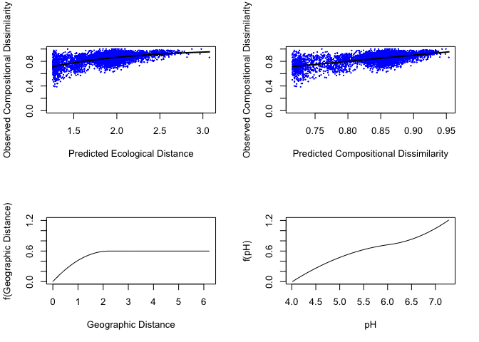<!-- -->

``` r
plot(gdm.modelsoil, plot.layout = c(2, 2), plot.color = "blue", plot.linewidth = 2.0)
```

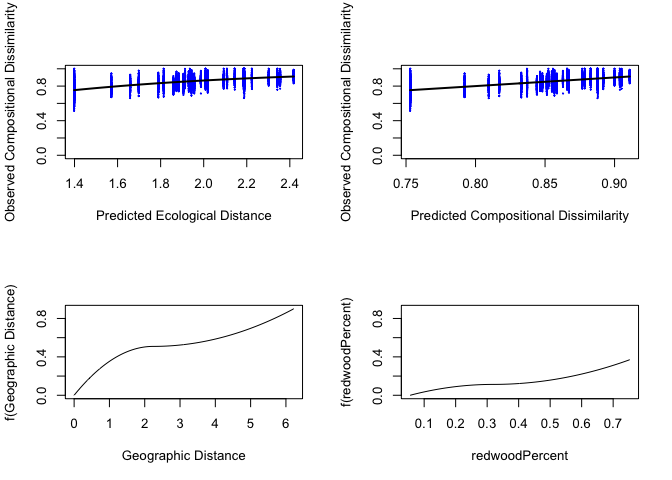<!-- -->

``` r
#guilds
plot(gdm.modelsoilsaps, plot.layout = c(2, 2), plot.color = "blue", plot.linewidth = 2.0)
```

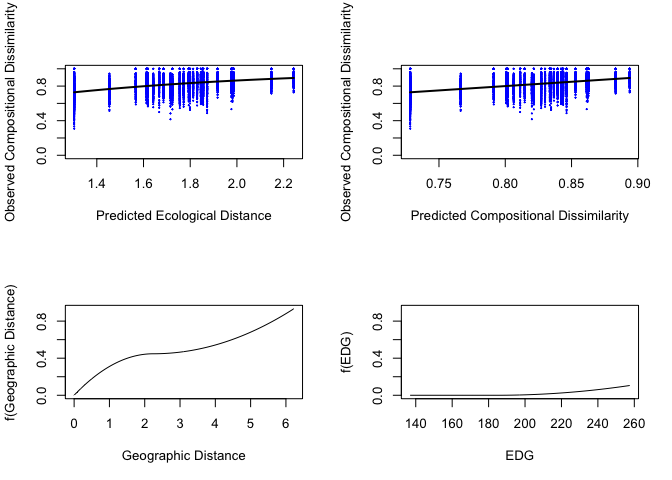<!-- -->

``` r
plot(gdm.modelsoilsymbios, plot.layout = c(2, 2), plot.color = "blue", plot.linewidth = 2.0)
```

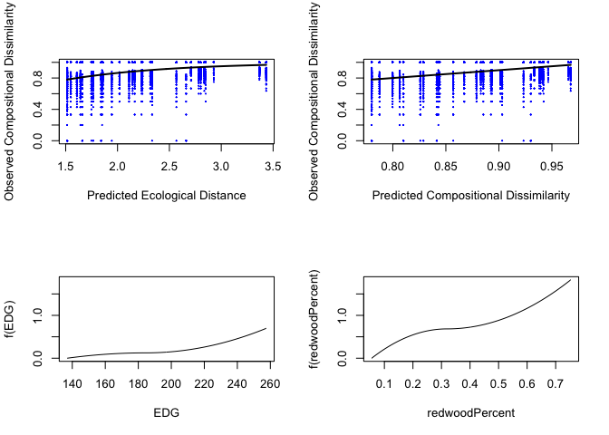<!-- -->

``` r
plot(gdm.modelsoilpathos, plot.layout = c(2, 2), plot.color = "blue", plot.linewidth = 2.0)
```

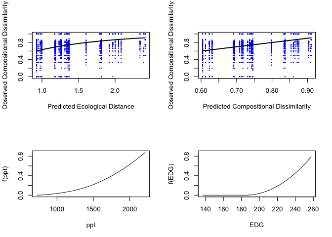<!-- -->

``` r
plot(gdm.modelrootGLOMS, plot.layout = c(2, 2), plot.color = "blue", plot.linewidth = 2.0)
```

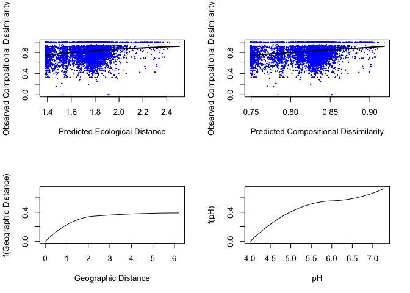<!-- -->

``` r
summary.gdm(gdm.modelroot)
```

    ## [1] 
    ## [1] 
    ## [1] GDM Modelling Summary
    ## [1] Creation Date:  Fri Aug 20 10:44:59 2021
    ## [1] 
    ## [1] Name:  gdm.modelroot
    ## [1] 
    ## [1] Data:  gdmDistroot
    ## [1] 
    ## [1] Samples:  6105
    ## [1] 
    ## [1] Geographical distance used in model fitting?  TRUE
    ## [1] 
    ## [1] NULL Deviance:  289.15076519028
    ## [1] GDM Deviance:  192.229802163789
    ## [1] Percent Deviance Explained:  33.519179159948
    ## [1] 
    ## [1] Intercept:  1.25646118973097
    ## [1] 
    ## [1] Predictor 1: Geographic
    ## [1] Splines: 3
    ## [1] Min Knot: 0
    ## [1] 50% Knot: 2.23114506435821
    ## [1] Max Knot: 6.22155374258433
    ## [1] Coefficient[1]: 0.599644765303032
    ## [1] Coefficient[2]: 0
    ## [1] Coefficient[3]: 0
    ## [1] 
    ## [1] Predictor 2: pH
    ## [1] Splines: 3
    ## [1] Min Knot: 4.01
    ## [1] 50% Knot: 6.02
    ## [1] Max Knot: 7.28
    ## [1] Coefficient[1]: 0.600167076597188
    ## [1] Coefficient[2]: 0.205093459536338
    ## [1] Coefficient[3]: 0.413839302211788
    ## [1]

``` r
summary.gdm(gdm.modelsoil)
```

    ## [1] 
    ## [1] 
    ## [1] GDM Modelling Summary
    ## [1] Creation Date:  Fri Aug 20 10:44:59 2021
    ## [1] 
    ## [1] Name:  gdm.modelsoil
    ## [1] 
    ## [1] Data:  gdmDistsoil
    ## [1] 
    ## [1] Samples:  6903
    ## [1] 
    ## [1] Geographical distance used in model fitting?  TRUE
    ## [1] 
    ## [1] NULL Deviance:  291.513333497545
    ## [1] GDM Deviance:  188.188729015854
    ## [1] Percent Deviance Explained:  35.4442121881746
    ## [1] 
    ## [1] Intercept:  1.39816914291393
    ## [1] 
    ## [1] Predictor 1: Geographic
    ## [1] Splines: 3
    ## [1] Min Knot: 0
    ## [1] 50% Knot: 2.2295856858782
    ## [1] Max Knot: 6.22155374258433
    ## [1] Coefficient[1]: 0.509052758374224
    ## [1] Coefficient[2]: 0
    ## [1] Coefficient[3]: 0.397846838234384
    ## [1] 
    ## [1] Predictor 2: redwoodPercent
    ## [1] Splines: 3
    ## [1] Min Knot: 0.0554527267700015
    ## [1] 50% Knot: 0.317810223165624
    ## [1] Max Knot: 0.752683483738462
    ## [1] Coefficient[1]: 0.113151564772283
    ## [1] Coefficient[2]: 0
    ## [1] Coefficient[3]: 0.261259365301635
    ## [1]

``` r
# Sum coefficients for each predictor
coefSumsRoot <- c()
for (i in 1:length(gdm.modelroot$predictors)){
  j <- (i * 3) - 2
  coefSumsRoot[i] <- sum(gdm.modelroot$coefficients[j:(j+2)])
}

coefSumsSoil <- c()
for (i in 1:length(gdm.modelsoil$predictors)){
  j <- (i * 3) - 2
  coefSumsSoil[i] <- sum(gdm.modelsoil$coefficients[j:(j+2)])
}
# Add those values to a simple data frame
coeffsRootsFungi <- data.frame(predictor = gdm.modelroot$predictors, coefficient = coefSumsRoot)
coeffsRootsFungi
```

    ##    predictor coefficient
    ## 1 Geographic   0.5996448
    ## 2         pH   1.2190998

``` r
coeffsSoilsFungi <- data.frame(predictor = gdm.modelsoil$predictors, coefficient = coefSumsSoil)
coeffsSoilsFungi
```

    ##        predictor coefficient
    ## 1     Geographic   0.9068996
    ## 2 redwoodPercent   0.3744109

GDM Plots

``` r
rootsplines<-isplineExtract(gdm.modelroot)
rootsplines<-as.data.frame(rootsplines)
rootsplines$Type="All Fungi (Roots)"

soilsplines<-isplineExtract(gdm.modelsoil)
soilsplines<-as.data.frame(soilsplines)
soilsplines$Type="All Fungi (Soil)"

##guilds
sapsoilsplines<-isplineExtract(gdm.modelsoilsaps)
sapsoilsplines<-as.data.frame(sapsoilsplines)
sapsoilsplines$Type="Saprotrophs"

symbiosoilsplines<-isplineExtract(gdm.modelsoilsymbios)
symbiosoilsplines<-as.data.frame(symbiosoilsplines)
symbiosoilsplines$Type="Symbiotrophs (Soil)"

pathosoilsplines<-isplineExtract(gdm.modelsoilpathos)
pathosoilsplines<-as.data.frame(pathosoilsplines)
pathosoilsplines$Type="Pathogens"

glomrootsplines<-isplineExtract(gdm.modelrootGLOMS)
glomrootsplines<-as.data.frame(glomrootsplines)
glomrootsplines$Type="AMF (Roots)"

rootplotsplines<-full_join(rootsplines, glomrootsplines)
soilplotsplines<-(soilsplines)

##back transforming for secondary axis  
##scale take your z-score; multiple by standard deviation and +mean 
##hand modify these axes for 0, 1, -1 etc, place these label 

##the x for geographic is in lat-long and i need to convert to UTM and can divide by 1000 to get km (they are in m) http://rstudio-pubs-static.s3.amazonaws.com/19879_7e13ab80d5ed416c8e235bd6bb93cf3e.html
meangdroot<-mean(rootplotsplines$x.Geographic)
sdgdroot<-sd(rootplotsplines$x.Geographic)
meanpH<-mean(rootplotsplines$x.pH)
sdpH<-sd(rootplotsplines$x.pH)

meangdsoil<-mean(soilsplines$x.Geographic)
sdgdsoil<-sd(soilsplines$x.Geographic)
meanred<-mean(soilsplines$x.redwoodPercent)
sdred<-sd(soilsplines$x.redwoodPercent)

GDMsoil<-ggplot(data = soilplotsplines)+
  geom_line(aes(x=scale(x.Geographic), y=y.Geographic, color="Geographic distance"), size=1)+
  geom_line(aes(x=scale(x.redwoodPercent), y=y.redwoodPercent, color="Redwood percent"), size=1)+
  facet_wrap(~Type, ncol=1, scales = "free_y",
             strip.position = "right")+
  scale_color_manual(values=c("#3c4e5c", "#a14329"), labels=c("Geographic distance", "Percent redwood cover"))+
  scale_y_continuous("Partial ecological distance")+
  scale_x_continuous("Geographic distance (scaled)", 
                     breaks = seq(-1,1, by=0.5), 
sec.axis=sec_axis(~((.*sdred)+meanred)*100, name="Percent redwood cover (%)"))+
  theme( text = element_text(family = "Helvetica"),
         plot.title = element_text(margin = margin(b=5, r=5, l=5, unit = "mm"),
 size = rel(1),
hjust = 0.5),
panel.background = element_rect(fill="transparent", colour = NA),
            plot.background = element_rect(fill="transparent",colour = NA),
            panel.border = element_rect(fill="transparent", colour = "black"),
            axis.title = element_text(size = rel(1)),
            axis.title.y = element_text(angle=90, size = rel(1), margin = margin(r=3, unit = "mm")),
            axis.title.x = element_text(size=rel(1), margin = margin(t=3, unit = "mm")),
            axis.text.x = element_text(size=12, margin = unit(c(t = 2.5, r = 0, b = 0, l = 0), "mm")),
            axis.text.y = element_text(size=12, margin = unit(c(t = 0, r = 2.5, b = 0, l = 0), "mm")),
            axis.line = element_blank(),
            panel.grid.major = element_blank(),
            panel.grid.minor = element_blank(),
          legend.key = element_rect(fill="transparent", colour = NA),
        legend.key.size= unit(4, "mm"),
        legend.text = element_text(size =9),
        legend.spacing = unit(0, "mm"),
        legend.title = element_blank(),
        legend.position = c(0.21,0.90),
        legend.background = element_rect(fill = "transparent",
colour = NA),strip.text = element_text(face="bold"))


GDMsoilsymbios<-ggplot(data = symbiosoilsplines)+
  geom_line(aes(x=scale(x.EDG), y=y.EDG, color="EDG"), size=1)+
  geom_line(aes(x=scale(x.redwoodPercent), y=y.redwoodPercent, color="Redwood percent"), size=1)+
  facet_wrap(~Type, ncol=1, scales = "free_y",
             strip.position = "right")+
  scale_color_manual(values=c("#aebcc0", "#a14329"), labels=c("EDG", "Percent redwood cover"))+
  scale_y_continuous("Partial ecological distance")+
  scale_x_continuous("Edge Density (EDG)", breaks = c(-1,0,1),
                     #0 =mean EDG; mean(dfroot$EDG)=185.3344
                     #1=mean+sd(=40.77364)>>185.3344+40.77364=226.108
                     #-1=mean-sd(=504.5895)>>185.3344-40.77364=144.5608
                     labels=c("145", "185", "226"), 
sec.axis=sec_axis(~((.*sdred)+meanred)*100, name="Percent redwood cover (%)"))+
  theme( text = element_text(family = "Helvetica"),
         plot.title = element_text(margin = margin(b=5, r=5, l=5, unit = "mm"),
 size = rel(1),
hjust = 0.5),
panel.background = element_rect(fill="transparent", colour = NA),
            plot.background = element_rect(fill="transparent",colour = NA),
            panel.border = element_rect(fill="transparent", colour = "black"),
            axis.title = element_text(size = rel(1)),
            axis.title.y = element_text(angle=90, size = rel(1), margin = margin(r=3, unit = "mm")),
            axis.title.x = element_text(size=rel(1), margin = margin(t=3, unit = "mm")),
            axis.text.x = element_text(size=12, margin = unit(c(t = 2.5, r = 0, b = 0, l = 0), "mm")),
            axis.text.y = element_text(size=12, margin = unit(c(t = 0, r = 2.5, b = 0, l = 0), "mm")),
            axis.line = element_blank(),
            panel.grid.major = element_blank(),
            panel.grid.minor = element_blank(),
          legend.key = element_rect(fill="transparent", colour = NA),
        legend.key.size= unit(4, "mm"),
        legend.text = element_text(size =9),
        legend.spacing = unit(0, "mm"),
        legend.title = element_blank(),
        legend.position = c(0.21,0.90),
        legend.background = element_rect(fill = "transparent",
colour = NA),strip.text = element_text(face="bold"))


GDMroot<-ggplot(data = rootplotsplines)+
  geom_line(aes(x=scale(x.Geographic), y=y.Geographic, color="Geographic distance"), size=1)+
  geom_line(aes(x=scale(x.pH), y=y.pH, color="Soil pH"), size=1)+
  facet_wrap(~Type, ncol=1, scales = "free_y",
             strip.position = "right")+
  scale_y_continuous("Partial ecological distance")+
  scale_x_continuous("Geographic distance (scaled)", sec.axis=sec_axis(~(.*sdpH)+meanpH, name="Soil pH"))+
  scale_color_manual(values=c("#3c4e5c", "#bb9236"), labels=c("Geographic distance", "Soil pH"))+
  theme( text = element_text(family = "Helvetica"),
         plot.title = element_text(margin = margin(b=5, r=5, l=5, unit = "mm"),
 size = rel(1),
hjust = 0.5),
panel.background = element_rect(fill="transparent", colour = NA),
            plot.background = element_rect(fill="transparent",colour = NA),
            panel.border = element_rect(fill="transparent", colour = "black"),
            axis.title = element_text(size = rel(1)),
            axis.title.y = element_text(angle=90, size = rel(1), margin = margin(r=3, unit = "mm")),
            axis.title.x = element_text(size=rel(1), margin = margin(t=3, unit = "mm")),
            axis.text.x = element_text(size=12, margin = unit(c(t = 2.5, r = 0, b = 0, l = 0), "mm")),
            axis.text.y = element_text(size=12, margin = unit(c(t = 0, r = 2.5, b = 0, l = 0), "mm")),
            axis.line = element_blank(),
            panel.grid.major = element_blank(),
            panel.grid.minor = element_blank(),
          legend.key = element_rect(fill="transparent", colour = NA),
        legend.key.size= unit(4, "mm"),
        legend.text = element_text(size =9),
        legend.spacing = unit(0, "mm"),
        legend.title = element_blank(),
        legend.position = c(0.29,0.95),
        legend.background = element_rect(fill = "transparent",
colour = NA),strip.text = element_text(face="bold"))


meangdsaps<-mean(sapsoilsplines$x.Geographic)
sdgdsoilsaps<-sd(sapsoilsplines$x.Geographic)
meanEDGsaps<-mean(sapsoilsplines$x.EDG)
sdEDGsaps<-sd(sapsoilsplines$x.EDG)

GDMsoilsaps<-ggplot(data = sapsoilsplines)+
  geom_line(aes(x=scale(x.Geographic), y=y.Geographic, color="Geographic distance"), size=1)+
  geom_line(aes(x=scale(x.EDG), y=y.EDG, color="EDG"), size=1)+
  facet_wrap(~Type, ncol=1, scales = "free_y",
             strip.position = "right")+
  scale_color_manual(values=c("#aebcc0","#3c4e5c"), labels=c("EDG","Geographic distance"))+
  scale_y_continuous("Partial ecological distance")+
  scale_x_continuous("Geographic distance (scaled)", 
                     breaks = seq(-1,1, by=0.5), 
sec.axis=sec_axis(~((.*sdEDGsaps)+meanEDGsaps), name="Edge density (EDG)"))+
  theme( text = element_text(family = "Helvetica"),
         plot.title = element_text(margin = margin(b=5, r=5, l=5, unit = "mm"),
 size = rel(1),
hjust = 0.5),
panel.background = element_rect(fill="transparent", colour = NA),
            plot.background = element_rect(fill="transparent",colour = NA),
            panel.border = element_rect(fill="transparent", colour = "black"),
            axis.title = element_text(size = rel(1)),
            axis.title.y = element_text(angle=90, size = rel(1), margin = margin(r=3, unit = "mm")),
            axis.title.x = element_text(size=rel(1), margin = margin(t=3, unit = "mm")),
            axis.text.x = element_text(size=12, margin = unit(c(t = 2.5, r = 0, b = 0, l = 0), "mm")),
            axis.text.y = element_text(size=12, margin = unit(c(t = 0, r = 2.5, b = 0, l = 0), "mm")),
            axis.line = element_blank(),
            panel.grid.major = element_blank(),
            panel.grid.minor = element_blank(),
          legend.key = element_rect(fill="transparent", colour = NA),
        legend.key.size= unit(4, "mm"),
        legend.text = element_text(size =9),
        legend.spacing = unit(0, "mm"),
        legend.title = element_blank(),
        legend.position = c(0.26,0.9),
        legend.background = element_rect(fill = "transparent",
colour = NA),strip.text = element_text(face="bold"))


meanEDGpaths<-mean(pathosoilsplines$x.EDG)
sdEDGpaths<-sd(pathosoilsplines$x.EDG)
meanpptpaths<-mean(pathosoilsplines$x.ppt)
sdpptpaths<-sd(pathosoilsplines$x.ppt)

GDMsoilpaths<-ggplot(data=pathosoilsplines)+
  geom_line(aes(x=scale(x.ppt),y=y.ppt, color="Precipitation"), size=1)+
  geom_line(aes(x=scale(x.EDG),y=y.EDG, color="EDG"), size=1)+
  scale_color_manual(values=c("#0088c9", "#aebcc0"), labels=c("Preciptiation", "EDG"))+
  facet_wrap(~Type, ncol=1, scales = "free_y", strip.position="right")+
  scale_y_continuous("Partial ecological distance")+
  scale_x_continuous("Precipitation (mm/yr)", breaks = c(-1,0,1),
                     #0 =mean ppt; mean(dfroot$ppt)=1404.529
                     #1=mean+sd(=504.5895)>>1404.529-504.5895=1909.119
                     #-1=mean-sd(=504.5895)>>1404.529-504.5895=899.9395
                     labels=c("900", "1405", "1909"), 
  sec.axis = sec_axis(~(.*sdEDGpaths)+meanEDGpaths, name="Edge density (EDG)"))+
  theme( text = element_text(family = "Helvetica"),
         plot.title = element_text(margin = margin(b=5, r=5, l=5, unit = "mm"),
 size = rel(1),
hjust = 0.5),
panel.background = element_rect(fill="transparent", colour = NA),
            plot.background = element_rect(fill="transparent",colour = NA),
            panel.border = element_rect(fill="transparent", colour = "black"),
            axis.title = element_text(size = rel(1)),
            axis.title.y = element_text(angle=90, size = rel(1), margin = margin(r=3, unit = "mm")),
            axis.title.x = element_text(size=rel(1), margin = margin(t=3, unit = "mm")),
            axis.text.x = element_text(size=12, margin = unit(c(t = 2.5, r = 0, b = 0, l = 0), "mm")),
            axis.text.y = element_text(size=12, margin = unit(c(t = 0, r = 2.5, b = 0, l = 0), "mm")),
            axis.line = element_blank(),
            panel.grid.major = element_blank(),
            panel.grid.minor = element_blank(),
          legend.key = element_rect(fill="transparent", colour = NA),
        legend.key.size= unit(4, "mm"),
        legend.text = element_text(size =9),
        legend.spacing = unit(0, "mm"),
        legend.title = element_blank(),
        legend.position = c(0.21,0.88),
        legend.background = element_rect(fill = "transparent",
colour = NA),strip.text = element_text(face="bold"))
```

Alpha diversity (roots); no significant relationships

``` r
RichnessROOTS<-estimate_richness(Roots, split = TRUE, measures = NULL)
RichnessROOTS$SampleUnique<-rownames(RichnessROOTS)
SampleData<-as(sample_data(Roots), "data.frame")
RichnessROOTS<-full_join(RichnessROOTS, SampleData)
RichnessROOTS<-full_join(RichnessROOTS,dfroot)
RichnessROOTS$Type="Root"

library(lme4)
library(lmerTest)
library(sjPlot)
library(car)

#landscape het
modelobservEDGroots<-lmer(formula = Observed~EDG+(1|SiteID/Treenum), data = RichnessROOTS, REML=F)
modelobservredPerroots<-lmer(formula = Observed~redwoodPercent +(1|SiteID/Treenum), data = RichnessROOTS, REML = F)
modelobservLPIroots<-lmer(formula = Observed~LPI +(1|SiteID/Treenum), data = RichnessROOTS, REML = F)


AIC(modelobservEDGroots,modelobservredPerroots, modelobservLPIroots)
```

    ##                        df      AIC
    ## modelobservEDGroots     5 956.9265
    ## modelobservredPerroots  5 956.9231
    ## modelobservLPIroots     5 956.4809

``` r
BIC(modelobservEDGroots,modelobservredPerroots, modelobservLPIroots)
```

    ##                        df      BIC
    ## modelobservEDGroots     5 970.4742
    ## modelobservredPerroots  5 970.4708
    ## modelobservLPIroots     5 970.0285

``` r
##compare to climate and chem
modelobservKroots<-lmer(formula = Observed~k +(1|SiteID/Treenum), data = RichnessROOTS, REML = F)
modelobservpHroots<-lmer(formula = Observed~pH +(1|SiteID/Treenum), data = RichnessROOTS, REML = F)

AIC(modelobservredPerroots,modelobservEDGroots,modelobservpHroots)
```

    ##                        df      AIC
    ## modelobservredPerroots  5 956.9231
    ## modelobservEDGroots     5 956.9265
    ## modelobservpHroots      5 955.8591

``` r
BIC(modelobservredPerroots,modelobservEDGroots,modelobservpHroots)
```

    ##                        df      BIC
    ## modelobservredPerroots  5 970.4708
    ## modelobservEDGroots     5 970.4742
    ## modelobservpHroots      5 969.4067

``` r
##pH is best model for roots
modelobservpHrootsa<-lmer(formula = Observed~pH +(1|SiteID/Treenum), data = RichnessROOTS, REML = F)

modelobservpHrootsb<-lmer(formula = Observed~pH +(1|SiteID), data = RichnessROOTS, REML = F)

anova(modelobservpHrootsa,modelobservpHrootsb)
```

    ## Data: RichnessROOTS
    ## Models:
    ## modelobservpHrootsb: Observed ~ pH + (1 | SiteID)
    ## modelobservpHrootsa: Observed ~ pH + (1 | SiteID/Treenum)
    ##                     npar    AIC    BIC  logLik deviance  Chisq Df Pr(>Chisq)
    ## modelobservpHrootsb    4 955.38 966.21 -473.69   947.38                     
    ## modelobservpHrootsa    5 955.86 969.41 -472.93   945.86 1.5168  1     0.2181

``` r
##modelobservpHrootsb is best
modelobservpHrootsb<-lmer(formula = Observed~pH +(1|SiteID), data = RichnessROOTS, REML = T)

#qqp(residuals(modelobservpHrootsb), col=2)
summary(modelobservpHrootsb)
```

    ## Linear mixed model fit by REML. t-tests use Satterthwaite's method [
    ## lmerModLmerTest]
    ## Formula: Observed ~ pH + (1 | SiteID)
    ##    Data: RichnessROOTS
    ## 
    ## REML criterion at convergence: 938.9
    ## 
    ## Scaled residuals: 
    ##     Min      1Q  Median      3Q     Max 
    ## -1.9590 -0.6011  0.1077  0.5986  4.2350 
    ## 
    ## Random effects:
    ##  Groups   Name        Variance Std.Dev.
    ##  SiteID   (Intercept)  54.87    7.407  
    ##  Residual             276.31   16.623  
    ## Number of obs: 111, groups:  SiteID, 8
    ## 
    ## Fixed effects:
    ##             Estimate Std. Error     df t value Pr(>|t|)
    ## (Intercept)   38.236     22.882 36.008   1.671    0.103
    ## pH             2.706      3.824 38.306   0.708    0.483
    ## 
    ## Correlation of Fixed Effects:
    ##    (Intr)
    ## pH -0.991

``` r
##Shannon

##How does landscape vs climate impact observed spp
modelshannonEDGroots<-lmer(formula = Shannon~EDG+(1|SiteID/Treenum), data = RichnessROOTS, REML=F)
modelshannonPerroots<-lmer(formula = Shannon~redwoodPercent +(1|SiteID/Treenum), data = RichnessROOTS, REML = F)

AIC(modelshannonEDGroots,modelshannonPerroots)
```

    ##                      df      AIC
    ## modelshannonEDGroots  5 227.1236
    ## modelshannonPerroots  5 227.1125

``` r
BIC(modelshannonEDGroots,modelshannonPerroots)
```

    ##                      df      BIC
    ## modelshannonEDGroots  5 240.6712
    ## modelshannonPerroots  5 240.6602

``` r
##compare to climate and chem
modelshannonKroots<-lmer(formula = Shannon~k +(1|SiteID/Treenum), data = RichnessROOTS, REML = F)
modelshannonpHroots<-lmer(formula = Shannon~pH +(1|SiteID/Treenum), data = RichnessROOTS, REML = F)

AIC(modelshannonPerroots, modelshannonEDGroots,modelshannonpHroots)
```

    ##                      df      AIC
    ## modelshannonPerroots  5 227.1125
    ## modelshannonEDGroots  5 227.1236
    ## modelshannonpHroots   5 224.5422

``` r
BIC(modelshannonPerroots, modelshannonEDGroots,modelshannonpHroots)
```

    ##                      df      BIC
    ## modelshannonPerroots  5 240.6602
    ## modelshannonEDGroots  5 240.6712
    ## modelshannonpHroots   5 238.0898

``` r
##pH is best model
modelshannonpHrootsa<-lmer(formula = Shannon~pH +(1|SiteID/Treenum), data = RichnessROOTS, REML = F)

modelshannonpHrootsb<-lmer(formula = Shannon~pH +(1|SiteID), data = RichnessROOTS, REML = F)

anova(modelshannonpHrootsa,modelshannonpHrootsb)
```

    ## Data: RichnessROOTS
    ## Models:
    ## modelshannonpHrootsb: Shannon ~ pH + (1 | SiteID)
    ## modelshannonpHrootsa: Shannon ~ pH + (1 | SiteID/Treenum)
    ##                      npar    AIC    BIC  logLik deviance  Chisq Df Pr(>Chisq)
    ## modelshannonpHrootsb    4 225.02 235.86 -108.51   217.02                     
    ## modelshannonpHrootsa    5 224.54 238.09 -107.27   214.54 2.4804  1     0.1153

``` r
##modela is best
modelshannonpHrootsa<-lmer(formula = Shannon~pH +(1|SiteID/Treenum), data = RichnessROOTS, REML = T)

#qqp(residuals(modelshannonpHrootsb), col=2)
summary(modelshannonpHrootsa)
```

    ## Linear mixed model fit by REML. t-tests use Satterthwaite's method [
    ## lmerModLmerTest]
    ## Formula: Shannon ~ pH + (1 | SiteID/Treenum)
    ##    Data: RichnessROOTS
    ## 
    ## REML criterion at convergence: 218.8
    ## 
    ## Scaled residuals: 
    ##      Min       1Q   Median       3Q      Max 
    ## -2.59405 -0.59964 -0.04174  0.66874  2.22926 
    ## 
    ## Random effects:
    ##  Groups         Name        Variance Std.Dev.
    ##  Treenum:SiteID (Intercept) 0.0612   0.2474  
    ##  SiteID         (Intercept) 0.1069   0.3269  
    ##  Residual                   0.3253   0.5703  
    ## Number of obs: 111, groups:  Treenum:SiteID, 31; SiteID, 8
    ## 
    ## Fixed effects:
    ##             Estimate Std. Error      df t value Pr(>|t|)  
    ## (Intercept)   0.7700     0.9035 50.2027   0.852   0.3981  
    ## pH            0.2523     0.1505 54.3513   1.676   0.0996 .
    ## ---
    ## Signif. codes:  0 '***' 0.001 '**' 0.01 '*' 0.05 '.' 0.1 ' ' 1
    ## 
    ## Correlation of Fixed Effects:
    ##    (Intr)
    ## pH -0.989

``` r
##just for comparison to soils 
modelshannonEDGroots<-lmer(formula = Shannon~EDG +(1|SiteID/Treenum), data = RichnessROOTS, REML = T)

library(sjPlot)
RootdiversitymodeltabpH<-tab_model(modelobservpHrootsa, modelshannonpHrootsb)
RootdiversitymodeltabpH
```

<table style="border-collapse:collapse; border:none;">

<tr>

<th style="border-top: double; text-align:center; font-style:normal; font-weight:bold; padding:0.2cm;  text-align:left; ">

 

</th>

<th colspan="3" style="border-top: double; text-align:center; font-style:normal; font-weight:bold; padding:0.2cm; ">

Observed

</th>

<th colspan="3" style="border-top: double; text-align:center; font-style:normal; font-weight:bold; padding:0.2cm; ">

Shannon

</th>

</tr>

<tr>

<td style=" text-align:center; border-bottom:1px solid; font-style:italic; font-weight:normal;  text-align:left; ">

Predictors

</td>

<td style=" text-align:center; border-bottom:1px solid; font-style:italic; font-weight:normal;  ">

Estimates

</td>

<td style=" text-align:center; border-bottom:1px solid; font-style:italic; font-weight:normal;  ">

CI

</td>

<td style=" text-align:center; border-bottom:1px solid; font-style:italic; font-weight:normal;  ">

p

</td>

<td style=" text-align:center; border-bottom:1px solid; font-style:italic; font-weight:normal;  ">

Estimates

</td>

<td style=" text-align:center; border-bottom:1px solid; font-style:italic; font-weight:normal;  ">

CI

</td>

<td style=" text-align:center; border-bottom:1px solid; font-style:italic; font-weight:normal;  col7">

p

</td>

</tr>

<tr>

<td style=" padding:0.2cm; text-align:left; vertical-align:top; text-align:left; ">

(Intercept)

</td>

<td style=" padding:0.2cm; text-align:left; vertical-align:top; text-align:center;  ">

30.90

</td>

<td style=" padding:0.2cm; text-align:left; vertical-align:top; text-align:center;  ">

\-12.26 – 74.05

</td>

<td style=" padding:0.2cm; text-align:left; vertical-align:top; text-align:center;  ">

0.161

</td>

<td style=" padding:0.2cm; text-align:left; vertical-align:top; text-align:center;  ">

1.19

</td>

<td style=" padding:0.2cm; text-align:left; vertical-align:top; text-align:center;  ">

\-0.51 – 2.89

</td>

<td style=" padding:0.2cm; text-align:left; vertical-align:top; text-align:center;  col7">

0.169

</td>

</tr>

<tr>

<td style=" padding:0.2cm; text-align:left; vertical-align:top; text-align:left; ">

pH

</td>

<td style=" padding:0.2cm; text-align:left; vertical-align:top; text-align:center;  ">

3.93

</td>

<td style=" padding:0.2cm; text-align:left; vertical-align:top; text-align:center;  ">

\-3.30 – 11.15

</td>

<td style=" padding:0.2cm; text-align:left; vertical-align:top; text-align:center;  ">

0.287

</td>

<td style=" padding:0.2cm; text-align:left; vertical-align:top; text-align:center;  ">

0.18

</td>

<td style=" padding:0.2cm; text-align:left; vertical-align:top; text-align:center;  ">

\-0.10 – 0.46

</td>

<td style=" padding:0.2cm; text-align:left; vertical-align:top; text-align:center;  col7">

0.210

</td>

</tr>

<tr>

<td style=" padding:0.2cm; text-align:left; vertical-align:top; text-align:left; ">

SD (Intercept)

</td>

<td style=" padding:0.2cm; text-align:left; vertical-align:top; text-align:center;  ">

5.74

</td>

<td style=" padding:0.2cm; text-align:left; vertical-align:top; text-align:center;  ">

</td>

<td style=" padding:0.2cm; text-align:left; vertical-align:top; text-align:center;  ">

</td>

<td style=" padding:0.2cm; text-align:left; vertical-align:top; text-align:center;  ">

0.30

</td>

<td style=" padding:0.2cm; text-align:left; vertical-align:top; text-align:center;  ">

</td>

<td style=" padding:0.2cm; text-align:left; vertical-align:top; text-align:center;  col7">

</td>

</tr>

<tr>

<td style=" padding:0.2cm; text-align:left; vertical-align:top; text-align:left; ">

SD (Intercept)

</td>

<td style=" padding:0.2cm; text-align:left; vertical-align:top; text-align:center;  ">

5.86

</td>

<td style=" padding:0.2cm; text-align:left; vertical-align:top; text-align:center;  ">

</td>

<td style=" padding:0.2cm; text-align:left; vertical-align:top; text-align:center;  ">

</td>

<td style=" padding:0.2cm; text-align:left; vertical-align:top; text-align:center;  ">

0.30

</td>

<td style=" padding:0.2cm; text-align:left; vertical-align:top; text-align:center;  ">

</td>

<td style=" padding:0.2cm; text-align:left; vertical-align:top; text-align:center;  col7">

</td>

</tr>

<tr>

<td style=" padding:0.2cm; text-align:left; vertical-align:top; text-align:left; ">

SD (Observations)

</td>

<td style=" padding:0.2cm; text-align:left; vertical-align:top; text-align:center;  ">

3.97

</td>

<td style=" padding:0.2cm; text-align:left; vertical-align:top; text-align:center;  ">

</td>

<td style=" padding:0.2cm; text-align:left; vertical-align:top; text-align:center;  ">

</td>

<td style=" padding:0.2cm; text-align:left; vertical-align:top; text-align:center;  ">

0.78

</td>

<td style=" padding:0.2cm; text-align:left; vertical-align:top; text-align:center;  ">

</td>

<td style=" padding:0.2cm; text-align:left; vertical-align:top; text-align:center;  col7">

</td>

</tr>

<tr>

<td colspan="7" style="font-weight:bold; text-align:left; padding-top:.8em;">

Random Effects

</td>

</tr>

<tr>

<td style=" padding:0.2cm; text-align:left; vertical-align:top; text-align:left; padding-top:0.1cm; padding-bottom:0.1cm;">

σ<sup>2</sup>

</td>

<td style=" padding:0.2cm; text-align:left; vertical-align:top; padding-top:0.1cm; padding-bottom:0.1cm; text-align:left;" colspan="3">

248.60

</td>

<td style=" padding:0.2cm; text-align:left; vertical-align:top; padding-top:0.1cm; padding-bottom:0.1cm; text-align:left;" colspan="3">

0.37

</td>

<tr>

<td style=" padding:0.2cm; text-align:left; vertical-align:top; text-align:left; padding-top:0.1cm; padding-bottom:0.1cm;">

τ<sub>00</sub>

</td>

<td style=" padding:0.2cm; text-align:left; vertical-align:top; padding-top:0.1cm; padding-bottom:0.1cm; text-align:left;" colspan="3">

32.92 <sub>Treenum:SiteID</sub>

</td>

<td style=" padding:0.2cm; text-align:left; vertical-align:top; padding-top:0.1cm; padding-bottom:0.1cm; text-align:left;" colspan="3">

0.09 <sub>SiteID</sub>

</td>

<tr>

<td style=" padding:0.2cm; text-align:left; vertical-align:top; text-align:left; padding-top:0.1cm; padding-bottom:0.1cm;">

</td>

<td style=" padding:0.2cm; text-align:left; vertical-align:top; padding-top:0.1cm; padding-bottom:0.1cm; text-align:left;" colspan="3">

34.37 <sub>SiteID</sub>

</td>

<td style=" padding:0.2cm; text-align:left; vertical-align:top; padding-top:0.1cm; padding-bottom:0.1cm; text-align:left;" colspan="3">

 

</td>

<tr>

<td style=" padding:0.2cm; text-align:left; vertical-align:top; text-align:left; padding-top:0.1cm; padding-bottom:0.1cm;">

ICC

</td>

<td style=" padding:0.2cm; text-align:left; vertical-align:top; padding-top:0.1cm; padding-bottom:0.1cm; text-align:left;" colspan="3">

0.21

</td>

<td style=" padding:0.2cm; text-align:left; vertical-align:top; padding-top:0.1cm; padding-bottom:0.1cm; text-align:left;" colspan="3">

0.20

</td>

<tr>

<td style=" padding:0.2cm; text-align:left; vertical-align:top; text-align:left; padding-top:0.1cm; padding-bottom:0.1cm;">

N

</td>

<td style=" padding:0.2cm; text-align:left; vertical-align:top; padding-top:0.1cm; padding-bottom:0.1cm; text-align:left;" colspan="3">

4 <sub>Treenum</sub>

</td>

<td style=" padding:0.2cm; text-align:left; vertical-align:top; padding-top:0.1cm; padding-bottom:0.1cm; text-align:left;" colspan="3">

8 <sub>SiteID</sub>

</td>

<tr>

<td style=" padding:0.2cm; text-align:left; vertical-align:top; text-align:left; padding-top:0.1cm; padding-bottom:0.1cm;">

</td>

<td style=" padding:0.2cm; text-align:left; vertical-align:top; padding-top:0.1cm; padding-bottom:0.1cm; text-align:left;" colspan="3">

8 <sub>SiteID</sub>

</td>

<td style=" padding:0.2cm; text-align:left; vertical-align:top; padding-top:0.1cm; padding-bottom:0.1cm; text-align:left;" colspan="3">

 

</td>

<tr>

<td style=" padding:0.2cm; text-align:left; vertical-align:top; text-align:left; padding-top:0.1cm; padding-bottom:0.1cm; border-top:1px solid;">

Observations

</td>

<td style=" padding:0.2cm; text-align:left; vertical-align:top; padding-top:0.1cm; padding-bottom:0.1cm; text-align:left; border-top:1px solid;" colspan="3">

111

</td>

<td style=" padding:0.2cm; text-align:left; vertical-align:top; padding-top:0.1cm; padding-bottom:0.1cm; text-align:left; border-top:1px solid;" colspan="3">

111

</td>

</tr>

<tr>

<td style=" padding:0.2cm; text-align:left; vertical-align:top; text-align:left; padding-top:0.1cm; padding-bottom:0.1cm;">

Marginal R<sup>2</sup> / Conditional R<sup>2</sup>

</td>

<td style=" padding:0.2cm; text-align:left; vertical-align:top; padding-top:0.1cm; padding-bottom:0.1cm; text-align:left;" colspan="3">

0.017 / 0.226

</td>

<td style=" padding:0.2cm; text-align:left; vertical-align:top; padding-top:0.1cm; padding-bottom:0.1cm; text-align:left;" colspan="3">

0.025 / 0.217

</td>

</tr>

</table>

``` r
RootdiversitymodeltabEDG<-tab_model(modelobservEDGroots, modelshannonEDGroots)
RootdiversitymodeltabEDG
```

<table style="border-collapse:collapse; border:none;">

<tr>

<th style="border-top: double; text-align:center; font-style:normal; font-weight:bold; padding:0.2cm;  text-align:left; ">

 

</th>

<th colspan="3" style="border-top: double; text-align:center; font-style:normal; font-weight:bold; padding:0.2cm; ">

Observed

</th>

<th colspan="3" style="border-top: double; text-align:center; font-style:normal; font-weight:bold; padding:0.2cm; ">

Shannon

</th>

</tr>

<tr>

<td style=" text-align:center; border-bottom:1px solid; font-style:italic; font-weight:normal;  text-align:left; ">

Predictors

</td>

<td style=" text-align:center; border-bottom:1px solid; font-style:italic; font-weight:normal;  ">

Estimates

</td>

<td style=" text-align:center; border-bottom:1px solid; font-style:italic; font-weight:normal;  ">

CI

</td>

<td style=" text-align:center; border-bottom:1px solid; font-style:italic; font-weight:normal;  ">

p

</td>

<td style=" text-align:center; border-bottom:1px solid; font-style:italic; font-weight:normal;  ">

Estimates

</td>

<td style=" text-align:center; border-bottom:1px solid; font-style:italic; font-weight:normal;  ">

CI

</td>

<td style=" text-align:center; border-bottom:1px solid; font-style:italic; font-weight:normal;  col7">

p

</td>

</tr>

<tr>

<td style=" padding:0.2cm; text-align:left; vertical-align:top; text-align:left; ">

(Intercept)

</td>

<td style=" padding:0.2cm; text-align:left; vertical-align:top; text-align:center;  ">

53.94

</td>

<td style=" padding:0.2cm; text-align:left; vertical-align:top; text-align:center;  ">

28.73 – 79.15

</td>

<td style=" padding:0.2cm; text-align:left; vertical-align:top; text-align:center;  ">

<strong>\<0.001

</td>

<td style=" padding:0.2cm; text-align:left; vertical-align:top; text-align:center;  ">

2.24

</td>

<td style=" padding:0.2cm; text-align:left; vertical-align:top; text-align:center;  ">

0.99 – 3.50

</td>

<td style=" padding:0.2cm; text-align:left; vertical-align:top; text-align:center;  col7">

<strong>\<0.001

</td>

</tr>

<tr>

<td style=" padding:0.2cm; text-align:left; vertical-align:top; text-align:left; ">

EDG

</td>

<td style=" padding:0.2cm; text-align:left; vertical-align:top; text-align:center;  ">

0.00

</td>

<td style=" padding:0.2cm; text-align:left; vertical-align:top; text-align:center;  ">

\-0.13 – 0.13

</td>

<td style=" padding:0.2cm; text-align:left; vertical-align:top; text-align:center;  ">

0.984

</td>

<td style=" padding:0.2cm; text-align:left; vertical-align:top; text-align:center;  ">

0.00

</td>

<td style=" padding:0.2cm; text-align:left; vertical-align:top; text-align:center;  ">

\-0.01 – 0.01

</td>

<td style=" padding:0.2cm; text-align:left; vertical-align:top; text-align:center;  col7">

0.969

</td>

</tr>

<tr>

<td style=" padding:0.2cm; text-align:left; vertical-align:top; text-align:left; ">

SD (Intercept)

</td>

<td style=" padding:0.2cm; text-align:left; vertical-align:top; text-align:center;  ">

5.07

</td>

<td style=" padding:0.2cm; text-align:left; vertical-align:top; text-align:center;  ">

</td>

<td style=" padding:0.2cm; text-align:left; vertical-align:top; text-align:center;  ">

</td>

<td style=" padding:0.2cm; text-align:left; vertical-align:top; text-align:center;  ">

0.21

</td>

<td style=" padding:0.2cm; text-align:left; vertical-align:top; text-align:center;  ">

</td>

<td style=" padding:0.2cm; text-align:left; vertical-align:top; text-align:center;  col7">

</td>

</tr>

<tr>

<td style=" padding:0.2cm; text-align:left; vertical-align:top; text-align:left; ">

SD (Intercept)

</td>

<td style=" padding:0.2cm; text-align:left; vertical-align:top; text-align:center;  ">

5.07

</td>

<td style=" padding:0.2cm; text-align:left; vertical-align:top; text-align:center;  ">

</td>

<td style=" padding:0.2cm; text-align:left; vertical-align:top; text-align:center;  ">

</td>

<td style=" padding:0.2cm; text-align:left; vertical-align:top; text-align:center;  ">

0.35

</td>

<td style=" padding:0.2cm; text-align:left; vertical-align:top; text-align:center;  ">

</td>

<td style=" padding:0.2cm; text-align:left; vertical-align:top; text-align:center;  col7">

</td>

</tr>

<tr>

<td style=" padding:0.2cm; text-align:left; vertical-align:top; text-align:left; ">

SD (Intercept)

</td>

<td style=" padding:0.2cm; text-align:left; vertical-align:top; text-align:center;  ">

6.14

</td>

<td style=" padding:0.2cm; text-align:left; vertical-align:top; text-align:center;  ">

</td>

<td style=" padding:0.2cm; text-align:left; vertical-align:top; text-align:center;  ">

</td>

<td style=" padding:0.2cm; text-align:left; vertical-align:top; text-align:center;  ">

0.21

</td>

<td style=" padding:0.2cm; text-align:left; vertical-align:top; text-align:center;  ">

</td>

<td style=" padding:0.2cm; text-align:left; vertical-align:top; text-align:center;  col7">

</td>

</tr>

<tr>

<td style=" padding:0.2cm; text-align:left; vertical-align:top; text-align:left; ">

SD (Intercept)

</td>

<td style=" padding:0.2cm; text-align:left; vertical-align:top; text-align:center;  ">

6.14

</td>

<td style=" padding:0.2cm; text-align:left; vertical-align:top; text-align:center;  ">

</td>

<td style=" padding:0.2cm; text-align:left; vertical-align:top; text-align:center;  ">

</td>

<td style=" padding:0.2cm; text-align:left; vertical-align:top; text-align:center;  ">

0.35

</td>

<td style=" padding:0.2cm; text-align:left; vertical-align:top; text-align:center;  ">

</td>

<td style=" padding:0.2cm; text-align:left; vertical-align:top; text-align:center;  col7">

</td>

</tr>

<tr>

<td style=" padding:0.2cm; text-align:left; vertical-align:top; text-align:left; ">

SD (Observations)

</td>

<td style=" padding:0.2cm; text-align:left; vertical-align:top; text-align:center;  ">

4.00

</td>

<td style=" padding:0.2cm; text-align:left; vertical-align:top; text-align:center;  ">

</td>

<td style=" padding:0.2cm; text-align:left; vertical-align:top; text-align:center;  ">

</td>

<td style=" padding:0.2cm; text-align:left; vertical-align:top; text-align:center;  ">

0.76

</td>

<td style=" padding:0.2cm; text-align:left; vertical-align:top; text-align:center;  ">

</td>

<td style=" padding:0.2cm; text-align:left; vertical-align:top; text-align:center;  col7">

</td>

</tr>

<tr>

<td colspan="7" style="font-weight:bold; text-align:left; padding-top:.8em;">

Random Effects

</td>

</tr>

<tr>

<td style=" padding:0.2cm; text-align:left; vertical-align:top; text-align:left; padding-top:0.1cm; padding-bottom:0.1cm;">

σ<sup>2</sup>

</td>

<td style=" padding:0.2cm; text-align:left; vertical-align:top; padding-top:0.1cm; padding-bottom:0.1cm; text-align:left;" colspan="3">

255.07

</td>

<td style=" padding:0.2cm; text-align:left; vertical-align:top; padding-top:0.1cm; padding-bottom:0.1cm; text-align:left;" colspan="3">

0.34

</td>

<tr>

<td style=" padding:0.2cm; text-align:left; vertical-align:top; text-align:left; padding-top:0.1cm; padding-bottom:0.1cm;">

τ<sub>00</sub>

</td>

<td style=" padding:0.2cm; text-align:left; vertical-align:top; padding-top:0.1cm; padding-bottom:0.1cm; text-align:left;" colspan="3">

25.69 <sub>Treenum:SiteID</sub>

</td>

<td style=" padding:0.2cm; text-align:left; vertical-align:top; padding-top:0.1cm; padding-bottom:0.1cm; text-align:left;" colspan="3">

0.04 <sub>Treenum:SiteID</sub>

</td>

<tr>

<td style=" padding:0.2cm; text-align:left; vertical-align:top; text-align:left; padding-top:0.1cm; padding-bottom:0.1cm;">

</td>

<td style=" padding:0.2cm; text-align:left; vertical-align:top; padding-top:0.1cm; padding-bottom:0.1cm; text-align:left;" colspan="3">

37.72 <sub>SiteID</sub>

</td>

<td style=" padding:0.2cm; text-align:left; vertical-align:top; padding-top:0.1cm; padding-bottom:0.1cm; text-align:left;" colspan="3">

0.12 <sub>SiteID</sub>

</td>

<tr>

<td style=" padding:0.2cm; text-align:left; vertical-align:top; text-align:left; padding-top:0.1cm; padding-bottom:0.1cm;">

ICC

</td>

<td style=" padding:0.2cm; text-align:left; vertical-align:top; padding-top:0.1cm; padding-bottom:0.1cm; text-align:left;" colspan="3">

0.20

</td>

<td style=" padding:0.2cm; text-align:left; vertical-align:top; padding-top:0.1cm; padding-bottom:0.1cm; text-align:left;" colspan="3">

0.33

</td>

<tr>

<td style=" padding:0.2cm; text-align:left; vertical-align:top; text-align:left; padding-top:0.1cm; padding-bottom:0.1cm;">

N

</td>

<td style=" padding:0.2cm; text-align:left; vertical-align:top; padding-top:0.1cm; padding-bottom:0.1cm; text-align:left;" colspan="3">

4 <sub>Treenum</sub>

</td>

<td style=" padding:0.2cm; text-align:left; vertical-align:top; padding-top:0.1cm; padding-bottom:0.1cm; text-align:left;" colspan="3">

4 <sub>Treenum</sub>

</td>

<tr>

<td style=" padding:0.2cm; text-align:left; vertical-align:top; text-align:left; padding-top:0.1cm; padding-bottom:0.1cm;">

</td>

<td style=" padding:0.2cm; text-align:left; vertical-align:top; padding-top:0.1cm; padding-bottom:0.1cm; text-align:left;" colspan="3">

8 <sub>SiteID</sub>

</td>

<td style=" padding:0.2cm; text-align:left; vertical-align:top; padding-top:0.1cm; padding-bottom:0.1cm; text-align:left;" colspan="3">

8 <sub>SiteID</sub>

</td>

<tr>

<td style=" padding:0.2cm; text-align:left; vertical-align:top; text-align:left; padding-top:0.1cm; padding-bottom:0.1cm; border-top:1px solid;">

Observations

</td>

<td style=" padding:0.2cm; text-align:left; vertical-align:top; padding-top:0.1cm; padding-bottom:0.1cm; text-align:left; border-top:1px solid;" colspan="3">

111

</td>

<td style=" padding:0.2cm; text-align:left; vertical-align:top; padding-top:0.1cm; padding-bottom:0.1cm; text-align:left; border-top:1px solid;" colspan="3">

111

</td>

</tr>

<tr>

<td style=" padding:0.2cm; text-align:left; vertical-align:top; text-align:left; padding-top:0.1cm; padding-bottom:0.1cm;">

Marginal R<sup>2</sup> / Conditional R<sup>2</sup>

</td>

<td style=" padding:0.2cm; text-align:left; vertical-align:top; padding-top:0.1cm; padding-bottom:0.1cm; text-align:left;" colspan="3">

0.000 / 0.199

</td>

<td style=" padding:0.2cm; text-align:left; vertical-align:top; padding-top:0.1cm; padding-bottom:0.1cm; text-align:left;" colspan="3">

0.000 / 0.327

</td>

</tr>

</table>

``` r
summary(aov(RichnessROOTS$Observed~RichnessROOTS$SiteID))
```

    ##                       Df Sum Sq Mean Sq F value  Pr(>F)   
    ## RichnessROOTS$SiteID   7   6898   985.4   3.586 0.00171 **
    ## Residuals            103  28304   274.8                   
    ## ---
    ## Signif. codes:  0 '***' 0.001 '**' 0.01 '*' 0.05 '.' 0.1 ' ' 1

``` r
summary(aov(RichnessROOTS$Shannon~RichnessROOTS$SiteID))
```

    ##                       Df Sum Sq Mean Sq F value   Pr(>F)    
    ## RichnessROOTS$SiteID   7  12.98  1.8538   4.916 8.06e-05 ***
    ## Residuals            103  38.84  0.3771                     
    ## ---
    ## Signif. codes:  0 '***' 0.001 '**' 0.01 '*' 0.05 '.' 0.1 ' ' 1

``` r
RobservSite<-aov(RichnessROOTS$Observed~RichnessROOTS$SiteID)
RshannonSite<-aov(RichnessROOTS$Shannon~RichnessROOTS$SiteID)

TukeyHSD(RobservSite)
```

    ##   Tukey multiple comparisons of means
    ##     95% family-wise confidence level
    ## 
    ## Fit: aov(formula = RichnessROOTS$Observed ~ RichnessROOTS$SiteID)
    ## 
    ## $`RichnessROOTS$SiteID`
    ##           diff         lwr       upr     p adj
    ## 2-1 -12.929167 -31.3632515  5.504918 0.3783617
    ## 3-1  -4.666667 -23.3957156 14.062382 0.9942327
    ## 4-1  10.577778 -11.0486651 32.204221 0.7985786
    ## 5-1 -15.438095 -34.4986575  3.622467 0.2046691
    ## 6-1  -8.666667 -27.3957156 10.062382 0.8403875
    ## 7-1   4.600000 -14.1290490 23.329049 0.9947198
    ## 8-1   0.050000 -19.8151563 19.915156 1.0000000
    ## 3-2   8.262500 -10.1715849 26.696585 0.8612414
    ## 4-2  23.506944   2.1354390 44.878450 0.0205654
    ## 5-2  -2.508929 -21.2797369 16.261880 0.9998986
    ## 6-2   4.262500 -14.1715849 22.696585 0.9963655
    ## 7-2  17.529167  -0.9049182 35.963252 0.0746850
    ## 8-2  12.979167  -6.6081416 32.566475 0.4539080
    ## 4-3  15.244444  -6.3819985 36.870887 0.3717749
    ## 5-3 -10.771429 -29.8319909  8.289134 0.6556619
    ## 6-3  -4.000000 -22.7290490 14.729049 0.9977952
    ## 7-3   9.266667  -9.4623823 27.995716 0.7889861
    ## 8-3   4.716667 -15.1484896 24.581823 0.9957151
    ## 5-4 -26.015873 -47.9300418 -4.101704 0.0088117
    ## 6-4 -19.244444 -40.8708874  2.381998 0.1187768
    ## 7-4  -5.977778 -27.6042207 15.648665 0.9892201
    ## 8-4 -10.527778 -33.1452532 12.089698 0.8362874
    ## 6-5   6.771429 -12.2891337 25.831991 0.9556256
    ## 7-5  20.038095   0.9775330 39.098658 0.0320588
    ## 8-5  15.488095  -4.6899174 35.666108 0.2648073
    ## 7-6  13.266667  -5.4623823 31.995716 0.3653844
    ## 8-6   8.716667 -11.1484896 28.581823 0.8739116
    ## 8-7  -4.550000 -24.4151563 15.315156 0.9965747

``` r
TukeyHSD(RshannonSite)
```

    ##   Tukey multiple comparisons of means
    ##     95% family-wise confidence level
    ## 
    ## Fit: aov(formula = RichnessROOTS$Shannon ~ RichnessROOTS$SiteID)
    ## 
    ## $`RichnessROOTS$SiteID`
    ##            diff         lwr         upr     p adj
    ## 2-1 -0.72919847 -1.41207925 -0.04631768 0.0276318
    ## 3-1 -0.37610254 -1.06991011  0.31770504 0.7017060
    ## 4-1  0.12665523 -0.67448474  0.92779521 0.9996882
    ## 5-1 -0.80235783 -1.50844613 -0.09626952 0.0145491
    ## 6-1 -0.81515585 -1.50896342 -0.12134827 0.0099646
    ## 7-1 -0.14273162 -0.83653920  0.55107595 0.9982630
    ## 8-1 -0.19717115 -0.93306521  0.53872291 0.9910466
    ## 3-2  0.35309593 -0.32978485  1.03597672 0.7493205
    ## 4-2  0.85585370  0.06415775  1.64754965 0.0244955
    ## 5-2 -0.07315936 -0.76851388  0.62219516 0.9999800
    ## 6-2 -0.08595738 -0.76883816  0.59692341 0.9999324
    ## 7-2  0.58646684 -0.09641394  1.26934763 0.1480325
    ## 8-2  0.53202732 -0.19357401  1.25762864 0.3209402
    ## 4-3  0.50275777 -0.29838221  1.30389774 0.5259432
    ## 5-3 -0.42625529 -1.13234360  0.27983301 0.5758127
    ## 6-3 -0.43905331 -1.13286088  0.25475426 0.5149968
    ## 7-3  0.23337091 -0.46043666  0.92717848 0.9669378
    ## 8-3  0.17893138 -0.55696267  0.91482544 0.9950368
    ## 5-4 -0.92901306 -1.74081169 -0.11721443 0.0134578
    ## 6-4 -0.94181108 -1.74295105 -0.14067110 0.0098965
    ## 7-4 -0.26938686 -1.07052683  0.53175312 0.9669958
    ## 8-4 -0.32382638 -1.16167863  0.51402586 0.9313988
    ## 6-5 -0.01279802 -0.71888632  0.69329029 1.0000000
    ## 7-5  0.65962620 -0.04646210  1.36571451 0.0851359
    ## 8-5  0.60518668 -0.14229698  1.35267033 0.2050814
    ## 7-6  0.67242422 -0.02138335  1.36623179 0.0645085
    ## 8-6  0.61798469 -0.11790936  1.35387875 0.1685118
    ## 8-7 -0.05443953 -0.79033359  0.68145453 0.9999982

``` r
ObservedRoots<-ggplot(data=RichnessROOTS, aes(x=EDG, y=Observed, color=SiteID))+
geom_jitter(width = 0.1)+
  labs(x="Edge density (EDG)", y="Number of Species")+
  facet_wrap(~Type, ncol=1, scales = "free_y", strip.position="right")+
  Publicationcolors()+
  #geom_abline(aes(intercept=`(Intercept)`, slope=`scale(pH)`), data=as.data.frame(t(fixef(model3e))))+
    theme( text = element_text(family = "Helvetica"),
            plot.title = element_text(margin = margin(b=5, r=5, l=5, unit = "mm"),
                                      size = rel(1),
                                      hjust = 0.5),
            panel.background = element_rect(fill="transparent", colour = NA),
            plot.background = element_rect(fill="transparent",colour = NA),
            panel.border = element_rect(fill="transparent", colour = "black"),
            axis.title = element_text(size = rel(1)),
            axis.title.y = element_text(angle=90, size = rel(1), margin = margin(r=3, unit = "mm")),
            axis.title.x = element_text(size=rel(1), margin = margin(t=3, unit = "mm")),
            axis.text.x = element_text(size=12, margin = unit(c(t = 2.5, r = 0, b = 0, l = 0), "mm")),
            axis.text.y = element_text(size=12, margin = unit(c(t = 0, r = 2.5, b = 0, l = 0), "mm")),
            axis.line = element_blank(),
            axis.ticks.x = element_line(colour = "black"),
            axis.ticks.y = element_line(colour = "black"),
            axis.ticks.length=unit(-1.4, "mm"), 
            panel.grid.major = element_blank(),
            panel.grid.minor = element_blank(),
          legend.position =  "none")
ObservedRoots
```

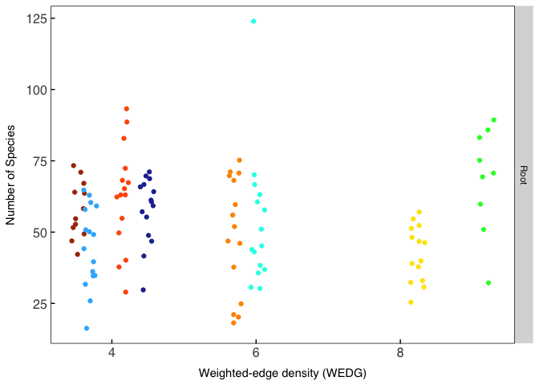<!-- -->

``` r
Shannonroots<-ggplot(data=RichnessROOTS, aes(x=EDG, y=Shannon, color=SiteID))+
  Publicationcolors()+
  geom_point(aes())+
  labs(x="Edge density (EDG)", y="Shannon diversity index")+
  facet_wrap(~Type, ncol=1, scales = "free_y", strip.position="right")+
  #geom_abline(aes(intercept=`(Intercept)`, slope=`scale(pH)`), data=as.data.frame(t(fixef(model3e.Shannon))), color="black", linetype = "dashed")+
  theme(text = element_text(family = "Helvetica"),
      plot.title = element_text(margin = margin(b=5, r=5, l=5, unit = "mm"),
                                      size = rel(1),
                                      hjust = 0.5),
            panel.background = element_rect(fill="transparent", colour = NA),
            plot.background = element_rect(fill="transparent",colour = NA),
            panel.border = element_rect(fill="transparent", colour = "black"),
            axis.title = element_text(size = rel(1)),
            axis.title.y = element_text(angle=90, size = rel(1), margin = margin(r=3, unit = "mm")),
            axis.title.x = element_text(size=rel(1), margin = margin(t=3, unit = "mm")),
            axis.text.x = element_text(size=12, margin = unit(c(t = 2.5, r = 0, b = 0, l = 0), "mm")),
            axis.text.y = element_text(size=12, margin = unit(c(t = 0, r = 2.5, b = 0, l = 0), "mm")),
            axis.line = element_blank(),
            axis.ticks.x = element_line(colour = "black"),
            axis.ticks.y = element_line(colour = "black"),
            axis.ticks.length=unit(-1.4, "mm"), 
            panel.grid.major = element_blank(),
            panel.grid.minor = element_blank(),
            legend.position  = "none")

Shannonroots
```

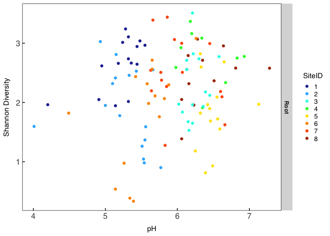<!-- -->

Richness in soils

``` r
RichnessSoilS<-estimate_richness(Soils, split = TRUE, measures = NULL)
RichnessSoilS$SampleUnique<-rownames(RichnessSoilS)
SampleData<-as(sample_data(Soils), "data.frame")
RichnessSoilS<-full_join(RichnessSoilS, SampleData)
RichnessSoilS<-full_join(RichnessSoilS,dfsoil)
RichnessSoilS$Type="Soil"

library(lme4)
library(lmerTest)
##How does landscape vs climate impact observed spp
modelobservEDG<-lmer(formula = Observed~EDG+(1|SiteID/Treenum), data = RichnessSoilS, REML=F)
modelobservredPer<-lmer(formula = Observed~redwoodPercent +(1|SiteID/Treenum), data = RichnessSoilS, REML = F)
modelobservLPI<-lmer(formula = Observed~LPI +(1|SiteID/Treenum), data = RichnessSoilS, REML = F)

AIC(modelobservredPer, modelobservLPI,modelobservEDG)
```

    ##                   df      AIC
    ## modelobservredPer  5 1144.270
    ## modelobservLPI     5 1144.486
    ## modelobservEDG     5 1141.044

``` r
BIC(modelobservredPer, modelobservLPI,modelobservEDG)
```

    ##                   df      BIC
    ## modelobservredPer  5 1158.124
    ## modelobservLPI     5 1158.340
    ## modelobservEDG     5 1154.897

``` r
##compare to climate and chem
modelobservK<-lmer(formula = Observed~k +(1|SiteID/Treenum), data = RichnessSoilS, REML = F)
modelobservpH<-lmer(formula = Observed~pH +(1|SiteID/Treenum), data = RichnessSoilS, REML = F)
modelobservaet<-lmer(formula = Observed~aet +(1|SiteID/Treenum), data = RichnessSoilS, REML = F)

AIC(modelobservEDG,modelobservK,modelobservaet, modelobservpH)
```

    ##                df      AIC
    ## modelobservEDG  5 1141.044
    ## modelobservK    5 1144.465
    ## modelobservaet  5 1144.368
    ## modelobservpH   5 1144.352

``` r
BIC(modelobservEDG,modelobservK,modelobservaet,modelobservpH)
```

    ##                df      BIC
    ## modelobservEDG  5 1154.897
    ## modelobservK    5 1158.318
    ## modelobservaet  5 1158.222
    ## modelobservpH   5 1158.205

``` r
##best model is WEDG;
modelobservEDGa<-lmer(formula = Observed~EDG+(1|SiteID/Treenum), data = RichnessSoilS, REML=F)
modelobservEDGb<-lmer(formula = Observed~EDG+(1|SiteID), data = RichnessSoilS, REML=F)

anova(modelobservEDGa,modelobservEDGb)
```

    ## Data: RichnessSoilS
    ## Models:
    ## modelobservEDGb: Observed ~ EDG + (1 | SiteID)
    ## modelobservEDGa: Observed ~ EDG + (1 | SiteID/Treenum)
    ##                 npar  AIC    BIC  logLik deviance Chisq Df Pr(>Chisq)
    ## modelobservEDGb    4 1139 1150.1 -565.52     1131                    
    ## modelobservEDGa    5 1141 1154.9 -565.52     1131     0  1          1

``` r
##best model for observed spp; patchier lanscapes have less species 
modelobservEDGb<-lmer(formula = Observed~EDG+(1|SiteID), data = RichnessSoilS, REML=T)

qqp(residuals(modelobservEDGb), col=2)
```

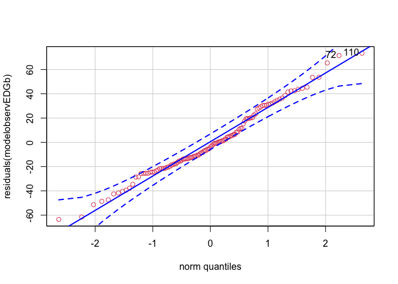<!-- -->

    ## [1] 110  72

``` r
summary(modelobservEDGb)
```

    ## Linear mixed model fit by REML. t-tests use Satterthwaite's method [
    ## lmerModLmerTest]
    ## Formula: Observed ~ EDG + (1 | SiteID)
    ##    Data: RichnessSoilS
    ## 
    ## REML criterion at convergence: 1129.1
    ## 
    ## Scaled residuals: 
    ##     Min      1Q  Median      3Q     Max 
    ## -2.2386 -0.6539 -0.1457  0.6917  2.5882 
    ## 
    ## Random effects:
    ##  Groups   Name        Variance Std.Dev.
    ##  SiteID   (Intercept) 113.8    10.67   
    ##  Residual             804.6    28.36   
    ## Number of obs: 118, groups:  SiteID, 8
    ## 
    ## Fixed effects:
    ##             Estimate Std. Error       df t value Pr(>|t|)   
    ## (Intercept) 113.2867    20.7420   6.2560   5.462  0.00137 **
    ## EDG          -0.1936     0.1074   6.2793  -1.802  0.11934   
    ## ---
    ## Signif. codes:  0 '***' 0.001 '**' 0.01 '*' 0.05 '.' 0.1 ' ' 1
    ## 
    ## Correlation of Fixed Effects:
    ##     (Intr)
    ## EDG -0.975

``` r
tab_model(modelobservEDGb)
```

<table style="border-collapse:collapse; border:none;">

<tr>

<th style="border-top: double; text-align:center; font-style:normal; font-weight:bold; padding:0.2cm;  text-align:left; ">

 

</th>

<th colspan="3" style="border-top: double; text-align:center; font-style:normal; font-weight:bold; padding:0.2cm; ">

Observed

</th>

</tr>

<tr>

<td style=" text-align:center; border-bottom:1px solid; font-style:italic; font-weight:normal;  text-align:left; ">

Predictors

</td>

<td style=" text-align:center; border-bottom:1px solid; font-style:italic; font-weight:normal;  ">

Estimates

</td>

<td style=" text-align:center; border-bottom:1px solid; font-style:italic; font-weight:normal;  ">

CI

</td>

<td style=" text-align:center; border-bottom:1px solid; font-style:italic; font-weight:normal;  ">

p

</td>

</tr>

<tr>

<td style=" padding:0.2cm; text-align:left; vertical-align:top; text-align:left; ">

(Intercept)

</td>

<td style=" padding:0.2cm; text-align:left; vertical-align:top; text-align:center;  ">

113.29

</td>

<td style=" padding:0.2cm; text-align:left; vertical-align:top; text-align:center;  ">

72.63 – 153.94

</td>

<td style=" padding:0.2cm; text-align:left; vertical-align:top; text-align:center;  ">

<strong>\<0.001

</td>

</tr>

<tr>

<td style=" padding:0.2cm; text-align:left; vertical-align:top; text-align:left; ">

EDG

</td>

<td style=" padding:0.2cm; text-align:left; vertical-align:top; text-align:center;  ">

\-0.19

</td>

<td style=" padding:0.2cm; text-align:left; vertical-align:top; text-align:center;  ">

\-0.40 – 0.02

</td>

<td style=" padding:0.2cm; text-align:left; vertical-align:top; text-align:center;  ">

0.071

</td>

</tr>

<tr>

<td style=" padding:0.2cm; text-align:left; vertical-align:top; text-align:left; ">

SD (Intercept)

</td>

<td style=" padding:0.2cm; text-align:left; vertical-align:top; text-align:center;  ">

10.67

</td>

<td style=" padding:0.2cm; text-align:left; vertical-align:top; text-align:center;  ">

</td>

<td style=" padding:0.2cm; text-align:left; vertical-align:top; text-align:center;  ">

</td>

</tr>

<tr>

<td style=" padding:0.2cm; text-align:left; vertical-align:top; text-align:left; ">

SD (Observations)

</td>

<td style=" padding:0.2cm; text-align:left; vertical-align:top; text-align:center;  ">

5.33

</td>

<td style=" padding:0.2cm; text-align:left; vertical-align:top; text-align:center;  ">

</td>

<td style=" padding:0.2cm; text-align:left; vertical-align:top; text-align:center;  ">

</td>

</tr>

<tr>

<td colspan="4" style="font-weight:bold; text-align:left; padding-top:.8em;">

Random Effects

</td>

</tr>

<tr>

<td style=" padding:0.2cm; text-align:left; vertical-align:top; text-align:left; padding-top:0.1cm; padding-bottom:0.1cm;">

σ<sup>2</sup>

</td>

<td style=" padding:0.2cm; text-align:left; vertical-align:top; padding-top:0.1cm; padding-bottom:0.1cm; text-align:left;" colspan="3">

804.57

</td>

<tr>

<td style=" padding:0.2cm; text-align:left; vertical-align:top; text-align:left; padding-top:0.1cm; padding-bottom:0.1cm;">

τ<sub>00</sub> <sub>SiteID</sub>

</td>

<td style=" padding:0.2cm; text-align:left; vertical-align:top; padding-top:0.1cm; padding-bottom:0.1cm; text-align:left;" colspan="3">

113.76

</td>

<tr>

<td style=" padding:0.2cm; text-align:left; vertical-align:top; text-align:left; padding-top:0.1cm; padding-bottom:0.1cm;">

ICC

</td>

<td style=" padding:0.2cm; text-align:left; vertical-align:top; padding-top:0.1cm; padding-bottom:0.1cm; text-align:left;" colspan="3">

0.12

</td>

<tr>

<td style=" padding:0.2cm; text-align:left; vertical-align:top; text-align:left; padding-top:0.1cm; padding-bottom:0.1cm;">

N <sub>SiteID</sub>

</td>

<td style=" padding:0.2cm; text-align:left; vertical-align:top; padding-top:0.1cm; padding-bottom:0.1cm; text-align:left;" colspan="3">

8

</td>

<tr>

<td style=" padding:0.2cm; text-align:left; vertical-align:top; text-align:left; padding-top:0.1cm; padding-bottom:0.1cm; border-top:1px solid;">

Observations

</td>

<td style=" padding:0.2cm; text-align:left; vertical-align:top; padding-top:0.1cm; padding-bottom:0.1cm; text-align:left; border-top:1px solid;" colspan="3">

118

</td>

</tr>

<tr>

<td style=" padding:0.2cm; text-align:left; vertical-align:top; text-align:left; padding-top:0.1cm; padding-bottom:0.1cm;">

Marginal R<sup>2</sup> / Conditional R<sup>2</sup>

</td>

<td style=" padding:0.2cm; text-align:left; vertical-align:top; padding-top:0.1cm; padding-bottom:0.1cm; text-align:left;" colspan="3">

0.069 / 0.185

</td>

</tr>

</table>

``` r
##Shannon comparison
##How does landscape vs climate impact observed spp
modelshannonEDG<-lmer(formula = Shannon~EDG+(1|SiteID/Treenum), data = RichnessSoilS, REML=F)
modelshannonPer<-lmer(formula = Shannon~redwoodPercent +(1|SiteID/Treenum), data = RichnessSoilS, REML = F)

AIC(modelshannonEDG,modelshannonPer)
```

    ##                 df      AIC
    ## modelshannonEDG  5 285.8796
    ## modelshannonPer  5 293.5212

``` r
BIC(modelshannonEDG,modelshannonPer)
```

    ##                 df      BIC
    ## modelshannonEDG  5 299.7330
    ## modelshannonPer  5 307.3746

``` r
##compare to climate and chem
modelshannonK<-lmer(formula = Shannon~k +(1|SiteID/Treenum), data = RichnessSoilS, REML = F)
modelshannonpH<-lmer(formula = Shannon~pH +(1|SiteID/Treenum), data = RichnessSoilS, REML = F)
modelshannonAET<-lmer(formula = Shannon~aet +(1|SiteID/Treenum), data = RichnessSoilS, REML = F)

AIC(modelobservEDG,modelobservK, modelobservpH, modelobservaet)
```

    ##                df      AIC
    ## modelobservEDG  5 1141.044
    ## modelobservK    5 1144.465
    ## modelobservpH   5 1144.352
    ## modelobservaet  5 1144.368

``` r
BIC(modelobservEDG,modelobservK,modelobservpH, modelobservaet)
```

    ##                df      BIC
    ## modelobservEDG  5 1154.897
    ## modelobservK    5 1158.318
    ## modelobservpH   5 1158.205
    ## modelobservaet  5 1158.222

``` r
AIC(modelshannonEDG,modelshannonK,modelshannonpH, modelshannonAET)
```

    ##                 df      AIC
    ## modelshannonEDG  5 285.8796
    ## modelshannonK    5 293.4713
    ## modelshannonpH   5 292.1445
    ## modelshannonAET  5 292.8131

``` r
BIC(modelshannonEDG,modelshannonK,modelshannonpH, modelshannonAET)
```

    ##                 df      BIC
    ## modelshannonEDG  5 299.7330
    ## modelshannonK    5 307.3248
    ## modelshannonpH   5 305.9979
    ## modelshannonAET  5 306.6665

``` r
##EDG is clear winner
modelshannonEDGa<-lmer(formula = Shannon~EDG+(1|SiteID/Treenum), data = RichnessSoilS, REML=F)
modelshannonEDGb<-lmer(formula = Shannon~EDG+(1|SiteID), data = RichnessSoilS, REML=F)

anova(modelshannonEDGa,modelshannonEDGb)
```

    ## Data: RichnessSoilS
    ## Models:
    ## modelshannonEDGb: Shannon ~ EDG + (1 | SiteID)
    ## modelshannonEDGa: Shannon ~ EDG + (1 | SiteID/Treenum)
    ##                  npar    AIC    BIC  logLik deviance Chisq Df Pr(>Chisq)
    ## modelshannonEDGb    4 283.88 294.96 -137.94   275.88                    
    ## modelshannonEDGa    5 285.88 299.73 -137.94   275.88     0  1          1

``` r
#best model
modelshannonEDGb<-lmer(formula = Shannon~EDG+(1|SiteID), data = RichnessSoilS, REML=T)

qqp(residuals(modelshannonEDGb), col=2)
```

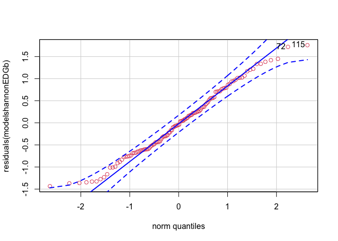<!-- -->

    ## [1] 115  72

``` r
summary(modelshannonEDGb)
```

    ## Linear mixed model fit by REML. t-tests use Satterthwaite's method [
    ## lmerModLmerTest]
    ## Formula: Shannon ~ EDG + (1 | SiteID)
    ##    Data: RichnessSoilS
    ## 
    ## REML criterion at convergence: 289.5
    ## 
    ## Scaled residuals: 
    ##      Min       1Q   Median       3Q      Max 
    ## -1.85590 -0.77459 -0.05704  0.72111  2.27525 
    ## 
    ## Random effects:
    ##  Groups   Name        Variance Std.Dev.
    ##  SiteID   (Intercept) 0.02769  0.1664  
    ##  Residual             0.59698  0.7726  
    ## Number of obs: 118, groups:  SiteID, 8
    ## 
    ## Fixed effects:
    ##              Estimate Std. Error        df t value Pr(>|t|)    
    ## (Intercept)  3.555367   0.417947  6.334864   8.507 0.000108 ***
    ## EDG         -0.006673   0.002166  6.375352  -3.081 0.020027 *  
    ## ---
    ## Signif. codes:  0 '***' 0.001 '**' 0.01 '*' 0.05 '.' 0.1 ' ' 1
    ## 
    ## Correlation of Fixed Effects:
    ##     (Intr)
    ## EDG -0.975

``` r
tab_model(modelshannonEDGb)
```

<table style="border-collapse:collapse; border:none;">

<tr>

<th style="border-top: double; text-align:center; font-style:normal; font-weight:bold; padding:0.2cm;  text-align:left; ">

 

</th>

<th colspan="3" style="border-top: double; text-align:center; font-style:normal; font-weight:bold; padding:0.2cm; ">

Shannon

</th>

</tr>

<tr>

<td style=" text-align:center; border-bottom:1px solid; font-style:italic; font-weight:normal;  text-align:left; ">

Predictors

</td>

<td style=" text-align:center; border-bottom:1px solid; font-style:italic; font-weight:normal;  ">

Estimates

</td>

<td style=" text-align:center; border-bottom:1px solid; font-style:italic; font-weight:normal;  ">

CI

</td>

<td style=" text-align:center; border-bottom:1px solid; font-style:italic; font-weight:normal;  ">

p

</td>

</tr>

<tr>

<td style=" padding:0.2cm; text-align:left; vertical-align:top; text-align:left; ">

(Intercept)

</td>

<td style=" padding:0.2cm; text-align:left; vertical-align:top; text-align:center;  ">

3.56

</td>

<td style=" padding:0.2cm; text-align:left; vertical-align:top; text-align:center;  ">

2.74 – 4.37

</td>

<td style=" padding:0.2cm; text-align:left; vertical-align:top; text-align:center;  ">

<strong>\<0.001

</td>

</tr>

<tr>

<td style=" padding:0.2cm; text-align:left; vertical-align:top; text-align:left; ">

EDG

</td>

<td style=" padding:0.2cm; text-align:left; vertical-align:top; text-align:center;  ">

\-0.01

</td>

<td style=" padding:0.2cm; text-align:left; vertical-align:top; text-align:center;  ">

\-0.01 – -0.00

</td>

<td style=" padding:0.2cm; text-align:left; vertical-align:top; text-align:center;  ">

<strong>0.002</strong>

</td>

</tr>

<tr>

<td style=" padding:0.2cm; text-align:left; vertical-align:top; text-align:left; ">

SD (Intercept)

</td>

<td style=" padding:0.2cm; text-align:left; vertical-align:top; text-align:center;  ">

0.17

</td>

<td style=" padding:0.2cm; text-align:left; vertical-align:top; text-align:center;  ">

</td>

<td style=" padding:0.2cm; text-align:left; vertical-align:top; text-align:center;  ">

</td>

</tr>

<tr>

<td style=" padding:0.2cm; text-align:left; vertical-align:top; text-align:left; ">

SD (Observations)

</td>

<td style=" padding:0.2cm; text-align:left; vertical-align:top; text-align:center;  ">

0.88

</td>

<td style=" padding:0.2cm; text-align:left; vertical-align:top; text-align:center;  ">

</td>

<td style=" padding:0.2cm; text-align:left; vertical-align:top; text-align:center;  ">

</td>

</tr>

<tr>

<td colspan="4" style="font-weight:bold; text-align:left; padding-top:.8em;">

Random Effects

</td>

</tr>

<tr>

<td style=" padding:0.2cm; text-align:left; vertical-align:top; text-align:left; padding-top:0.1cm; padding-bottom:0.1cm;">

σ<sup>2</sup>

</td>

<td style=" padding:0.2cm; text-align:left; vertical-align:top; padding-top:0.1cm; padding-bottom:0.1cm; text-align:left;" colspan="3">

0.60

</td>

<tr>

<td style=" padding:0.2cm; text-align:left; vertical-align:top; text-align:left; padding-top:0.1cm; padding-bottom:0.1cm;">

τ<sub>00</sub> <sub>SiteID</sub>

</td>

<td style=" padding:0.2cm; text-align:left; vertical-align:top; padding-top:0.1cm; padding-bottom:0.1cm; text-align:left;" colspan="3">

0.03

</td>

<tr>

<td style=" padding:0.2cm; text-align:left; vertical-align:top; text-align:left; padding-top:0.1cm; padding-bottom:0.1cm;">

ICC

</td>

<td style=" padding:0.2cm; text-align:left; vertical-align:top; padding-top:0.1cm; padding-bottom:0.1cm; text-align:left;" colspan="3">

0.04

</td>

<tr>

<td style=" padding:0.2cm; text-align:left; vertical-align:top; text-align:left; padding-top:0.1cm; padding-bottom:0.1cm;">

N <sub>SiteID</sub>

</td>

<td style=" padding:0.2cm; text-align:left; vertical-align:top; padding-top:0.1cm; padding-bottom:0.1cm; text-align:left;" colspan="3">

8

</td>

<tr>

<td style=" padding:0.2cm; text-align:left; vertical-align:top; text-align:left; padding-top:0.1cm; padding-bottom:0.1cm; border-top:1px solid;">

Observations

</td>

<td style=" padding:0.2cm; text-align:left; vertical-align:top; padding-top:0.1cm; padding-bottom:0.1cm; text-align:left; border-top:1px solid;" colspan="3">

118

</td>

</tr>

<tr>

<td style=" padding:0.2cm; text-align:left; vertical-align:top; text-align:left; padding-top:0.1cm; padding-bottom:0.1cm;">

Marginal R<sup>2</sup> / Conditional R<sup>2</sup>

</td>

<td style=" padding:0.2cm; text-align:left; vertical-align:top; padding-top:0.1cm; padding-bottom:0.1cm; text-align:left;" colspan="3">

0.115 / 0.154

</td>

</tr>

</table>

``` r
library(sjPlot)
Soildiversitymodeltab<-tab_model(modelobservEDGb,modelshannonEDGb, auto.label = F)
Soildiversitymodeltab
```

<table style="border-collapse:collapse; border:none;">

<tr>

<th style="border-top: double; text-align:center; font-style:normal; font-weight:bold; padding:0.2cm;  text-align:left; ">

 

</th>

<th colspan="3" style="border-top: double; text-align:center; font-style:normal; font-weight:bold; padding:0.2cm; ">

Observed

</th>

<th colspan="3" style="border-top: double; text-align:center; font-style:normal; font-weight:bold; padding:0.2cm; ">

Shannon

</th>

</tr>

<tr>

<td style=" text-align:center; border-bottom:1px solid; font-style:italic; font-weight:normal;  text-align:left; ">

Predictors

</td>

<td style=" text-align:center; border-bottom:1px solid; font-style:italic; font-weight:normal;  ">

Estimates

</td>

<td style=" text-align:center; border-bottom:1px solid; font-style:italic; font-weight:normal;  ">

CI

</td>

<td style=" text-align:center; border-bottom:1px solid; font-style:italic; font-weight:normal;  ">

p

</td>

<td style=" text-align:center; border-bottom:1px solid; font-style:italic; font-weight:normal;  ">

Estimates

</td>

<td style=" text-align:center; border-bottom:1px solid; font-style:italic; font-weight:normal;  ">

CI

</td>

<td style=" text-align:center; border-bottom:1px solid; font-style:italic; font-weight:normal;  col7">

p

</td>

</tr>

<tr>

<td style=" padding:0.2cm; text-align:left; vertical-align:top; text-align:left; ">

(Intercept)

</td>

<td style=" padding:0.2cm; text-align:left; vertical-align:top; text-align:center;  ">

113.29

</td>

<td style=" padding:0.2cm; text-align:left; vertical-align:top; text-align:center;  ">

72.63 – 153.94

</td>

<td style=" padding:0.2cm; text-align:left; vertical-align:top; text-align:center;  ">

<strong>\<0.001

</td>

<td style=" padding:0.2cm; text-align:left; vertical-align:top; text-align:center;  ">

3.56

</td>

<td style=" padding:0.2cm; text-align:left; vertical-align:top; text-align:center;  ">

2.74 – 4.37

</td>

<td style=" padding:0.2cm; text-align:left; vertical-align:top; text-align:center;  col7">

<strong>\<0.001

</td>

</tr>

<tr>

<td style=" padding:0.2cm; text-align:left; vertical-align:top; text-align:left; ">

EDG

</td>

<td style=" padding:0.2cm; text-align:left; vertical-align:top; text-align:center;  ">

\-0.19

</td>

<td style=" padding:0.2cm; text-align:left; vertical-align:top; text-align:center;  ">

\-0.40 – 0.02

</td>

<td style=" padding:0.2cm; text-align:left; vertical-align:top; text-align:center;  ">

0.071

</td>

<td style=" padding:0.2cm; text-align:left; vertical-align:top; text-align:center;  ">

\-0.01

</td>

<td style=" padding:0.2cm; text-align:left; vertical-align:top; text-align:center;  ">

\-0.01 – -0.00

</td>

<td style=" padding:0.2cm; text-align:left; vertical-align:top; text-align:center;  col7">

<strong>0.002</strong>

</td>

</tr>

<tr>

<td style=" padding:0.2cm; text-align:left; vertical-align:top; text-align:left; ">

SD (Intercept)

</td>

<td style=" padding:0.2cm; text-align:left; vertical-align:top; text-align:center;  ">

10.67

</td>

<td style=" padding:0.2cm; text-align:left; vertical-align:top; text-align:center;  ">

</td>

<td style=" padding:0.2cm; text-align:left; vertical-align:top; text-align:center;  ">

</td>

<td style=" padding:0.2cm; text-align:left; vertical-align:top; text-align:center;  ">

0.17

</td>

<td style=" padding:0.2cm; text-align:left; vertical-align:top; text-align:center;  ">

</td>

<td style=" padding:0.2cm; text-align:left; vertical-align:top; text-align:center;  col7">

</td>

</tr>

<tr>

<td style=" padding:0.2cm; text-align:left; vertical-align:top; text-align:left; ">

SD (Observations)

</td>

<td style=" padding:0.2cm; text-align:left; vertical-align:top; text-align:center;  ">

5.33

</td>

<td style=" padding:0.2cm; text-align:left; vertical-align:top; text-align:center;  ">

</td>

<td style=" padding:0.2cm; text-align:left; vertical-align:top; text-align:center;  ">

</td>

<td style=" padding:0.2cm; text-align:left; vertical-align:top; text-align:center;  ">

0.88

</td>

<td style=" padding:0.2cm; text-align:left; vertical-align:top; text-align:center;  ">

</td>

<td style=" padding:0.2cm; text-align:left; vertical-align:top; text-align:center;  col7">

</td>

</tr>

<tr>

<td colspan="7" style="font-weight:bold; text-align:left; padding-top:.8em;">

Random Effects

</td>

</tr>

<tr>

<td style=" padding:0.2cm; text-align:left; vertical-align:top; text-align:left; padding-top:0.1cm; padding-bottom:0.1cm;">

σ<sup>2</sup>

</td>

<td style=" padding:0.2cm; text-align:left; vertical-align:top; padding-top:0.1cm; padding-bottom:0.1cm; text-align:left;" colspan="3">

804.57

</td>

<td style=" padding:0.2cm; text-align:left; vertical-align:top; padding-top:0.1cm; padding-bottom:0.1cm; text-align:left;" colspan="3">

0.60

</td>

<tr>

<td style=" padding:0.2cm; text-align:left; vertical-align:top; text-align:left; padding-top:0.1cm; padding-bottom:0.1cm;">

τ<sub>00</sub>

</td>

<td style=" padding:0.2cm; text-align:left; vertical-align:top; padding-top:0.1cm; padding-bottom:0.1cm; text-align:left;" colspan="3">

113.76 <sub>SiteID</sub>

</td>

<td style=" padding:0.2cm; text-align:left; vertical-align:top; padding-top:0.1cm; padding-bottom:0.1cm; text-align:left;" colspan="3">

0.03 <sub>SiteID</sub>

</td>

<tr>

<td style=" padding:0.2cm; text-align:left; vertical-align:top; text-align:left; padding-top:0.1cm; padding-bottom:0.1cm;">

ICC

</td>

<td style=" padding:0.2cm; text-align:left; vertical-align:top; padding-top:0.1cm; padding-bottom:0.1cm; text-align:left;" colspan="3">

0.12

</td>

<td style=" padding:0.2cm; text-align:left; vertical-align:top; padding-top:0.1cm; padding-bottom:0.1cm; text-align:left;" colspan="3">

0.04

</td>

<tr>

<td style=" padding:0.2cm; text-align:left; vertical-align:top; text-align:left; padding-top:0.1cm; padding-bottom:0.1cm;">

N

</td>

<td style=" padding:0.2cm; text-align:left; vertical-align:top; padding-top:0.1cm; padding-bottom:0.1cm; text-align:left;" colspan="3">

8 <sub>SiteID</sub>

</td>

<td style=" padding:0.2cm; text-align:left; vertical-align:top; padding-top:0.1cm; padding-bottom:0.1cm; text-align:left;" colspan="3">

8 <sub>SiteID</sub>

</td>

<tr>

<td style=" padding:0.2cm; text-align:left; vertical-align:top; text-align:left; padding-top:0.1cm; padding-bottom:0.1cm; border-top:1px solid;">

Observations

</td>

<td style=" padding:0.2cm; text-align:left; vertical-align:top; padding-top:0.1cm; padding-bottom:0.1cm; text-align:left; border-top:1px solid;" colspan="3">

118

</td>

<td style=" padding:0.2cm; text-align:left; vertical-align:top; padding-top:0.1cm; padding-bottom:0.1cm; text-align:left; border-top:1px solid;" colspan="3">

118

</td>

</tr>

<tr>

<td style=" padding:0.2cm; text-align:left; vertical-align:top; text-align:left; padding-top:0.1cm; padding-bottom:0.1cm;">

Marginal R<sup>2</sup> / Conditional R<sup>2</sup>

</td>

<td style=" padding:0.2cm; text-align:left; vertical-align:top; padding-top:0.1cm; padding-bottom:0.1cm; text-align:left;" colspan="3">

0.069 / 0.185

</td>

<td style=" padding:0.2cm; text-align:left; vertical-align:top; padding-top:0.1cm; padding-bottom:0.1cm; text-align:left;" colspan="3">

0.115 / 0.154

</td>

</tr>

</table>

``` r
ShannonSoilsa<-ggplot(data=RichnessSoilS, aes(x=EDG, y=Shannon, color=SiteID))+
  Publicationcolors()+
  geom_jitter()+
  labs(x="Edge density (EDG)", y="Shannon diversity index")+
    facet_wrap(~Type, ncol=1, scales = "free_y", strip.position="right")+
  geom_abline(aes(intercept=`(Intercept)`, slope=`EDG`), data=as.data.frame(t(fixef(modelshannonEDGb))), color="black")+
    theme( text = element_text(family = "Helvetica"),
            plot.title = element_text(margin = margin(b=5, r=5, l=5, unit = "mm"),
                                      size = rel(1),
                                      hjust = 0.5),
            panel.background = element_rect(fill="transparent", colour = NA),
            plot.background = element_rect(fill="transparent",colour = NA),
            panel.border = element_rect(fill="transparent", colour = "black"),
            axis.title = element_text(size = rel(1)),
            axis.title.y = element_text(angle=90, size = rel(1), margin = margin(r=3, unit = "mm")),
            axis.title.x = element_text(size=rel(1), margin = margin(t=3, unit = "mm")),
            axis.text.x = element_text(size=12, margin = unit(c(t = 2.5, r = 0, b = 0, l = 0), "mm")),
            axis.text.y = element_text(size=12, margin = unit(c(t = 0, r = 2.5, b = 0, l = 0), "mm")),
            axis.line = element_blank(),
            axis.ticks.x = element_line(colour = "black"),
            axis.ticks.y = element_line(colour = "black"),
            axis.ticks.length=unit(-1.4, "mm"), 
            panel.grid.major = element_blank(),
            panel.grid.minor = element_blank(),
           legend.key = element_rect(fill="transparent", 
                                      colour = NA),
        legend.key.size= unit(4, "mm"),
        legend.text = element_text(size =10),
        legend.spacing = unit(0, "mm"),
        legend.background = element_rect(fill = "transparent",
                                         colour = NA),
        strip.text = element_text(face="bold"))
ShannonSoilsa
```

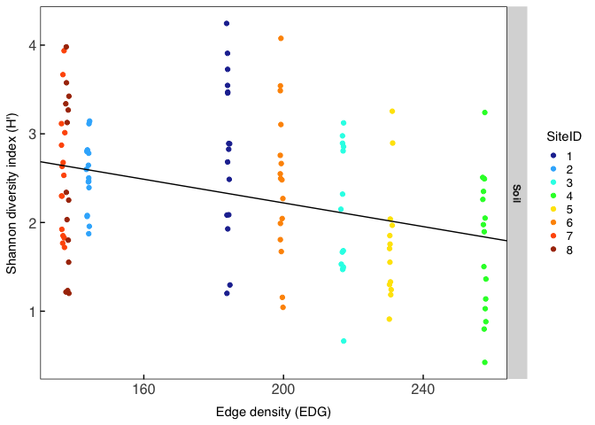<!-- -->

``` r
Legend<-get_legend(ShannonSoilsa)


ShannonSoils<-ggplot(data=RichnessSoilS, aes(x=EDG, y=Shannon, color=SiteID))+
  Publicationcolors()+
  geom_jitter(width = 0.1)+
  labs(x="Edge density (EDG)", y="Shannon diversity index")+
    facet_wrap(~Type, ncol=1, scales = "free_y", strip.position="right")+
  geom_abline(aes(intercept=`(Intercept)`, slope=`EDG`), data=as.data.frame(t(fixef(modelshannonEDGb))), color="black")+
    theme( text = element_text(family = "Helvetica"),
            plot.title = element_text(margin = margin(b=5, r=5, l=5, unit = "mm"),
                                      size = rel(1),
                                      hjust = 0.5),
            panel.background = element_rect(fill="transparent", colour = NA),
            plot.background = element_rect(fill="transparent",colour = NA),
            panel.border = element_rect(fill="transparent", colour = "black"),
            axis.title = element_text(size = rel(1)),
            axis.title.y = element_text(angle=90, size = rel(1), margin = margin(r=3, unit = "mm")),
            axis.title.x = element_text(size=rel(1), margin = margin(t=3, unit = "mm")),
            axis.text.x = element_text(size=12, margin = unit(c(t = 2.5, r = 0, b = 0, l = 0), "mm")),
            axis.text.y = element_text(size=12, margin = unit(c(t = 0, r = 2.5, b = 0, l = 0), "mm")),
            axis.line = element_blank(),
            axis.ticks.x = element_line(colour = "black"),
            axis.ticks.y = element_line(colour = "black"),
            axis.ticks.length=unit(-1.4, "mm"), 
            panel.grid.major = element_blank(),
            panel.grid.minor = element_blank(),
            legend.position = "none")

##diversity declines as landscapes become more patchy
```

Rhizonode Richness (soil vs root vs rhizonode)

``` r
RichnessRhizo<-estimate_richness(RAREstructure, split = TRUE, measures = NULL)
RichnessRhizo$SampleUnique<-cbind(Strucdf$SampleUnique)
SampleDataRhizo<-as(sample_data(RAREstructure), "data.frame")
RichnessRhizo<-full_join(RichnessRhizo, SampleDataRhizo)


ObservedRhizo<-ggplot(data=RichnessRhizo, aes(x=SampleType, y=Observed, fill=SampleType))+
  geom_boxplot(aes())+
  labs(x="Compartment", y="Number of Species")+
scale_fill_manual(values = c("#2332A0", "#36B4FC", "#1BFFE8"))+
  theme(
        text = element_text(),
        panel.background = element_rect(fill="transparent", colour = NA),
        plot.background = element_rect(fill="transparent",colour = NA),
        panel.border = element_rect(fill="transparent", colour = "black"),
        axis.title.y = element_text(angle=90, size = 12, margin = margin(r=3, unit = "mm")),
        axis.title.x = element_text(size=12, margin = margin(t=3, unit = "mm")),
        axis.text.x = element_text(size=12, margin = unit(c(t = 2.5, r = 0, b = 0, l = 0), "mm")),
        axis.text.y = element_text(size=12, margin = unit(c(t = 0, r = 2.5, b = 0, l = 0), "mm")),
        axis.line = element_blank(),
        axis.ticks.x = element_line(colour = "black"),
        axis.ticks.y = element_line(colour = "black"),
        axis.ticks.length=unit(-1.4, "mm"), 
        panel.grid.major = element_blank(),
        panel.grid.minor = element_blank(),
        legend.position = "none",
        plot.margin=margin(t=2, r=2, b=2, l=2, unit = "mm"),
        strip.background=element_rect(fill="transparent", colour=NA),
        strip.text = element_text(face="bold"))

ShannonRhizo<-ggplot(data=RichnessRhizo, aes(x=SampleType, y=Shannon, fill=SampleType))+
  geom_boxplot(aes())+
    labs(x="Compartment", y="Shannon Diversity")+
scale_fill_manual(values = c("#2332A0", "#36B4FC", "#1BFFE8"))+
  theme(
        text = element_text(),
        panel.background = element_rect(fill="transparent", colour = NA),
        plot.background = element_rect(fill="transparent",colour = NA),
        panel.border = element_rect(fill="transparent", colour = "black"),
        axis.title.y = element_text(angle=90, size = 12, margin = margin(r=3, unit = "mm")),
        axis.title.x = element_text(size=12, margin = margin(t=3, unit = "mm")),
        axis.text.x = element_text(size=12, margin = unit(c(t = 2.5, r = 0, b = 0, l = 0), "mm")),
        axis.text.y = element_text(size=12, margin = unit(c(t = 0, r = 2.5, b = 0, l = 0), "mm")),
        axis.line = element_blank(),
        axis.ticks.x = element_line(colour = "black"),
        axis.ticks.y = element_line(colour = "black"),
        axis.ticks.length=unit(-1.4, "mm"), 
        panel.grid.major = element_blank(),
        panel.grid.minor = element_blank(),
        legend.position = "none",
        plot.margin=margin(t=2, r=2, b=2, l=2, unit = "mm"),
        strip.background=element_rect(fill="transparent", colour=NA),
        strip.text = element_text(face="bold"))

RobsvSampleType<-aov(RichnessRhizo$Observed~RichnessRhizo$SampleType+RichnessRhizo$Treenum)
summary(RobsvSampleType)
```

    ##                          Df Sum Sq Mean Sq F value   Pr(>F)    
    ## RichnessRhizo$SampleType  2 219624  109812 140.896  < 2e-16 ***
    ## RichnessRhizo$Treenum     5  22411    4482   5.751 0.000201 ***
    ## Residuals                62  48322     779                     
    ## ---
    ## Signif. codes:  0 '***' 0.001 '**' 0.01 '*' 0.05 '.' 0.1 ' ' 1

``` r
TukeyHSD(RobsvSampleType)
```

    ##   Tukey multiple comparisons of means
    ##     95% family-wise confidence level
    ## 
    ## Fit: aov(formula = RichnessRhizo$Observed ~ RichnessRhizo$SampleType + RichnessRhizo$Treenum)
    ## 
    ## $`RichnessRhizo$SampleType`
    ##                     diff       lwr        upr     p adj
    ## Root-Rhizonode -10.84091 -30.62771   8.945891 0.3919757
    ## Soil-Rhizonode 112.45833  93.10646 131.810205 0.0000000
    ## Soil-Root      123.29924 103.51244 143.086042 0.0000000
    ## 
    ## $`RichnessRhizo$Treenum`
    ##           diff         lwr      upr     p adj
    ## 2-1  12.079086 -22.1900832 46.34826 0.9037165
    ## 3-1  33.715450  -0.5537195 67.98462 0.0563428
    ## 4-1  44.250000  10.7340911 77.76591 0.0033166
    ## 5-1  25.833333  -7.6825756 59.34924 0.2234258
    ## 6-1  51.500000  17.9840911 85.01591 0.0003965
    ## 3-2  21.636364 -13.3698616 56.64259 0.4622986
    ## 4-2  32.170914  -2.0982558 66.44008 0.0778044
    ## 5-2  13.754247 -20.5149225 48.02342 0.8445153
    ## 6-2  39.420914   5.1517442 73.69008 0.0150987
    ## 4-3  10.534550 -23.7346194 44.80372 0.9440568
    ## 5-3  -7.882117 -42.1512861 26.38705 0.9839249
    ## 6-3  17.784550 -16.4846194 52.05372 0.6490224
    ## 5-4 -18.416667 -51.9325756 15.09924 0.5914090
    ## 6-4   7.250000 -26.2659089 40.76591 0.9878069
    ## 6-5  25.666667  -7.8492423 59.18258 0.2296226

``` r
RshannonSampleType<-aov(RichnessRhizo$Shannon~RichnessRhizo$SampleType+
                          RichnessRhizo$Treenum)
summary(RshannonSampleType)
```

    ##                          Df Sum Sq Mean Sq F value   Pr(>F)    
    ## RichnessRhizo$SampleType  2  32.58  16.289  49.354 1.50e-13 ***
    ## RichnessRhizo$Treenum     5  11.96   2.391   7.245 2.13e-05 ***
    ## Residuals                62  20.46   0.330                     
    ## ---
    ## Signif. codes:  0 '***' 0.001 '**' 0.01 '*' 0.05 '.' 0.1 ' ' 1

``` r
TukeyHSD(RshannonSampleType)
```

    ##   Tukey multiple comparisons of means
    ##     95% family-wise confidence level
    ## 
    ## Fit: aov(formula = RichnessRhizo$Shannon ~ RichnessRhizo$SampleType + RichnessRhizo$Treenum)
    ## 
    ## $`RichnessRhizo$SampleType`
    ##                      diff        lwr        upr     p adj
    ## Root-Rhizonode -0.3881853 -0.7953702 0.01899967 0.0647939
    ## Soil-Rhizonode  1.2129146  0.8146799 1.61114935 0.0000000
    ## Soil-Root       1.6010999  1.1939149 2.00828483 0.0000000
    ## 
    ## $`RichnessRhizo$Treenum`
    ##           diff         lwr       upr     p adj
    ## 2-1  0.5829386 -0.12227346 1.2881507 0.1617411
    ## 3-1  0.9878991  0.28268701 1.6931111 0.0015375
    ## 4-1  0.8874219  0.19771088 1.5771329 0.0045298
    ## 5-1  0.4235926 -0.26611840 1.1133036 0.4694878
    ## 6-1  1.2542705  0.56455950 1.9439815 0.0000197
    ## 3-2  0.4049605 -0.31541918 1.1253401 0.5673268
    ## 4-2  0.3044833 -0.40072878 1.0096953 0.8001303
    ## 5-2 -0.1593460 -0.86455806 0.5458661 0.9851559
    ## 6-2  0.6713319 -0.03388016 1.3765440 0.0709084
    ## 4-3 -0.1004772 -0.80568924 0.6047349 0.9982721
    ## 5-3 -0.5643065 -1.26951853 0.1409056 0.1891363
    ## 6-3  0.2663714 -0.43884063 0.9715835 0.8751161
    ## 5-4 -0.4638293 -1.15354028 0.2258817 0.3667087
    ## 6-4  0.3668486 -0.32286238 1.0565596 0.6247644
    ## 6-5  0.8306779  0.14096690 1.5203889 0.0094828

Beta diversity(turnover and nestedness)

``` r
library(betapart)
      
##calculate geographic distances (uses SoDA)
gdroot<-dist(geoXY(dfroot$Latitude, dfroot$Longitude, unit=1000))
gdsoil<-dist(geoXY(dfsoil$Latitude, dfsoil$Longitude, unit=1000))

##environmental distances from gdm
pHdistroot<-dist(dfroot$pH) 
redcoverdistroot<-dist(dfroot$redwoodPercent)
EDGdistroot<-dist(dfroot$EDG)
redcoverdistsoil<-dist(dfsoil$redwoodPercent)
EDGdistsoil<-dist(dfsoil$EDG)
pHdistsoil<-dist(dfsoil$pH)

##beta.pair (spatial turnover and nestedness)
#fungiroots<-Rootdf; Rootdf[Rootdf>0]=1 
#save(fungiroots, file = "fungiroots.rda")
setwd("~/Dropbox/Research/Thesis_Ch1/Data/R/")
load(file = "fungiroots.rda")
fungi.dist.roots<-beta.pair(fungiroots, index.family = "jaccard")

##gdroot is distance matrix of spatial distance
##phdistroot is a distance matrix of difference in pH


##turnover and nestedness across spatial distance and pH 
mantel(fungi.dist.roots$beta.jne~pHdistroot)
```

    ##    mantelr      pval1      pval2      pval3  llim.2.5% ulim.97.5% 
    ## -0.1942127  1.0000000  0.0010000  0.0010000 -0.2128645 -0.1709968

``` r
mantel(fungi.dist.roots$beta.jtu~pHdistroot)
```

    ##    mantelr      pval1      pval2      pval3  llim.2.5% ulim.97.5% 
    ##  0.3763814  0.0010000  1.0000000  0.0010000  0.3459575  0.4070375

``` r
mantel(fungi.dist.roots$beta.jne~gdroot)
```

    ##    mantelr      pval1      pval2      pval3  llim.2.5% ulim.97.5% 
    ## -0.2149729  1.0000000  0.0010000  0.0010000 -0.2348628 -0.1971172

``` r
mantel(fungi.dist.roots$beta.jtu~gdroot)
```

    ##    mantelr      pval1      pval2      pval3  llim.2.5% ulim.97.5% 
    ##  0.3826535  0.0010000  1.0000000  0.0010000  0.3561888  0.4093881

``` r
##soils
#fungisoils<-Soildf; Soildf[Soildf>0]=1 
#save(fungisoils, file = "fungisoils.rda")
load(file = "fungisoils.rda")
fungi.dist.soils<-beta.pair(fungisoils, index.family = "jaccard")

mantel(fungi.dist.soils$beta.jtu~redcoverdistsoil)
```

    ##    mantelr      pval1      pval2      pval3  llim.2.5% ulim.97.5% 
    ##  0.4056888  0.0010000  1.0000000  0.0010000  0.3837705  0.4300593

``` r
mantel(fungi.dist.soils$beta.jne~redcoverdistsoil)
```

    ##    mantelr      pval1      pval2      pval3  llim.2.5% ulim.97.5% 
    ## -0.2003529  1.0000000  0.0010000  0.0010000 -0.2189962 -0.1822267

``` r
mantel(fungi.dist.soils$beta.jne~gdsoil)
```

    ##    mantelr      pval1      pval2      pval3  llim.2.5% ulim.97.5% 
    ## -0.2331537  1.0000000  0.0010000  0.0010000 -0.2496066 -0.2169623

``` r
mantel(fungi.dist.soils$beta.jtu~gdsoil)
```

    ##    mantelr      pval1      pval2      pval3  llim.2.5% ulim.97.5% 
    ##  0.4905473  0.0010000  1.0000000  0.0010000  0.4690203  0.5133115

``` r
mantel(fungi.dist.soils$beta.jne~EDGdistsoil)
```

    ##     mantelr       pval1       pval2       pval3   llim.2.5%  ulim.97.5% 
    ## -0.06318691  1.00000000  0.00100000  0.00700000 -0.09632056 -0.03543407

``` r
mantel(fungi.dist.soils$beta.jtu~EDGdistsoil)
```

    ##    mantelr      pval1      pval2      pval3  llim.2.5% ulim.97.5% 
    ##  0.2376947  0.0010000  1.0000000  0.0010000  0.2157034  0.2659372

Beta-dispersion (homogeneity of variate dispersion across sites)

``` r
SampleDataAll<-as(sample_data(RARE), "data.frame")
SampleDataSoil<-as(sample_data(Soils), "data.frame")
SampleDataRoots<-as(sample_data(Roots), "data.frame")

SampleDataStructures<-as(sample_data(RAREstructure), "data.frame")

##Roots versus soils
z <- betadiver(FUNGIdf, "z")
mod <- with(SampleDataAll, betadisper(z, SampleType))
boxplot(mod)
```

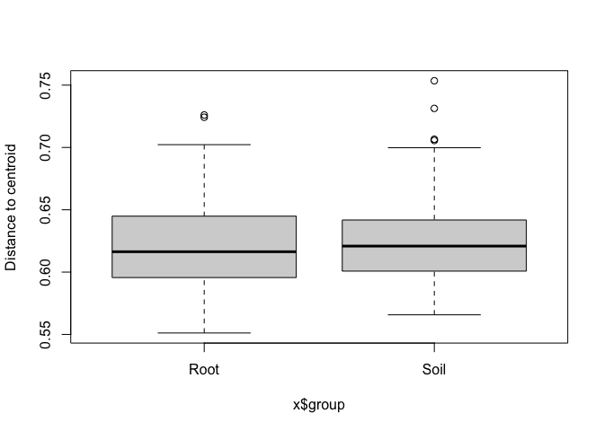<!-- -->

``` r
t.test(mod$distances~mod$group)
```

    ## 
    ##  Welch Two Sample t-test
    ## 
    ## data:  mod$distances by mod$group
    ## t = -0.77714, df = 224.09, p-value = 0.4379
    ## alternative hypothesis: true difference in means is not equal to 0
    ## 95 percent confidence interval:
    ##  -0.012842770  0.005578189
    ## sample estimates:
    ## mean in group Root mean in group Soil 
    ##          0.6209398          0.6245721

``` r
##soils
z <- betadiver(fungisoils, "z")
mod <- with(SampleDataSoil, betadisper(z, SiteID))
mod
```

    ## 
    ##  Homogeneity of multivariate dispersions
    ## 
    ## Call: betadisper(d = z, group = SiteID)
    ## 
    ## No. of Positive Eigenvalues: 117
    ## No. of Negative Eigenvalues: 0
    ## 
    ## Average distance to median:
    ##      1      2      3      4      5      6      7      8 
    ## 0.5246 0.5290 0.5559 0.5576 0.5518 0.5314 0.5701 0.5980 
    ## 
    ## Eigenvalues for PCoA axes:
    ## (Showing 8 of 117 eigenvalues)
    ##  PCoA1  PCoA2  PCoA3  PCoA4  PCoA5  PCoA6  PCoA7  PCoA8 
    ## 3.3092 2.3421 1.8012 1.5057 1.2671 1.0869 0.9432 0.8803

``` r
betadist <- data.frame(matrix(unlist(mod$distances), byrow=F))
betasite<-data.frame(matrix(unlist(mod$group), byrow=F))
betadispsoils<-cbind(betasite,betadist)

##roots
zr<-betadiver(fungiroots, "z")
modr <- with(SampleDataRoots, betadisper(zr, SiteID))
betadistr <- data.frame(matrix(unlist(modr$distances), byrow=F))
betasiter<-data.frame(matrix(unlist(modr$group), byrow=F))
betadisproots<-cbind(betasiter,betadistr)

##join with sample data
betadispsoils<-betadispsoils %>% 
  dplyr::rename(
        BetaDist=matrix.unlist.mod.distances...byrow...F.,
        SiteID_delete=matrix.unlist.mod.group...byrow...F.)
  betadispsoils<-cbind(betadispsoils, dfsoil)

betadisproots<-betadisproots %>% 
  dplyr::rename(
        BetaDist=matrix.unlist.modr.distances...byrow...F.,
        SiteID_delete=matrix.unlist.modr.group...byrow...F.)
  betadisproots<-cbind(betadisproots, dfroot)

##combine root and soil into one df
betadispall<-full_join(betadisproots, betadispsoils)

library(lme4)
library(lmerTest)

##modelselection

betadispmodelLat<-lmer(formula = BetaDist~scale(Latitude)*SampleType +(1|Site), data = betadispall, REML = F)
betadispmodelK<-lmer(formula = BetaDist~scale(k)*SampleType +(1|SiteID), data = betadispall, REML = F)
betadispmodelaet<-lmer(formula = BetaDist~scale(aet)*SampleType +(1|SiteID), data = betadispall, REML = F)
betadispmodelpH<-lmer(formula = BetaDist~scale(pH)*SampleType +(1|SiteID), data = betadispall, REML = F)


AIC(betadispmodelaet, betadispmodelLat, betadispmodelpH, betadispmodelK)
```

    ##                  df       AIC
    ## betadispmodelaet  6 -606.8237
    ## betadispmodelLat  6 -607.7127
    ## betadispmodelpH   6 -595.3067
    ## betadispmodelK    6 -611.4343

``` r
BIC(betadispmodelaet, betadispmodelLat, betadispmodelpH, betadispmodelK)
```

    ##                  df       BIC
    ## betadispmodelaet  6 -586.2214
    ## betadispmodelLat  6 -587.1104
    ## betadispmodelpH   6 -574.7043
    ## betadispmodelK    6 -590.8320

``` r
betadispmodelKfull<-lmer(formula = BetaDist~k*SampleType +(1|SiteID), data = betadispall, REML = F)
betadispmodelKmin1<-lmer(formula = BetaDist~k+SampleType +(1|SiteID), data = betadispall, REML = F)
betadispmodelKmin2<-lmer(formula = BetaDist~k +(1|SiteID), data = betadispall, REML = F)

anova(betadispmodelKfull, betadispmodelKmin1, betadispmodelKmin2)
```

    ## Data: betadispall
    ## Models:
    ## betadispmodelKmin2: BetaDist ~ k + (1 | SiteID)
    ## betadispmodelKmin1: BetaDist ~ k + SampleType + (1 | SiteID)
    ## betadispmodelKfull: BetaDist ~ k * SampleType + (1 | SiteID)
    ##                    npar     AIC     BIC logLik deviance  Chisq Df Pr(>Chisq)  
    ## betadispmodelKmin2    4 -611.11 -597.37 309.55  -619.11                       
    ## betadispmodelKmin1    5 -609.71 -592.54 309.86  -619.71 0.6049  1    0.43673  
    ## betadispmodelKfull    6 -611.43 -590.83 311.72  -623.43 3.7241  1    0.05363 .
    ## ---
    ## Signif. codes:  0 '***' 0.001 '**' 0.01 '*' 0.05 '.' 0.1 ' ' 1

``` r
##no random effect
betadispmodelKmin2<-lmer(formula = BetaDist~(k) +(1|SiteID), data = betadispall, REML = T)

library(dplyr)
betadispallgroup<-(betadispall) %>% 
  group_by(SiteID, SampleType)%>% 
   dplyr::summarise(MeanDisp=mean(na.exclude(BetaDist)),
            SD=sd(na.exclude(BetaDist)),
            SiteID=SiteID, 
            Latitude=Latitude,
            k=k) 


library(sjPlot)
tab_model(betadispmodelKmin2)
```

<table style="border-collapse:collapse; border:none;">

<tr>

<th style="border-top: double; text-align:center; font-style:normal; font-weight:bold; padding:0.2cm;  text-align:left; ">

 

</th>

<th colspan="3" style="border-top: double; text-align:center; font-style:normal; font-weight:bold; padding:0.2cm; ">

BetaDist

</th>

</tr>

<tr>

<td style=" text-align:center; border-bottom:1px solid; font-style:italic; font-weight:normal;  text-align:left; ">

Predictors

</td>

<td style=" text-align:center; border-bottom:1px solid; font-style:italic; font-weight:normal;  ">

Estimates

</td>

<td style=" text-align:center; border-bottom:1px solid; font-style:italic; font-weight:normal;  ">

CI

</td>

<td style=" text-align:center; border-bottom:1px solid; font-style:italic; font-weight:normal;  ">

p

</td>

</tr>

<tr>

<td style=" padding:0.2cm; text-align:left; vertical-align:top; text-align:left; ">

(Intercept)

</td>

<td style=" padding:0.2cm; text-align:left; vertical-align:top; text-align:center;  ">

0.59

</td>

<td style=" padding:0.2cm; text-align:left; vertical-align:top; text-align:center;  ">

0.57 – 0.61

</td>

<td style=" padding:0.2cm; text-align:left; vertical-align:top; text-align:center;  ">

<strong>\<0.001

</td>

</tr>

<tr>

<td style=" padding:0.2cm; text-align:left; vertical-align:top; text-align:left; ">

k

</td>

<td style=" padding:0.2cm; text-align:left; vertical-align:top; text-align:center;  ">

\-0.20

</td>

<td style=" padding:0.2cm; text-align:left; vertical-align:top; text-align:center;  ">

\-0.27 – -0.12

</td>

<td style=" padding:0.2cm; text-align:left; vertical-align:top; text-align:center;  ">

<strong>\<0.001

</td>

</tr>

<tr>

<td style=" padding:0.2cm; text-align:left; vertical-align:top; text-align:left; ">

SD (Intercept)

</td>

<td style=" padding:0.2cm; text-align:left; vertical-align:top; text-align:center;  ">

0.00

</td>

<td style=" padding:0.2cm; text-align:left; vertical-align:top; text-align:center;  ">

</td>

<td style=" padding:0.2cm; text-align:left; vertical-align:top; text-align:center;  ">

</td>

</tr>

<tr>

<td style=" padding:0.2cm; text-align:left; vertical-align:top; text-align:left; ">

SD (Observations)

</td>

<td style=" padding:0.2cm; text-align:left; vertical-align:top; text-align:center;  ">

0.25

</td>

<td style=" padding:0.2cm; text-align:left; vertical-align:top; text-align:center;  ">

</td>

<td style=" padding:0.2cm; text-align:left; vertical-align:top; text-align:center;  ">

</td>

</tr>

<tr>

<td colspan="4" style="font-weight:bold; text-align:left; padding-top:.8em;">

Random Effects

</td>

</tr>

<tr>

<td style=" padding:0.2cm; text-align:left; vertical-align:top; text-align:left; padding-top:0.1cm; padding-bottom:0.1cm;">

σ<sup>2</sup>

</td>

<td style=" padding:0.2cm; text-align:left; vertical-align:top; padding-top:0.1cm; padding-bottom:0.1cm; text-align:left;" colspan="3">

0.00

</td>

<tr>

<td style=" padding:0.2cm; text-align:left; vertical-align:top; text-align:left; padding-top:0.1cm; padding-bottom:0.1cm;">

τ<sub>00</sub> <sub>SiteID</sub>

</td>

<td style=" padding:0.2cm; text-align:left; vertical-align:top; padding-top:0.1cm; padding-bottom:0.1cm; text-align:left;" colspan="3">

0.00

</td>

<tr>

<td style=" padding:0.2cm; text-align:left; vertical-align:top; text-align:left; padding-top:0.1cm; padding-bottom:0.1cm;">

ICC

</td>

<td style=" padding:0.2cm; text-align:left; vertical-align:top; padding-top:0.1cm; padding-bottom:0.1cm; text-align:left;" colspan="3">

0.00

</td>

<tr>

<td style=" padding:0.2cm; text-align:left; vertical-align:top; text-align:left; padding-top:0.1cm; padding-bottom:0.1cm;">

N <sub>SiteID</sub>

</td>

<td style=" padding:0.2cm; text-align:left; vertical-align:top; padding-top:0.1cm; padding-bottom:0.1cm; text-align:left;" colspan="3">

8

</td>

<tr>

<td style=" padding:0.2cm; text-align:left; vertical-align:top; text-align:left; padding-top:0.1cm; padding-bottom:0.1cm; border-top:1px solid;">

Observations

</td>

<td style=" padding:0.2cm; text-align:left; vertical-align:top; padding-top:0.1cm; padding-bottom:0.1cm; text-align:left; border-top:1px solid;" colspan="3">

229

</td>

</tr>

<tr>

<td style=" padding:0.2cm; text-align:left; vertical-align:top; text-align:left; padding-top:0.1cm; padding-bottom:0.1cm;">

Marginal R<sup>2</sup> / Conditional R<sup>2</sup>

</td>

<td style=" padding:0.2cm; text-align:left; vertical-align:top; padding-top:0.1cm; padding-bottom:0.1cm; text-align:left;" colspan="3">

0.117 / 0.121

</td>

</tr>

</table>

``` r
betadispsoil<-filter(betadispallgroup, SampleType=="Soil")
betadisplotsoil<-ggplot(betadispsoil, aes(x=k, y = MeanDisp, color=SiteID)) +
  facet_wrap(~SampleType,scales="free_x", ncol = 1, strip.position = "right")+
  Publicationcolors()+
  geom_pointrange(aes(
      ymin = betadispsoil$MeanDisp-betadispsoil$SD, 
      ymax = betadispsoil$MeanDisp+betadispsoil$SD))+
  geom_abline(aes(intercept=`(Intercept)`, slope=`k`), data=as.data.frame(t(fixef(betadispmodelKmin2))), color="black")+
  labs(x="Climatic controls on decomp (k)", y="Dispersion")+
  theme(
            text = element_text(family = "Helvetica"),
            plot.title = element_text(margin = margin(b=5, r=5, l=5, unit = "mm"),
                                      size = rel(1),
                                      hjust = 0.5),
            panel.background = element_rect(fill="transparent", colour = NA),
            plot.background = element_rect(fill="transparent",colour = NA),
            panel.border = element_rect(fill="transparent", colour = "black"),
            axis.title = element_text(size = rel(1)),
            axis.title.y = element_text(angle=90, size = rel(1), margin = margin(r=3, unit = "mm")),
            axis.title.x = element_text(size=rel(1), margin = margin(t=3, unit = "mm")),
            axis.text.x = element_text(size=12, margin = unit(c(t = 2.5, r = 0, b = 0, l = 0), "mm")),
            axis.text.y = element_text(size=12, margin = unit(c(t = 0, r = 2.5, b = 0, l = 0), "mm")),
            axis.line = element_blank(),
            axis.ticks.x = element_line(colour = "black"),
            axis.ticks.y = element_line(colour = "black"),
            axis.ticks.length=unit(-1.4, "mm"), 
            panel.grid.major = element_blank(),
            panel.grid.minor = element_blank(),
            legend.text = element_text(size=12),
            legend.title = element_text(size =12,face = "bold" ),
            legend.position = "none")


betadisproot<-filter(betadispallgroup, SampleType=="Root")
betadisplotroot<-ggplot(betadisproot, aes(x=k, y = MeanDisp, color=SiteID)) +
  facet_wrap(~SampleType,scales="free_x", ncol = 1, strip.position = "right")+
  Publicationcolors()+
  geom_pointrange(aes(
      ymin = betadisproot$MeanDisp-betadisproot$SD, 
      ymax = betadisproot$MeanDisp+betadisproot$SD))+
  geom_abline(aes(intercept=`(Intercept)`, slope=`k`), data=as.data.frame(t(fixef(betadispmodelKmin2))), color="black")+
  labs(x="Climatic controls on decomp (k)", y="Dispersion")+
  theme(
            text = element_text(family = "Helvetica"),
            plot.title = element_text(margin = margin(b=5, r=5, l=5, unit = "mm"),
                                      size = rel(1),
                                      hjust = 0.5),
            panel.background = element_rect(fill="transparent", colour = NA),
            plot.background = element_rect(fill="transparent",colour = NA),
            panel.border = element_rect(fill="transparent", colour = "black"),
            axis.title = element_text(size = rel(1)),
            axis.title.y = element_text(angle=90, size = rel(1), margin = margin(r=3, unit = "mm")),
            axis.title.x = element_text(size=rel(1), margin = margin(t=3, unit = "mm")),
            axis.text.x = element_text(size=12, margin = unit(c(t = 2.5, r = 0, b = 0, l = 0), "mm")),
            axis.text.y = element_text(size=12, margin = unit(c(t = 0, r = 2.5, b = 0, l = 0), "mm")),
            axis.line = element_blank(),
            axis.ticks.x = element_line(colour = "black"),
            axis.ticks.y = element_line(colour = "black"),
            axis.ticks.length=unit(-1.4, "mm"), 
            panel.grid.major = element_blank(),
            panel.grid.minor = element_blank(),
            legend.text = element_text(size=12),
            legend.title = element_text(size =12,face = "bold" ),
            legend.position = "none")


structurestotal<-Structuresdf; Structuresdf[Structuresdf>0]=1 # fung is the OTU table ##

zstructures<-betadiver(structurestotal, "z")
modstruc <- with(SampleDataStructures, betadisper(zstructures, SampleType))


betadiststruc <- data.frame(matrix(unlist(modstruc$distances), byrow=F))
betagroupstruc<-data.frame(matrix(unlist(modstruc$group), byrow=F))
betadispstruc<-cbind(betadiststruc,betagroupstruc)

##join with sample data
betadispstruc<-betadispstruc %>% 
  dplyr::rename(
        BetaDist=matrix.unlist.modstruc.distances...byrow...F.,
        SampID_delete=matrix.unlist.modstruc.group...byrow...F.)
  betadispstruc<-cbind(betadispstruc, SampleDataStructures)

Strucdisp<-aov(BetaDist~SampleType, betadispstruc)
summary(Strucdisp)
```

    ##             Df  Sum Sq  Mean Sq F value   Pr(>F)    
    ## SampleType   2 0.03179 0.015895   11.81 4.04e-05 ***
    ## Residuals   67 0.09018 0.001346                     
    ## ---
    ## Signif. codes:  0 '***' 0.001 '**' 0.01 '*' 0.05 '.' 0.1 ' ' 1

``` r
TukeyHSD(Strucdisp)
```

    ##   Tukey multiple comparisons of means
    ##     95% family-wise confidence level
    ## 
    ## Fit: aov(formula = BetaDist ~ SampleType, data = betadispstruc)
    ## 
    ## $SampleType
    ##                       diff         lwr         upr     p adj
    ## Root-Rhizonode  0.03689876  0.01094308  0.06285444 0.0031558
    ## Soil-Rhizonode -0.01436574 -0.03975090  0.01101941 0.3695059
    ## Soil-Root      -0.05126450 -0.07722018 -0.02530883 0.0000349

``` r
betahomogenstruc<-ggplot(data=betadispstruc, aes(SampleType, BetaDist, fill=SampleType)) +geom_boxplot()+
  labs(x="Compartment", y="Dispersion")+
  scale_fill_manual(values = c("#2332A0", "#36B4FC", "#1BFFE8"))+
  theme(
        text = element_text(),
        panel.background = element_rect(fill="transparent", colour = NA),
        plot.background = element_rect(fill="transparent",colour = NA),
        panel.border = element_rect(fill="transparent", colour = "black"),
        axis.title.y = element_text(angle=90, size = 12, margin = margin(r=3, unit = "mm")),
        axis.title.x = element_text(size=12, margin = margin(t=3, unit = "mm")),
        axis.text.x = element_text(size=12, margin = unit(c(t = 2.5, r = 0, b = 0, l = 0), "mm")),
        axis.text.y = element_text(size=12, margin = unit(c(t = 0, r = 2.5, b = 0, l = 0), "mm")),
        axis.line = element_blank(),
        axis.ticks.x = element_line(colour = "black"),
        axis.ticks.y = element_line(colour = "black"),
        axis.ticks.length=unit(-1.4, "mm"), 
        panel.grid.major = element_blank(),
        panel.grid.minor = element_blank(),
        legend.position = "none",
        plot.margin=margin(t=2, r=2, b=2, l=2, unit = "mm"),
        strip.background=element_rect(fill="transparent", colour=NA),
        strip.text = element_text(face="bold"))
```

Rhizonodes

``` r
Top500structures = names(sort(taxa_sums(RAREstructure), TRUE)[1:500])
Top500structures <- prune_taxa(Top500structures, Structures)

mergingStructures = merge_samples(Top500structures, "SampleType")
mergingStructuresT = transform_sample_counts(mergingStructures, function(x) 100 * x/sum(x*100))

##pulling out rhizonode taxon data
structurestable<-(as(otu_table(mergingStructuresT), "matrix"))
structurestable<-as.data.frame(t(structurestable))
StrTaxStructures<-as.data.frame(as(tax_table(mergingStructuresT), "matrix"))
StrTaxStructures$OTU<-rownames(StrTaxStructures) 

library(tibble)
perchangeamfdf<-structurestable %>%
  rownames_to_column("OTU") %>%
  dplyr::full_join(StrTaxStructures)


changedf<-group_by(perchangeamfdf, Phylum)%>%
  summarise_at(vars(Root, Rhizonode, Soil), sum, na.rm=T) 

logplotRootRhizo<-ggplot(data=changedf)+
  geom_abline(intercept=0, slope=1) +
  annotate("text", x=-6.7, y=-6.9, label="1:1", angle=45 )+
  annotate("segment", x = -4.3, xend = -5.2, y = -4.3, yend = -3.2, colour = "gray", size=3, alpha=0.6, arrow=arrow())+
  geom_point(aes(x=log(Root), y=log(Rhizonode), color=Phylum), size=3)+ 
  scale_color_manual(values = Rhizonodebarcolors, na.value="#E8E8E8", labels=c("Ascomycota", "Basidiomycota", "Chytridiomycota", "Glomeromycota", "Monoblepharidomycota","Mortierellomycota","Mucoromycota", "Rozellomycota", "Unassigned"), name="Fungal Phylum")+ 
            scale_y_continuous("log(Relative Abundance Rhizonode)")+
            xlab("log(Relative Abundance Root)")+
            theme(
            text = element_text(family = "Helvetica"),
            panel.background = element_rect(fill="transparent", colour = NA),
            plot.background = element_rect(fill="transparent",colour = NA),
            strip.background.x=element_rect(fill="LightGray",colour = NA),
            strip.background.y=element_rect(fill="LightGray",colour = NA),
            panel.border = element_rect(fill="transparent", colour = "black"),
            axis.text.x = element_text(angle=0, size=14, 
                         margin = unit(c(t = 2.5, r = 0, b = 0, l = 0), "mm")),
            axis.text.y = element_text(size=12, 
                        margin = unit(c(t = 0, r = 2.5, b = 0, l = 0), "mm")),
            axis.line = element_blank(),
            axis.ticks.x = element_blank(),
            axis.ticks.y = element_line(colour = "black"),
            axis.ticks.length=unit(-1.4, "mm"), 
            panel.grid.major = element_blank(),
            panel.grid.minor = element_blank(),
            legend.key = element_rect(fill="transparent", colour = NA),
            legend.box = "horizontal",
            legend.key.size= unit(4, "mm"),
            legend.text = element_text(size =11),
            legend.spacing = unit(0, "mm"),
            legend.background = element_rect(fill = "transparent", colour = NA),
            plot.margin=margin(t=2, r=2, b=2, l=2, unit = "mm"),
            strip.background=element_rect(fill="transparent", colour=NA),
            strip.text = element_text(face="bold"))


logplotSoilRhizo<-ggplot(data=changedf)+
  geom_abline(intercept=0, slope=1) +
  geom_point(aes(x=log(Soil), y=log(Rhizonode), color=Phylum), size=2)+ 
  scale_color_manual(values = Rhizonodebarcolors, na.value="#E8E8E8", labels=c("Ascomycota", "Basidiomycota", "Chytridiomycota", "Glomeromycota", "Monoblepharidomycota","Mortierellomycota","Mucoromycota", "Rozellomycota", "Unassigned"), name="Fungal Phylum")+ 
            scale_y_continuous("log(Relative Abundance Rhizonode)")+
            xlab("log(Relative Abundance Soil)")+
            theme(
            text = element_text(family = "Helvetica"),
            panel.background = element_rect(fill="transparent", colour = NA),
            plot.background = element_rect(fill="transparent",colour = NA),
            strip.background.x=element_rect(fill="LightGray",colour = NA),
            strip.background.y=element_rect(fill="LightGray",colour = NA),
            panel.border = element_rect(fill="transparent", colour = "black"),
            axis.title.y = element_text(angle=90, size = 14, margin = margin(r=3, unit = "mm")),
            axis.title.x = element_text(size=12, margin = margin(t=3, unit = "mm")),
            axis.text.x = element_text(angle=0, size=14, 
                                       margin = unit(c(t = 2.5, r = 0, b = 0, l = 0), "mm")),
            axis.text.y = element_text(size=14, margin = unit(c(t = 0, r = 2.5, b = 0, l = 0), "mm")),
            axis.line = element_blank(),
            axis.ticks.x = element_blank(),
            axis.ticks.y = element_line(colour = "black"),
            axis.ticks.length=unit(-1.4, "mm"), 
            panel.grid.major = element_blank(),
            panel.grid.minor = element_blank(),
            legend.key = element_rect(fill="transparent", colour = NA),
            legend.box = "horizontal",
            legend.key.size= unit(4, "mm"),
            legend.text = element_text(size =11),
            legend.spacing = unit(0, "mm"),
            legend.background = element_rect(fill = "transparent", colour = NA),
            plot.margin=margin(t=2, r=2, b=2, l=2, unit = "mm"),
            strip.background=element_rect(fill="transparent", colour=NA),
            strip.text = element_text(face="bold"))


allstruc= transform_sample_counts(Top500structures, function(x) 100 * x/sum(x*100))

structurestable2<-(as(otu_table(allstruc), "matrix"))
structurestable2<-as.data.frame((structurestable2))
StrTaxStructures2<-as.data.frame(as(tax_table(allstruc), "matrix"))
StrTaxStructures2$OTU<-rownames(StrTaxStructures2) 
SampleData<-as(sample_data(allstruc), "data.frame")


AMFstructuresdf2<-structurestable2 %>%
  rownames_to_column("OTU") %>%
  dplyr::full_join(StrTaxStructures2)

AMFstructuresdf2<-full_join(AMFstructuresdf2, StrTaxStructures)
AMFstructuresdf2<-filter(AMFstructuresdf2, Phylum=="Glomeromycota")

AMFsums<-colSums(AMFstructuresdf2[,2:72])
AMFstructuresdfsums=as.data.frame(AMFsums)
AMFstructuresdfsums=cbind(AMFstructuresdfsums,SampleData) 

as.character(AMFstructuresdfsums$SampleType)
```

    ##  [1] "Rhizonode" "Root"      "Soil"      "Rhizonode" "Root"      "Soil"     
    ##  [7] "Rhizonode" "Root"      "Soil"      "Rhizonode" "Root"      "Soil"     
    ## [13] "Rhizonode" "Root"      "Soil"      "Rhizonode" "Root"      "Soil"     
    ## [19] "Rhizonode" "Root"      "Soil"      "Rhizonode" "Soil"      "Rhizonode"
    ## [25] "Root"      "Soil"      "Rhizonode" "Root"      "Soil"      "Rhizonode"
    ## [31] "Root"      "Soil"      "Rhizonode" "Root"      "Soil"      "Rhizonode"
    ## [37] "Root"      "Soil"      "Rhizonode" "Root"      "Soil"      "Rhizonode"
    ## [43] "Root"      "Soil"      "Rhizonode" "Root"      "Soil"      "Rhizonode"
    ## [49] "Root"      "Soil"      "Rhizonode" "Root"      "Soil"      "Rhizonode"
    ## [55] "Root"      "Soil"      "Rhizonode" "Root"      "Soil"      "Rhizonode"
    ## [61] "Root"      "Soil"      "Rhizonode" "Root"      "Soil"      "Rhizonode"
    ## [67] "Root"      "Soil"      "Rhizonode" "Root"      "Soil"

``` r
as.numeric(AMFstructuresdfsums$AMFsums)
```

    ##  [1] 7.768458e-02 1.038069e-03 1.100200e-03 1.479546e-01 1.090955e-02
    ##  [6] 0.000000e+00 3.339555e-02 8.553588e-04 0.000000e+00 1.771640e-02
    ## [11] 3.747190e-04 0.000000e+00 2.172719e-02 4.260550e-03 6.130080e-05
    ## [16] 3.433026e-02 1.058201e-03 5.747457e-05 4.152098e-02 8.417015e-03
    ## [21] 0.000000e+00 4.565729e-02 1.571586e-04 2.310063e-01 4.900990e-03
    ## [26] 1.325491e-03 9.387410e-02 0.000000e+00 2.505010e-04 5.640478e-02
    ## [31] 6.120242e-03 1.384436e-03 1.675397e-02 1.396453e-03 0.000000e+00
    ## [36] 5.434573e-02 7.272172e-03 3.677823e-04 1.046321e-01 3.209153e-03
    ## [41] 2.597517e-03 3.533273e-02 1.328256e-04 9.859586e-04 2.096058e-02
    ## [46] 0.000000e+00 6.128859e-04 1.251054e-02 5.415162e-03 7.871950e-04
    ## [51] 2.230925e-02 1.461988e-03 5.910165e-04 1.906735e-01 9.596929e-04
    ## [56] 1.369962e-03 7.213712e-02 1.900716e-03 1.368544e-03 1.051256e-01
    ## [61] 6.256983e-03 1.560486e-03 4.254258e-02 6.505072e-03 1.706582e-04
    ## [66] 4.524742e-02 3.680177e-03 3.333419e-04 1.317535e-01 3.213931e-03
    ## [71] 1.269170e-03

``` r
RhizoAMFtest<-aov(AMFstructuresdfsums$AMFsums~AMFstructuresdfsums$SampleType)
summary(RhizoAMFtest)
```

    ##                                Df  Sum Sq Mean Sq F value  Pr(>F)    
    ## AMFstructuresdfsums$SampleType  2 0.07130 0.03565   31.67 1.9e-10 ***
    ## Residuals                      68 0.07653 0.00113                    
    ## ---
    ## Signif. codes:  0 '***' 0.001 '**' 0.01 '*' 0.05 '.' 0.1 ' ' 1

``` r
TukeyHSD(RhizoAMFtest)
```

    ##   Tukey multiple comparisons of means
    ##     95% family-wise confidence level
    ## 
    ## Fit: aov(formula = AMFstructuresdfsums$AMFsums ~ AMFstructuresdfsums$SampleType)
    ## 
    ## $`AMFstructuresdfsums$SampleType`
    ##                        diff         lwr         upr     p adj
    ## Root-Rhizonode -0.065533670 -0.08898927 -0.04207807 0.0000000
    ## Soil-Rhizonode -0.068301897 -0.09150663 -0.04509716 0.0000000
    ## Soil-Root      -0.002768228 -0.02622383  0.02068738 0.9569039

``` r
meanAMFroots<-mean(AMFstructuresdfsums$AMFsums[AMFstructuresdfsums$SampleType=="Root"])

meanAMFrhizonodes<-mean(AMFstructuresdfsums$AMFsums[AMFstructuresdfsums$SampleType=="Rhizonode"])

meanAMFrhizonodes/meanAMFroots
```

    ## [1] 19.99789

``` r
AMFsumsplot=ggplot(data=AMFstructuresdfsums, aes(x=SampleType, y=AMFsums),fill=SampleType)+
  geom_boxplot(aes(fill=SampleType))+
          labs(x="Compartment",
                  y="Relative Abundance of AMF")+
scale_fill_manual(values = c("#2332A0", "#36B4FC", "#1BFFE8"))+
  theme(
        text = element_text(),
        panel.background = element_rect(fill="transparent", colour = NA),
        plot.background = element_rect(fill="transparent",colour = NA),
        panel.border = element_rect(fill="transparent", colour = "black"),
        axis.title.y = element_text(angle=90, size = 12, margin = margin(r=3, unit = "mm")),
        axis.title.x = element_text(size=12, margin = margin(t=3, unit = "mm")),
        axis.text.x = element_text(size=12, margin = unit(c(t = 2.5, r = 0, b = 0, l = 0), "mm")),
        axis.text.y = element_text(size=12, margin = unit(c(t = 0, r = 2.5, b = 0, l = 0), "mm")),
        axis.line = element_blank(),
        axis.ticks.x = element_line(colour = "black"),
        axis.ticks.y = element_line(colour = "black"),
        axis.ticks.length=unit(-1.4, "mm"), 
        panel.grid.major = element_blank(),
        panel.grid.minor = element_blank(),
        legend.position = "none",
        plot.margin=margin(t=2, r=2, b=2, l=2, unit = "mm"),
        strip.background=element_rect(fill="transparent", colour=NA),
        strip.text = element_text(face="bold"))
```

Indicator spp analysis

``` r
#Lets start trying to do indicator species. First extract the OTU table from rarefied NoSingletons

indval_noS<-otu_table(RAREstructure)

#transpose it
indval_noS = t(indval_noS)

#Then make a dataframe from the mapping file that has 1 for root and 2 for structure and 3 for soil

indval_data<-sample_data(RAREstructure)
indval_data$SampleType <- gsub('Nodule', '1', indval_data$SampleType)
indval_data$SampleType <- gsub('Root', '2', indval_data$SampleType)
indval_data$SampleType <- gsub('Soil', '3', indval_data$SampleType)
indval_data$SampleType<-as.factor(as.character(indval_data$SampleType))

#Use this to do indval
#install.packages("labdsv")
library(labdsv)

iva<-indval(indval_noS,indval_data$SampleType)
gr<-iva$maxcls[iva$pval<=0.05]
iv<-iva$indcls[iva$pval<=0.05]
pv<-iva$pval[iva$pval<=0.05]
fr<-apply(indval_noS > 0,2,sum)[iva$pval<=0.05]
fidg<-data.frame(group=gr, indval=iv, pvalue=pv, freq=fr)
fidg<-fidg[order(fidg$group, -fidg$indval),]
fidg
```

    ##         group    indval pvalue freq
    ## OTU1        1 0.5290023  0.002   28
    ## OTU14       1 0.4239905  0.023   45
    ## OTU141      1 0.3004033  0.025   18
    ## OTU273      1 0.2919438  0.031   21
    ## OTU749      1 0.2688860  0.008   12
    ## OTU639      1 0.2272727  0.002    5
    ## OTU569      1 0.1956272  0.025    7
    ## OTU1459     1 0.1818182  0.012    4
    ## OTU1817     1 0.1818182  0.009    4
    ## OTU109      1 0.1363636  0.030    3
    ## OTU198      1 0.1363636  0.025    3
    ## OTU1389     1 0.1363636  0.022    3
    ## OTU1721     1 0.1363636  0.026    3
    ## OTU2392     1 0.1363636  0.027    3
    ## OTU18       2 0.9568014  0.001   44
    ## OTU116      2 0.9328431  0.001   27
    ## OTU53       2 0.9319359  0.001   32
    ## OTU38       2 0.9220426  0.001   39
    ## OTU73       2 0.9059900  0.001   33
    ## OTU17       2 0.8700565  0.001   59
    ## OTU64       2 0.8643569  0.001   23
    ## OTU78       2 0.8237395  0.001   22
    ## OTU1251     2 0.7814389  0.001   26
    ## OTU25       2 0.7609384  0.001   35
    ## OTU130      2 0.7520259  0.001   24
    ## OTU94       2 0.7500000  0.001   18
    ## OTU777      2 0.7491432  0.001   25
    ## OTU70       2 0.7378797  0.001   30
    ## OTU119      2 0.7297486  0.001   22
    ## OTU144      2 0.7280952  0.001   20
    ## OTU123      2 0.7046727  0.001   30
    ## OTU61       2 0.6911702  0.001   33
    ## OTU103      2 0.6788971  0.001   25
    ## OTU164      2 0.6729167  0.001   20
    ## OTU277      2 0.6345154  0.001   19
    ## OTU161      2 0.6259359  0.001   19
    ## OTU268      2 0.6254296  0.001   20
    ## OTU72       2 0.6115648  0.001   27
    ## OTU168      2 0.5991620  0.001   28
    ## OTU801      2 0.5882353  0.001   16
    ## OTU122      2 0.5761905  0.001   23
    ## OTU209      2 0.5416667  0.001   13
    ## OTU226      2 0.5413237  0.001   16
    ## OTU189      2 0.5387693  0.001   21
    ## OTU769      2 0.5365106  0.001   16
    ## OTU112      2 0.5330517  0.001   14
    ## OTU244      2 0.5278960  0.001   18
    ## OTU419      2 0.5226608  0.001   14
    ## OTU251      2 0.5209102  0.001   18
    ## OTU99       2 0.5201455  0.001   17
    ## OTU205      2 0.5101313  0.001   15
    ## OTU1645     2 0.5029279  0.001   19
    ## OTU267      2 0.5022831  0.001   17
    ## OTU149      2 0.5014439  0.001   14
    ## OTU223      2 0.5000000  0.001   12
    ## OTU300      2 0.4892473  0.001   15
    ## OTU311      2 0.4845238  0.001   15
    ## OTU124      2 0.4767470  0.001   26
    ## OTU2054     2 0.4615385  0.001   13
    ## OTU59       2 0.4583333  0.001   11
    ## OTU323      2 0.4583333  0.001   11
    ## OTU353      2 0.4583333  0.001   11
    ## OTU309      2 0.4477156  0.001   12
    ## OTU1391     2 0.4476744  0.001   12
    ## OTU170      2 0.4343590  0.001   14
    ## OTU247      2 0.4336296  0.001   13
    ## OTU207      2 0.4244763  0.001   22
    ## OTU533      2 0.4166667  0.001   10
    ## OTU77       2 0.4155673  0.001   11
    ## OTU121      2 0.4127512  0.001   11
    ## OTU62       2 0.4102123  0.001   12
    ## OTU67       2 0.4097891  0.001   11
    ## OTU243      2 0.4069767  0.001   14
    ## OTU201      2 0.4007499  0.001   13
    ## OTU197      2 0.3957889  0.002   13
    ## OTU82       2 0.3883847  0.002   19
    ## OTU79       2 0.3796184  0.020   39
    ## OTU76       2 0.3750000  0.001    9
    ## OTU321      2 0.3750000  0.001    9
    ## OTU278      2 0.3697183  0.001   10
    ## OTU175      2 0.3639706  0.001   10
    ## OTU233      2 0.3557214  0.012   24
    ## OTU151      2 0.3555477  0.016   22
    ## OTU336      2 0.3503425  0.002   10
    ## OTU916      2 0.3495763  0.001   10
    ## OTU33       2 0.3493852  0.024   22
    ## OTU166      2 0.3463217  0.006   14
    ## OTU700      2 0.3459677  0.001   10
    ## OTU361      2 0.3429095  0.002   12
    ## OTU1953     2 0.3390411  0.002   12
    ## OTU213      2 0.3333333  0.001    8
    ## OTU391      2 0.3333333  0.001    8
    ## OTU557      2 0.3333333  0.002    8
    ## OTU74       2 0.3298611  0.001    9
    ## OTU23       2 0.3267469  0.003   11
    ## OTU118      2 0.3260870  0.001   10
    ## OTU65       2 0.3236448  0.005   15
    ## OTU239      2 0.3197279  0.001    9
    ## OTU369      2 0.3173546  0.003   10
    ## OTU295      2 0.3153409  0.002   10
    ## OTU436      2 0.3150358  0.002   11
    ## OTU996      2 0.3129057  0.005   11
    ## OTU2418     2 0.3083913  0.005   16
    ## OTU281      2 0.3053987  0.015   20
    ## OTU176      2 0.3005464  0.012   17
    ## OTU56       2 0.2997602  0.009   11
    ## OTU1412     2 0.2967442  0.008   12
    ## OTU133      2 0.2916667  0.001    7
    ## OTU210      2 0.2916667  0.002    7
    ## OTU331      2 0.2916667  0.001    7
    ## OTU390      2 0.2916667  0.001    7
    ## OTU421      2 0.2916667  0.001    7
    ## OTU424      2 0.2916667  0.002    7
    ## OTU447      2 0.2916667  0.001    7
    ## OTU455      2 0.2916667  0.001    7
    ## OTU472      2 0.2916667  0.002    7
    ## OTU604      2 0.2916667  0.002    7
    ## OTU616      2 0.2916667  0.001    7
    ## OTU761      2 0.2916667  0.001    7
    ## OTU879      2 0.2916667  0.002    7
    ## OTU1006     2 0.2916667  0.002    7
    ## OTU97       2 0.2901076  0.001    8
    ## OTU606      2 0.2857143  0.003   10
    ## OTU138      2 0.2848606  0.017   20
    ## OTU394      2 0.2767296  0.004    9
    ## OTU1114     2 0.2754630  0.003    8
    ## OTU487      2 0.2750000  0.005    8
    ## OTU108      2 0.2721277  0.016   10
    ## OTU261      2 0.2616726  0.016   11
    ## OTU395      2 0.2557367  0.008   10
    ## OTU379      2 0.2552083  0.007    9
    ## OTU183      2 0.2530675  0.033   16
    ## OTU492      2 0.2516340  0.026   10
    ## OTU24       2 0.2500000  0.004    6
    ## OTU228      2 0.2500000  0.006    6
    ## OTU293      2 0.2500000  0.001    6
    ## OTU310      2 0.2500000  0.006    8
    ## OTU342      2 0.2500000  0.004    6
    ## OTU405      2 0.2500000  0.007    6
    ## OTU581      2 0.2500000  0.008    6
    ## OTU646      2 0.2500000  0.002    6
    ## OTU1617     2 0.2500000  0.003    6
    ## OTU1137     2 0.2479871  0.009   11
    ## OTU163      2 0.2467568  0.008    7
    ## OTU195      2 0.2418033  0.010    7
    ## OTU296      2 0.2415014  0.008    7
    ## OTU290      2 0.2371795  0.006    7
    ## OTU578      2 0.2361111  0.007    7
    ## OTU245      2 0.2340909  0.015    8
    ## OTU464      2 0.2320312  0.015    8
    ## OTU598      2 0.2291667  0.012    9
    ## OTU313      2 0.2234375  0.016    8
    ## OTU474      2 0.2233650  0.035   12
    ## OTU143      2 0.2204069  0.033    8
    ## OTU503      2 0.2133621  0.035    8
    ## OTU357      2 0.2129032  0.017    8
    ## OTU322      2 0.2100000  0.014    7
    ## OTU167      2 0.2083333  0.010    5
    ## OTU315      2 0.2083333  0.011    5
    ## OTU320      2 0.2083333  0.008    5
    ## OTU354      2 0.2083333  0.006    5
    ## OTU374      2 0.2083333  0.006    5
    ## OTU416      2 0.2083333  0.013    5
    ## OTU420      2 0.2083333  0.008    5
    ## OTU432      2 0.2083333  0.007    5
    ## OTU435      2 0.2083333  0.010    5
    ## OTU478      2 0.2083333  0.007    5
    ## OTU479      2 0.2083333  0.010    5
    ## OTU563      2 0.2083333  0.011    5
    ## OTU611      2 0.2083333  0.008    5
    ## OTU795      2 0.2083333  0.005    5
    ## OTU816      2 0.2083333  0.005    5
    ## OTU827      2 0.2083333  0.010    5
    ## OTU869      2 0.2083333  0.010    5
    ## OTU1007     2 0.2083333  0.009    5
    ## OTU1125     2 0.2083333  0.009    5
    ## OTU1231     2 0.2083333  0.010    5
    ## OTU1578     2 0.2083333  0.010    5
    ## OTU1779     2 0.2083333  0.007    5
    ## OTU100      2 0.2073171  0.011    6
    ## OTU279      2 0.2052239  0.022    8
    ## OTU193      2 0.2044210  0.021    6
    ## OTU240      2 0.2029338  0.023    6
    ## OTU448      2 0.2026644  0.023    6
    ## OTU370      2 0.2023667  0.024    6
    ## OTU383      2 0.2020361  0.016    6
    ## OTU262      2 0.2014289  0.034    7
    ## OTU136      2 0.2009442  0.029    7
    ## OTU107      2 0.2009197  0.025    7
    ## OTU325      2 0.2002427  0.009    6
    ## OTU202      2 0.1990281  0.028    6
    ## OTU140      2 0.1978877  0.031    7
    ## OTU463      2 0.1975575  0.029    6
    ## OTU425      2 0.1964286  0.019    7
    ## OTU497      2 0.1948925  0.024    6
    ## OTU1763     2 0.1916109  0.030    7
    ## OTU520      2 0.1905941  0.042    9
    ## OTU727      2 0.1893939  0.018    6
    ## OTU352      2 0.1888021  0.021    7
    ## OTU625      2 0.1875000  0.014    6
    ## OTU766      2 0.1858108  0.042    6
    ## OTU2229     2 0.1846367  0.031    6
    ## OTU882      2 0.1802434  0.031    6
    ## OTU275      2 0.1802326  0.034    8
    ## OTU206      2 0.1757732  0.047    8
    ## OTU57       2 0.1666667  0.020    4
    ## OTU225      2 0.1666667  0.036    4
    ## OTU312      2 0.1666667  0.026    4
    ## OTU329      2 0.1666667  0.028    4
    ## OTU343      2 0.1666667  0.031    4
    ## OTU411      2 0.1666667  0.036    4
    ## OTU413      2 0.1666667  0.034    4
    ## OTU423      2 0.1666667  0.024    4
    ## OTU444      2 0.1666667  0.034    4
    ## OTU457      2 0.1666667  0.043    4
    ## OTU459      2 0.1666667  0.031    4
    ## OTU482      2 0.1666667  0.026    4
    ## OTU491      2 0.1666667  0.037    4
    ## OTU496      2 0.1666667  0.042    4
    ## OTU510      2 0.1666667  0.033    4
    ## OTU517      2 0.1666667  0.030    4
    ## OTU542      2 0.1666667  0.042    4
    ## OTU546      2 0.1666667  0.031    4
    ## OTU570      2 0.1666667  0.032    4
    ## OTU588      2 0.1666667  0.029    4
    ## OTU592      2 0.1666667  0.031    4
    ## OTU617      2 0.1666667  0.028    4
    ## OTU619      2 0.1666667  0.034    4
    ## OTU650      2 0.1666667  0.042    4
    ## OTU660      2 0.1666667  0.035    4
    ## OTU696      2 0.1666667  0.031    4
    ## OTU711      2 0.1666667  0.036    4
    ## OTU729      2 0.1666667  0.031    4
    ## OTU796      2 0.1666667  0.029    4
    ## OTU818      2 0.1666667  0.040    4
    ## OTU843      2 0.1666667  0.029    4
    ## OTU857      2 0.1666667  0.030    4
    ## OTU866      2 0.1666667  0.029    4
    ## OTU874      2 0.1666667  0.029    4
    ## OTU906      2 0.1666667  0.032    4
    ## OTU951      2 0.1666667  0.030    4
    ## OTU984      2 0.1666667  0.033    4
    ## OTU1031     2 0.1666667  0.036    4
    ## OTU1053     2 0.1666667  0.039    4
    ## OTU1068     2 0.1666667  0.031    4
    ## OTU1223     2 0.1666667  0.026    4
    ## OTU1294     2 0.1666667  0.028    4
    ## OTU1470     2 0.1666667  0.026    4
    ## OTU1919     2 0.1666667  0.032    4
    ## OTU2364     2 0.1666667  0.034    4
    ## OTU2377     2 0.1666667  0.023    4
    ## OTU129      2 0.1656920  0.041    5
    ## OTU135      2 0.1629630  0.043    5
    ## OTU380      2 0.1606244  0.049    5
    ## OTU1100     2 0.1537634  0.045    5
    ## OTU500      2 0.1527778  0.048    5
    ## OTU509      2 0.1481481  0.041    5
    ## OTU603      2 0.1481481  0.043    5
    ## OTU359      3 0.8592140  0.001   35
    ## OTU37       3 0.8587665  0.001   27
    ## OTU308      3 0.8119902  0.001   28
    ## OTU188      3 0.7029148  0.001   22
    ## OTU30       3 0.6961001  0.001   39
    ## OTU349      3 0.6260301  0.001   25
    ## OTU1003     3 0.6120384  0.001   19
    ## OTU513      3 0.5359458  0.001   17
    ## OTU6        3 0.5287845  0.001   46
    ## OTU702      3 0.4763642  0.001   18
    ## OTU137      3 0.4760320  0.001   15
    ## OTU49       3 0.4451268  0.001   16
    ## OTU178      3 0.4326232  0.002   28
    ## OTU2179     3 0.4166667  0.001   10
    ## OTU274      3 0.3995283  0.001   14
    ## OTU387      3 0.3981824  0.001   11
    ## OTU1344     3 0.3977987  0.001   11
    ## OTU280      3 0.3976716  0.001   20
    ## OTU215      3 0.3883056  0.002   15
    ## OTU257      3 0.3727106  0.001   11
    ## OTU841      3 0.3707108  0.002   17
    ## OTU88       3 0.3568702  0.002   12
    ## OTU231      3 0.3505795  0.007   15
    ## OTU41       3 0.3389719  0.029   27
    ## OTU339      3 0.3333333  0.001    8
    ## OTU162      3 0.3249913  0.001   10
    ## OTU299      3 0.3244838  0.001    9
    ## OTU960      3 0.3107345  0.003    9
    ## OTU969      3 0.3049747  0.017   18
    ## OTU84       3 0.2842640  0.007   10
    ## OTU430      3 0.2422280  0.008    7
    ## OTU335      3 0.2383454  0.023   10
    ## OTU452      3 0.2083333  0.010    5
    ## OTU1390     3 0.2083333  0.009    5
    ## OTU1705     3 0.2083333  0.009    5
    ## OTU1901     3 0.2083333  0.009    5
    ## OTU350      3 0.2020767  0.022    8
    ## OTU318      3 0.1988994  0.018    6
    ## OTU838      3 0.1973684  0.012    6
    ## OTU289      3 0.1889313  0.049    9
    ## OTU541      3 0.1858108  0.036    6
    ## OTU199      3 0.1827485  0.031    6
    ## OTU397      3 0.1666667  0.034    4
    ## OTU602      3 0.1666667  0.039    4
    ## OTU2051     3 0.1666667  0.035    4

``` r
indval_tax<-tax_table(RAREstructure)
indval_output<-indval_tax[c(rownames(fidg)),]
indval_output<-cbind(fidg, indval_output)

write.csv(indval_output, file = "~/Dropbox/Research/Thesis_Ch1/Manuscript/Ecology Submission/amptk_indicators_CEW.csv")
```

Figure formatting

``` r
library(cowplot)

Figure1<-cowplot::plot_grid(plotmap)

setwd("~/Dropbox/Research/Thesis_Ch1/Manuscript/Ecology Letters 2/MajorRevisions/Figures_updated/")
ggsave("Figure1.pdf", plot = Figure1, width=3.8, height = 4.5)                
  
Figure2A<-cowplot::plot_grid(GDMsoil,GDMsoilsymbios,
                  labels = c("a)", ""), 
                  label_size = 14,
                  label_fontfamily = "sans",
                  ncol = 1)

Figure2BC<-cowplot::plot_grid(ShannonSoils,betadisplotsoil,
                  labels = c("b)", "c)"), 
                  ncol=1,
                  label_size = 14,
                  label_fontfamily = "sans")
Figure2BCl<-cowplot::plot_grid(Figure2BC,Legend,
                  rel_widths  = c(2,0.5),
                  ncol=2,
                  label_size = 14,
                  label_fontfamily = "sans")

Figure2ABCl<-cowplot::plot_grid(Figure2A, Figure2BCl,
                            rel_widths  = c(2,2),
                            ncol=2,
                            label_size = 12, 
                            label_fontfamily = "sans")

setwd("~/Dropbox/Research/Thesis_Ch1/Manuscript/Ecology Letters 2/MajorRevisions/Figures_updated/")
ggsave("Figure2ABC.pdf", plot = Figure2ABCl, width=10.2, height = 5.8)

Figure3A<-cowplot::plot_grid(GDMroot,
                  labels = c("a)"), 
                  label_size = 14,
                  label_fontfamily = "sans",
                  ncol = 1)
Figure3BC<-cowplot::plot_grid(Shannonroots,betadisplotroot,
                  labels = c("b)", "c)"), 
                  ncol=1,
                  label_size = 14,
                  label_fontfamily = "sans")
Figure3BCl<-cowplot::plot_grid(Figure3BC,Legend,
                  rel_widths  = c(2,0.5),
                  ncol=2,
                  label_size = 14,
                  label_fontfamily = "sans")

Figure3ABC<-cowplot::plot_grid(Figure3A,Figure3BCl,
                            rel_widths  = c(2,2),
                            ncol=2,
                            label_size = 12, 
                            label_fontfamily = "sans")

setwd("~/Dropbox/Research/Thesis_Ch1/Manuscript/Ecology Letters 2/MajorRevisions/Figures_updated/")
ggsave("Figure3ABC.pdf", plot = Figure3ABC, width=10.2, height = 5.8)

##Figure 4; morphological characterization of rhizonodes


Figure5A<-cowplot::plot_grid(StructuresORD,
                            rel_heights = c(0.1, 1.85),
                            labels = c("a)"),
                            label_fontfamily = "sans")

Figure5B<-cowplot::plot_grid(Rhizobarplot,
                            ncol=1,
                            labels = c("b)"),
                            label_fontfamily = "sans")

Figure5AB<-cowplot::plot_grid(Figure5A,Figure5B,
                            rel_widths = c(3,3.2),
                            nrow=1)
setwd("~/Dropbox/Research/Thesis_Ch1/Manuscript/Ecology Letters 2/MajorRevisions/Figures_updated/")
ggsave("Figure5AB.pdf", plot = Figure5AB, width=8, height = 4)


Figure6AB<-cowplot::plot_grid(AMFsumsplot,ObservedRhizo,
                            labels = c("a)", "b)"),
                            ncol = 1,
                            label_fontfamily = "sans")

Figure6C<-cowplot::plot_grid(logplotRootRhizo,
                            labels = c("c)"),
                            ncol = 1,
                            label_fontfamily = "sans")
Figure6ABC<-cowplot::plot_grid(Figure6AB,Figure6C,
                               rel_widths  = c(2,6))
setwd("~/Dropbox/Research/Thesis_Ch1/Manuscript/Ecology Letters 2/MajorRevisions/Figures_updated/")
ggsave("Figure6ABC.pdf", plot = Figure6ABC, width=11.5, height = 6.5)


  
##Supplemental Figures
FigS1<-cowplot::plot_grid(GDMsoilsaps, GDMsoilpaths,
                  labels = c("a)", "b)"), 
                  label_size = 14,
                  label_fontfamily = "sans",
                  ncol = 1)

setwd("~/Dropbox/Research/Thesis_Ch1/Manuscript/Ecology Letters 2/MajorRevisions/Figures_updated/")
ggsave("FigS1.pdf", plot = FigS1, width=4.5, height = 5.8)

FigureS2A<-cowplot::plot_grid(ORD,
                            rel_heights = c(0.1, 1.85),
                            labels = c("a)"),
                            label_fontfamily = "sans")

FigureS2B<-cowplot::plot_grid(barplot,
                            ncol=1,
                            labels = c("b)"),
                            label_fontfamily = "sans")

FigureS2AB<-cowplot::plot_grid(FigureS2A,FigureS2B,
                            rel_widths = c(3.9,2.8),
                            nrow=1)
setwd("~/Dropbox/Research/Thesis_Ch1/Manuscript/Ecology Letters 2/MajorRevisions/Figures_updated/")
ggsave("FigureS2AB.pdf", plot = FigureS2AB, width=10.2, height = 5)


FigS3<-cowplot::plot_grid(Ectorootbarplot,
                  ncol = 1)
setwd("~/Dropbox/Research/Thesis_Ch1/Manuscript/Ecology Letters 2/MajorRevisions/Figures_updated/")
ggsave("FigS3.pdf", plot = FigS3, width=4.5, height = 5.8)


FigS4<-cowplot::plot_grid(Glombarplot,
                  ncol = 1)
setwd("~/Dropbox/Research/Thesis_Ch1/Manuscript/Ecology Letters 2/MajorRevisions/Figures_updated/")
ggsave("FigS4.pdf", plot = FigS4, width=4.5, height = 5.8)
```
