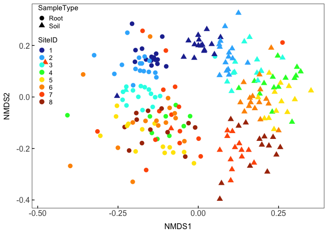
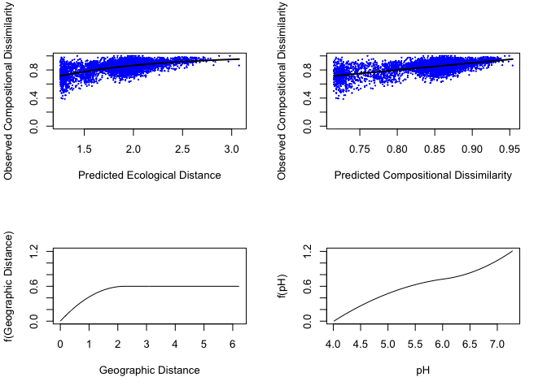

Redwood fungal ecology
================
Claire Willing
5/14/2020

Bioinfomatic steps in ampTK \#\#Pre-processing reads; allowing for
custum seq primers (spacers, etc) amptk illumina -i unzipped -o
Redwoodfunginew -f AACTTTYRRCAAYGGATCWCT -r AGCCTCCGCTTATTGATATGCTTAART
–require\_primer off –rescue\_forward off –primer\_mismatch 6

\#\#Clustering data; 2 errors in alignment allowed (longer seq length);
default of 97% similarity amptk cluster -i Redwoodfunginew.demux.fq.gz
-e 1.0 -o Redwoodfunginew

\#\#Filter table based on what is in negative controls amptk filter -i
Redwoodfunginew.otu\_table.txt -f Redwoodfunginew.cluster.otus.fa -p
0.005 -d –negatives ControlSynMockBuffer ControlPCR1
ControlExtractionBuffer ControlPCR2 ControlPCR3 ControlPCR4 ControlPCR5

\#\#Post clustering LULU (used for structures) amptk lulu -i
Structures2.final.txt -f Structures2.filtered.otus.fa -o Structures2

\#\#Assign taxonomy (used ITS database) amptk taxonomy -f
Redwoodfunginew.cluster.otus.fa -i Redwoodfunginew.otu\_table.txt -m
Redwoodfunginew.mapping\_file.txt -d ITS -o Redwoodfunginew

Reading in my OTU table (phyloseq)

``` r
#setwd("~/Dropbox/Research/Thesis_Ch1/Data/CleanData")
#CN=read.csv("CNData_Cleaned.csv", header=T)
    #Calculate CN ratio
    #CNratio=PercentC/PercentN
    ##Append to table
    #CNall<-cbind.data.frame(CNratio, CN)
#attach(CNall)
#Soilread1=read.csv("OtherSoilDataClean.csv", header=T)
#attach(Soilread1)
#Combine all soil data into one dataframe
#merging both datasets
#Soildata<-full_join(Soilread1, CNall)
##mapfile
#METAdata=read.table("MID_Meta.txt", header = T)
#    Soildata$SiteID<-as.character(Soildata$SiteID)
#    Soildata$Treenum<-as.character(Soildata$Treenum)
    
#METAfull=full_join(METAdata, Soildata)
##Created a new file with full metadata (couldn't script this because of phyloseq)
#write.csv(METAfull, file = "MIDMETA_complete.csv")
##biom file and map file
setwd("~/Dropbox/Research/Thesis_Ch1/Data/CleanData")
biom_file="Redwoodfungibiogeo.biom"
map_file="MIDMETA_complete.txt"
biomot=import_biom(biom_file, parseFunction=parse_taxonomy_greengenes)
META=import_qiime_sample_data(map_file)
##Rhizonode data
setwd("~/Dropbox/Research/Thesis_Ch1/Data/CleanData")
biom_file2="RvS_Big.biom"
map_file2="RvsS_META.txt"
biomot2=import_biom(biom_file2, parseFunction=parse_taxonomy_greengenes)
META2=import_qiime_sample_data(map_file2)
META2$Treenum<-as.character(META2$Treenum)
```

Creating phyloseq objects and merging OTU with meta data and removing
plant reads

``` r
##merging OTU and metadata
Redwoodfungi=merge_phyloseq(biomot, META)
Structures=merge_phyloseq(biomot2, META2)
##Remove plant reads
Redwoodfungi<-subset_taxa(Redwoodfungi, Kingdom=="Fungi")
#Redwoodplant<-subset_taxa(Redwoodfungi, Kingdom=="Plantae")
Structures<-subset_taxa(Structures, Kingdom=="Fungi")
##Gather only samples (already parameterized OTU with negative controls in phyloseq)
MID<-subset_samples(Redwoodfungi, Samp=="Sample")
Structures<-subset_samples(Structures, SiteID=="8")
```

Rarefaction curves

``` r
MIDtable<-otu_table(MID)
Structuretable<-otu_table(Structures)
rarecurve(MIDtable, step = 50, col = "blue", label = F)
```

    ## empty rows removed

<!-- -->

``` r
rarecurve(Structuretable, step = 20, col = "blue", label=F)
```

    ## empty rows removed

<!-- -->
Rarification

``` r
set.seed(5)
#RARE=rarefy_even_depth(MID, sample.size = 1000)
#save(RARE, file = "RARE.rda")
setwd("~/Dropbox/Research/Thesis_Ch1/Data/R")
load(file = "RARE.rda")
set.seed(5)
#RAREstructure=rarefy_even_depth(Structures, sample.size = 2000)
#setwd("~/Dropbox/Research/Thesis_Ch1/Data/R")
#save(RAREstructure, file = "RAREstructure.rda")
setwd("~/Dropbox/Research/Thesis_Ch1/Data/R")
load(file = "RAREstructure.rda")
```

Subsetting samples by sample type

``` r
##subset by sample type
Roots<-subset_samples(RARE, SampleType=="Root")
Soils<-subset_samples(RARE, SampleType=="Soil")
Glom<-subset_taxa(RARE, Phylum=="Glomeromycota")
Glomroot<-subset_samples(Glom, SampleType=="Root")
Glomsoil<-subset_samples(Glom, SampleType=="Soil")
```

Ordination (NMDS) using default of bray for distance (bray is default
method for ordinate function)

``` r
ORDtotalvals<-ordinate(RARE, "NMDS")
```

    ## Square root transformation
    ## Wisconsin double standardization
    ## Run 0 stress 0.2630447 
    ## Run 1 stress 0.2629722 
    ## ... New best solution
    ## ... Procrustes: rmse 0.01260294  max resid 0.1375316 
    ## Run 2 stress 0.2677977 
    ## Run 3 stress 0.2631141 
    ## ... Procrustes: rmse 0.01344245  max resid 0.1371982 
    ## Run 4 stress 0.262065 
    ## ... New best solution
    ## ... Procrustes: rmse 0.008830369  max resid 0.1318373 
    ## Run 5 stress 0.2624022 
    ## ... Procrustes: rmse 0.005953505  max resid 0.08733367 
    ## Run 6 stress 0.2694219 
    ## Run 7 stress 0.2708438 
    ## Run 8 stress 0.2662769 
    ## Run 9 stress 0.2621283 
    ## ... Procrustes: rmse 0.003455978  max resid 0.04798084 
    ## Run 10 stress 0.2620935 
    ## ... Procrustes: rmse 0.001923852  max resid 0.02417719 
    ## Run 11 stress 0.2635326 
    ## Run 12 stress 0.2644428 
    ## Run 13 stress 0.2630357 
    ## Run 14 stress 0.2639613 
    ## Run 15 stress 0.2643654 
    ## Run 16 stress 0.2630303 
    ## Run 17 stress 0.2640225 
    ## Run 18 stress 0.2635902 
    ## Run 19 stress 0.2639126 
    ## Run 20 stress 0.2644348 
    ## *** No convergence -- monoMDS stopping criteria:
    ##     20: stress ratio > sratmax

``` r
ORD<-plot_ordination(RARE, ORDtotalvals, color = "SiteID", shape = "SampleType")+ geom_point(size=3)+
  Publicationcolors()+
  theme(
        text = element_text(),
        panel.background = element_rect(fill="transparent", colour = NA),
        plot.background = element_rect(fill="transparent",colour = NA),
        panel.border = element_rect(fill="transparent", colour = "black"),
        axis.title.y = element_text(angle=90, size = 12, margin = margin(r=3, unit = "mm")),
        axis.title.x = element_text(size=12, margin = margin(t=3, unit = "mm")),
        axis.text.x = element_text(size=12, margin = unit(c(t = 2.5, r = 0, b = 0, l = 0), "mm")),
        axis.text.y = element_text(size=12, margin = unit(c(t = 0, r = 2.5, b = 0, l = 0), "mm")),
        axis.line = element_blank(),
        axis.ticks.x = element_line(colour = "black"),
        axis.ticks.y = element_line(colour = "black"),
        axis.ticks.length=unit(-1.4, "mm"), 
        panel.grid.major = element_blank(),
        panel.grid.minor = element_blank(),
        legend.key = element_rect(fill="transparent", colour = NA),
        legend.position =c(0.09,0.75),
        legend.key.size= unit(4, "mm"),
        legend.text = element_text(size =10),
        legend.spacing = unit(0, "mm"),
        legend.background = element_rect(fill = "transparent", colour = NA),
        plot.margin=margin(t=2, r=2, b=2, l=2, unit = "mm"),
        strip.background=element_rect(fill="transparent", colour=NA),
        strip.text = element_text(face="bold"))
ORD
```

<!-- -->

``` r
##subset climatic variables for the ones that I want to use
#DATA=dplyr::select(df, pH)
##fit environmental variables
#df<-as(sample_data(RARE), "data.frame")
#ef=envfit(ORDtotalvals, DATA, permutations = 999)
#variablefit<-plot(ef, p.max=0.1)
#arrow<-ef$vectors$arrows
#arrow<-as.data.frame(arrow)
#arrow$var <- row.names(arrow)
#samples <- as.data.frame(ORDtotalvals$points)
#samples$SampleUnique <- row.names(samples)
#samples <- full_join(samples, df)
#scale <- 0.25
#BRAY<-ggplot() +
#  geom_point(data=samples, 
#             aes(MDS1, MDS2, color=SiteID, shape=SampleType, size=1.2))+
#  geom_segment(data=arrow, aes(x = 0, y=0, xend=NMDS1*scale, yend=NMDS2*scale),
#               arrow=grid::arrow(angle=15, type="closed", length=unit(.1, "inches"))) +
#  geom_text(data=arrow, aes(NMDS1*scale*1.1, NMDS2*scale*1.1, label=var))
#grid.arrange(BRAY+mytheme2()+Publicationcolors())
##For supplement (by jaccard)
ORDtotalvalsjacc<-ordinate(RARE, "PCoA", distance = "jaccard")
set.seed(33)
ORDjacc<-plot_ordination(RARE, ORDtotalvalsjacc, color = "SiteID", shape = "SampleType")+ geom_point(size=3)+
  Publicationcolors()+
  theme(
        text = element_text(),
        panel.background = element_rect(fill="transparent", colour = NA),
        plot.background = element_rect(fill="transparent",colour = NA),
        panel.border = element_rect(fill="transparent", colour = "black"),
        axis.title.y = element_text(angle=90, size = 12, margin = margin(r=3, unit = "mm")),
        axis.title.x = element_text(size=12, margin = margin(t=3, unit = "mm")),
        axis.text.x = element_text(size=12, margin = unit(c(t = 2.5, r = 0, b = 0, l = 0), "mm")),
        axis.text.y = element_text(size=12, margin = unit(c(t = 0, r = 2.5, b = 0, l = 0), "mm")),
        axis.line = element_blank(),
        axis.ticks.x = element_line(colour = "black"),
        axis.ticks.y = element_line(colour = "black"),
        axis.ticks.length=unit(-1.4, "mm"), 
        panel.grid.major = element_blank(),
        panel.grid.minor = element_blank(),
        legend.key = element_rect(fill="transparent", colour = NA),
        legend.position =c(0.09,0.75),
        legend.key.size= unit(4, "mm"),
        legend.text = element_text(size =10),
        legend.spacing = unit(0, "mm"),
        legend.background = element_rect(fill = "transparent", colour = NA),
        plot.margin=margin(t=2, r=2, b=2, l=2, unit = "mm"),
        strip.background=element_rect(fill="transparent", colour=NA),
        strip.text = element_text(face="bold"))
##Rootstructures
set.seed(33)
ORDStructure<-ordinate(RAREstructure, "NMDS")
```

    ## Square root transformation
    ## Wisconsin double standardization
    ## Run 0 stress 0.237017 
    ## Run 1 stress 0.2423269 
    ## Run 2 stress 0.2354958 
    ## ... New best solution
    ## ... Procrustes: rmse 0.02899639  max resid 0.1488729 
    ## Run 3 stress 0.2385676 
    ## Run 4 stress 0.2458852 
    ## Run 5 stress 0.2385168 
    ## Run 6 stress 0.2426885 
    ## Run 7 stress 0.2529933 
    ## Run 8 stress 0.2385328 
    ## Run 9 stress 0.235516 
    ## ... Procrustes: rmse 0.007074254  max resid 0.05508447 
    ## Run 10 stress 0.245618 
    ## Run 11 stress 0.2448252 
    ## Run 12 stress 0.2521357 
    ## Run 13 stress 0.2483469 
    ## Run 14 stress 0.2369083 
    ## Run 15 stress 0.2386885 
    ## Run 16 stress 0.2563033 
    ## Run 17 stress 0.2420008 
    ## Run 18 stress 0.2514619 
    ## Run 19 stress 0.245469 
    ## Run 20 stress 0.2363951 
    ## *** No convergence -- monoMDS stopping criteria:
    ##     20: stress ratio > sratmax

``` r
ORDStructureplot<-plot_ordination(RAREstructure, ORDStructure, color = "SampleType")+ geom_point(size=3)+
  Publicationcolors()+
  theme(
        text = element_text(),
        panel.background = element_rect(fill="transparent", colour = NA),
        plot.background = element_rect(fill="transparent",colour = NA),
        panel.border = element_rect(fill="transparent", colour = "black"),
        axis.title.y = element_text(angle=90, size = 12, margin = margin(r=3, unit = "mm")),
        axis.title.x = element_text(size=12, margin = margin(t=3, unit = "mm")),
        axis.text.x = element_text(size=12, margin = unit(c(t = 2.5, r = 0, b = 0, l = 0), "mm")),
        axis.text.y = element_text(size=12, margin = unit(c(t = 0, r = 2.5, b = 0, l = 0), "mm")),
        axis.line = element_blank(),
        axis.ticks.x = element_line(colour = "black"),
        axis.ticks.y = element_line(colour = "black"),
        axis.ticks.length=unit(-1.4, "mm"), 
        panel.grid.major = element_blank(),
        panel.grid.minor = element_blank(),
        legend.key = element_rect(fill="transparent", colour = NA),
        legend.position =c(0.09,0.75),
        legend.key.size= unit(4, "mm"),
        legend.text = element_text(size =10),
        legend.spacing = unit(0, "mm"),
        legend.background = element_rect(fill = "transparent", colour = NA),
        plot.margin=margin(t=2, r=2, b=2, l=2, unit = "mm"),
        strip.background=element_rect(fill="transparent", colour=NA),
        strip.text = element_text(face="bold"))
ORDStructureplot
```

<!-- -->

Adonis test; vegan

``` r
RootsRARE<-subset_samples(RARE, SampleType=="Root")
SoilsRARE<-subset_samples(RARE, SampleType=="Soil")
##Extracting spp counts to a transposed dataframe
FUNGIdf<-t(as.data.frame(as(otu_table(RARE), "matrix")))
Rootdf<-t(as.data.frame(as(otu_table(RootsRARE), "matrix")))
Soildf<-t(as.data.frame(as(otu_table(SoilsRARE), "matrix")))
Structuresdf<-t(as.data.frame(as(otu_table(RAREstructure), "matrix")))
##Extracting Metadata    
Fdf<-(as(sample_data(RARE), "data.frame")) 
Rdf<-as(sample_data(RootsRARE), "data.frame")
Sdf<-as(sample_data(SoilsRARE),"data.frame")
Strucdf<-as(sample_data(RAREstructure),"data.frame")
##Variance in total, root, and soil fungal comm. across sites
##This is accounting for the nested design; tree num is nested within Site 
adonis(FUNGIdf ~ SiteID*SampleType, data=Fdf, strata = Fdf$Treenum, perm=1e3)
```

    ## 
    ## Call:
    ## adonis(formula = FUNGIdf ~ SiteID * SampleType, data = Fdf, permutations = 1000,      strata = Fdf$Treenum) 
    ## 
    ## Blocks:  strata 
    ## Permutation: free
    ## Number of permutations: 1000
    ## 
    ## Terms added sequentially (first to last)
    ## 
    ##                    Df SumsOfSqs MeanSqs F.Model      R2   Pr(>F)    
    ## SiteID              7    12.361  1.7659  5.4014 0.12423 0.000999 ***
    ## SampleType          1     9.347  9.3467 28.5891 0.09394 0.000999 ***
    ## SiteID:SampleType   7     8.157  1.1653  3.5644 0.08198 0.000999 ***
    ## Residuals         213    69.636  0.3269         0.69985             
    ## Total             228    99.501                 1.00000             
    ## ---
    ## Signif. codes:  0 '***' 0.001 '**' 0.01 '*' 0.05 '.' 0.1 ' ' 1

``` r
##Are structures sig different from root sample from which they are collected?
adonis(Structuresdf~SampleType, data=Strucdf, perm=1e3)
```

    ## 
    ## Call:
    ## adonis(formula = Structuresdf ~ SampleType, data = Strucdf, permutations = 1000) 
    ## 
    ## Permutation: free
    ## Number of permutations: 1000
    ## 
    ## Terms added sequentially (first to last)
    ## 
    ##            Df SumsOfSqs MeanSqs F.Model      R2   Pr(>F)    
    ## SampleType  2    4.3491 2.17454  6.2216 0.15663 0.000999 ***
    ## Residuals  67   23.4173 0.34951         0.84337             
    ## Total      69   27.7664                 1.00000             
    ## ---
    ## Signif. codes:  0 '***' 0.001 '**' 0.01 '*' 0.05 '.' 0.1 ' ' 1

``` r
#How much variance does site of collection explain in root+rhizonodes 
adonis(Structuresdf~SampleType+Treenum, data = Strucdf, permutations = 1e3)
```

    ## 
    ## Call:
    ## adonis(formula = Structuresdf ~ SampleType + Treenum, data = Strucdf,      permutations = 1000) 
    ## 
    ## Permutation: free
    ## Number of permutations: 1000
    ## 
    ## Terms added sequentially (first to last)
    ## 
    ##            Df SumsOfSqs MeanSqs F.Model      R2   Pr(>F)    
    ## SampleType  2    4.3491 2.17454  6.9760 0.15663 0.000999 ***
    ## Treenum     5    4.0910 0.81820  2.6248 0.14734 0.000999 ***
    ## Residuals  62   19.3264 0.31172         0.69603             
    ## Total      69   27.7664                 1.00000             
    ## ---
    ## Signif. codes:  0 '***' 0.001 '**' 0.01 '*' 0.05 '.' 0.1 ' ' 1

``` r
library(pairwiseAdonis)
```

    ## Loading required package: cluster

``` r
pairwise.adonis2(Structuresdf ~ SampleType+Treenum, data = Strucdf)
```

    ## $parent_call
    ## [1] "Structuresdf ~ SampleType + Treenum , strata = Null"
    ## 
    ## $Rhizonode_vs_Root
    ## Permutation: free
    ## Number of permutations: 999
    ## 
    ## Terms added sequentially (first to last)
    ## 
    ##            Df SumsOfSqs MeanSqs F.Model      R2 Pr(>F)    
    ## SampleType  1    0.7797 0.77972  2.5025 0.04778  0.002 ** 
    ## Treenum     5    3.3867 0.67734  2.1739 0.20754  0.001 ***
    ## Residuals  39   12.1516 0.31158         0.74467           
    ## Total      45   16.3180                 1.00000           
    ## ---
    ## Signif. codes:  0 '***' 0.001 '**' 0.01 '*' 0.05 '.' 0.1 ' ' 1
    ## 
    ## $Rhizonode_vs_Soil
    ## Permutation: free
    ## Number of permutations: 999
    ## 
    ## Terms added sequentially (first to last)
    ## 
    ##            Df SumsOfSqs MeanSqs F.Model      R2 Pr(>F)    
    ## SampleType  1    2.8455 2.84555  9.2264 0.15079  0.001 ***
    ## Treenum     5    3.3801 0.67603  2.1920 0.17912  0.001 ***
    ## Residuals  41   12.6449 0.30841         0.67009           
    ## Total      47   18.8706                 1.00000           
    ## ---
    ## Signif. codes:  0 '***' 0.001 '**' 0.01 '*' 0.05 '.' 0.1 ' ' 1
    ## 
    ## $Root_vs_Soil
    ## Permutation: free
    ## Number of permutations: 999
    ## 
    ## Terms added sequentially (first to last)
    ## 
    ##            Df SumsOfSqs MeanSqs F.Model      R2 Pr(>F)    
    ## SampleType  1    2.8692 2.86917  8.9605 0.15816  0.001 ***
    ## Treenum     5    2.7834 0.55667  1.7385 0.15343  0.001 ***
    ## Residuals  39   12.4879 0.32020         0.68840           
    ## Total      45   18.1405                 1.00000           
    ## ---
    ## Signif. codes:  0 '***' 0.001 '**' 0.01 '*' 0.05 '.' 0.1 ' ' 1
    ## 
    ## attr(,"class")
    ## [1] "pwadstrata" "list"

Bar charts

``` r
Top100= names(sort(taxa_sums(RARE), TRUE)[1:100])
Top100=prune_taxa(Top100, RARE)
Top100_Site1<-subset_samples(Top100, SiteID=="1")
Top100_Site2<-subset_samples(Top100, SiteID=="2")
Top100_Site3<-subset_samples(Top100, SiteID=="3")
Top100_Site4<-subset_samples(Top100, SiteID=="4")
Top100_Site5<-subset_samples(Top100, SiteID=="5")
Top100_Site6<-subset_samples(Top100, SiteID=="6")
Top100_Site7<-subset_samples(Top100, SiteID=="7")
Top100_Site8<-subset_samples(Top100, SiteID=="8")
Site1root<- subset_samples(Top100_Site1, SampleType=="Root")
Site1soil<-subset_samples(Top100_Site1, SampleType=="Soil")
Site2root<- subset_samples(Top100_Site2, SampleType=="Root")
Site2soil<-subset_samples(Top100_Site2, SampleType=="Soil")
Site3root<- subset_samples(Top100_Site3, SampleType=="Root")
Site3soil<-subset_samples(Top100_Site3, SampleType=="Soil")
Site4root<- subset_samples(Top100_Site4, SampleType=="Root")
Site4soil<-subset_samples(Top100_Site4, SampleType=="Soil")
Site5root<- subset_samples(Top100_Site5, SampleType=="Root")
Site5soil<-subset_samples(Top100_Site5, SampleType=="Soil")
Site6root<- subset_samples(Top100_Site6, SampleType=="Root")
Site6soil<-subset_samples(Top100_Site6, SampleType=="Soil")
Site7root<- subset_samples(Top100_Site7, SampleType=="Root")
Site7soil<-subset_samples(Top100_Site7, SampleType=="Soil")
Site8root<- subset_samples(Top100_Site8, SampleType=="Root")
Site8soil<-subset_samples(Top100_Site8, SampleType=="Soil")
Site1root <- Site1root %>%
  psmelt() %>%                                       
  arrange(Phylum) 
Site1soil <- Site1soil %>%
  psmelt() %>%                                       
  arrange(Phylum) 
Site2root <- Site2root %>%
  psmelt() %>%                                       
  arrange(Phylum) 
Site2soil <- Site2soil %>%
  psmelt() %>%                                       
  arrange(Phylum) 
Site3root <- Site3root %>%
  psmelt() %>%                                       
  arrange(Phylum) 
Site3soil <- Site3soil %>%
  psmelt() %>%                                       
  arrange(Phylum) 
Site4root <- Site4root %>%
  psmelt() %>%                                       
  arrange(Phylum) 
Site4soil <- Site4soil %>%
  psmelt() %>%                                       
  arrange(Phylum) 
Site5root <- Site5root %>%
  psmelt() %>%                                       
  arrange(Phylum) 
Site5soil <- Site5soil %>%
  psmelt() %>%                                       
  arrange(Phylum) 
Site6root <- Site6root %>%
  psmelt() %>%                                       
  arrange(Phylum) 
Site6soil <- Site6soil %>%
  psmelt() %>%                                       
  arrange(Phylum) 
Site7root <- Site7root %>%
  psmelt() %>%                                       
  arrange(Phylum) 
Site7soil <- Site7soil %>%
  psmelt() %>%                                       
  arrange(Phylum) 
Site8root <- Site8root %>%
  psmelt() %>%                                       
  arrange(Phylum) 
Site8soil <- Site8soil %>%
  psmelt() %>%                                       
  arrange(Phylum) 
Site1root$SampleType <- "Root"
Site1soil$SampleType <- "Soil"
Site2root$SampleType <- "Root"
Site2soil$SampleType <- "Soil"
Site3root$SampleType <- "Root"
Site3soil$SampleType <- "Soil"
Site4root$SampleType <- "Root"
Site4soil$SampleType <- "Soil"
Site5root$SampleType <- "Root"
Site5soil$SampleType <- "Soil"
Site6root$SampleType <- "Root"
Site6soil$SampleType <- "Soil"
Site7root$SampleType <- "Root"
Site7soil$SampleType <- "Soil"
Site8root$SampleType <- "Root"
Site8soil$SampleType <- "Soil"
Site1root$SiteID <- "1"
Site1soil$SiteID <- "1"
Site2root$SiteID <- "2"
Site2soil$SiteID <- "2"
Site3root$SiteID <- "3"
Site3soil$SiteID <- "3"
Site4root$SiteID <- "4"
Site4soil$SiteID <- "4"
Site5root$SiteID <- "5"
Site5soil$SiteID <- "5"
Site6root$SiteID <- "6"
Site6soil$SiteID <- "6"
Site7root$SiteID <- "7"
Site7soil$SiteID <- "7"
Site8root$SiteID <- "8"
Site8soil$SiteID <- "8"
barcolors= c(Agaricales="#2F4236", Atheliales ="#9F993D", Boletales="#576A00", Chaetothyriales="#560d0d", Eurotiales="#896c39", Geastrales="#6f0000", Geoglossales="#934D4B", Gomphales="#8D2D56", Helotiales="#2B193E", Hypocreales="#fdbe02",Hysterangiales="#0F7E94",Mortierellales="#487ABC",Mucorales="#55A049",Mytilinidales="#203453",Pezizales="#40318D", Pleosporales="#136207", Polyporales="#c9ffe5", Russulales="#e77797", Sordariales="#67B6BD", Thelebolales="#fdfd96", Thelephorales="#BFCE72", Trechisporales="#babed4", Venturiales="#383838")
##join all sets
bars_all<- rbind(Site1root, Site1soil,Site2root, Site2soil, Site3root, Site3soil, Site4root, Site4soil,
                 Site5root, Site5soil, Site6root, Site6soil, Site7root, Site7soil, Site8root, Site8soil)
##plot
barplot<-ggplot(data = filter(bars_all), aes(SiteID, Abundance, fill = Order )) +
  facet_wrap(~SampleType,scales="free_x", ncol = 1, strip.position = "right") +
  geom_bar(stat = "identity", position = position_fill(), linetype=2) +
  guides(fill = guide_legend(ncol = 1))+
  scale_fill_manual(values = barcolors, na.value="#E8E8E8", labels=c("Agaricales", "Atheliales", "Boletales","Chaetothyriales", "Eurotiales", "Geastrales", "Geoglossales", "Gomphales", "Helotiales", "Hypocreales","Hysterangiales","Mortierellales","Mucorales","Mytilinidales","Pezizales", "Pleosporales", "Polyporales", "Russulales", "Sordariales", "Thelebolales", "Thelephorales", "Trechisporales", "Venturiales", "Unassigned"), name="Fungal Order")+ 
            scale_y_continuous("Relative abundance")+
            xlab("Site ID")+
            theme(
            text = element_text(family = "Helvetica"),
            panel.background = element_rect(fill="transparent", colour = NA),
            plot.background = element_rect(fill="transparent",colour = NA),
            strip.background.x=element_rect(fill="LightGray",colour = NA),
            strip.background.y=element_rect(fill="LightGray",colour = NA),
            panel.border = element_rect(fill="transparent", colour = "black"),
            axis.title.y = element_text(angle=90, size = 14, margin = margin(r=3, unit = "mm")),
            axis.title.x = element_text(size=12, margin = margin(t=3, unit = "mm")),
            axis.text.x = element_text(angle=0, size=14, 
                                       margin = unit(c(t = 2.5, r = 0, b = 0, l = 0), "mm")),
            axis.text.y = element_text(size=14, margin = unit(c(t = 0, r = 2.5, b = 0, l = 0), "mm")),
            axis.line = element_blank(),
            axis.ticks.x = element_blank(),
            axis.ticks.y = element_line(colour = "black"),
            axis.ticks.length=unit(-1.4, "mm"), 
            panel.grid.major = element_blank(),
            panel.grid.minor = element_blank(),
            legend.key = element_rect(fill="transparent", colour = NA),
            legend.box = "horizontal",
            legend.key.size= unit(4, "mm"),
            legend.text = element_text(size =11),
            legend.spacing = unit(0, "mm"),
            legend.background = element_rect(fill = "transparent", colour = NA),
            plot.margin=margin(t=2, r=2, b=2, l=2, unit = "mm"),
            strip.background=element_rect(fill="transparent", colour=NA),
            strip.text = element_text(face="bold"))
```

Rhizonode taxa (all fungi)

``` r
Top500rhizo= names(sort(taxa_sums(RAREstructure), TRUE)[1:500])
Top500rhizo=prune_taxa(Top500rhizo, RAREstructure)
RootsRhiz<-subset_samples(Top500rhizo, SampleType=="Rhizonode")
RootsRoot<-subset_samples(Top500rhizo, SampleType=="Root")
RootsSoils<-subset_samples(Top500rhizo, SampleType=="Soil")
RhizoT1<-subset_samples(RootsRhiz, Treenum=="1")
RhizoT2<-subset_samples(RootsRhiz, Treenum=="2")
RhizoT3<-subset_samples(RootsRhiz, Treenum=="3")
RhizoT4<-subset_samples(RootsRhiz, Treenum=="4")
RhizoT5<-subset_samples(RootsRhiz, Treenum=="5")
RhizoT6<-subset_samples(RootsRhiz, Treenum=="6")
RootT1<-subset_samples(RootsRoot, Treenum=="1")
RootT2<-subset_samples(RootsRoot, Treenum=="2")
RootT3<-subset_samples(RootsRoot, Treenum=="3")
RootT4<-subset_samples(RootsRoot, Treenum=="4")
RootT5<-subset_samples(RootsRoot, Treenum=="5")
RootT6<-subset_samples(RootsRoot, Treenum=="6")
SoilT1<-subset_samples(RootsSoils, Treenum=="1")
SoilT2<-subset_samples(RootsSoils, Treenum=="2")
SoilT3<-subset_samples(RootsSoils, Treenum=="3")
SoilT4<-subset_samples(RootsSoils, Treenum=="4")
SoilT5<-subset_samples(RootsSoils, Treenum=="5")
SoilT6<-subset_samples(RootsSoils, Treenum=="6")
RootT1 <- RootT1 %>%
  psmelt() %>%                                       
  arrange(Family) 
RootT2 <- RootT2 %>%
  psmelt() %>%                                       
  arrange(Family) 
RootT3 <- RootT3 %>%
  psmelt() %>%                                       
  arrange(Family) 
RootT4 <- RootT4 %>%
  psmelt() %>%                                       
  arrange(Family) 
RootT5 <- RootT5 %>%
  psmelt() %>%                                       
  arrange(Family) 
RootT6 <- RootT6 %>%
  psmelt() %>%                                       
  arrange(Family) 
RhizoT1 <- RhizoT1 %>%
  psmelt() %>%                                       
  arrange(Family) 
RhizoT2 <- RhizoT2 %>%
  psmelt() %>%                                       
  arrange(Family) 
RhizoT3 <- RhizoT3 %>%
  psmelt() %>%                                       
  arrange(Family) 
RhizoT4 <- RhizoT4 %>%
  psmelt() %>%                                       
  arrange(Family) 
RhizoT5 <- RhizoT5 %>%
  psmelt() %>%                                       
  arrange(Family) 
RhizoT6 <- RhizoT6 %>%
  psmelt() %>%                                       
  arrange(Family) 
SoilT1 <- SoilT1 %>%
  psmelt() %>%                                       
  arrange(Family) 
SoilT2 <- SoilT2 %>%
  psmelt() %>%                                       
  arrange(Family) 
SoilT3 <- SoilT3 %>%
  psmelt() %>%                                       
  arrange(Family) 
SoilT4 <- SoilT4 %>%
  psmelt() %>%                                       
  arrange(Family) 
SoilT5 <- SoilT5 %>%
  psmelt() %>%                                       
  arrange(Family) 
SoilT6 <- SoilT6 %>%
  psmelt() %>%                                       
  arrange(Family) 
RootT1$samptypecode <- "Root"
RootT2$samptypecode <- "Root"
RootT3$samptypecode <- "Root"
RootT4$samptypecode <- "Root"
RootT5$samptypecode <- "Root"
RootT6$samptypecode <- "Root"
RhizoT1$samptypecode <- "Rhizonode"
RhizoT2$samptypecode <- "Rhizonode"
RhizoT3$samptypecode <- "Rhizonode"
RhizoT4$samptypecode <- "Rhizonode"
RhizoT5$samptypecode <- "Rhizonode"
RhizoT6$samptypecode <- "Rhizonode"
SoilT1$samptypecode <- "Soil"
SoilT2$samptypecode <- "Soil"
SoilT3$samptypecode <- "Soil"
SoilT4$samptypecode <- "Soil"
SoilT5$samptypecode <- "Soil"
SoilT6$samptypecode <- "Soil"
RootT1$Treenumber <- "1"
RootT2$Treenumber <- "2"
RootT3$Treenumber <- "3"
RootT4$Treenumber <- "4"
RootT5$Treenumber <- "5"
RootT6$Treenumber <- "6"
RhizoT1$Treenumber <- "1"
RhizoT2$Treenumber <- "2"
RhizoT3$Treenumber <- "3"
RhizoT4$Treenumber <- "4"
RhizoT5$Treenumber <- "5"
RhizoT6$Treenumber <- "6"
SoilT1$Treenumber <- "1"
SoilT2$Treenumber <- "2"
SoilT3$Treenumber <- "3"
SoilT4$Treenumber <- "4"
SoilT5$Treenumber <- "5"
SoilT6$Treenumber <- "6"
Rhizobars<-rbind(RootT1, RootT2,RootT3, RootT4, RootT5, RootT6, SoilT1, SoilT2,SoilT3, SoilT4, SoilT5, SoilT6, RhizoT1, RhizoT2, RhizoT3, RhizoT4,RhizoT5, RhizoT6)
Rhizonodebarcolors= c(Ascomycota="#2B193E", Basidiomycota ="#2F4236", Chytridiomycota="#9F993D", Monoblepharidomycota="#800000", Glomeromycota="#fdbe02", Mortierellomycota="#487ABC", Mucoromycota="#23395d", Rozellomycota="#cc1100")
Rhizobarplot<-ggplot(data = filter(Rhizobars), aes(Treenumber, Abundance, fill = Phylum)) +
  facet_wrap(~samptypecode,scales="free_x", ncol = 1, strip.position = "right") +
  geom_bar(stat = "identity", position = position_fill()) +
  guides(fill = guide_legend(ncol = 1))+
 scale_fill_manual(values = Rhizonodebarcolors, na.value="#E8E8E8", labels=c("Ascomycota", "Basidiomycota", "Chytridiomycota", "Glomeromycota", "Monoblepharidomycota","Mortierellomycota","Mucoromycota", "Rozellomycota", "Unassigned"), name="Fungal Phylum")+ 
            scale_y_continuous("Relative abundance")+
            xlab("Tree ID")+
            theme(
            text = element_text(family = "Helvetica"),
            panel.background = element_rect(fill="transparent", colour = NA),
            plot.background = element_rect(fill="transparent",colour = NA),
            strip.background.x=element_rect(fill="LightGray",colour = NA),
            strip.background.y=element_rect(fill="LightGray",colour = NA),
            panel.border = element_rect(fill="transparent", colour = "black"),
            axis.title.y = element_text(angle=90, size = 14, margin = margin(r=3, unit = "mm")),
            axis.title.x = element_text(size=12, margin = margin(t=3, unit = "mm")),
            axis.text.x = element_text(angle=0, size=14, 
                                       margin = unit(c(t = 2.5, r = 0, b = 0, l = 0), "mm")),
            axis.text.y = element_text(size=14, margin = unit(c(t = 0, r = 2.5, b = 0, l = 0), "mm")),
            axis.line = element_blank(),
            axis.ticks.x = element_blank(),
            axis.ticks.y = element_line(colour = "black"),
            axis.ticks.length=unit(-1.4, "mm"), 
            panel.grid.major = element_blank(),
            panel.grid.minor = element_blank(),
            legend.key = element_rect(fill="transparent", colour = NA),
            legend.box = "horizontal",
            legend.key.size= unit(4, "mm"),
            legend.text = element_text(size =11),
            legend.spacing = unit(0, "mm"),
            legend.background = element_rect(fill = "transparent", colour = NA),
            plot.margin=margin(t=2, r=2, b=2, l=2, unit = "mm"),
            strip.background=element_rect(fill="transparent", colour=NA),
            strip.text = element_text(face="bold"))
```

Rhiznode AMF taxa

``` r
GlomsRootsRhiz<-subset_samples(RAREstructure, SampleType=="Rhizonode")
GlomsRootsRhiz<-subset_taxa(GlomsRootsRhiz, Phylum=="Glomeromycota")
GlomsRootsRoot<-subset_samples(RAREstructure, SampleType=="Root")
GlomsRootsRoot<-subset_taxa(GlomsRootsRoot, Phylum=="Glomeromycota")
GlomsRootsSoils<-subset_samples(RAREstructure, SampleType=="Soil")
GlomsRootsSoils<-subset_taxa(GlomsRootsSoils, Phylum=="Glomeromycota")
GlomrhizoT1<-subset_samples(GlomsRootsRhiz, Treenum=="1")
GlomrhizoT2<-subset_samples(GlomsRootsRhiz, Treenum=="2")
GlomrhizoT3<-subset_samples(GlomsRootsRhiz, Treenum=="3")
GlomrhizoT4<-subset_samples(GlomsRootsRhiz, Treenum=="4")
GlomrhizoT5<-subset_samples(GlomsRootsRhiz, Treenum=="5")
GlomrhizoT6<-subset_samples(GlomsRootsRhiz, Treenum=="6")
GlomrootT1<-subset_samples(GlomsRootsRoot, Treenum=="1")
GlomrootT2<-subset_samples(GlomsRootsRoot, Treenum=="2")
GlomrootT3<-subset_samples(GlomsRootsRoot, Treenum=="3")
GlomrootT4<-subset_samples(GlomsRootsRoot, Treenum=="4")
GlomrootT5<-subset_samples(GlomsRootsRoot, Treenum=="5")
GlomrootT6<-subset_samples(GlomsRootsRoot, Treenum=="6")
GlomsoilT1<-subset_samples(GlomsRootsSoils, Treenum=="1")
GlomsoilT2<-subset_samples(GlomsRootsSoils, Treenum=="2")
GlomsoilT3<-subset_samples(GlomsRootsSoils, Treenum=="3")
GlomsoilT4<-subset_samples(GlomsRootsSoils, Treenum=="4")
GlomsoilT5<-subset_samples(GlomsRootsSoils, Treenum=="5")
GlomsoilT6<-subset_samples(GlomsRootsSoils, Treenum=="6")
GlomrootT1 <- GlomrootT1 %>%
  psmelt() %>%                                       
  arrange(Family) 
GlomrootT2 <- GlomrootT2 %>%
  psmelt() %>%                                       
  arrange(Family) 
GlomrootT3 <- GlomrootT3 %>%
  psmelt() %>%                                       
  arrange(Family) 
GlomrootT4 <- GlomrootT4 %>%
  psmelt() %>%                                       
  arrange(Family) 
GlomrootT5 <- GlomrootT5 %>%
  psmelt() %>%                                       
  arrange(Family) 
GlomrootT6 <- GlomrootT6 %>%
  psmelt() %>%                                       
  arrange(Family) 
GlomrhizoT1 <- GlomrhizoT1 %>%
  psmelt() %>%                                       
  arrange(Family) 
GlomrhizoT2 <- GlomrhizoT2 %>%
  psmelt() %>%                                       
  arrange(Family) 
GlomrhizoT3 <- GlomrhizoT3 %>%
  psmelt() %>%                                       
  arrange(Family) 
GlomrhizoT4 <- GlomrhizoT4 %>%
  psmelt() %>%                                       
  arrange(Family) 
GlomrhizoT5 <- GlomrhizoT5 %>%
  psmelt() %>%                                       
  arrange(Family) 
GlomrhizoT6 <- GlomrhizoT6 %>%
  psmelt() %>%                                       
  arrange(Family) 
GlomsoilT1 <- GlomsoilT1 %>%
  psmelt() %>%                                       
  arrange(Family) 
GlomsoilT2 <- GlomsoilT2 %>%
  psmelt() %>%                                       
  arrange(Family) 
GlomsoilT3 <- GlomsoilT3 %>%
  psmelt() %>%                                       
  arrange(Family) 
GlomsoilT4 <- GlomsoilT4 %>%
  psmelt() %>%                                       
  arrange(Family) 
GlomsoilT5 <- GlomsoilT5 %>%
  psmelt() %>%                                       
  arrange(Family) 
GlomsoilT6 <- GlomsoilT6 %>%
  psmelt() %>%                                       
  arrange(Family) 
GlomrootT1$samptypecode <- "Root"
GlomrootT2$samptypecode <- "Root"
GlomrootT3$samptypecode <- "Root"
GlomrootT4$samptypecode <- "Root"
GlomrootT5$samptypecode <- "Root"
GlomrootT6$samptypecode <- "Root"
GlomrhizoT1$samptypecode <- "Rhizonode"
GlomrhizoT2$samptypecode <- "Rhizonode"
GlomrhizoT3$samptypecode <- "Rhizonode"
GlomrhizoT4$samptypecode <- "Rhizonode"
GlomrhizoT5$samptypecode <- "Rhizonode"
GlomrhizoT6$samptypecode <- "Rhizonode"
GlomsoilT1$samptypecode <- "Soil"
GlomsoilT2$samptypecode <- "Soil"
GlomsoilT3$samptypecode <- "Soil"
GlomsoilT4$samptypecode <- "Soil"
GlomsoilT5$samptypecode <- "Soil"
GlomsoilT6$samptypecode <- "Soil"
GlomrootT1$Treenumber <- "1"
GlomrootT2$Treenumber <- "2"
GlomrootT3$Treenumber <- "3"
GlomrootT4$Treenumber <- "4"
GlomrootT5$Treenumber <- "5"
GlomrootT6$Treenumber <- "6"
GlomrhizoT1$Treenumber <- "1"
GlomrhizoT2$Treenumber <- "2"
GlomrhizoT3$Treenumber <- "3"
GlomrhizoT4$Treenumber <- "4"
GlomrhizoT5$Treenumber <- "5"
GlomrhizoT6$Treenumber <- "6"
GlomsoilT1$Treenumber <- "1"
GlomsoilT2$Treenumber <- "2"
GlomsoilT3$Treenumber <- "3"
GlomsoilT4$Treenumber <- "4"
GlomsoilT5$Treenumber <- "5"
GlomsoilT6$Treenumber <- "6"
Glombars<-rbind(GlomrootT1, GlomrootT2,GlomrootT3, GlomrootT4, GlomrootT5, GlomrootT6, GlomsoilT1, GlomsoilT2,GlomsoilT3, GlomsoilT4, GlomsoilT5, GlomsoilT6, GlomrhizoT1, GlomrhizoT2, GlomrhizoT3, GlomrhizoT4,GlomrhizoT5, GlomrhizoT6)
AMbarcolors= c(Acaulosporaceae="#2B193E", Ambisporaceae ="#9F993D", Archaeosporaceae="#576A00", Claroideoglomeraceae="#487ABC", Diversisporaceae="#fdbe02", Glomeraceae="#2F4236")
Glombarplot<-ggplot(data = filter(Glombars), aes(Treenumber, Abundance, fill = Family)) +
  facet_wrap(~samptypecode,scales="free_x", ncol = 1, strip.position = "right") +
  geom_bar(stat = "identity", position = position_fill()) +
  guides(fill = guide_legend(ncol = 1))+
  scale_fill_manual(values = AMbarcolors, na.value="#E8E8E8", labels=c("Acaulosporaceae", "Ambisporaceae","Archaeosporaceae", "Claroideoglomeraceae", "Diversisporaceae", "Glomeraceae", "Unassigned"), name="AMF Family")+ 
            scale_y_continuous("Relative abundance")+
            xlab("Tree ID")+
            theme(
            text = element_text(family = "Helvetica"),
            panel.background = element_rect(fill="transparent", colour = NA),
            plot.background = element_rect(fill="transparent",colour = NA),
            strip.background.x=element_rect(fill="LightGray",colour = NA),
            strip.background.y=element_rect(fill="LightGray",colour = NA),
            panel.border = element_rect(fill="transparent", colour = "black"),
            axis.title.y = element_text(angle=90, size = 14, margin = margin(r=3, unit = "mm")),
            axis.title.x = element_text(size=12, margin = margin(t=3, unit = "mm")),
            axis.text.x = element_text(angle=0, size=14, 
                                       margin = unit(c(t = 2.5, r = 0, b = 0, l = 0), "mm")),
            axis.text.y = element_text(size=14, margin = unit(c(t = 0, r = 2.5, b = 0, l = 0), "mm")),
            axis.line = element_blank(),
            axis.ticks.x = element_blank(),
            axis.ticks.y = element_line(colour = "black"),
            axis.ticks.length=unit(-1.4, "mm"), 
            panel.grid.major = element_blank(),
            panel.grid.minor = element_blank(),
            legend.key = element_rect(fill="transparent", colour = NA),
            legend.box = "horizontal",
            legend.key.size= unit(4, "mm"),
            legend.text = element_text(size =11),
            legend.spacing = unit(0, "mm"),
            legend.background = element_rect(fill = "transparent", colour = NA),
            plot.margin=margin(t=2, r=2, b=2, l=2, unit = "mm"),
            strip.background=element_rect(fill="transparent", colour=NA),
            strip.text = element_text(face="bold"))
```

GDM Step 1: OTU Data for GDM

``` r
library(raster)
library(sp)
library(plyr)
##Calculating k (decomp coeff)
setwd("~/Dropbox/Research/Thesis_Ch1/Data/CleanData")
redwoodsites<-read.table("MIDMETA_complete.txt", header = T, sep="", dec=".")
redwoodsitesroots<-dplyr::filter(redwoodsites, SampleType=="Root")
redwoodsitessoils<-dplyr::filter(redwoodsites, SampleType=="Soil")
clim <- raster::getData('worldclim', download = TRUE, var = 'bio', res = 10)
clim.ca=raster::crop(clim,c(-125,-118,34,45))
coordsroots<-data.frame(redwoodsitesroots$Longitude, redwoodsitesroots$Latitude)
coordssoils<-data.frame(redwoodsitessoils$Longitude, redwoodsitessoils$Latitude)
climr<-clim.ca[[c(10, 18)]]
points <- SpatialPoints(coordsroots, proj4string=climr@crs)
values<-extract(climr, points)
SiteNum<-redwoodsitesroots$SiteID
df<-cbind.data.frame(coordinates(points), values, SiteNum)
df
```

    ##     redwoodsitesroots.Longitude redwoodsitesroots.Latitude bio10 bio18 SiteNum
    ## 1                     -124.1131                   41.77106   154    83       1
    ## 2                     -124.1131                   41.77106   154    83       1
    ## 3                     -124.1131                   41.77106   154    83       1
    ## 4                     -124.1131                   41.77106   154    83       1
    ## 5                     -124.1127                   41.77064   154    83       1
    ## 6                     -124.1127                   41.77064   154    83       1
    ## 7                     -124.1127                   41.77064   154    83       1
    ## 8                     -124.1127                   41.77064   154    83       1
    ## 9                     -124.1133                   41.77064   154    83       1
    ## 10                    -124.1133                   41.77064   154    83       1
    ## 11                    -124.1133                   41.77064   154    83       1
    ## 12                    -124.1133                   41.77064   154    83       1
    ## 13                    -124.1129                   41.77114   154    83       1
    ## 14                    -124.1129                   41.77114   154    83       1
    ## 15                    -124.1129                   41.77114   154    83       1
    ## 16                    -124.1129                   41.77114   154    83       1
    ## 17                    -124.0147                   41.36808   151    73       2
    ## 18                    -124.0147                   41.36808   151    73       2
    ## 19                    -124.0147                   41.36808   151    73       2
    ## 20                    -124.0147                   41.36808   151    73       2
    ## 21                    -124.0146                   41.36803   151    73       2
    ## 22                    -124.0146                   41.36803   151    73       2
    ## 23                    -124.0146                   41.36803   151    73       2
    ## 24                    -124.0146                   41.36803   151    73       2
    ## 25                    -124.0141                   41.36808   151    73       2
    ## 26                    -124.0141                   41.36808   151    73       2
    ## 27                    -124.0141                   41.36808   151    73       2
    ## 28                    -124.0141                   41.36808   151    73       2
    ## 29                    -124.0143                   41.36786   151    73       2
    ## 30                    -124.0143                   41.36786   151    73       2
    ## 31                    -124.0143                   41.36786   151    73       2
    ## 32                    -124.0143                   41.36786   151    73       2
    ## 33                    -123.9454                   40.34222   172    49       3
    ## 34                    -123.9454                   40.34222   172    49       3
    ## 35                    -123.9454                   40.34222   172    49       3
    ## 36                    -123.9454                   40.34222   172    49       3
    ## 37                    -123.9459                   40.34186   172    49       3
    ## 38                    -123.9459                   40.34186   172    49       3
    ## 39                    -123.9459                   40.34186   172    49       3
    ## 40                    -123.9459                   40.34186   172    49       3
    ## 41                    -123.9452                   40.34203   172    49       3
    ## 42                    -123.9452                   40.34203   172    49       3
    ## 43                    -123.9452                   40.34203   172    49       3
    ## 44                    -123.9452                   40.34203   172    49       3
    ## 45                    -123.9460                   40.34178   172    49       3
    ## 46                    -123.9460                   40.34178   172    49       3
    ## 47                    -123.9460                   40.34178   172    49       3
    ## 48                    -123.9460                   40.34178   172    49       3
    ## 49                    -123.6347                   39.74247   172    45       4
    ## 50                    -123.6347                   39.74247   172    45       4
    ## 51                    -123.6347                   39.74247   172    45       4
    ## 52                    -123.6347                   39.74247   172    45       4
    ## 53                    -123.6343                   39.74200   172    45       4
    ## 54                    -123.6343                   39.74200   172    45       4
    ## 55                    -123.6343                   39.74200   172    45       4
    ## 56                    -123.6343                   39.74200   172    45       4
    ## 57                    -123.6345                   39.74200   172    45       4
    ## 58                    -123.6345                   39.74200   172    45       4
    ## 59                    -123.6345                   39.74200   172    45       4
    ## 60                    -123.6345                   39.74200   172    45       4
    ## 61                    -123.6349                   39.74244   172    45       4
    ## 62                    -123.6349                   39.74244   172    45       4
    ## 63                    -123.6349                   39.74244   172    45       4
    ## 64                    -123.6349                   39.74244   172    45       4
    ## 65                    -123.3849                   39.22911   176    31       5
    ## 66                    -123.3849                   39.22911   176    31       5
    ## 67                    -123.3849                   39.22911   176    31       5
    ## 68                    -123.3849                   39.22911   176    31       5
    ## 69                    -123.3849                   39.22869   176    31       5
    ## 70                    -123.3849                   39.22869   176    31       5
    ## 71                    -123.3849                   39.22869   176    31       5
    ## 72                    -123.3849                   39.22869   176    31       5
    ## 73                    -123.3829                   39.22808   176    31       5
    ## 74                    -123.3829                   39.22808   176    31       5
    ## 75                    -123.3829                   39.22808   176    31       5
    ## 76                    -123.3829                   39.22808   176    31       5
    ## 77                    -123.3826                   39.22800   176    31       5
    ## 78                    -123.3826                   39.22800   176    31       5
    ## 79                    -123.3826                   39.22800   176    31       5
    ## 80                    -123.3826                   39.22800   176    31       5
    ## 81                    -122.7315                   38.01444   175    18       6
    ## 82                    -122.7315                   38.01444   175    18       6
    ## 83                    -122.7315                   38.01444   175    18       6
    ## 84                    -122.7315                   38.01444   175    18       6
    ## 85                    -122.7311                   38.01503   175    18       6
    ## 86                    -122.7311                   38.01503   175    18       6
    ## 87                    -122.7311                   38.01503   175    18       6
    ## 88                    -122.7311                   38.01503   175    18       6
    ## 89                    -122.7315                   38.01528   175    18       6
    ## 90                    -122.7315                   38.01528   175    18       6
    ## 91                    -122.7315                   38.01528   175    18       6
    ## 92                    -122.7315                   38.01528   175    18       6
    ## 93                    -122.7311                   38.01503   175    18       6
    ## 94                    -122.7311                   38.01503   175    18       6
    ## 95                    -122.7311                   38.01503   175    18       6
    ## 96                    -122.7311                   38.01503   175    18       6
    ## 97                    -122.2193                   37.18586   173    15       7
    ## 98                    -122.2193                   37.18586   173    15       7
    ## 99                    -122.2193                   37.18586   173    15       7
    ## 100                   -122.2193                   37.18586   173    15       7
    ## 101                   -122.2194                   37.18608   173    15       7
    ## 102                   -122.2194                   37.18608   173    15       7
    ## 103                   -122.2194                   37.18608   173    15       7
    ## 104                   -122.2194                   37.18608   173    15       7
    ## 105                   -122.2190                   37.18567   173    15       7
    ## 106                   -122.2190                   37.18567   173    15       7
    ## 107                   -122.2190                   37.18567   173    15       7
    ## 108                   -122.2190                   37.18567   173    15       7
    ## 109                   -122.2191                   37.18586   173    15       7
    ## 110                   -122.2191                   37.18586   173    15       7
    ## 111                   -122.2191                   37.18586   173    15       7
    ## 112                   -122.2191                   37.18586   173    15       7
    ## 113                   -121.5974                   36.08236   162    14       8
    ## 114                   -121.5974                   36.08236   162    14       8
    ## 115                   -121.5974                   36.08236   162    14       8
    ## 116                   -121.5974                   36.08236   162    14       8
    ## 117                   -121.5969                   36.08197   162    14       8
    ## 118                   -121.5969                   36.08197   162    14       8
    ## 119                   -121.5969                   36.08197   162    14       8
    ## 120                   -121.5969                   36.08197   162    14       8
    ## 121                   -121.5958                   36.08156   162    14       8
    ## 122                   -121.5958                   36.08156   162    14       8
    ## 123                   -121.5958                   36.08156   162    14       8
    ## 124                   -121.5958                   36.08156   162    14       8
    ## 125                   -121.5958                   36.08150   162    14       8
    ## 126                   -121.5958                   36.08150   162    14       8
    ## 127                   -121.5958                   36.08150   162    14       8
    ## 128                   -121.5958                   36.08150   162    14       8

``` r
clims<-clim.ca[[c(10, 18)]]
pointsS <- SpatialPoints(coordssoils, proj4string=clims@crs)
values<-extract(clims, pointsS)
SiteNumS<-redwoodsitessoils$SiteID
dfS<-cbind.data.frame(coordinates(pointsS), values, SiteNumS)
dfS
```

    ##     redwoodsitessoils.Longitude redwoodsitessoils.Latitude bio10 bio18 SiteNumS
    ## 1                     -124.1131                   41.77106   154    83        1
    ## 2                     -124.1131                   41.77106   154    83        1
    ## 3                     -124.1131                   41.77106   154    83        1
    ## 4                     -124.1131                   41.77106   154    83        1
    ## 5                     -124.1127                   41.77064   154    83        1
    ## 6                     -124.1127                   41.77064   154    83        1
    ## 7                     -124.1127                   41.77064   154    83        1
    ## 8                     -124.1127                   41.77064   154    83        1
    ## 9                     -124.1133                   41.77064   154    83        1
    ## 10                    -124.1133                   41.77064   154    83        1
    ## 11                    -124.1133                   41.77064   154    83        1
    ## 12                    -124.1133                   41.77064   154    83        1
    ## 13                    -124.1129                   41.77114   154    83        1
    ## 14                    -124.1129                   41.77114   154    83        1
    ## 15                    -124.1129                   41.77114   154    83        1
    ## 16                    -124.1129                   41.77114   154    83        1
    ## 17                    -124.0147                   41.36808   151    73        2
    ## 18                    -124.0147                   41.36808   151    73        2
    ## 19                    -124.0147                   41.36808   151    73        2
    ## 20                    -124.0147                   41.36808   151    73        2
    ## 21                    -124.0146                   41.36803   151    73        2
    ## 22                    -124.0146                   41.36803   151    73        2
    ## 23                    -124.0146                   41.36803   151    73        2
    ## 24                    -124.0146                   41.36803   151    73        2
    ## 25                    -124.0141                   41.36808   151    73        2
    ## 26                    -124.0141                   41.36808   151    73        2
    ## 27                    -124.0141                   41.36808   151    73        2
    ## 28                    -124.0141                   41.36808   151    73        2
    ## 29                    -124.0143                   41.36786   151    73        2
    ## 30                    -124.0143                   41.36786   151    73        2
    ## 31                    -124.0143                   41.36786   151    73        2
    ## 32                    -124.0143                   41.36786   151    73        2
    ## 33                    -123.9454                   40.34222   172    49        3
    ## 34                    -123.9454                   40.34222   172    49        3
    ## 35                    -123.9454                   40.34222   172    49        3
    ## 36                    -123.9454                   40.34222   172    49        3
    ## 37                    -123.9459                   40.34186   172    49        3
    ## 38                    -123.9459                   40.34186   172    49        3
    ## 39                    -123.9459                   40.34186   172    49        3
    ## 40                    -123.9459                   40.34186   172    49        3
    ## 41                    -123.9452                   40.34203   172    49        3
    ## 42                    -123.9452                   40.34203   172    49        3
    ## 43                    -123.9452                   40.34203   172    49        3
    ## 44                    -123.9452                   40.34203   172    49        3
    ## 45                    -123.9460                   40.34178   172    49        3
    ## 46                    -123.9460                   40.34178   172    49        3
    ## 47                    -123.9460                   40.34178   172    49        3
    ## 48                    -123.9460                   40.34178   172    49        3
    ## 49                    -123.6347                   39.74247   172    45        4
    ## 50                    -123.6347                   39.74247   172    45        4
    ## 51                    -123.6347                   39.74247   172    45        4
    ## 52                    -123.6347                   39.74247   172    45        4
    ## 53                    -123.6343                   39.74200   172    45        4
    ## 54                    -123.6343                   39.74200   172    45        4
    ## 55                    -123.6343                   39.74200   172    45        4
    ## 56                    -123.6343                   39.74200   172    45        4
    ## 57                    -123.6345                   39.74200   172    45        4
    ## 58                    -123.6345                   39.74200   172    45        4
    ## 59                    -123.6345                   39.74200   172    45        4
    ## 60                    -123.6345                   39.74200   172    45        4
    ## 61                    -123.6349                   39.74244   172    45        4
    ## 62                    -123.6349                   39.74244   172    45        4
    ## 63                    -123.6349                   39.74244   172    45        4
    ## 64                    -123.6349                   39.74244   172    45        4
    ## 65                    -123.3849                   39.22911   176    31        5
    ## 66                    -123.3849                   39.22911   176    31        5
    ## 67                    -123.3849                   39.22911   176    31        5
    ## 68                    -123.3849                   39.22911   176    31        5
    ## 69                    -123.3849                   39.22869   176    31        5
    ## 70                    -123.3849                   39.22869   176    31        5
    ## 71                    -123.3849                   39.22869   176    31        5
    ## 72                    -123.3849                   39.22869   176    31        5
    ## 73                    -123.3829                   39.22808   176    31        5
    ## 74                    -123.3829                   39.22808   176    31        5
    ## 75                    -123.3829                   39.22808   176    31        5
    ## 76                    -123.3829                   39.22808   176    31        5
    ## 77                    -123.3826                   39.22800   176    31        5
    ## 78                    -123.3826                   39.22800   176    31        5
    ## 79                    -123.3826                   39.22800   176    31        5
    ## 80                    -123.3826                   39.22800   176    31        5
    ## 81                    -122.7315                   38.01444   175    18        6
    ## 82                    -122.7315                   38.01444   175    18        6
    ## 83                    -122.7315                   38.01444   175    18        6
    ## 84                    -122.7315                   38.01444   175    18        6
    ## 85                    -122.7311                   38.01503   175    18        6
    ## 86                    -122.7311                   38.01503   175    18        6
    ## 87                    -122.7311                   38.01503   175    18        6
    ## 88                    -122.7311                   38.01503   175    18        6
    ## 89                    -122.7315                   38.01528   175    18        6
    ## 90                    -122.7315                   38.01528   175    18        6
    ## 91                    -122.7315                   38.01528   175    18        6
    ## 92                    -122.7315                   38.01528   175    18        6
    ## 93                    -122.7311                   38.01503   175    18        6
    ## 94                    -122.7311                   38.01503   175    18        6
    ## 95                    -122.7311                   38.01503   175    18        6
    ## 96                    -122.7311                   38.01503   175    18        6
    ## 97                    -122.2193                   37.18586   173    15        7
    ## 98                    -122.2193                   37.18586   173    15        7
    ## 99                    -122.2193                   37.18586   173    15        7
    ## 100                   -122.2193                   37.18586   173    15        7
    ## 101                   -122.2194                   37.18608   173    15        7
    ## 102                   -122.2194                   37.18608   173    15        7
    ## 103                   -122.2194                   37.18608   173    15        7
    ## 104                   -122.2194                   37.18608   173    15        7
    ## 105                   -122.2190                   37.18567   173    15        7
    ## 106                   -122.2190                   37.18567   173    15        7
    ## 107                   -122.2190                   37.18567   173    15        7
    ## 108                   -122.2190                   37.18567   173    15        7
    ## 109                   -122.2191                   37.18586   173    15        7
    ## 110                   -122.2191                   37.18586   173    15        7
    ## 111                   -122.2191                   37.18586   173    15        7
    ## 112                   -122.2191                   37.18586   173    15        7
    ## 113                   -121.5974                   36.08236   162    14        8
    ## 114                   -121.5974                   36.08236   162    14        8
    ## 115                   -121.5974                   36.08236   162    14        8
    ## 116                   -121.5974                   36.08236   162    14        8
    ## 117                   -121.5969                   36.08197   162    14        8
    ## 118                   -121.5969                   36.08197   162    14        8
    ## 119                   -121.5969                   36.08197   162    14        8
    ## 120                   -121.5969                   36.08197   162    14        8
    ## 121                   -121.5958                   36.08156   162    14        8
    ## 122                   -121.5958                   36.08156   162    14        8
    ## 123                   -121.5958                   36.08156   162    14        8
    ## 124                   -121.5958                   36.08156   162    14        8
    ## 125                   -121.5958                   36.08150   162    14        8
    ## 126                   -121.5958                   36.08150   162    14        8
    ## 127                   -121.5958                   36.08150   162    14        8
    ## 128                   -121.5958                   36.08150   162    14        8

``` r
library(dplyr)
df2=df %>% 
  rowwise()%>% 
  mutate(bio10_C=bio10/10,
                  bio18_in_m=(bio18/1000)) 
df2s=dfS%>% 
  rowwise()%>% 
  mutate(bio10_C=bio10/10,
                  bio18_in_m=(bio18/1000)) 
T=df2$bio10_C
P=df2$bio18_in_m
k = exp(0.095*T - 0.00014 * T^2) * (1 - exp(-1.21 * P))
dataframe<-list(SampleUnique=redwoodsitesroots$SampleUnique, 
           k=k)
df<-dplyr::bind_rows(dataframe)
df<-dplyr::arrange(df, SampleUnique)
T=df2s$bio10_C
P=df2s$bio18_in_m
k = exp(0.095*T - 0.00014 * T^2) * (1 - exp(-1.21 * P))
dataframe<-list(SampleUnique=redwoodsitessoils$SampleUnique, 
           k=k)
dfS<-dplyr::bind_rows(dataframe)
dfS<-dplyr::arrange(dfS, SampleUnique)
##write the rarified meta data into a data frame
dfroot<-as(sample_data(Roots), "data.frame")
dfsoil<-as(sample_data(Soils),"data.frame")
dfroot<-dplyr::select(dfroot,-RevBarcodeSequence, -DemuxReads, -phinchID, -Treatment, -ReversePrimer, -BarcodeSequence, -LinkerPrimerSequence, -LinkerPrimerSequence)
dfsoil<-dplyr::select(dfsoil,-RevBarcodeSequence, -DemuxReads, -phinchID, -Treatment, -ReversePrimer, -BarcodeSequence, -LinkerPrimerSequence, -LinkerPrimerSequence)
dfroot<-left_join(dfroot, df)
dfsoil<-left_join(dfsoil, dfS)
dfsoilfilter<-dplyr::filter(dfsoil, Treenum=="1",Cardinaldirection=="N")
Decompplot<-ggplot(data=dfsoilfilter, aes(SiteID, k, color=SiteID))+
                     geom_point(aes(), size=2)+
  labs(x="Site ID", y="Decomposition coefficient (k)")+
  Publicationcolors()+
  theme(
        text = element_text(),
        panel.background = element_rect(fill="transparent", colour = NA),
        plot.background = element_rect(fill="transparent",colour = NA),
        panel.border = element_rect(fill="transparent", colour = "black"),
        axis.title.y = element_text(angle=90, size = 12, margin = margin(r=3, unit = "mm")),
        axis.title.x = element_text(size=12, margin = margin(t=3, unit = "mm")),
        axis.text.x = element_text(size=12, margin = unit(c(t = 2.5, r = 0, b = 0, l = 0), "mm")),
        axis.text.y = element_text(size=12, margin = unit(c(t = 0, r = 2.5, b = 0, l = 0), "mm")),
        axis.line = element_blank(),
        axis.ticks.x = element_line(colour = "black"),
        axis.ticks.y = element_line(colour = "black"),
        axis.ticks.length=unit(-1.4, "mm"), 
        panel.grid.major = element_blank(),
        panel.grid.minor = element_blank(),
        legend.position = "right",
        legend.background = element_rect(fill="transparent",
                                         colour = NA),
        legend.key = element_rect(fill="transparent", colour = NA),
        plot.margin=margin(t=2, r=2, b=2, l=2, unit = "mm"),
        strip.background=element_rect(fill="transparent", colour=NA),
        strip.text = element_text(face="bold"))
##write a datatable of rarified data 
OTUrootraretemp<-as(otu_table(Roots), "matrix")
OTUrareroot<-as.data.frame(OTUrootraretemp)
OTUsoilraretemp<-as(otu_table(Soils), "matrix")
OTUraresoil<-as.data.frame(OTUsoilraretemp)
      
##calculate bray-curtis distances for fungi (uses vegan)
root.bc<-vegdist(t(OTUrareroot), "bray")
soil.bc<-vegdist(t(OTUraresoil), "bray")
##Extract the rare data
GDMrareroot<-as.data.frame(t(OTUrareroot))
GDMraresoil<-as.data.frame(t(OTUraresoil))
#append SampleID
SampleUnique<-dfroot$SampleUnique
GDMrareroot<-cbind(SampleUnique, GDMrareroot)
SampleUnique<-dfsoil$SampleUnique
GDMraresoil<-cbind(SampleUnique, GDMraresoil)
#write.csv(GDMrareroot, "FungiGDM_rareroot.csv")
#write.csv(GDMraresoil, "FungiGDM_raresoil.csv")
setwd("~/Dropbox/Research/Thesis_Ch1/Data/R")
bioDroot<-read.csv("FungiGDM_rareroot.csv", header =T)
bioDsoil<-read.csv("FungiGDM_raresoil.csv", header=T)
#remove extraneous columns from getting names formatted between files
bioDroot<-dplyr::select(bioDroot,-X)
bioDsoil<-dplyr::select(bioDsoil,-X)
```

Step 2: Environmental Data for GDM

``` r
##Pulling all of the potential data that I want to test in the data frame
predD_root<-dplyr::select(dfroot, SampleUnique, aet, djf, jja, pH, FINALP, CEC, CNratio, Latitude, Longitude, ppt, tmn, tmx, k, SiteID)
predD_soil<-dplyr::select(dfsoil, SampleUnique, aet, djf, jja, pH, FINALP, CEC, CNratio, Latitude, Longitude, ppt, tmn, tmx, k, SiteID)
##Had to remove NAs--replaced with same tree sample (only 3 CN ratios had NAs)
predD_root<-predD_root%>%
    dplyr::mutate(CNratio=replace_na(CNratio, 
                          mean(c(predD_root[51,8],predD_root[48,8]))))
    ##Correct value for BC4E
    predD_root[35,8]<-predD_root[36,8]
    
##Had to remove NAs--replaced with same tree sample (only 3 CN ratios had NAs)
predD_soil<-predD_soil%>%
    dplyr::mutate(CNratio=replace_na(CNratio, 
                          mean(c(predD_soil[55,8],predD_soil[58,8]))))
    ##Correct value for BC4E
    predD_soil[41,8]<-predD_soil[41,8]
```

Step 3: Backwards selection for GDM (removing all non-sig factors in
last step here)

``` r
library(Hmisc)
matrix <-(predD_soil[,2:10])
matrix<-as.matrix(matrix)
corr_ana<-cor(matrix)
#with pvals
corr_ana2<-rcorr(matrix)
##turn into a table
flattenCorrMatrix <- function(cormat, pmat) {
  ut <- upper.tri(cormat)
  data.frame(
    row = rownames(cormat)[row(cormat)[ut]],
    column = rownames(cormat)[col(cormat)[ut]],
    cor  =(cormat)[ut],
    p = pmat[ut]
    )
}
#cormat : matrix of the correlation coefficients
#pmat : matrix of the correlation p-values
#For my data
summary = flattenCorrMatrix(corr_ana2$r, corr_ana2$P)
summary
```

    ##         row    column          cor            p
    ## 1       aet       djf -0.404072121 5.687987e-06
    ## 2       aet       jja -0.417479455 2.559667e-06
    ## 3       djf       jja -0.040641148 6.621426e-01
    ## 4       aet        pH -0.439724960 6.293248e-07
    ## 5       djf        pH -0.070026272 4.511447e-01
    ## 6       jja        pH  0.528993204 7.369052e-10
    ## 7       aet    FINALP -0.148219378 1.092008e-01
    ## 8       djf    FINALP  0.095937214 3.013994e-01
    ## 9       jja    FINALP  0.073262270 4.304508e-01
    ## 10       pH    FINALP -0.323687297 3.495976e-04
    ## 11      aet       CEC -0.244938030 7.512396e-03
    ## 12      djf       CEC -0.117876562 2.036314e-01
    ## 13      jja       CEC  0.048427343 6.025330e-01
    ## 14       pH       CEC -0.237305845 9.669463e-03
    ## 15   FINALP       CEC  0.723027875 0.000000e+00
    ## 16      aet   CNratio -0.246874181 7.038006e-03
    ## 17      djf   CNratio  0.007507569 9.356916e-01
    ## 18      jja   CNratio  0.312444229 5.720372e-04
    ## 19       pH   CNratio -0.101014966 2.764145e-01
    ## 20   FINALP   CNratio  0.406658107 4.889145e-06
    ## 21      CEC   CNratio  0.486898735 2.260977e-08
    ## 22      aet  Latitude  0.854887214 0.000000e+00
    ## 23      djf  Latitude -0.672771769 0.000000e+00
    ## 24      jja  Latitude -0.408216482 4.460256e-06
    ## 25       pH  Latitude -0.457293624 1.932462e-07
    ## 26   FINALP  Latitude -0.084757939 3.614797e-01
    ## 27      CEC  Latitude  0.020961997 8.217410e-01
    ## 28  CNratio  Latitude -0.108159435 2.436837e-01
    ## 29      aet Longitude -0.775047131 0.000000e+00
    ## 30      djf Longitude  0.734559569 0.000000e+00
    ## 31      jja Longitude  0.261345233 4.255537e-03
    ## 32       pH Longitude  0.352156608 9.202256e-05
    ## 33   FINALP Longitude  0.075687633 4.153040e-01
    ## 34      CEC Longitude -0.063372677 4.953901e-01
    ## 35  CNratio Longitude  0.059401899 5.228455e-01
    ## 36 Latitude Longitude -0.978674388 0.000000e+00

``` r
##only CEC and Final P were had a cor value>0.7, so probably best to pull out CEC
predD_root<-dplyr::select(predD_root, -CEC, -djf, -jja, -FINALP, -CNratio, -aet, -ppt, -tmx, -tmn, -k, -SiteID)
predD_soil<-dplyr::select(predD_soil, -CEC, -djf, -jja, -FINALP, -CNratio, -aet, -ppt, -tmx, -tmn, -k, -SiteID)
```

Step 4: Formatting site-pairs and running GSM/backward selections of
models

``` r
library(gdm)
##This is the backwards calculations and it stops at full model-5 of the variables (AET is retained only part of the time, as it is likely co-varied with distance)
gdmDistroot <- formatsitepair(bioDroot, bioFormat = 1, 
                       dist = "bray", abundance = FALSE, 
                       siteColumn = "SampleUnique", XColumn = "Longitude", YColumn = 
                         "Latitude", 
                       sppColumn = NULL, abundColumn = NULL, sppFilter = 0, 
                       predData = predD_root, distPreds = NULL, weightType = "equal")
gdmDistsoil <- formatsitepair(bioDsoil, bioFormat = 1, 
                       dist = "bray", abundance = FALSE, 
                       siteColumn = "SampleUnique", XColumn = "Longitude", YColumn = 
                         "Latitude",
                       sppColumn = NULL, abundColumn = NULL, sppFilter = 0, 
                       predData = predD_soil, distPreds = NULL, weightType = "equal")
#vars <- gdm.varImp(gdmDistroot, geo = TRUE, splines = NULL)
#save(vars, file = "gdm_roots_modelselection.rda")
#varssoil<-gdm.varImp(gdmDistsoil, geo = TRUE, splines = NULL)
#save(varssoil, file = "gdm_soils_modelselection.rda")
##run model
gdm.modelroot <- gdm(gdmDistroot, geo = TRUE, splines = NULL)
  ##root model with only ph and geographic distance included (only significant variables)
gdm.modelsoil <- gdm(gdmDistsoil, geo = TRUE, splines = NULL)
  ##soil model with only ph and geographic distance included (only significant variables)

plot(gdm.modelroot, plot.layout = c(2, 2), plot.color = "blue", plot.linewidth = 2.0)
```

<!-- -->

``` r
plot(gdm.modelsoil, plot.layout = c(2, 2), plot.color = "blue", plot.linewidth = 2.0)
```

<!-- -->

``` r
summary.gdm(gdm.modelroot)
```

    ## [1] 
    ## [1] 
    ## [1] GDM Modelling Summary
    ## [1] Creation Date:  Wed Aug 26 12:06:57 2020
    ## [1] 
    ## [1] Name:  gdm.modelroot
    ## [1] 
    ## [1] Data:  gdmDistroot
    ## [1] 
    ## [1] Samples:  6105
    ## [1] 
    ## [1] Geographical distance used in model fitting?  TRUE
    ## [1] 
    ## [1] NULL Deviance:  289.15076519028
    ## [1] GDM Deviance:  192.229802163789
    ## [1] Percent Deviance Explained:  33.519179159948
    ## [1] 
    ## [1] Intercept:  1.25646118973097
    ## [1] 
    ## [1] Predictor 1: Geographic
    ## [1] Splines: 3
    ## [1] Min Knot: 0
    ## [1] 50% Knot: 2.23114506435821
    ## [1] Max Knot: 6.22155374258433
    ## [1] Coefficient[1]: 0.599644765303032
    ## [1] Coefficient[2]: 0
    ## [1] Coefficient[3]: 0
    ## [1] 
    ## [1] Predictor 2: pH
    ## [1] Splines: 3
    ## [1] Min Knot: 4.01
    ## [1] 50% Knot: 6.02
    ## [1] Max Knot: 7.28
    ## [1] Coefficient[1]: 0.600167076597188
    ## [1] Coefficient[2]: 0.205093459536338
    ## [1] Coefficient[3]: 0.413839302211788
    ## [1]

``` r
summary.gdm(gdm.modelsoil)
```

    ## [1] 
    ## [1] 
    ## [1] GDM Modelling Summary
    ## [1] Creation Date:  Wed Aug 26 12:06:57 2020
    ## [1] 
    ## [1] Name:  gdm.modelsoil
    ## [1] 
    ## [1] Data:  gdmDistsoil
    ## [1] 
    ## [1] Samples:  6903
    ## [1] 
    ## [1] Geographical distance used in model fitting?  TRUE
    ## [1] 
    ## [1] NULL Deviance:  291.513333497545
    ## [1] GDM Deviance:  188.69589827695
    ## [1] Percent Deviance Explained:  35.2702341217132
    ## [1] 
    ## [1] Intercept:  1.3435301520247
    ## [1] 
    ## [1] Predictor 1: Geographic
    ## [1] Splines: 3
    ## [1] Min Knot: 0
    ## [1] 50% Knot: 2.2295856858782
    ## [1] Max Knot: 6.22155374258433
    ## [1] Coefficient[1]: 0.574751871341532
    ## [1] Coefficient[2]: 0.00699750885214378
    ## [1] Coefficient[3]: 0.442522939810416
    ## [1] 
    ## [1] Predictor 2: pH
    ## [1] Splines: 3
    ## [1] Min Knot: 4.01
    ## [1] 50% Knot: 6
    ## [1] Max Knot: 7.28
    ## [1] Coefficient[1]: 0.305162067782974
    ## [1] Coefficient[2]: 0
    ## [1] Coefficient[3]: 0.53132437336807
    ## [1]

``` r
# Sum coefficients for each predictor
coefSumsRoot <- c()
for (i in 1:length(gdm.modelroot$predictors)){
  j <- (i * 3) - 2
  coefSumsRoot[i] <- sum(gdm.modelroot$coefficients[j:(j+2)])
}
coefSumsSoil <- c()
for (i in 1:length(gdm.modelsoil$predictors)){
  j <- (i * 3) - 2
  coefSumsSoil[i] <- sum(gdm.modelsoil$coefficients[j:(j+2)])
}
# Add those values to a simple data frame
coeffsRootsFungi <- data.frame(predictor = gdm.modelroot$predictors, coefficient = coefSumsRoot)
coeffsRootsFungi
```

    ##    predictor coefficient
    ## 1 Geographic   0.5996448
    ## 2         pH   1.2190998

``` r
coeffsSoilsFungi <- data.frame(predictor = gdm.modelsoil$predictors, coefficient = coefSumsSoil)
coeffsSoilsFungi
```

    ##    predictor coefficient
    ## 1 Geographic   1.0242723
    ## 2         pH   0.8364864

GDM Plots

``` r
rootsplines<-isplineExtract(gdm.modelroot)
soilsplines<-isplineExtract(gdm.modelsoil)
GDMsoil<-function(){plot(scale(soilsplines[[1]][,"pH"]), soilsplines[[2]][,"pH"], type="l", 
lwd=3, xlab="Standardized variables (Soils)",ylab="Partial Ecological Distance", tck=.02, las=1, col="#800000", ylim=c(0, 1.2))
   points(scale(soilsplines[[1]][,"Geographic"]), soilsplines[[2]][,"Geographic"], col="#1b3752", type="l", lwd=3)
   legend("topleft", legend = c("pH", "Geographic"), col=c("#800000", "#1b3752"), lwd=3, cex=0.8, box.lty=0)
   par(ps = 14, cex = 1, cex.main = 1)}
GDMsoil<-ggdraw(GDMsoil)
GDMsoil
```

<!-- -->

``` r
GDMroot<-function() {plot(scale(rootsplines[[1]][,"pH"]), rootsplines[[2]][,"pH"], type="l", col="#800000", 
lwd=3, xlab="Standardized variables (Roots)", ylab="Partial Ecological Distance", tck=.02, las=1)
  points(scale(rootsplines[[1]][,"Geographic"]), rootsplines[[2]][,"Geographic"], type="l", col="#1b3752",
lwd=3)
   legend("topleft", legend = c("pH", "Geographic"), col=c("#800000", "#1b3752"), lwd=3, cex=0.8, box.lty=0)
   par(ps = 14, cex = 1, cex.main = 1)}
GDMroot<-ggdraw(GDMroot)
GDMroot
```

<!-- -->
Alpha diversity (roots); no significant relationships with either pH or
geographic distance

``` r
RichnessROOTS<-estimate_richness(Roots, split = TRUE, measures = NULL)
RichnessROOTS$SampleUnique<-rownames(RichnessROOTS)
SampleData<-as(sample_data(Roots), "data.frame")
RichnessROOTS<-full_join(RichnessROOTS, SampleData)
```

    ## Joining, by = "SampleUnique"

``` r
library(lme4)
```

    ## Loading required package: Matrix

    ## 
    ## Attaching package: 'Matrix'

    ## The following objects are masked from 'package:tidyr':
    ## 
    ##     expand, pack, unpack

    ## 
    ## Attaching package: 'lme4'

    ## The following object is masked from 'package:raster':
    ## 
    ##     getData

    ## The following object is masked from 'package:labdsv':
    ## 
    ##     factorize

    ## The following object is masked from 'package:nlme':
    ## 
    ##     lmList

``` r
library(lmerTest)
```

    ## 
    ## Attaching package: 'lmerTest'

    ## The following object is masked from 'package:lme4':
    ## 
    ##     lmer

    ## The following object is masked from 'package:stats':
    ## 
    ##     step

``` r
library(sjPlot)
```

    ## Learn more about sjPlot with 'browseVignettes("sjPlot")'.

    ## 
    ## Attaching package: 'sjPlot'

    ## The following objects are masked from 'package:cowplot':
    ## 
    ##     plot_grid, save_plot

``` r
##Treenum nested within SiteID (both are random effects)
model3a<-lmer(formula = Simpson~scale(Latitude)*scale(pH) +(1|SiteID/Treenum), data = RichnessROOTS, REML=F)
model3b<-lmer(formula = Simpson~scale(Latitude)*scale(pH) +(1|SiteID), data = RichnessROOTS, REML = F)
model3c<-lmer(formula = Simpson~scale(Latitude)+scale(pH) +(1|SiteID/Treenum), data = RichnessROOTS, REML = F)
model3d<-lmer(formula = Simpson~scale(Latitude)+scale(pH) +(1|SiteID), data = RichnessROOTS, REML=F)
model3e<-lmer(formula = Simpson~scale(pH) +(1|SiteID), data = RichnessROOTS, REML=F)
model3f<-lmer(formula = Simpson~scale(Latitude) +(1|SiteID), data = RichnessROOTS, REML=F)
model3g<-lmer(formula = Simpson~scale(pH) +(1|SiteID/Treenum), data = RichnessROOTS, REML=F)
AIC(model3a, model3b, model3c, model3d, model3e, model3f,model3g)
```

    ##         df       AIC
    ## model3a  7 -68.78108
    ## model3b  6 -67.05312
    ## model3c  6 -66.99276
    ## model3d  5 -66.41560
    ## model3e  4 -68.07073
    ## model3f  4 -66.46109
    ## model3g  5 -68.47666

``` r
BIC(model3a, model3b, model3c, model3d, model3e, model3f,model3g)
```

    ##         df       BIC
    ## model3a  7 -49.81437
    ## model3b  6 -50.79594
    ## model3c  6 -50.73558
    ## model3d  5 -52.86794
    ## model3e  4 -57.23261
    ## model3f  4 -55.62297
    ## model3g  5 -54.92901

``` r
##REML=T
model3e<-lmer(formula = Simpson~scale(pH) +(1|SiteID), data = RichnessROOTS, REML=T)
```

    ## Warning in if (REML) p else 0L: the condition has length > 1 and only the first
    ## element will be used
    
    ## Warning in if (REML) p else 0L: the condition has length > 1 and only the first
    ## element will be used

``` r
##Model3e has lowest AIC and BIC
summary(model3e)
```

    ## Linear mixed model fit by REML. t-tests use Satterthwaite's method [
    ## lmerModLmerTest]
    ## Formula: Simpson ~ scale(pH) + (1 | SiteID)
    ##    Data: RichnessROOTS
    ## 
    ## REML criterion at convergence: -65.2
    ## 
    ## Scaled residuals: 
    ##     Min      1Q  Median      3Q     Max 
    ## -3.3054 -0.3109  0.2090  0.6373  1.5219 
    ## 
    ## Random effects:
    ##  Groups   Name        Variance Std.Dev.
    ##  SiteID   (Intercept) 0.00638  0.07987 
    ##  Residual             0.02711  0.16464 
    ## Number of obs: 111, groups:  SiteID, 8
    ## 
    ## Fixed effects:
    ##             Estimate Std. Error       df t value Pr(>|t|)    
    ## (Intercept)  0.75597    0.03239  6.85459  23.341 8.69e-08 ***
    ## scale(pH)    0.02904    0.02312 44.48987   1.256    0.216    
    ## ---
    ## Signif. codes:  0 '***' 0.001 '**' 0.01 '*' 0.05 '.' 0.1 ' ' 1
    ## 
    ## Correlation of Fixed Effects:
    ##           (Intr)
    ## scale(pH) -0.041

``` r
library(car)
```

    ## Loading required package: carData

    ## 
    ## Attaching package: 'carData'

    ## The following object is masked _by_ '.GlobalEnv':
    ## 
    ##     Soils

    ## Registered S3 methods overwritten by 'car':
    ##   method                          from
    ##   influence.merMod                lme4
    ##   cooks.distance.influence.merMod lme4
    ##   dfbeta.influence.merMod         lme4
    ##   dfbetas.influence.merMod        lme4

    ## 
    ## Attaching package: 'car'

    ## The following object is masked from 'package:dplyr':
    ## 
    ##     recode

``` r
qqp(residuals(model3c), col=2)
```

<!-- -->

    ## [1] 110 102

``` r
##Shannon
model3a.Shannon<-lmer(formula = Shannon~scale(Latitude)*scale(pH) +(1|SiteID/Treenum), data = RichnessROOTS, REML=F)
model3b.Shannon<-lmer(formula = Shannon~scale(Latitude)*scale(pH) +(1|SiteID), data = RichnessROOTS, REML = F)
model3c.Shannon<-lmer(formula = Shannon~scale(Latitude)+scale(pH) +(1|SiteID/Treenum), data = RichnessROOTS, REML = F)
model3d.Shannon<-lmer(formula = Shannon~scale(Latitude)+scale(pH) +(1|SiteID), data = RichnessROOTS, REML=F)
model3e.Shannon<-lmer(formula = Shannon~scale(pH) +(1|SiteID), data = RichnessROOTS, REML=F)
model3f.Shannon<-lmer(formula = Shannon~scale(Latitude) +(1|SiteID), data = RichnessROOTS, REML=F)
model3g.Shannon<-lmer(formula = Shannon~scale(pH) +(1|SiteID/Treenum), data = RichnessROOTS, REML=F)
AIC(model3a.Shannon, model3b.Shannon, model3c.Shannon, model3d.Shannon, model3e.Shannon, model3f.Shannon, model3g.Shannon)
```

    ##                 df      AIC
    ## model3a.Shannon  7 226.0530
    ## model3b.Shannon  6 227.6816
    ## model3c.Shannon  6 226.2691
    ## model3d.Shannon  5 226.8883
    ## model3e.Shannon  4 225.0226
    ## model3f.Shannon  4 226.5825
    ## model3g.Shannon  5 224.5422

``` r
BIC(model3a.Shannon, model3b.Shannon, model3c.Shannon, model3d.Shannon, model3e.Shannon, model3f.Shannon, model3g.Shannon)
```

    ##                 df      BIC
    ## model3a.Shannon  7 245.0197
    ## model3b.Shannon  6 243.9388
    ## model3c.Shannon  6 242.5263
    ## model3d.Shannon  5 240.4360
    ## model3e.Shannon  4 235.8607
    ## model3f.Shannon  4 237.4207
    ## model3g.Shannon  5 238.0898

``` r
model3e.Shannon<-lmer(formula = Shannon~scale(pH) +(1|SiteID), data = RichnessROOTS, REML=T)
```

    ## Warning in if (REML) p else 0L: the condition has length > 1 and only the first
    ## element will be used
    
    ## Warning in if (REML) p else 0L: the condition has length > 1 and only the first
    ## element will be used

``` r
qqp(residuals(model3e.Shannon), col=2)
```

<!-- -->

    ## [1] 102 110

``` r
summary(model3e.Shannon)
```

    ## Linear mixed model fit by REML. t-tests use Satterthwaite's method [
    ## lmerModLmerTest]
    ## Formula: Shannon ~ scale(pH) + (1 | SiteID)
    ##    Data: RichnessROOTS
    ## 
    ## REML criterion at convergence: 222.3
    ## 
    ## Scaled residuals: 
    ##      Min       1Q   Median       3Q      Max 
    ## -2.50127 -0.63739  0.08241  0.74210  2.02683 
    ## 
    ## Random effects:
    ##  Groups   Name        Variance Std.Dev.
    ##  SiteID   (Intercept) 0.1150   0.3392  
    ##  Residual             0.3743   0.6118  
    ## Number of obs: 111, groups:  SiteID, 8
    ## 
    ## Fixed effects:
    ##             Estimate Std. Error       df t value Pr(>|t|)    
    ## (Intercept)  2.25906    0.13366  6.81170  16.901 8.17e-07 ***
    ## scale(pH)    0.11090    0.08894 53.72380   1.247    0.218    
    ## ---
    ## Signif. codes:  0 '***' 0.001 '**' 0.01 '*' 0.05 '.' 0.1 ' ' 1
    ## 
    ## Correlation of Fixed Effects:
    ##           (Intr)
    ## scale(pH) -0.041

``` r
Rootdiversitymodeltab<-tab_model(model3e, model3e.Shannon, auto.label = F)
Rootdiversitymodeltab
```

<table style="border-collapse:collapse; border:none;">

<tr>

<th style="border-top: double; text-align:center; font-style:normal; font-weight:bold; padding:0.2cm;  text-align:left; ">

 

</th>

<th colspan="3" style="border-top: double; text-align:center; font-style:normal; font-weight:bold; padding:0.2cm; ">

Simpson

</th>

<th colspan="3" style="border-top: double; text-align:center; font-style:normal; font-weight:bold; padding:0.2cm; ">

Shannon

</th>

</tr>

<tr>

<td style=" text-align:center; border-bottom:1px solid; font-style:italic; font-weight:normal;  text-align:left; ">

Predictors

</td>

<td style=" text-align:center; border-bottom:1px solid; font-style:italic; font-weight:normal;  ">

Estimates

</td>

<td style=" text-align:center; border-bottom:1px solid; font-style:italic; font-weight:normal;  ">

CI

</td>

<td style=" text-align:center; border-bottom:1px solid; font-style:italic; font-weight:normal;  ">

p

</td>

<td style=" text-align:center; border-bottom:1px solid; font-style:italic; font-weight:normal;  ">

Estimates

</td>

<td style=" text-align:center; border-bottom:1px solid; font-style:italic; font-weight:normal;  ">

CI

</td>

<td style=" text-align:center; border-bottom:1px solid; font-style:italic; font-weight:normal;  col7">

p

</td>

</tr>

<tr>

<td style=" padding:0.2cm; text-align:left; vertical-align:top; text-align:left; ">

(Intercept)

</td>

<td style=" padding:0.2cm; text-align:left; vertical-align:top; text-align:center;  ">

0.76

</td>

<td style=" padding:0.2cm; text-align:left; vertical-align:top; text-align:center;  ">

0.69 – 0.82

</td>

<td style=" padding:0.2cm; text-align:left; vertical-align:top; text-align:center;  ">

<strong>\<0.001

</td>

<td style=" padding:0.2cm; text-align:left; vertical-align:top; text-align:center;  ">

2.26

</td>

<td style=" padding:0.2cm; text-align:left; vertical-align:top; text-align:center;  ">

2.00 – 2.52

</td>

<td style=" padding:0.2cm; text-align:left; vertical-align:top; text-align:center;  col7">

<strong>\<0.001

</td>

</tr>

<tr>

<td style=" padding:0.2cm; text-align:left; vertical-align:top; text-align:left; ">

scale(pH)

</td>

<td style=" padding:0.2cm; text-align:left; vertical-align:top; text-align:center;  ">

0.03

</td>

<td style=" padding:0.2cm; text-align:left; vertical-align:top; text-align:center;  ">

\-0.02 – 0.07

</td>

<td style=" padding:0.2cm; text-align:left; vertical-align:top; text-align:center;  ">

0.209

</td>

<td style=" padding:0.2cm; text-align:left; vertical-align:top; text-align:center;  ">

0.11

</td>

<td style=" padding:0.2cm; text-align:left; vertical-align:top; text-align:center;  ">

\-0.06 – 0.29

</td>

<td style=" padding:0.2cm; text-align:left; vertical-align:top; text-align:center;  col7">

0.212

</td>

</tr>

<tr>

<td colspan="7" style="font-weight:bold; text-align:left; padding-top:.8em;">

Random Effects

</td>

</tr>

<tr>

<td style=" padding:0.2cm; text-align:left; vertical-align:top; text-align:left; padding-top:0.1cm; padding-bottom:0.1cm;">

σ<sup>2</sup>

</td>

<td style=" padding:0.2cm; text-align:left; vertical-align:top; padding-top:0.1cm; padding-bottom:0.1cm; text-align:left;" colspan="3">

0.03

</td>

<td style=" padding:0.2cm; text-align:left; vertical-align:top; padding-top:0.1cm; padding-bottom:0.1cm; text-align:left;" colspan="3">

0.37

</td>

<tr>

<td style=" padding:0.2cm; text-align:left; vertical-align:top; text-align:left; padding-top:0.1cm; padding-bottom:0.1cm;">

τ<sub>00</sub>

</td>

<td style=" padding:0.2cm; text-align:left; vertical-align:top; padding-top:0.1cm; padding-bottom:0.1cm; text-align:left;" colspan="3">

0.01 <sub>SiteID</sub>

</td>

<td style=" padding:0.2cm; text-align:left; vertical-align:top; padding-top:0.1cm; padding-bottom:0.1cm; text-align:left;" colspan="3">

0.12 <sub>SiteID</sub>

</td>

<tr>

<td style=" padding:0.2cm; text-align:left; vertical-align:top; text-align:left; padding-top:0.1cm; padding-bottom:0.1cm;">

ICC

</td>

<td style=" padding:0.2cm; text-align:left; vertical-align:top; padding-top:0.1cm; padding-bottom:0.1cm; text-align:left;" colspan="3">

0.19

</td>

<td style=" padding:0.2cm; text-align:left; vertical-align:top; padding-top:0.1cm; padding-bottom:0.1cm; text-align:left;" colspan="3">

0.24

</td>

<tr>

<td style=" padding:0.2cm; text-align:left; vertical-align:top; text-align:left; padding-top:0.1cm; padding-bottom:0.1cm;">

N

</td>

<td style=" padding:0.2cm; text-align:left; vertical-align:top; padding-top:0.1cm; padding-bottom:0.1cm; text-align:left;" colspan="3">

8 <sub>SiteID</sub>

</td>

<td style=" padding:0.2cm; text-align:left; vertical-align:top; padding-top:0.1cm; padding-bottom:0.1cm; text-align:left;" colspan="3">

8 <sub>SiteID</sub>

</td>

<tr>

<td style=" padding:0.2cm; text-align:left; vertical-align:top; text-align:left; padding-top:0.1cm; padding-bottom:0.1cm; border-top:1px solid;">

Observations

</td>

<td style=" padding:0.2cm; text-align:left; vertical-align:top; padding-top:0.1cm; padding-bottom:0.1cm; text-align:left; border-top:1px solid;" colspan="3">

111

</td>

<td style=" padding:0.2cm; text-align:left; vertical-align:top; padding-top:0.1cm; padding-bottom:0.1cm; text-align:left; border-top:1px solid;" colspan="3">

111

</td>

</tr>

<tr>

<td style=" padding:0.2cm; text-align:left; vertical-align:top; text-align:left; padding-top:0.1cm; padding-bottom:0.1cm;">

Marginal R<sup>2</sup> / Conditional R<sup>2</sup>

</td>

<td style=" padding:0.2cm; text-align:left; vertical-align:top; padding-top:0.1cm; padding-bottom:0.1cm; text-align:left;" colspan="3">

0.025 / 0.210

</td>

<td style=" padding:0.2cm; text-align:left; vertical-align:top; padding-top:0.1cm; padding-bottom:0.1cm; text-align:left;" colspan="3">

0.025 / 0.254

</td>

</tr>

</table>

``` r
Simpsonroots<-ggplot(data=RichnessROOTS, aes(x=scale(pH), y=Simpson))+
  geom_point(aes())+
  labs(x="pH (scaled)", y="Simpson Diversity")+
  #geom_abline(aes(intercept=`(Intercept)`, slope=`scale(pH)`), data=as.data.frame(t(fixef(model3e))))+
    theme( text = element_text(family = "Helvetica"),
            plot.title = element_text(margin = margin(b=5, r=5, l=5, unit = "mm"),
                                      size = rel(1),
                                      hjust = 0.5),
            panel.background = element_rect(fill="transparent", colour = NA),
            plot.background = element_rect(fill="transparent",colour = NA),
            panel.border = element_rect(fill="transparent", colour = "black"),
            axis.title = element_text(size = rel(1)),
            axis.title.y = element_text(angle=90, size = rel(1), margin = margin(r=3, unit = "mm")),
            axis.title.x = element_text(size=rel(1), margin = margin(t=3, unit = "mm")),
            axis.text.x = element_text(size=12, margin = unit(c(t = 2.5, r = 0, b = 0, l = 0), "mm")),
            axis.text.y = element_text(size=12, margin = unit(c(t = 0, r = 2.5, b = 0, l = 0), "mm")),
            axis.line = element_blank(),
            axis.ticks.x = element_line(colour = "black"),
            axis.ticks.y = element_line(colour = "black"),
            axis.ticks.length=unit(-1.4, "mm"), 
            panel.grid.major = element_blank(),
            panel.grid.minor = element_blank())
Simpsonroots
```

<!-- -->

``` r
Shannonroots<-ggplot(data=RichnessROOTS, aes(x=scale(pH), y=Shannon))+
  geom_point(aes())+
  labs(x="pH (scaled)", y="Shannon Diversity")+
  #geom_abline(aes(intercept=`(Intercept)`, slope=`scale(pH)`), data=as.data.frame(t(fixef(model3e.Shannon))), color="black", linetype = "dashed")+
  theme(text = element_text(family = "Helvetica"),
      plot.title = element_text(margin = margin(b=5, r=5, l=5, unit = "mm"),
                                      size = rel(1),
                                      hjust = 0.5),
            panel.background = element_rect(fill="transparent", colour = NA),
            plot.background = element_rect(fill="transparent",colour = NA),
            panel.border = element_rect(fill="transparent", colour = "black"),
            axis.title = element_text(size = rel(1)),
            axis.title.y = element_text(angle=90, size = rel(1), margin = margin(r=3, unit = "mm")),
            axis.title.x = element_text(size=rel(1), margin = margin(t=3, unit = "mm")),
            axis.text.x = element_text(size=12, margin = unit(c(t = 2.5, r = 0, b = 0, l = 0), "mm")),
            axis.text.y = element_text(size=12, margin = unit(c(t = 0, r = 2.5, b = 0, l = 0), "mm")),
            axis.line = element_blank(),
            axis.ticks.x = element_line(colour = "black"),
            axis.ticks.y = element_line(colour = "black"),
            axis.ticks.length=unit(-1.4, "mm"), 
            panel.grid.major = element_blank(),
            panel.grid.minor = element_blank())
Shannonroots
```

<!-- -->

Richness in soils

``` r
RichnessSoilS<-estimate_richness(Soils, split = TRUE, measures = NULL)
RichnessSoilS$SampleUnique<-rownames(RichnessSoilS)
SampleData<-as(sample_data(Soils), "data.frame")
RichnessSoilS<-full_join(RichnessSoilS, SampleData)
```

    ## Joining, by = "SampleUnique"

``` r
library(lme4)
library(lmerTest)
##Treenum nested within SiteID (both are random effects)
model3asoil<-lmer(formula = Simpson~scale(Latitude)*scale(pH) +(1|SiteID/Treenum), data = RichnessSoilS, REML=F)
```

    ## boundary (singular) fit: see ?isSingular

``` r
model3bsoil<-lmer(formula = Simpson~scale(Latitude)*scale(pH) +(1|SiteID), data = RichnessSoilS, REML = F)
```

    ## boundary (singular) fit: see ?isSingular

``` r
model3csoil<-lmer(formula = Simpson~scale(Latitude)+scale(pH) +(1|SiteID/Treenum), data = RichnessSoilS, REML = F)
```

    ## boundary (singular) fit: see ?isSingular

``` r
model3dsoil<-lmer(formula = Simpson~scale(Latitude)+scale(pH) +(1|SiteID), data = RichnessSoilS, REML=F)
model3esoil<-lmer(formula = Simpson~scale(pH) +(1|SiteID), data = RichnessSoilS, REML=F)
model3fsoil<-lmer(formula = Simpson~scale(Latitude) +(1|SiteID), data = RichnessSoilS, REML=F)
model3gsoil<-lmer(formula = Simpson~scale(pH) +(1|SiteID/Treenum), data = RichnessSoilS, REML=F)
```

    ## boundary (singular) fit: see ?isSingular

``` r
AIC(model3asoil, model3bsoil, model3csoil, model3dsoil, model3esoil, model3fsoil,model3gsoil)
```

    ##             df       AIC
    ## model3asoil  7 -62.80454
    ## model3bsoil  6 -64.80454
    ## model3csoil  6 -61.36120
    ## model3dsoil  5 -63.36120
    ## model3esoil  4 -64.52370
    ## model3fsoil  4 -61.89551
    ## model3gsoil  5 -62.52370

``` r
BIC(model3asoil, model3bsoil, model3csoil, model3dsoil, model3esoil, model3fsoil,model3gsoil)
```

    ##             df       BIC
    ## model3asoil  7 -43.40975
    ## model3bsoil  6 -48.18043
    ## model3csoil  6 -44.73709
    ## model3dsoil  5 -49.50778
    ## model3esoil  4 -53.44096
    ## model3fsoil  4 -50.81278
    ## model3gsoil  5 -48.67027

``` r
##REML=T
model3esoil<-lmer(formula = Simpson~scale(pH) +(1|SiteID), data = RichnessSoilS, REML=T)
```

    ## Warning in if (REML) p else 0L: the condition has length > 1 and only the first
    ## element will be used
    
    ## Warning in if (REML) p else 0L: the condition has length > 1 and only the first
    ## element will be used

``` r
##Model3e has lowest AIC and BIC
summary(model3esoil)
```

    ## Linear mixed model fit by REML. t-tests use Satterthwaite's method [
    ## lmerModLmerTest]
    ## Formula: Simpson ~ scale(pH) + (1 | SiteID)
    ##    Data: RichnessSoilS
    ## 
    ## REML criterion at convergence: -60.8
    ## 
    ## Scaled residuals: 
    ##     Min      1Q  Median      3Q     Max 
    ## -3.0312 -0.5462  0.1807  0.7355  1.5991 
    ## 
    ## Random effects:
    ##  Groups   Name        Variance Std.Dev.
    ##  SiteID   (Intercept) 0.002639 0.05137 
    ##  Residual             0.030513 0.17468 
    ## Number of obs: 118, groups:  SiteID, 8
    ## 
    ## Fixed effects:
    ##             Estimate Std. Error       df t value Pr(>|t|)    
    ## (Intercept)  0.72724    0.02428  5.63485   29.96 1.98e-07 ***
    ## scale(pH)   -0.03385    0.02064 22.27601   -1.64    0.115    
    ## ---
    ## Signif. codes:  0 '***' 0.001 '**' 0.01 '*' 0.05 '.' 0.1 ' ' 1
    ## 
    ## Correlation of Fixed Effects:
    ##           (Intr)
    ## scale(pH) -0.020

``` r
library(car)
qqp(residuals(model3esoil), col=2)
```

<!-- -->

    ## [1]  4 49

``` r
##Shannon
model3asoil.Shannon<-lmer(formula = Shannon~scale(Latitude)*scale(pH) +(1|SiteID/Treenum), data = RichnessSoilS, REML=F)
```

    ## boundary (singular) fit: see ?isSingular

``` r
model3bsoil.Shannon<-lmer(formula = Shannon~scale(Latitude)*scale(pH) +(1|SiteID), data = RichnessSoilS, REML = F)
```

    ## boundary (singular) fit: see ?isSingular

``` r
model3csoil.Shannon<-lmer(formula = Shannon~scale(Latitude)+scale(pH) +(1|SiteID/Treenum), data = RichnessSoilS, REML = F)
```

    ## boundary (singular) fit: see ?isSingular

``` r
model3dsoil.Shannon<-lmer(formula = Shannon~scale(Latitude)+scale(pH) +(1|SiteID), data = RichnessSoilS, REML=F)
model3esoil.Shannon<-lmer(formula = Shannon~scale(pH) +(1|SiteID), data = RichnessSoilS, REML=F)
model3fsoil.Shannon<-lmer(formula = Shannon~scale(Latitude) +(1|SiteID), data = RichnessSoilS, REML=F)
model3gsoil.Shannon<-lmer(formula = Shannon~scale(pH) +(1|SiteID/Treenum), data = RichnessSoilS, REML=F)
```

    ## boundary (singular) fit: see ?isSingular

``` r
AIC(model3asoil.Shannon, model3bsoil.Shannon, model3csoil.Shannon, model3dsoil.Shannon, model3esoil.Shannon, model3fsoil.Shannon, model3gsoil.Shannon)
```

    ##                     df      AIC
    ## model3asoil.Shannon  7 291.7416
    ## model3bsoil.Shannon  6 289.7416
    ## model3csoil.Shannon  6 293.6958
    ## model3dsoil.Shannon  5 291.6958
    ## model3esoil.Shannon  4 290.1445
    ## model3fsoil.Shannon  4 291.5225
    ## model3gsoil.Shannon  5 292.1445

``` r
BIC(model3asoil.Shannon, model3bsoil.Shannon, model3csoil.Shannon, model3dsoil.Shannon, model3esoil.Shannon, model3fsoil.Shannon, model3gsoil.Shannon)
```

    ##                     df      BIC
    ## model3asoil.Shannon  7 311.1364
    ## model3bsoil.Shannon  6 306.3657
    ## model3csoil.Shannon  6 310.3199
    ## model3dsoil.Shannon  5 305.5492
    ## model3esoil.Shannon  4 301.2273
    ## model3fsoil.Shannon  4 302.6052
    ## model3gsoil.Shannon  5 305.9979

``` r
model3esoil.Shannon<-lmer(formula = Shannon~scale(pH) +(1|SiteID), data = RichnessSoilS, REML=T)
```

    ## Warning in if (REML) p else 0L: the condition has length > 1 and only the first
    ## element will be used
    
    ## Warning in if (REML) p else 0L: the condition has length > 1 and only the first
    ## element will be used

``` r
library(car)
qqp(residuals(model3esoil.Shannon), col=2)
```

<!-- -->

    ## [1] 115  72

``` r
summary(model3esoil.Shannon)
```

    ## Linear mixed model fit by REML. t-tests use Satterthwaite's method [
    ## lmerModLmerTest]
    ## Formula: Shannon ~ scale(pH) + (1 | SiteID)
    ##    Data: RichnessSoilS
    ## 
    ## REML criterion at convergence: 287.6
    ## 
    ## Scaled residuals: 
    ##      Min       1Q   Median       3Q      Max 
    ## -1.89030 -0.75480 -0.00309  0.75938  2.20499 
    ## 
    ## Random effects:
    ##  Groups   Name        Variance Std.Dev.
    ##  SiteID   (Intercept) 0.07095  0.2664  
    ##  Residual             0.60908  0.7804  
    ## Number of obs: 118, groups:  SiteID, 8
    ## 
    ## Fixed effects:
    ##             Estimate Std. Error       df t value Pr(>|t|)    
    ## (Intercept)  2.29925    0.11854  4.84217  19.397 8.89e-06 ***
    ## scale(pH)   -0.10902    0.09614 23.32179  -1.134    0.268    
    ## ---
    ## Signif. codes:  0 '***' 0.001 '**' 0.01 '*' 0.05 '.' 0.1 ' ' 1
    ## 
    ## Correlation of Fixed Effects:
    ##           (Intr)
    ## scale(pH) -0.022

``` r
library(sjPlot)
Soildiversitymodeltab<-tab_model(model3esoil, model3esoil.Shannon, auto.label = F)
Soildiversitymodeltab
```

<table style="border-collapse:collapse; border:none;">

<tr>

<th style="border-top: double; text-align:center; font-style:normal; font-weight:bold; padding:0.2cm;  text-align:left; ">

 

</th>

<th colspan="3" style="border-top: double; text-align:center; font-style:normal; font-weight:bold; padding:0.2cm; ">

Simpson

</th>

<th colspan="3" style="border-top: double; text-align:center; font-style:normal; font-weight:bold; padding:0.2cm; ">

Shannon

</th>

</tr>

<tr>

<td style=" text-align:center; border-bottom:1px solid; font-style:italic; font-weight:normal;  text-align:left; ">

Predictors

</td>

<td style=" text-align:center; border-bottom:1px solid; font-style:italic; font-weight:normal;  ">

Estimates

</td>

<td style=" text-align:center; border-bottom:1px solid; font-style:italic; font-weight:normal;  ">

CI

</td>

<td style=" text-align:center; border-bottom:1px solid; font-style:italic; font-weight:normal;  ">

p

</td>

<td style=" text-align:center; border-bottom:1px solid; font-style:italic; font-weight:normal;  ">

Estimates

</td>

<td style=" text-align:center; border-bottom:1px solid; font-style:italic; font-weight:normal;  ">

CI

</td>

<td style=" text-align:center; border-bottom:1px solid; font-style:italic; font-weight:normal;  col7">

p

</td>

</tr>

<tr>

<td style=" padding:0.2cm; text-align:left; vertical-align:top; text-align:left; ">

(Intercept)

</td>

<td style=" padding:0.2cm; text-align:left; vertical-align:top; text-align:center;  ">

0.73

</td>

<td style=" padding:0.2cm; text-align:left; vertical-align:top; text-align:center;  ">

0.68 – 0.77

</td>

<td style=" padding:0.2cm; text-align:left; vertical-align:top; text-align:center;  ">

<strong>\<0.001

</td>

<td style=" padding:0.2cm; text-align:left; vertical-align:top; text-align:center;  ">

2.30

</td>

<td style=" padding:0.2cm; text-align:left; vertical-align:top; text-align:center;  ">

2.07 – 2.53

</td>

<td style=" padding:0.2cm; text-align:left; vertical-align:top; text-align:center;  col7">

<strong>\<0.001

</td>

</tr>

<tr>

<td style=" padding:0.2cm; text-align:left; vertical-align:top; text-align:left; ">

scale(pH)

</td>

<td style=" padding:0.2cm; text-align:left; vertical-align:top; text-align:center;  ">

\-0.03

</td>

<td style=" padding:0.2cm; text-align:left; vertical-align:top; text-align:center;  ">

\-0.07 – 0.01

</td>

<td style=" padding:0.2cm; text-align:left; vertical-align:top; text-align:center;  ">

0.101

</td>

<td style=" padding:0.2cm; text-align:left; vertical-align:top; text-align:center;  ">

\-0.11

</td>

<td style=" padding:0.2cm; text-align:left; vertical-align:top; text-align:center;  ">

\-0.30 – 0.08

</td>

<td style=" padding:0.2cm; text-align:left; vertical-align:top; text-align:center;  col7">

0.257

</td>

</tr>

<tr>

<td colspan="7" style="font-weight:bold; text-align:left; padding-top:.8em;">

Random Effects

</td>

</tr>

<tr>

<td style=" padding:0.2cm; text-align:left; vertical-align:top; text-align:left; padding-top:0.1cm; padding-bottom:0.1cm;">

σ<sup>2</sup>

</td>

<td style=" padding:0.2cm; text-align:left; vertical-align:top; padding-top:0.1cm; padding-bottom:0.1cm; text-align:left;" colspan="3">

0.03

</td>

<td style=" padding:0.2cm; text-align:left; vertical-align:top; padding-top:0.1cm; padding-bottom:0.1cm; text-align:left;" colspan="3">

0.61

</td>

<tr>

<td style=" padding:0.2cm; text-align:left; vertical-align:top; text-align:left; padding-top:0.1cm; padding-bottom:0.1cm;">

τ<sub>00</sub>

</td>

<td style=" padding:0.2cm; text-align:left; vertical-align:top; padding-top:0.1cm; padding-bottom:0.1cm; text-align:left;" colspan="3">

0.00 <sub>SiteID</sub>

</td>

<td style=" padding:0.2cm; text-align:left; vertical-align:top; padding-top:0.1cm; padding-bottom:0.1cm; text-align:left;" colspan="3">

0.07 <sub>SiteID</sub>

</td>

<tr>

<td style=" padding:0.2cm; text-align:left; vertical-align:top; text-align:left; padding-top:0.1cm; padding-bottom:0.1cm;">

ICC

</td>

<td style=" padding:0.2cm; text-align:left; vertical-align:top; padding-top:0.1cm; padding-bottom:0.1cm; text-align:left;" colspan="3">

0.08

</td>

<td style=" padding:0.2cm; text-align:left; vertical-align:top; padding-top:0.1cm; padding-bottom:0.1cm; text-align:left;" colspan="3">

0.10

</td>

<tr>

<td style=" padding:0.2cm; text-align:left; vertical-align:top; text-align:left; padding-top:0.1cm; padding-bottom:0.1cm;">

N

</td>

<td style=" padding:0.2cm; text-align:left; vertical-align:top; padding-top:0.1cm; padding-bottom:0.1cm; text-align:left;" colspan="3">

8 <sub>SiteID</sub>

</td>

<td style=" padding:0.2cm; text-align:left; vertical-align:top; padding-top:0.1cm; padding-bottom:0.1cm; text-align:left;" colspan="3">

8 <sub>SiteID</sub>

</td>

<tr>

<td style=" padding:0.2cm; text-align:left; vertical-align:top; text-align:left; padding-top:0.1cm; padding-bottom:0.1cm; border-top:1px solid;">

Observations

</td>

<td style=" padding:0.2cm; text-align:left; vertical-align:top; padding-top:0.1cm; padding-bottom:0.1cm; text-align:left; border-top:1px solid;" colspan="3">

118

</td>

<td style=" padding:0.2cm; text-align:left; vertical-align:top; padding-top:0.1cm; padding-bottom:0.1cm; text-align:left; border-top:1px solid;" colspan="3">

118

</td>

</tr>

<tr>

<td style=" padding:0.2cm; text-align:left; vertical-align:top; text-align:left; padding-top:0.1cm; padding-bottom:0.1cm;">

Marginal R<sup>2</sup> / Conditional R<sup>2</sup>

</td>

<td style=" padding:0.2cm; text-align:left; vertical-align:top; padding-top:0.1cm; padding-bottom:0.1cm; text-align:left;" colspan="3">

0.033 / 0.110

</td>

<td style=" padding:0.2cm; text-align:left; vertical-align:top; padding-top:0.1cm; padding-bottom:0.1cm; text-align:left;" colspan="3">

0.017 / 0.120

</td>

</tr>

</table>

``` r
SimpsonSoils<-ggplot(data=RichnessSoilS, aes(x=scale(pH), y=Simpson))+
  geom_point(aes())+
  labs(x="pH (scaled)", y="Simpson Diversity")+
  #geom_abline(aes(intercept=`(Intercept)`, slope=`scale(pH)`), data=as.data.frame(t(fixef(model3e))))+
    theme( text = element_text(family = "Helvetica"),
            plot.title = element_text(margin = margin(b=5, r=5, l=5, unit = "mm"),
                                      size = rel(1),
                                      hjust = 0.5),
            panel.background = element_rect(fill="transparent", colour = NA),
            plot.background = element_rect(fill="transparent",colour = NA),
            panel.border = element_rect(fill="transparent", colour = "black"),
            axis.title = element_text(size = rel(1)),
            axis.title.y = element_text(angle=90, size = rel(1), margin = margin(r=3, unit = "mm")),
            axis.title.x = element_text(size=rel(1), margin = margin(t=3, unit = "mm")),
            axis.text.x = element_text(size=12, margin = unit(c(t = 2.5, r = 0, b = 0, l = 0), "mm")),
            axis.text.y = element_text(size=12, margin = unit(c(t = 0, r = 2.5, b = 0, l = 0), "mm")),
            axis.line = element_blank(),
            axis.ticks.x = element_line(colour = "black"),
            axis.ticks.y = element_line(colour = "black"),
            axis.ticks.length=unit(-1.4, "mm"), 
            panel.grid.major = element_blank(),
            panel.grid.minor = element_blank())
SimpsonSoils
```

<!-- -->

``` r
ShannonSoils<-ggplot(data=RichnessSoilS, aes(x=scale(pH), y=Shannon))+
  geom_point(aes())+
  labs(x="pH (scaled)", y="Shannon Diversity")+
  #geom_abline(aes(intercept=`(Intercept)`, slope=`scale(pH)`), data=as.data.frame(t(fixef(model3e.Shannon))), color="black", linetype = "dashed")+
  theme(text = element_text(family = "Helvetica"),
      plot.title = element_text(margin = margin(b=5, r=5, l=5, unit = "mm"),
                                      size = rel(1),
                                      hjust = 0.5),
            panel.background = element_rect(fill="transparent", colour = NA),
            plot.background = element_rect(fill="transparent",colour = NA),
            panel.border = element_rect(fill="transparent", colour = "black"),
            axis.title = element_text(size = rel(1)),
            axis.title.y = element_text(angle=90, size = rel(1), margin = margin(r=3, unit = "mm")),
            axis.title.x = element_text(size=rel(1), margin = margin(t=3, unit = "mm")),
            axis.text.x = element_text(size=12, margin = unit(c(t = 2.5, r = 0, b = 0, l = 0), "mm")),
            axis.text.y = element_text(size=12, margin = unit(c(t = 0, r = 2.5, b = 0, l = 0), "mm")),
            axis.line = element_blank(),
            axis.ticks.x = element_line(colour = "black"),
            axis.ticks.y = element_line(colour = "black"),
            axis.ticks.length=unit(-1.4, "mm"), 
            panel.grid.major = element_blank(),
            panel.grid.minor = element_blank())
ShannonSoils
```

<!-- -->
Rhizonode Richness (soil vs root vs rhizonode)

``` r
RichnessRhizo<-estimate_richness(RAREstructure, split = TRUE, measures = NULL)
RichnessRhizo$SampleUnique<-cbind(Strucdf$SampleUnique)
SampleDataRhizo<-as(sample_data(RAREstructure), "data.frame")
RichnessRhizo<-full_join(RichnessRhizo, SampleDataRhizo)
```

    ## Joining, by = "SampleUnique"

``` r
SimpsonRhizo<-ggplot(data=RichnessRhizo, aes(x=SampleType, y=Simpson, fill=SampleType))+
  geom_boxplot(aes())+
  labs(x="Compartment", y="Simpson Diversity")+
scale_fill_manual(values = c("#2332A0", "#36B4FC", "#1BFFE8"))+
  theme(
        text = element_text(),
        panel.background = element_rect(fill="transparent", colour = NA),
        plot.background = element_rect(fill="transparent",colour = NA),
        panel.border = element_rect(fill="transparent", colour = "black"),
        axis.title.y = element_text(angle=90, size = 12, margin = margin(r=3, unit = "mm")),
        axis.title.x = element_text(size=12, margin = margin(t=3, unit = "mm")),
        axis.text.x = element_text(size=12, margin = unit(c(t = 2.5, r = 0, b = 0, l = 0), "mm")),
        axis.text.y = element_text(size=12, margin = unit(c(t = 0, r = 2.5, b = 0, l = 0), "mm")),
        axis.line = element_blank(),
        axis.ticks.x = element_line(colour = "black"),
        axis.ticks.y = element_line(colour = "black"),
        axis.ticks.length=unit(-1.4, "mm"), 
        panel.grid.major = element_blank(),
        panel.grid.minor = element_blank(),
        legend.position = "none",
        plot.margin=margin(t=2, r=2, b=2, l=2, unit = "mm"),
        strip.background=element_rect(fill="transparent", colour=NA),
        strip.text = element_text(face="bold"))
ShannonRhizo<-ggplot(data=RichnessRhizo, aes(x=SampleType, y=Shannon, fill=SampleType))+
  geom_boxplot(aes())+
    labs(x="Compartment", y="Shannon Diversity")+
scale_fill_manual(values = c("#2332A0", "#36B4FC", "#1BFFE8"))+
  theme(
        text = element_text(),
        panel.background = element_rect(fill="transparent", colour = NA),
        plot.background = element_rect(fill="transparent",colour = NA),
        panel.border = element_rect(fill="transparent", colour = "black"),
        axis.title.y = element_text(angle=90, size = 12, margin = margin(r=3, unit = "mm")),
        axis.title.x = element_text(size=12, margin = margin(t=3, unit = "mm")),
        axis.text.x = element_text(size=12, margin = unit(c(t = 2.5, r = 0, b = 0, l = 0), "mm")),
        axis.text.y = element_text(size=12, margin = unit(c(t = 0, r = 2.5, b = 0, l = 0), "mm")),
        axis.line = element_blank(),
        axis.ticks.x = element_line(colour = "black"),
        axis.ticks.y = element_line(colour = "black"),
        axis.ticks.length=unit(-1.4, "mm"), 
        panel.grid.major = element_blank(),
        panel.grid.minor = element_blank(),
        legend.position = "none",
        plot.margin=margin(t=2, r=2, b=2, l=2, unit = "mm"),
        strip.background=element_rect(fill="transparent", colour=NA),
        strip.text = element_text(face="bold"))
```

Beta diversity(turnover and nestedness)

``` r
library(betapart)
      
##calculate geographic distances (uses SoDA)
gdroot<-dist(geoXY(dfroot$Latitude, dfroot$Longitude, unit=1000))
gdsoil<-dist(geoXY(dfsoil$Latitude, dfsoil$Longitude, unit=1000))
          
##pH distances 
pHdistsoil<-dist(dfsoil$pH)
pHdistroot<-dist(dfroot$pH)
##beta.pair (spatial turnover and nestedness)
fungiroots<-Rootdf; Rootdf[Rootdf>0]=1 
#fungi.dist.roots<-beta.pair(fungiroots, index.family = "jaccard");
#par(mfrow=c(1,1),mar=c(2, 2, 4, 0.5))
##gdroot is distance matrix of spatial distance
##phdistroot is a distance matrix of difference in pH
##turnover across spatial distance (positive trend in turnover with increasing spatial distance between samples)
#color=rgb(0,0,0,alpha=0.1)
#plot(jitter(gdroot),fungi.dist.roots$beta.jtu,xlab=" ",ylab=" ", #ylim=c(0,1), col=color, cex=0.2)
#mantel(fungi.dist.roots$beta.jtu~gdroot)
#mantel(fungi.dist.roots$beta.jtu~pHdistroot)
#abline(lm(fungi.dist.roots$beta.jtu~gdroot),col="red")
##no pattern of nestedness across spatial distance; species are not being lost or gained; turnover is resulting in replacement
#color=rgb(0,0,0,alpha=0.1)
#plot(jitter(gdroot),fungi.dist.roots$beta.jne,xlab=" ",ylab=" ", ylim=c(0,0.4), col=color, cex=0.2)
#test<-vegan::mantel(as.matrix(fungi.dist.roots$beta.jne),gdroot)
#abline(lm(fungi.dist.roots$beta.jne~gdroot),col="red")
##turnover across difference in pH (positive turnover; increases with difference in pH)
#plot(jitter(pHdistroot),fungi.dist.roots$beta.jtu,xlab=" ",ylab=" ", ylim=c(0,1), col=color, cex=0.2)
#mantel(fungi.dist.roots$beta.jtu~pHdistroot)
#abline(lm(fungi.dist.roots$beta.jtu~pHdistroot),col="red")

##nestedness across pH (not signficantly nested)
#plot(jitter(pHdistroot),fungi.dist.roots$beta.jne,xlab=" ",ylab=" ", ylim=c(0,1), col=color, cex=0.2)
#mantel(fungi.dist.roots$beta.jne~pHdistroot)
#abline(lm(fungi.dist.roots$beta.jne~pHdistroot),col="red")
fungisoils<-Soildf; Soildf[Soildf>0]=1 
#fungi.dist.soils<-beta.pair(fungisoils, index.family = "jaccard");
#par(mfrow=c(1,1),mar=c(2, 2, 4, 0.5))
#color=rgb(0,0,0,alpha=0.1)
#plot(jitter(gdsoil),fungi.dist.soils$beta.jne,xlab=" ",ylab=" ", #ylim=c(0,0.4), col=color, cex=0.2)
#mantel(fungi.dist.soils$beta.jne~gdsoil)
#mantel(fungi.dist.soils$beta.jne~pHdistsoil)
#abline(lm(fungi.dist.soils$beta.jne~gdsoil),col="red")
library(vegan)
#t1<-vegan::mantel(as.matrix(fungi.dist.soils$beta.jne),gdsoil)
#plot(jitter(gdsoil),fungi.dist.soils$beta.jtu,xlab=" ",ylab=" ", ylim=c(0,1), col=color, cex=0.2)
#mantel(fungi.dist.soils$beta.jtu~gdsoil)
#abline(lm(fungi.dist.soils$beta.jtu~gdsoil),col="red")
#plot(jitter(pHdistsoil),fungi.dist.soils$beta.jtu,xlab=" ",ylab=" ", ylim=c(0,1), col=color, cex=0.2)
#mantel(fungi.dist.soils$beta.jtu~pHdistsoil)
#abline(lm(fungi.dist.soils$beta.jtu~pHdistsoil),col="red")
##Rhizonode nestedness
library(RInSp)
Rhiznodedf<-subset_samples(RAREstructure, SampleType=="Rhizonode")
Rootstrudf<-subset_samples(RAREstructure, SampleType=="Root")
Soilstrucdf<-subset_samples(RAREstructure, SampleType=="Soil")
Rhiznodedf<-t(as.data.frame(as(otu_table(Rhiznodedf), "matrix")))
Rootstrudf<-t(as.data.frame(as(otu_table(Rootstrudf), "matrix")))
Soilstrucdf<-t(as.data.frame(as(otu_table(Soilstrucdf), "matrix")))
Rhizonodenest<-import.RInSp(Rhiznodedf, row.names = 0)
```

    ## 
    ##  Warning! 
    ## 
    ##  The total number of resources was 1922 but 1209 resources were dropped 
    ## because not present in the selected sample

``` r
NestingRhizonode <- NODF(Rhizonodenest)
```

    ## 
    ##  The value of NODF is  16.49396

``` r
Rootrhiznest<-import.RInSp(Rootstrudf, row.names = 0)
```

    ## 
    ##  Warning! 
    ## 
    ##  The total number of resources was 1922 but 1280 resources were dropped 
    ## because not present in the selected sample

``` r
NestingRootrhizo <- NODF(Rootrhiznest)
```

    ## 
    ##  The value of NODF is  14.28868

``` r
Soilrhiznest<-import.RInSp(Soilstrucdf, row.names = 0)
```

    ## 
    ##  Warning! 
    ## 
    ##  The total number of resources was 1922 but 359 resources were dropped 
    ## because not present in the selected sample

``` r
NestingRootrhizo <- NODF(Soilrhiznest)
```

    ## 
    ##  The value of NODF is  17.62351

Beta-dispersion (homogeneity of variate dispersion across sites)

``` r
SampleDataAll<-as(sample_data(RARE), "data.frame")
SampleDataSoil<-as(sample_data(Soils), "data.frame")
SampleDataRoots<-as(sample_data(Roots), "data.frame")
SampleDataStructures<-as(sample_data(RAREstructure), "data.frame")

##soils
z <- betadiver(fungisoils, "z")
mod <- with(SampleDataSoil, betadisper(z, SiteID))
mod
```

    ## 
    ##  Homogeneity of multivariate dispersions
    ## 
    ## Call: betadisper(d = z, group = SiteID)
    ## 
    ## No. of Positive Eigenvalues: 117
    ## No. of Negative Eigenvalues: 0
    ## 
    ## Average distance to median:
    ##      1      2      3      4      5      6      7      8 
    ## 0.5246 0.5290 0.5559 0.5576 0.5518 0.5314 0.5701 0.5980 
    ## 
    ## Eigenvalues for PCoA axes:
    ## (Showing 8 of 117 eigenvalues)
    ##  PCoA1  PCoA2  PCoA3  PCoA4  PCoA5  PCoA6  PCoA7  PCoA8 
    ## 3.3092 2.3421 1.8012 1.5057 1.2671 1.0869 0.9432 0.8803

``` r
betadist <- data.frame(matrix(unlist(mod$distances), byrow=F))
betasite<-data.frame(matrix(unlist(mod$group), byrow=F))
betadispsoils<-cbind(betasite,betadist)

##roots
zr<-betadiver(fungiroots, "z")
modr <- with(SampleDataRoots, betadisper(zr, SiteID))
betadistr <- data.frame(matrix(unlist(modr$distances), byrow=F))
betasiter<-data.frame(matrix(unlist(modr$group), byrow=F))
betadisproots<-cbind(betasiter,betadistr)

##join with sample data
betadispsoils<-betadispsoils %>% 
  dplyr::rename(
        BetaDist=matrix.unlist.mod.distances...byrow...F.,
        SiteID_delete=matrix.unlist.mod.group...byrow...F.)
  betadispsoils<-cbind(betadispsoils, SampleDataSoil)
betadisproots<-betadisproots %>% 
  dplyr::rename(
        BetaDist=matrix.unlist.modr.distances...byrow...F.,
        SiteID_delete=matrix.unlist.modr.group...byrow...F.)
  betadisproots<-cbind(betadisproots, SampleDataRoots)

##combine root and soil into one df
betadispall<-full_join(betadisproots, betadispsoils)
```

    ## Joining, by = c("SiteID_delete", "BetaDist", "RevBarcodeSequence", "DemuxReads", "phinchID", "Treatment", "ReversePrimer", "BarcodeSequence", "LinkerPrimerSequence", "SampleUnique", "Samp", "Site", "SiteID", "Cardinaldirection", "SiteLocation", "Treenum", "SampleType", "aet", "cwd", "djf", "jja", "ppt", "tmn", "tmx", "ppt_aet", "Latitude", "Longitude", "SampleName", "pH", "FINALP", "FINALK", "FINALCA", "FINALMG", "FINALZN", "FINALB", "FINALMN", "FINALCU", "FINALFE", "FINALPB", "FINALAL", "FINALNA", "FINALS", "Exch_Acid", "CEC", "CA_Base_Sat", "MG_Base_Sat", "K_Base_Sat", "Scoop_Dens", "CNratio", "PercentN", "PercentC")

``` r
library(lme4)
library(lmerTest)
library(sjPlot)

##modelselection
betadispmodela<-lmer(formula =BetaDist~scale(aet)*scale(pH)*SampleType +(1|SiteID/Treenum), data = betadispall, REML = F)

betadispmodelb<-lmer(formula =BetaDist~scale(aet)+scale(pH)+SampleType +(1|SiteID/Treenum), data = 
                       betadispall, REML = F)
```

    ## boundary (singular) fit: see ?isSingular

``` r
betadispmodelc<-lmer(formula = BetaDist~scale(aet)+scale(pH) +(1|SiteID/Treenum), data = betadispall, REML = F)
```

    ## boundary (singular) fit: see ?isSingular

``` r
betadispmodeld<-lmer(formula = BetaDist~scale(aet)+SampleType +(1|SiteID/Treenum), data = betadispall, REML = F)
```

    ## boundary (singular) fit: see ?isSingular

``` r
betadispmodele<-lmer(formula = BetaDist~scale(aet)+(1|SiteID/Treenum), data = betadispall, REML = F)
```

    ## boundary (singular) fit: see ?isSingular

``` r
betadispmodelf<-lmer(formula = BetaDist~scale(aet)+scale(pH) +(1|SiteID), data = betadispall, REML = F)

betadispmodelg<-lmer(formula = BetaDist~scale(aet)+SampleType +(1|SiteID), data = betadispall, REML = F)

betadispmodelh<-lmer(formula = BetaDist~scale(aet) +(1|SiteID), data = betadispall, REML = F)

AIC(betadispmodela, betadispmodelb, betadispmodelc, betadispmodeld, betadispmodele, betadispmodelf, betadispmodelg, betadispmodelh)
```

    ##                df       AIC
    ## betadispmodela 11 -632.5011
    ## betadispmodelb  7 -619.0114
    ## betadispmodelc  6 -620.1403
    ## betadispmodeld  6 -620.6002
    ## betadispmodele  5 -621.7448
    ## betadispmodelf  5 -605.0490
    ## betadispmodelg  5 -605.4395
    ## betadispmodelh  4 -606.9869

``` r
BIC(betadispmodela, betadispmodelb, betadispmodelc, betadispmodeld, betadispmodele, betadispmodelf, betadispmodelg, betadispmodelh)
```

    ##                df       BIC
    ## betadispmodela 11 -594.7301
    ## betadispmodelb  7 -594.9753
    ## betadispmodelc  6 -599.5379
    ## betadispmodeld  6 -599.9979
    ## betadispmodele  5 -604.5762
    ## betadispmodelf  5 -587.8804
    ## betadispmodelg  5 -588.2709
    ## betadispmodelh  4 -593.2520

``` r
detach(package:plyr)
library(dplyr)

betadispallgroup<-(betadispall) %>% 
  dplyr::group_by(aet)%>% 
  summarise(MeanDisp=mean((BetaDist)),
            SD=sd((BetaDist)),
            SiteID=SiteID)
```

    ## `summarise()` regrouping output by 'aet' (override with `.groups` argument)

``` r
betadispplot<-ggplot(betadispallgroup, aes(x=scale(aet), y = MeanDisp, color=SiteID)) +
  Publicationcolors()+
  geom_pointrange(aes(
      ymin = betadispallgroup$MeanDisp-betadispallgroup$SD, 
      ymax = betadispallgroup$MeanDisp+betadispallgroup$SD))+
  geom_abline(aes(intercept=`(Intercept)`, slope=`scale(aet)`), data=as.data.frame(t(fixef(betadispmodelf))), color="black", linetype = "dashed")+
  labs(x="Scale(AET)", y="Dispersion")+
  theme(
            text = element_text(family = "Helvetica"),
            plot.title = element_text(margin = margin(b=5, r=5, l=5, unit = "mm"),
                                      size = rel(1),
                                      hjust = 0.5),
            panel.background = element_rect(fill="transparent", colour = NA),
            plot.background = element_rect(fill="transparent",colour = NA),
            panel.border = element_rect(fill="transparent", colour = "black"),
            axis.title = element_text(size = rel(1)),
            axis.title.y = element_text(angle=90, size = rel(1), margin = margin(r=3, unit = "mm")),
            axis.title.x = element_text(size=rel(1), margin = margin(t=3, unit = "mm")),
            axis.text.x = element_text(size=12, margin = unit(c(t = 2.5, r = 0, b = 0, l = 0), "mm")),
            axis.text.y = element_text(size=12, margin = unit(c(t = 0, r = 2.5, b = 0, l = 0), "mm")),
            axis.line = element_blank(),
            axis.ticks.x = element_line(colour = "black"),
            axis.ticks.y = element_line(colour = "black"),
            axis.ticks.length=unit(-1.4, "mm"), 
            panel.grid.major = element_blank(),
            panel.grid.minor = element_blank(),
            legend.text = element_text(size=12),
            legend.title = element_text(size =12,face = "bold" ),
            legend.position = "right", 
            legend.box = "vertical",
            legend.background = element_rect(fill = "transparent", 
                                             colour = NA),
            legend.key = element_rect(fill = "transparent", 
                                             colour = NA))

betadispplotsite<-ggplot(data=betadispall, aes(SiteID, BetaDist, fill=SiteID)) +
  geom_boxplot()+ labs(x="Site ID", y="Dispersion")+
  facet_wrap(~SampleType,scales="free_x", ncol = 1, strip.position = "right")+scale_fill_manual(values = c("#2332A0", "#36B4FC", "#1BFFE8", "#19FF31", "#FFE400", "#FE9400", "#ff5a04", "#AA3407", "red"))+
  theme(
            text = element_text(family = "Helvetica"),
            plot.title = element_text(margin = margin(b=5, r=5, l=5, unit = "mm"),
                                      size = rel(1),
                                      hjust = 0.5),
            panel.background = element_rect(fill="transparent", colour = NA),
            plot.background = element_rect(fill="transparent",colour = NA),
            panel.border = element_rect(fill="transparent", colour = "black"),
            axis.title = element_text(size = rel(1)),
            axis.title.y = element_text(angle=90, size = rel(1), margin = margin(r=3, unit = "mm")),
            axis.title.x = element_text(size=rel(1), margin = margin(t=3, unit = "mm")),
            axis.text.x = element_text(size=12, margin = unit(c(t = 2.5, r = 0, b = 0, l = 0), "mm")),
            axis.text.y = element_text(size=12, margin = unit(c(t = 0, r = 2.5, b = 0, l = 0), "mm")),
            axis.line = element_blank(),
            axis.ticks.x = element_line(colour = "black"),
            axis.ticks.y = element_line(colour = "black"),
            axis.ticks.length=unit(-1.4, "mm"), 
            panel.grid.major = element_blank(),
            panel.grid.minor = element_blank(),
            legend.text = element_text(size=12),
            legend.background = element_rect(fill = "transparent", 
                                             colour = NA),
            legend.title = element_text(size =12,face = "bold" ),
            legend.position = "right", legend.box = "vertical")

##k corresponding to turnover in roots
veg.dist<-vegdist(fungiroots)
env.dist<-vegdist(dfroot$pH)
mantel(veg.dist~env.dist)
```

    ##    mantelr      pval1      pval2      pval3  llim.2.5% ulim.97.5% 
    ## 0.09716385 0.02400000 0.97700000 0.03700000 0.06548856 0.12992115

``` r
mantel(veg.dist~gdroot)
```

    ##    mantelr      pval1      pval2      pval3  llim.2.5% ulim.97.5% 
    ##  0.1321427  0.0020000  0.9990000  0.0020000  0.1008498  0.1653278

``` r
veg.dist.soil<-vegdist(fungisoils)
env.dist.soil<-vegdist(dfsoil$pH)
mantel(veg.dist.soil~env.dist.soil)
```

    ##    mantelr      pval1      pval2      pval3  llim.2.5% ulim.97.5% 
    ##  0.1990557  0.0010000  1.0000000  0.0010000  0.1719740  0.2255813

``` r
mantel(veg.dist.soil~gdsoil)
```

    ##    mantelr      pval1      pval2      pval3  llim.2.5% ulim.97.5% 
    ##  0.3992419  0.0010000  1.0000000  0.0010000  0.3790341  0.4182906

``` r
fungitotal<-FUNGIdf; FUNGIdf[FUNGIdf>0]=1 # fung is the OTU table ##
zall<-betadiver(fungitotal, "z")
modall <- with(SampleDataAll, betadisper(zall, SampleType))

plot(x=modall$group, y=modall$distances)
```

<!-- -->

``` r
structurestotal<-Structuresdf; Structuresdf[Structuresdf>0]=1 # fung is the OTU table ##
zstructures<-betadiver(structurestotal, "z")
modstruc <- with(SampleDataStructures, betadisper(zstructures, SampleType))
betadiststruc <- data.frame(matrix(unlist(modstruc$distances), byrow=F))
betagroupstruc<-data.frame(matrix(unlist(modstruc$group), byrow=F))
betadispstruc<-cbind(betadiststruc,betagroupstruc)

##join with sample data
betadispstruc<-betadispstruc %>% 
  dplyr::rename(
        BetaDist=matrix.unlist.modstruc.distances...byrow...F.,
        SampID_delete=matrix.unlist.modstruc.group...byrow...F.)
  betadispstruc<-cbind(betadispstruc, SampleDataStructures)

  Strucdisp<-aov(BetaDist~SampleType, betadispstruc)

  summary(Strucdisp)
```

    ##             Df  Sum Sq  Mean Sq F value   Pr(>F)    
    ## SampleType   2 0.03179 0.015895   11.81 4.04e-05 ***
    ## Residuals   67 0.09018 0.001346                     
    ## ---
    ## Signif. codes:  0 '***' 0.001 '**' 0.01 '*' 0.05 '.' 0.1 ' ' 1

``` r
  TukeyHSD(Strucdisp)
```

    ##   Tukey multiple comparisons of means
    ##     95% family-wise confidence level
    ## 
    ## Fit: aov(formula = BetaDist ~ SampleType, data = betadispstruc)
    ## 
    ## $SampleType
    ##                       diff         lwr         upr     p adj
    ## Root-Rhizonode  0.03689876  0.01094308  0.06285444 0.0031558
    ## Soil-Rhizonode -0.01436574 -0.03975090  0.01101941 0.3695059
    ## Soil-Root      -0.05126450 -0.07722018 -0.02530883 0.0000349

``` r
  betahomogenstruc<-ggplot(data=betadispstruc, aes(SampleType,
                            BetaDist, fill=SampleType))+
    geom_boxplot()+
  labs(x="Compartment", y="Dispersion")+
  scale_fill_manual(values = c("#2332A0", "#36B4FC", "#1BFFE8"))+
  theme(
        text = element_text(),
        panel.background = element_rect(fill="transparent", colour = NA),
        plot.background = element_rect(fill="transparent",colour = NA),
        panel.border = element_rect(fill="transparent", colour = "black"),
        axis.title.y = element_text(angle=90, size = 12, margin = margin(r=3, unit = "mm")),
        axis.title.x = element_text(size=12, margin = margin(t=3, unit = "mm")),
        axis.text.x = element_text(size=12, margin = unit(c(t = 2.5, r = 0, b = 0, l = 0), "mm")),
        axis.text.y = element_text(size=12, margin = unit(c(t = 0, r = 2.5, b = 0, l = 0), "mm")),
        axis.line = element_blank(),
        axis.ticks.x = element_line(colour = "black"),
        axis.ticks.y = element_line(colour = "black"),
        axis.ticks.length=unit(-1.4, "mm"), 
        panel.grid.major = element_blank(),
        panel.grid.minor = element_blank(),
        legend.position = "none",
        plot.margin=margin(t=2, r=2, b=2, l=2, unit = "mm"),
        strip.background=element_rect(fill="transparent", colour=NA),
        strip.text = element_text(face="bold"))

  Rhizonodenetwork<-plot_net(RAREstructure, color = "SampleType")+
  Publicationcolors()
```

Rhizonodes

``` r
Top500structures = names(sort(taxa_sums(RAREstructure), TRUE)[1:500])
Top500structures <- prune_taxa(Top500structures, Structures)
mergingStructures = merge_samples(Top500structures, "SampleType")
```

    ## Warning in asMethod(object): NAs introduced by coercion
    
    ## Warning in asMethod(object): NAs introduced by coercion
    
    ## Warning in asMethod(object): NAs introduced by coercion
    
    ## Warning in asMethod(object): NAs introduced by coercion
    
    ## Warning in asMethod(object): NAs introduced by coercion
    
    ## Warning in asMethod(object): NAs introduced by coercion
    
    ## Warning in asMethod(object): NAs introduced by coercion
    
    ## Warning in asMethod(object): NAs introduced by coercion
    
    ## Warning in asMethod(object): NAs introduced by coercion
    
    ## Warning in asMethod(object): NAs introduced by coercion
    
    ## Warning in asMethod(object): NAs introduced by coercion

``` r
mergingStructuresT = transform_sample_counts(mergingStructures, function(x) 100 * x/sum(x*100))
##pulling out rhizonode taxon data
structurestable<-(as(otu_table(mergingStructuresT), "matrix"))
structurestable<-as.data.frame(t(structurestable))
StrTaxStructures<-as.data.frame(as(tax_table(mergingStructuresT), "matrix"))
StrTaxStructures$OTU<-rownames(StrTaxStructures) 
library(tibble)
perchangeamfdf<-structurestable %>%
  rownames_to_column("OTU") %>%
  dplyr::full_join(StrTaxStructures)
```

    ## Joining, by = "OTU"

``` r
changedf<-group_by(perchangeamfdf, Phylum)%>%
  summarise_at(vars(Root, Rhizonode, Soil), sum, na.rm=T) 
logplotRootRhizo<-ggplot(data=changedf)+
  geom_abline(intercept=0, slope=1) +
  geom_point(aes(x=log(Root), y=log(Rhizonode), color=Phylum), size=2)+ 
  scale_color_manual(values = Rhizonodebarcolors, na.value="#E8E8E8", labels=c("Ascomycota", "Basidiomycota", "Chytridiomycota", "Glomeromycota", "Monoblepharidomycota","Mortierellomycota","Mucoromycota", "Rozellomycota", "Unassigned"), name="Fungal Phylum")+ 
            scale_y_continuous("Relative abundance")+
            xlab("Tree ID")+
            theme(
            text = element_text(family = "Helvetica"),
            panel.background = element_rect(fill="transparent", colour = NA),
            plot.background = element_rect(fill="transparent",colour = NA),
            strip.background.x=element_rect(fill="LightGray",colour = NA),
            strip.background.y=element_rect(fill="LightGray",colour = NA),
            panel.border = element_rect(fill="transparent", colour = "black"),
            axis.title.y = element_text(angle=90, size = 14, margin = margin(r=3, unit = "mm")),
            axis.title.x = element_text(size=12, margin = margin(t=3, unit = "mm")),
            axis.text.x = element_text(angle=0, size=14, 
                                       margin = unit(c(t = 2.5, r = 0, b = 0, l = 0), "mm")),
            axis.text.y = element_text(size=14, margin = unit(c(t = 0, r = 2.5, b = 0, l = 0), "mm")),
            axis.line = element_blank(),
            axis.ticks.x = element_blank(),
            axis.ticks.y = element_line(colour = "black"),
            axis.ticks.length=unit(-1.4, "mm"), 
            panel.grid.major = element_blank(),
            panel.grid.minor = element_blank(),
            legend.key = element_rect(fill="transparent", colour = NA),
            legend.box = "horizontal",
            legend.key.size= unit(4, "mm"),
            legend.text = element_text(size =11),
            legend.spacing = unit(0, "mm"),
            legend.background = element_rect(fill = "transparent", colour = NA),
            plot.margin=margin(t=2, r=2, b=2, l=2, unit = "mm"),
            strip.background=element_rect(fill="transparent", colour=NA),
            strip.text = element_text(face="bold"))
logplotSoilRhizo<-ggplot(data=changedf)+
  geom_abline(intercept=0, slope=1) +
  geom_point(aes(x=log(Soil), y=log(Rhizonode), color=Phylum), size=2)+ 
  scale_color_manual(values = Rhizonodebarcolors, na.value="#E8E8E8", labels=c("Ascomycota", "Basidiomycota", "Chytridiomycota", "Glomeromycota", "Monoblepharidomycota","Mortierellomycota","Mucoromycota", "Rozellomycota", "Unassigned"), name="Fungal Phylum")+ 
            scale_y_continuous("Relative abundance")+
            xlab("Tree ID")+
            theme(
            text = element_text(family = "Helvetica"),
            panel.background = element_rect(fill="transparent", colour = NA),
            plot.background = element_rect(fill="transparent",colour = NA),
            strip.background.x=element_rect(fill="LightGray",colour = NA),
            strip.background.y=element_rect(fill="LightGray",colour = NA),
            panel.border = element_rect(fill="transparent", colour = "black"),
            axis.title.y = element_text(angle=90, size = 14, margin = margin(r=3, unit = "mm")),
            axis.title.x = element_text(size=12, margin = margin(t=3, unit = "mm")),
            axis.text.x = element_text(angle=0, size=14, 
                                       margin = unit(c(t = 2.5, r = 0, b = 0, l = 0), "mm")),
            axis.text.y = element_text(size=14, margin = unit(c(t = 0, r = 2.5, b = 0, l = 0), "mm")),
            axis.line = element_blank(),
            axis.ticks.x = element_blank(),
            axis.ticks.y = element_line(colour = "black"),
            axis.ticks.length=unit(-1.4, "mm"), 
            panel.grid.major = element_blank(),
            panel.grid.minor = element_blank(),
            legend.key = element_rect(fill="transparent", colour = NA),
            legend.box = "horizontal",
            legend.key.size= unit(4, "mm"),
            legend.text = element_text(size =11),
            legend.spacing = unit(0, "mm"),
            legend.background = element_rect(fill = "transparent", colour = NA),
            plot.margin=margin(t=2, r=2, b=2, l=2, unit = "mm"),
            strip.background=element_rect(fill="transparent", colour=NA),
            strip.text = element_text(face="bold"))
allstruc= transform_sample_counts(Top500structures, function(x) 100 * x/sum(x*100))
structurestable2<-(as(otu_table(allstruc), "matrix"))
structurestable2<-as.data.frame((structurestable2))
StrTaxStructures2<-as.data.frame(as(tax_table(allstruc), "matrix"))
StrTaxStructures2$OTU<-rownames(StrTaxStructures2) 
SampleData<-as(sample_data(allstruc), "data.frame")
AMFstructuresdf2<-structurestable2 %>%
  rownames_to_column("OTU") %>%
  dplyr::full_join(StrTaxStructures2)
```

    ## Joining, by = "OTU"

``` r
AMFstructuresdf2<-full_join(AMFstructuresdf2, StrTaxStructures)
```

    ## Joining, by = c("OTU", "Kingdom", "Phylum", "Class", "Order", "Family", "Genus", "Species")

``` r
AMFstructuresdf2<-filter(AMFstructuresdf2, Phylum=="Glomeromycota")
AMFsums<-colSums(AMFstructuresdf2[,2:72])
AMFstructuresdfsums=as.data.frame(AMFsums)
AMFstructuresdfsums=cbind(AMFstructuresdfsums,SampleData) 
as.character(AMFstructuresdfsums$SampleType)
```

    ##  [1] "Rhizonode" "Root"      "Soil"      "Rhizonode" "Root"      "Soil"     
    ##  [7] "Rhizonode" "Root"      "Soil"      "Rhizonode" "Root"      "Soil"     
    ## [13] "Rhizonode" "Root"      "Soil"      "Rhizonode" "Root"      "Soil"     
    ## [19] "Rhizonode" "Root"      "Soil"      "Rhizonode" "Soil"      "Rhizonode"
    ## [25] "Root"      "Soil"      "Rhizonode" "Root"      "Soil"      "Rhizonode"
    ## [31] "Root"      "Soil"      "Rhizonode" "Root"      "Soil"      "Rhizonode"
    ## [37] "Root"      "Soil"      "Rhizonode" "Root"      "Soil"      "Rhizonode"
    ## [43] "Root"      "Soil"      "Rhizonode" "Root"      "Soil"      "Rhizonode"
    ## [49] "Root"      "Soil"      "Rhizonode" "Root"      "Soil"      "Rhizonode"
    ## [55] "Root"      "Soil"      "Rhizonode" "Root"      "Soil"      "Rhizonode"
    ## [61] "Root"      "Soil"      "Rhizonode" "Root"      "Soil"      "Rhizonode"
    ## [67] "Root"      "Soil"      "Rhizonode" "Root"      "Soil"

``` r
as.numeric(AMFstructuresdfsums$AMFsums)
```

    ##  [1] 7.768458e-02 1.038069e-03 1.100200e-03 1.479546e-01 1.090955e-02
    ##  [6] 0.000000e+00 3.339555e-02 8.553588e-04 0.000000e+00 1.771640e-02
    ## [11] 3.747190e-04 0.000000e+00 2.172719e-02 4.260550e-03 6.130080e-05
    ## [16] 3.433026e-02 1.058201e-03 5.747457e-05 4.152098e-02 8.417015e-03
    ## [21] 0.000000e+00 4.565729e-02 1.571586e-04 2.310063e-01 4.900990e-03
    ## [26] 1.325491e-03 9.387410e-02 0.000000e+00 2.505010e-04 5.640478e-02
    ## [31] 6.120242e-03 1.384436e-03 1.675397e-02 1.396453e-03 0.000000e+00
    ## [36] 5.434573e-02 7.272172e-03 3.677823e-04 1.046321e-01 3.209153e-03
    ## [41] 2.597517e-03 3.533273e-02 1.328256e-04 9.859586e-04 2.096058e-02
    ## [46] 0.000000e+00 6.128859e-04 1.251054e-02 5.415162e-03 7.871950e-04
    ## [51] 2.230925e-02 1.461988e-03 5.910165e-04 1.906735e-01 9.596929e-04
    ## [56] 1.369962e-03 7.213712e-02 1.900716e-03 1.368544e-03 1.051256e-01
    ## [61] 6.256983e-03 1.560486e-03 4.254258e-02 6.505072e-03 1.706582e-04
    ## [66] 4.524742e-02 3.680177e-03 3.333419e-04 1.317535e-01 3.213931e-03
    ## [71] 1.269170e-03

``` r
RhizoAMFtest<-aov(AMFstructuresdfsums$AMFsums~AMFstructuresdfsums$SampleType)
summary(RhizoAMFtest)
```

    ##                                Df  Sum Sq Mean Sq F value  Pr(>F)    
    ## AMFstructuresdfsums$SampleType  2 0.07130 0.03565   31.67 1.9e-10 ***
    ## Residuals                      68 0.07653 0.00113                    
    ## ---
    ## Signif. codes:  0 '***' 0.001 '**' 0.01 '*' 0.05 '.' 0.1 ' ' 1

``` r
TukeyHSD(RhizoAMFtest)
```

    ##   Tukey multiple comparisons of means
    ##     95% family-wise confidence level
    ## 
    ## Fit: aov(formula = AMFstructuresdfsums$AMFsums ~ AMFstructuresdfsums$SampleType)
    ## 
    ## $`AMFstructuresdfsums$SampleType`
    ##                        diff         lwr         upr     p adj
    ## Root-Rhizonode -0.065533670 -0.08898927 -0.04207807 0.0000000
    ## Soil-Rhizonode -0.068301897 -0.09150663 -0.04509716 0.0000000
    ## Soil-Root      -0.002768228 -0.02622383  0.02068738 0.9569039

``` r
Rootvrhizonode=ggplot(data=AMFstructuresdfsums, aes(x=SampleType, y=AMFsums),fill=SampleType)+
  geom_boxplot(aes(fill=SampleType))+
          labs(x="Compartment",
                  y="Relative Abundance of AMF")+
scale_fill_manual(values = c("#2332A0", "#36B4FC", "#1BFFE8"))+
  theme(
        text = element_text(),
        panel.background = element_rect(fill="transparent", colour = NA),
        plot.background = element_rect(fill="transparent",colour = NA),
        panel.border = element_rect(fill="transparent", colour = "black"),
        axis.title.y = element_text(angle=90, size = 12, margin = margin(r=3, unit = "mm")),
        axis.title.x = element_text(size=12, margin = margin(t=3, unit = "mm")),
        axis.text.x = element_text(size=12, margin = unit(c(t = 2.5, r = 0, b = 0, l = 0), "mm")),
        axis.text.y = element_text(size=12, margin = unit(c(t = 0, r = 2.5, b = 0, l = 0), "mm")),
        axis.line = element_blank(),
        axis.ticks.x = element_line(colour = "black"),
        axis.ticks.y = element_line(colour = "black"),
        axis.ticks.length=unit(-1.4, "mm"), 
        panel.grid.major = element_blank(),
        panel.grid.minor = element_blank(),
        legend.position = "none",
        plot.margin=margin(t=2, r=2, b=2, l=2, unit = "mm"),
        strip.background=element_rect(fill="transparent", colour=NA),
        strip.text = element_text(face="bold"))
```

Figure formatting

``` r
library(cowplot)
##In methods; shows climatic controls on decomp, emphasizes climatic refugia 
Fig1<-cowplot::plot_grid(Decompplot)
Fig1
```

<!-- -->

``` r
##Ordination and taxonomic comp across sites; significant differences between sample types (roots and soils and site)
Figure2A<-cowplot::plot_grid(ORD,
                            rel_heights = c(0.1, 1.85),
                            labels = c("a)"),
                            label_fontfamily = "sans")
Figure2B<-cowplot::plot_grid(barplot,
                            ncol=1,
                            labels = c("b)"),
                            label_fontfamily = "sans")
Figure2AB<-cowplot::plot_grid(Figure2A,Figure2B,
                            rel_widths = c(3.9,2.8),
                            nrow=1)
Figure2AB
```

<!-- -->

``` r
##Figure 3; GDMs and beta-dispersion across sites; niche factors (pH) are more important for turnover in root communities whereas neutral factors (geographic distance) is more important for turnover in soil communities. There is no significant nestedeness across sites for roots or soils, indicating that turnover is resultant from species replacement, not spp gains or losses. There is a significant relationship between beta-dispersion and AET, but AET is not important for community comp. Drier sites have higher dispersion, meaning that there is greater variability in those communities, potentially due to decrease in habitat connectivity/"island" size. 
Figure3AB<-cowplot::plot_grid(GDMsoil, GDMroot,
                  labels = c("a)", "b)"), 
                  label_size = 14,
                  label_fontfamily = "sans",
                  ncol = 1)
Figure3AB
```

<!-- -->

``` r
Figure3C<-cowplot::plot_grid(betadispplot,
                  labels = c("c)"), 
                  label_size = 14,
                  label_fontfamily = "sans")
Figure3C
```

<!-- -->

``` r
Figure3ABC<-cowplot::plot_grid(Figure3AB,Figure3C,
                            rel_widths  = c(2.2,2),
                            ncol=2,
                            label_size = 12, 
                            label_fontfamily = "sans")
Figure3ABC
```

<!-- -->

``` r
##Rhizonode composition; Rhizonodes host distinct communities from roots and soils (significant permanova results for all sample types)
Figure4A<-cowplot::plot_grid(ORDStructureplot,
                            rel_heights = c(0.1, 1.85),
                            labels = c("a)"),
                            label_fontfamily = "sans")
Figure4B<-cowplot::plot_grid(Rhizobarplot,
                            ncol=1,
                            labels = c("b)"),
                            label_fontfamily = "sans")
Figure4AB<-cowplot::plot_grid(Figure4A,Figure4B,
                            rel_widths = c(3.9,2.8),
                            nrow=1)
Figure4AB
```

<!-- -->

``` r
##AMF are enriched in rhizonodes and only Glomeromycota falls far off of the 1:1 line between roots and rhizonodes (other fungal phylums are much closer to the 1:1 line). Rhizonodes show less beta-dispersion than adjacent root tissue, indicating that there might be greater precision in selection of fungal communities
Figure5AB<-cowplot::plot_grid(Rootvrhizonode,betahomogenstruc,
                            labels = c("a)", "b)"),
                            ncol = 1,
                            label_fontfamily = "sans")
Figure5C<-cowplot::plot_grid(logplotRootRhizo,
                            labels = c("c)"),
                            ncol = 1,
                            label_fontfamily = "sans")
Figure5ABC<-cowplot::plot_grid(Figure5AB,Figure5C,
                               rel_widths  = c(2,3.9))
Figure5ABC
```

<!-- -->

``` r
##Supplemental Figures
Rhizonodenetwork
```

<!-- -->

``` r
logplotRootRhizo
```

<!-- -->

``` r
Glombarplot
```

<!-- -->

``` r
ShannonRhizo
```

<!-- -->

``` r
SimpsonRhizo
```

<!-- -->

``` r
ShannonSoils
```

<!-- -->

``` r
Simpsonroots
```

<!-- -->

``` r
Shannonroots
```

<!-- -->

``` r
Simpsonroots
```

<!-- -->
